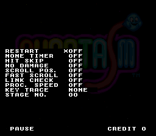
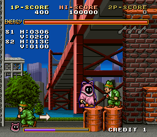
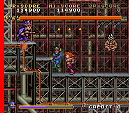
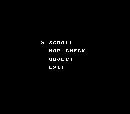
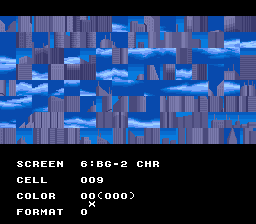
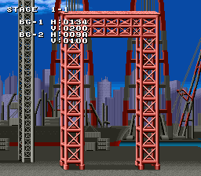
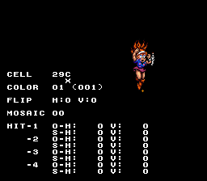

Phantasm is a creative take on platform shooters, where as a ghost you can posess the bodies of enemies on screen as your person avatar. It's a well-made game, definitely 'hidden gem' status. It also has a very nice selection of debugging tools!

<!--more-->

# Hidden Developer Credits

Tucked away at the end of the exception strings, starting at 0x600, is a hidden message from the developers, in Shift JIS encoding:

```
(C)CP.BRAIN 1990
     竹森 得泰  
     幸田 英一郎
     飯塚 均    
     橋本 茂徳  
     野口 みゆき
     長富 成夫  
     堀越 衛    
     阿部 貴佳史
     林   高志  
(C)CP.BRAIN 
```

C.P. BRAIN is the development group, and 1990 is the year. The rest is the names of the development team members, in their original Japanese kanji. Unfortunately, since name kanji can be quite variable, it can be difficult to ascertain the readings of the names. I've also attempted to pair some of the real names with the nicknames in the credits:

|Name|Reading|Credits Name|Credits Role|
|--- |--- |--- |--- |
|竹森得泰|Takemori Tokuhiro|TOKU|TOTAL PLANNER|
|幸田英一郎|Kouta Eiichirou|||
|飯塚　均|Iizuka Hitoshi|||
|橋本茂徳|Hashimoto Shigenori|||
|野口みゆき|Noguchi Miyuki|MIYUKI-CHAN|SPECIAL THANKS|
|長富成夫|Nagatomi Shigeo|||
|堀越　衛|Horikoshi Mamoru|H.MAMORU|DESIGNER|
|阿部貴佳史|Abe Takashi|||
|林　高志|Rin Takashi|||


There you go, Phantasm devs, the world now knows of your work!

There is one small mystery about this string, though. It looks like it's referenced in the block of code at 0xFB8, but I haven't been able to determine what exactly is going on:

<pre class="pdasm pdasm-arch-m68k">
uk__referencesDevEasterEgg:
000FB8: lea     $8c64.w, A6 ;0xFF8C64 - two ptrs and a word - looks like a linked list?
000FBC: tst.w   ($8,A6) ;test word at 0xFF8C6C
000FC0: beq     $fea{locret} ;if zero, jump out of the subroutine
000FC2: moveq   #$0, D7
000FC4: movea.l (A6), A0 ;get ptr to current index data
000FC6: move.w  (A0)+, D0 ;first word of that data is a ptr table index
000FC8: add.w   D0, D0
000FCA: add.w   D0, D0
000FCC: jsr     ($1e,PC,D0.w) ;jump to entry in ptr table at 0xFEC; d7 is modified by this jump
000FD0: cmpa.l  #$ffff8e6e, A0 ;is our list ptr out of bounds?
000FD6: bcs     $fdc ;if not, jump down
000FD8: lea     $8c6e.w, A0 ;if yes, reset it to the first element
000FDC: subq.w  #1, ($8,A6) ;0xFF8C6C--
000FE0: beq     $fe8 ;if 0xFF8C6C is zero jump down
000FE2: cmp.w   $600{devEasterEgg}, D7 ;compare d7 to word value at 0x600, which is 0x2843
000FE6: bcs     $fc6 ;if d7 is less than 0x2843, jump back up and do another jsr
000FE8: move.l  A0, (A6) ;move a0 into current list index ptr
000FEA: rts
</pre>

This code is only referenced once, at 0xF2, as part of the handler for IRQ2 (which looks to be the VBLANK interrupt). It looks like there is a list structure at 0xFF8C64 that this code iterates over to make jumps based on the pointer table at 0xFEC. When it comes back, it compares D7 register to the *hardcoded value of the first two bytes of the developer easter egg*, which is 0x2843. If D7 is lower than 0x2843, it jumps back up and does another JSR.

I've set watches on D7 and let the game run in all sort of places: it never goes above 0x2843. Most of the time it's a very low number. This would all be pretty inocuous, boring code anywhere else, but what makes it intriguing is that it is comparing logically to a small chunk of ASCII in a hidden easter egg string. Why? I'm pretty baffled.

Of course I've poked it all sorts of ways to fudge the code, to make D7 greater than 0x2843 at that point, and all I get is occasional graphics twitches and CPU exceptions. I've still no clue no what's going on with that. If I spent more time getting into the game engine code, the program flow, then maybe I could figure it out, but that's a project for a rainy day week.

# Build Constant

Once again, we have a build constant in the game which defines some basic settings for the program. It is a byte value defined at 0x21FFF. Three bitwise flags enable or disable these settings:

## Bit 7 - Display 'For North America only'

When unset, displays 'For North America only' on the copyright screen. This is set in both dumps (i.e. the text is never displayed).

## Bit 4 - Region

Determines the region: set for Japan, unset for World.

## Bit 3 - Debug Flag

Ah, the good stuff! Setting this flag enables a number of functions, including pause, stage select, game options, graphics viewers...

You can pause at any time by holding P1 Start then pressing P2 Start. Holding P2 start will run the game in slow mode, pressing P1 + P2 Start again will unpause.

Pause mode is the gateway to all the debug tools. While paused, hold P1 Start and press either P1 Button 1 or 2 for the Debug Options and Graphics Viewers, respectively.

## Debug Options







Some neat stuff going on here. Move cursor with P1 Joystick, P1 Button 1 to select an option, P1 Button 2 to return to the pause screen.

 - RESTART - Reboots the game
 - NONE TIMER - The timer is none
 - HIT SKIP - Invulnerability
 - NO DAMAGE - Invulnerable, but your character still reacts to damage
 - SCROLL POS - Displays X/Y coordinates for graphics planes (screenshot above)
 - LINK CHECK - Haven't been able to work out what this does...
 - PROC. SPEED - Enables a CPU load monitor, appearing as a black bar on the left side of the screen that flashes during CPU slowdown (screenshot above)
 - KEY TRACE - Has two modes, Record and Replay, and yes they seem to be related to demo mode playback. Record doesn't seem to work.
 - STAGE NO. - Sets the starting stage number. You'll need to reset the game to actually load your selected level, though.

## Graphics Viewers









Scroll is a pretty standard tile viewer, though it does have the relatively unique feature of a color palette viewer. P1 Up/Down to select an option; P1 Button 1 to select that option, then Up/Down to change it; and P1 Button 1 again to deselect that option.

Map Check lets you move the camera around Stage 1-1. You would think you'd be able to change the stage here, but that doesn't seem possible. In fact, the STAGE 1-1 text that is displayed in the corner is hardcoded. Quite interestingly, this game uses C style sprintf formatting in its strings that use variables, so fact that the stage identifier is hardcoded is a pretty clear sign that you can't change maps to check.

Object is a sprite viewer with hitboxes. Like the other menus, use P1 joystick to move the cursor, and P1 Button 1 to toggle changing the value. P2 joystick moves the sprite around.

# MAME Cheats

And here are the MAME cheats to flip each of the system bits. Note that this means the cheat being On doesn't necessarily mean the bit is set; it means the bit is currently the opposite of what was hardcoded in the ROM. I've included an accompanying cheat that displays the current build constant bit settings, for reference:

```
  <cheat desc="Flip debug mode flag">
    <script state="on">
      <action>temp0=maincpu.mb@21fff</action>
      <action>maincpu.mb@21fff=(maincpu.mb@21fff ^ 08)</action>
    </script>
    <script state="off">
      <action>maincpu.mb@21fff=temp0</action>
    </script>
  </cheat>
    
  <cheat desc="Flip region flag">
    <script state="on">
      <action>temp0=maincpu.mb@21fff</action>
      <action>maincpu.mb@21fff=(maincpu.mb@21fff ^ 10)</action>
    </script>
    <script state="off">
      <action>maincpu.mb@21fff=temp0</action>
    </script>
    </cheat>

  <cheat desc="Flip 'For North America' flag">
    <script state="on">
      <action>temp0=maincpu.mb@21fff</action>
      <action>maincpu.mb@21fff=(maincpu.mb@21fff ^ 80)</action>
    </script>
    <script state="off">
      <action>maincpu.mb@21fff=temp0</action>
    </script>
  </cheat>

  <cheat desc="Display build constant">
    <script state="run">
     <output format="Debug: %01X">
       <argument>(maincpu.mb@21fff &amp;amp; 08) gt 0</argument>
     </output>
     <output format="Region: %01X">
       <argument>(maincpu.mb@21fff &amp;amp; 10) gt 0</argument>
     </output>
      <output format="North America: %01X">
        <argument>(maincpu.mb@21fff &amp;amp; 80) gt 0</argument>
      </output>
    </script>
  </cheat>
```
