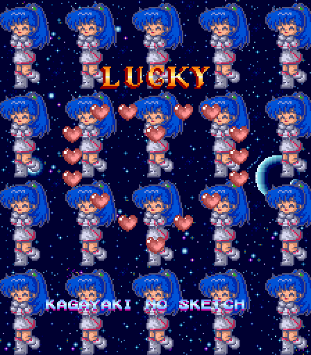
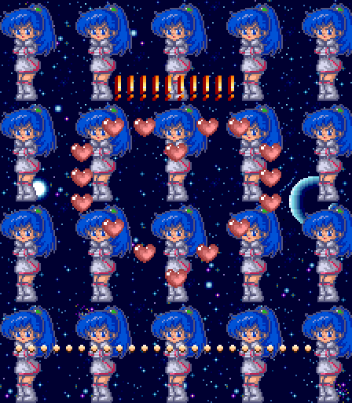
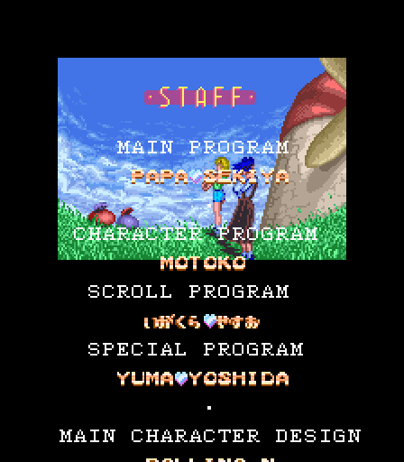
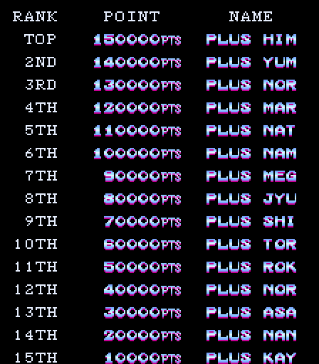

I'm a sucker for games with 1990's cutesy anime girls, especially when they are paired with hi-tech elements like piloting ships in an STG. Burning Force, [which we looked at more than a decade ago](/entry/burning-force-part-1-unused-translation-and-extra-round-select-options), is a great example of this, as is Plus Alpha, a silly and saccharine shooter from Jaleco.

<!--more-->

I haven't found any leftover debugging tools (yet), but I have found something I enjoy far more: easter eggs! Entering certain names at the high score entry will show a special screen with a short message:

The full list of names is stored in a table at 0x3C084:

    🤍HIMERIN
    🤍SHINOBU
    🤍MARINA🤍
    🤍NATSUKI
    MEGUMI.O
    JYUNKO.K
    🤍IGAKURA

The first six names are references to idol singers and one of their songs, speciflcally:

- [Himenogi Rika - Roman no Kishi](https://www.youtube.com/watch?v=fOMZXM2bAfc)
- [Nakayama Shinobu - Makenaide, Yūki](https://www.youtube.com/watch?v=zI47J83craU)
- [Watanabe Marina - Calendar](https://www.youtube.com/watch?v=2WKc3EeenBg)
- [Ozawa Natsuki - Private Panic!](https://www.youtube.com/watch?v=KNdG6EX9Fao)
- [Odaka Megumi - Jōnetsu no Sasayaki](https://www.youtube.com/watch?v=WiuRoaYOTUI)
- [Kawada Junko - Kagayaki no Sketch](https://www.youtube.com/watch?v=TA--5Y1F_6o)

The final name, IGAKURA, is the name of one of the staff, Igakura Yasuo, credited with the "Scroll Program" and probably the one responsible for the high score code as well.

The default names for the high score table are also likely references to idol singers. However, it seems Igakura made a mistake: The high score list only shows 8 characters per entry, but the default names have 10 characters each!

So while we see this as the high score list:

The names are actually slightly longer in the data, stored at 0x114E:

    PLUS HIMER
    PLUS YUMAC
    PLUS NORI-
    PLUS MARIN
    PLUS NATSU
    PLUS NAMIC
    PLUS MEGUC
    PLUS JYUNK
    PLUS SHINO
    PLUS TOROR
    PLUS ROKOC
    PLUS NORIC
    PLUS ASAKA
    PLUS NANNO
    PLUS KAYOC

As a result, there are two PLUS NOR names in the final result. Oops.
