Oh man, I am EXCITED! Pocket Fighter was one of the first games I tried picking at when I started hacking old arcade games around the end of last year. I could clearly see from the raw dump alone that there was something hidden away here (it doesn't get more blatant than a string reading "SECRET TEST"). I [tweeted](https://twitter.com/suddendesu/status/567551981410340866) when I found the the entry routine early on, but I could [never quite coax the game](https://twitter.com/suddendesu/status/568217371355299840) into loading it properly. Until now...*\*suspenseful music\**


<!--more-->

# Secret Test Menu

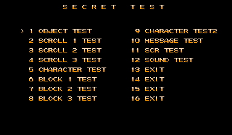

Here it is in all its glory. In most games, things like object and background tests are both pretty common and pretty boring. Pocket Fighter was particularly vexing because the artwork is so good and funny, and often times hard to appreciate in the speed of the game... and it lacked the artwork viewing tools. At least it used to!

A note beforehand: to exit any of these modes and return to the main menu, press P1 Start + P2 Start.

## OBJECT TEST

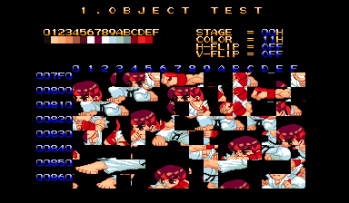

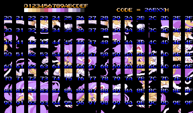

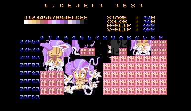

Your standard tile-based object viewer. P1 Left and Right scroll through the palette; P2 Left and Right scroll through the stage palette sets. P1 Up and Down scrolls through the tiles. Hold P1 Button 1 while scrolling speeds it up. Holding P1 Button 2 and hitting P1 Up/Down scrolls by page. P2 Button 1 does H-Flip while P2 Button 2 does V-Flip.

## SCROLL 1/2/3 TEST

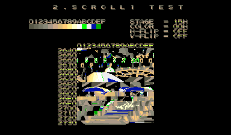

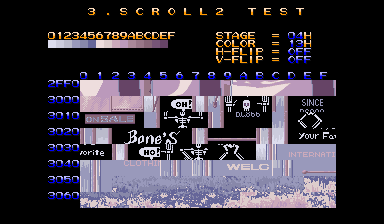

More tile-based viewers, this time for the scrolling backgrounds. The modes seem to be based on tile size (scroll 1 looks like 8x8, scroll 2 16x16, scroll 3 32x32). Controls are exactly the same as the Object Test.

## CHARACTER TEST

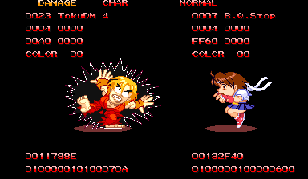

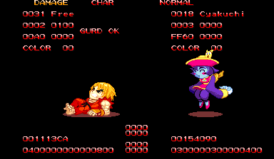

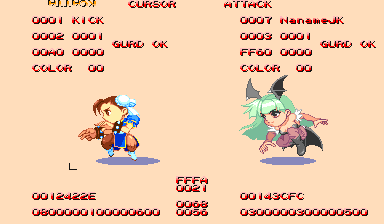

This is a bit similar to the [Obj Tool (Anime) in Dadandarn](/entry/debug-tools-and-more-in-monster-maulers-1). You can cycle through the sprite frames and play the animations. P1 Up/Down cycles through the frames of animation. P1 Button 3 + Up/Down cycles through the frame sets and characters. (**NOTE! Be careful not to hit P1 B3 + Down when you first load the screen! It will crash the game. Same when cycling up: do not cycle past Akuma's EFFECT set, or the game will crash!**) P1 Button 3 + Left/Right will change the color palette for the character, but note that you'll need to cycle frame sets to apply the palette.

Holding P1 Button 1 will play the animation, if there is one. P1 Button 2 will reset to the first frame.

There is also a cursor mode, although I'm uncertain of its function. Pressing P2 Start will switch between CHAR and CURSOR modes. When in Cursor mode, hold P1 Button 1 + Up/Down/Left/Right to resize the cursor box. The movement without holding anything moves the box around. None of the other inputs seem to do anything else...

Also, you can't directly set the background color, but choosing the palette in the Object or Scroll tests seems to affect the background here.

## BLOCK 1/2/3 TEST

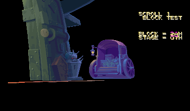

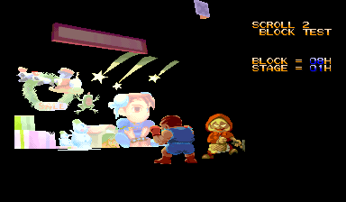

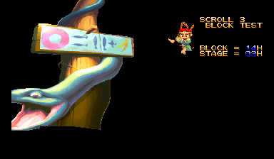

This is a viewer for the large blocks of artwork making up the stages. They don't really seem to be divided up logically; 1, 2 and 3 probably just reference different banks.

P1 Left/Right cycles the high bits of the Block value; P1 Up/Down cycles the low bits. Hold P1 Button 1 while cycling speeds it up. P2 Left/Right changes the stage palette. P1 Button 3 puts an odd grid overlay on the art; it looks broken to me (or maybe something to do with the Phoenix/decrypted ROM?).

## CHARACTER TEST2

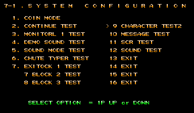

... is broken. It loads up part of the text from the System Config menu in the normal test screen. I've tried taking a look at the reference table (starting at 0x23320) and this option just points to a small bit of code that jumps directly to the text display function, so.. I dunno! It may be worth looking into a little further, but I fear the actual functionality has been removed.

## MESSAGE TEST

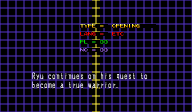

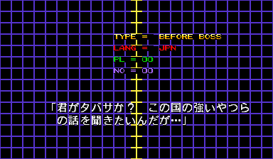

Like its name implies, this cycles through all the player story text in the game, in both Japanese and English. P1 Start cycles the Type, P2 Start cycles the language. P1 Up/Down cycles the Player, while P1 Left/Right cycles the message number.

## SCR TEST

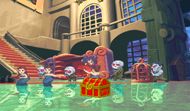


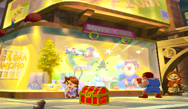

This is neat! It shows each stage, fully assembled with all the blocks from the Block Tests and with all animations. P1 Up/Down scrolls the camera up and down, and Button 3 pauses the animations. P1 Button 1 and P1 Button 2 cycle through the stages... Oh cool, I never noticed that Plasma Sword reference before!

## SOUND TEST

... is also broken. But that's okay, it's available in the standard test menu.

So! You may be wondering, how can I access all these great functions? To start, know that CPS-2 games are encrypted and, unfortunately, MAME doesn't apply ROM cheats to the un-encrypted, running code. So we'll need to use the un-encrypted Phoenix version of the Super Gem Fighter ROM set. Once that is running, this cheat should do the trick:

```
  <cheat desc="Enable Secret Test Menu">
    <comment>Replaces the standard test menu</comment>
    <script state="on">
      <action>temp0=maincpu.mw@20864</action>
      <action>maincpu.mw@20864=29b6</action>
    </script>
    <script state="off">
      <action>maincpu.mw@20864=temp0</action>
    </script>
  </cheat>
```

This replaces the standard test menu, so hit F2 once you're past the Phoenix loader and enjoy!
