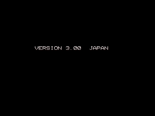

There's a [request on mamecheat](http://www.mamecheat.co.uk/forums/viewtopic.php?f=1&t=11547) for Pocket Gal Deluxe, and I figured I'd give it a go. I played around for a bit, then discovered a nice, juicy string table with some intriguing bits of text. After a few hours of working backwards through the disassembly, I've discovered a number of interesting bits in the game!

<!--more-->

**THREE YEARS LATER UPDATE:** My original work on this game was done with text disassemblies from MAME, a notebook and my copy of the M68k Reference Manual. How times have changed. I've revisited the game using my newer tools and have elaborated quite a bit on what I originally found, including the discovery of actual input codes to access the dev tools. Everything is much tidier and better explained now.

# Version

Like other Data East games, **hold P1 Start + P2 Start on game bootup** to display the version.

# Old/Unused Debug Menu Strings

Among the text in the string table were these lines of text, in successive order. They may be text from empty placeholder functions, perhaps from an SDK or 'example' program used as a base. (I see to recall seeing these lines in other DECo games' data...) These lines are never actually referenced anywhere else in the code, so we can't really say for sure.

I've only included three screenshots of the text, since it's pretty bland. The full list in order is: WARNING, DECO MARK, OPENING DEMO, TITLE, IDLE, BEST PLAYERS, START DEMO

# Copy Protection

There are a handful of security check routines in the game. First, there are two checks involves reads from the security device and comparing the value returned. If either are not as expected, it jumps to code that displays the snarky message above, obviously parodying the ugly FBI 'Winners Don't Do Drugs' screen of arcade games from the 90's.

After that, there is a secondary, more interesting check: it checks the *actual byte values of the code from the first security check* for expected values. So if the first security check against the protection device was removed or altered, it would still fail.

Here's the code to illustrate. First, the initial check:

<pre class="pdasm pdasm-arch-m68k">
securityCheck1:
0006E4: move.w  $167d10, D0 ; read from the security device
0006EA: cmpi.w  #-$7f80, D0 ; is the value what we expect?
0006EE: beq     $6f8 ; yes, move on
0006F2: jsr     $a46e{dispWinnersDontMakeCopy} ; nope! winners don't make copy!!
</pre>

And then later, we have the secondary check:

<pre class="pdasm pdasm-arch-m68k">
subSecurityCheck1:
00A4CA: move.l  $6e4.w, D0 ; it's reading from the program code itself, notice the address compared to the code above
00A4CE: cmpi.l  #$30390016, D0 ; check the data - again, compare this to the code above
00A4D4: bne     $a502 ; no good
00A4D8: move.l  $6ea.w, D0 ; check the next chunk
00A4DC: cmpi.l  #$c408080, D0 ; etc...
00A4E2: bne     $a502
00A4E6: move.l  $6ee.w, D0
00A4EA: cmpi.l  #$67000008, D0
00A4F0: bne     $a502
00A4F4: move.l  $6f2.w, D0
00A4F8: cmpi.l  #$4eb90000, D0
00A4FE: beq     $a508 ; everything checked out, exit the function
00A502: jsr     $a46e{dispWinnersDontMakeCopy} ; we got a hacker over here!
00A508: rts
</pre>

Of course, a skilled code hacker could remove this secondary check too, but it certainly would have given them a headache.

# 'Data East' Input Codes

There are two input codes hidden on the Data East logo screen, both of which should be accessible by the production hardware without any hacking. As a prerequisite, **switches 6 and 7 (marked as Free Play and Unused) need to be enabled on DIP switch 2. For the input code itself, it needs to be entered relatively quickly, before the Data East logo fades.**

Note that the Data East logo is not present in the Japanese version of the game. As such, the codes are only available on the European version. However, all the code is still present in the Japanese version; more on that below.

Here are the codes:

## Hidden Dev Credits

> P1 Up Down Right Right B1 B1 B2 B1

A simple dev credits screen, dug out of the code after all these years. It will remain on the screen for a few seconds or until you hit a button, then moves on to the title screen. The final line at the bottom translates to "Don't Copy [this game]!!" in a commanding tone.

# Debug Tools

> [Player 2] Down Up Left Left B2 B2 B1 Start

Here's the big find of the game: a fully functional dev tools menu. Game Mode brings you back to the game. Debug Mode is kind of a let down: it's simply a test of all the images in the game. There's a Sound Mode which is pretty self explanatory, and a Trick Mode, which lets you select the trick stages.

Now, if you don't want to bother with input codes and DIP switches, we can access both of these pieces of code with MAME cheats. This will also allow you to access the dev tools in the Japanese version, which cannot normally be done since the Data East logo is never referenced. You cannot, however, access the hidden dev credits in the Japanese version with this code since it is unreferenced in that version as well. (We could write a cheat to re-link it, but it's kind of pointless since it doesn't have any use and can be viewed easily in the European version...)

Here's the MAME cheat shortcuts:

~~~
  <cheat desc="Debug menu">
    <comment>Displayed after starting game from title screen</comment>
    
  </cheat>

  <cheat desc="Show hidden dev credits">
    <comment>Displayed after Data East logo</comment>
    
  </cheat>
~~~

# Unused Girl Pictures

In the 'Debug Mode,' we see there are seven pictures per girl. However, there are only five stages per girl in the game! Indeed, two of the pictures are not normally used. It looks like there was a planned or removed (or present in another, undumped version?) non-nude version.

The pointer tables for the pictures start at 0x362C for the Japanese version, 0x3632 for Euro. The very first table with four pointers (one for each girl) is unreferenced by the code; immediately following it is another table with four entries, which IS referenced. The second set is, of course, the one actually used in the game. The entries in each of these tables point to another pointer table, which then link to the code to display each picture. The unused lists seem to be more 'safe,' with no references to the last couple, nude images. The picture lists that ARE used in the game are lacking two of the more conservative images, which makes them unused in our dumps.

If you want to use the safe/unused lists, here's a MAME cheat:

Japanese:

~~~
  <cheat desc="Use 'safe' images">
    <comment>Enable the unused picture list, which lacks nudity</comment>
    
    
  </cheat>
~~~

Euro:

~~~
  <cheat desc="Use 'safe' images">
    <comment>Enable the unused picture list, which lacks nudity</comment>
    
    
  </cheat>
~~~
