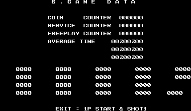

Good grief, has it really been almost *two years* since a proper article was posted? Let's finally correct that by taking a look at Progear no Arashi and the mess of debug tools and code oddities tucked away in its data.

<!--more-->

Way back in November 2022, we posted an article [detailing the CPS2 debug DIP switches](entry/cps2-debug-switches-and-the-games-that-love-them/) that were only physically present on development hardware but were still checked by the code in a number of games for the system. I intended to have a look at each of those games in occasional, relatively short articles that examined what sort of functions the debug switches enabled. I started with Progear, and, man, that was a mistake.

I found Progear no Arashi to be intriguingly strange in some of its implementation choices, noticably different from every other CPS2 game I've ever looked at in terms of its program code, and mysteriously containing chunks of data from another game. So what started as a "quick look" became a cavernous rabbit hole as I wanted to unravel what was going on here. But I have [a history](/entry/magical-crystals-debug-functions-unused-content-and-the-kaneko-toybox-system/) of [doing that](/entry/lucky-wild-disabled-art-viewers-sound-test-and-round-select/), I suppose...

# Debugging Multitool and State Viewer

Let's begin by looking at two unused debugging functions that remain in the code.

In some Cave games that we've [looked at](/entry/donpachi-debug-tools-and-more) in [the past](/entry/dodonpachi-debug-tools-level-select-and-more), we've found a debugging tool with a number of functions that run all at once during gameplay, making for a cluttered usage experience. I was originally calling this the "Swiss Army Knife" tool, but since that's a mouthful I've taken to calling the concept a "multitool."

In Progear no Arashi, we have something similar, though perhaps not as chaotic. There is a combined task spawner, stage select and state viewer which make use of the [debug DIPs](/entry/cps2-debug-switches-and-the-games-that-love-them) to enable/disable functionality.

There are actually two pieces of code that we're going to discuss at once, as there is evidence they were meant to work together as one whole.

The first of these is the interactive piece, which is **enabled by debug DIP 1-1**. When enabled, it displays a hex value in the lower right that acts as the parameter for its two main functions: a stage select and a task spawner.


To change the value of the parameter, hold P1 Start and use P2 Stick (left/right to change the left digit; up/down to change the right).

**To activate the stage select, press P2 B1 + B2.** For this function, only values 1 to 5 are valid. Anything else has no effect.

**To spawn a task, press P2 B2 + B3.** For the task spawner, the pointer table for gameplay tasks is used, located at 0x4EC42. Note that each single task is a pair of pointers in this table, with the first entry being the init code and the second being the loop code.

(What is a "task" in this sense? It is a discrete piece of code that runs during gameplay, usually maintaining local state and displaying something on screen. In other words, it's usually an object or visual effect during gameplay: an enemy to destroy, a unique graphical element in the stage, "boss incoming" popup text, etc.)

There doesn't seem to be a way to select the position on screen for the placement of new objects, and by default they appear on the edge of the left side, often making them nearly invisible. Some tasks crash the game, for reasons discussed in the analysis section below. Moreover, a couple of the tasks are noteworthy as they themselves are debugging tools, which we'll look at next.

The second piece is what I'm calling the state viewer. As the name implies, it displays a number of values relating to the current state of the game and some of its elements.


Some of the displays are enabled by the debug DIPs. DIP 2-1 displays a single two digit hex value in the upper left (shown as "34" in this example image):


DIPs 3-2, 3-3 and 3-4 also toggle some displays:


(Note that the display enabled by DIP 3-4 interferes with the one enabled by 2-1.)

But it turns out we don't even need to use the DIPs at all to display these! When the task spawner/stage select tool is enabled with DIP 1-1, pressing P2 Button 2 will toggle the same the displays normally enabled by DIPs 2-1, 3-2 and 3-3, as well as some additional fields.


This is displayed of the state of the actual switches. This also means that only the display enabled by DIP 3-4 is unique.

As for what each of these values represent in the game, that's something I haven't delved into and I will leave that research to the fans of the game.

## Analysis and Reimplementation

### "Multitool" and "State Viewer" Relationship

Despite being two discrete blocks of code, there is evidence that the multitool and the state viewer were meant to work together. This is based on the usage of the P2 B2 button as a toggle for the viewers. Besides checking for the DIP switch settings, the state viewer also checks the byte at 0xFF3EC8 to determine if a display should be enabled. If that byte is set, the display is shown regardless of the state of the associated DIP switch. In other words, this is the byte that is toggled when pressing P2 Button 2.

But the code to check P2 B2 and set that byte is located in the Multitool. QED, the State Viewer and the Multitool were meant to run at the same time if the viewer uses a variable that can only be changed with the multitool.

So instead of implementing them separately, we will work on a method that reintegrates both at the same time. Since both the State Viewer and the Multitool are orphaned, unused code, how do we go about getting them working...?

### Tasks

The task system is the same basic concept found in many games, consisting of task control blocks (TCBs) to maintain some state, and an allocation of memory for a fixed number of those blocks. But Progear no Arashi does something I've never seen before: hardcoding the pointer to the code for each index into that array of task blocks.

In most systems, a TCB holds a pointer (or an index into a pointer table) to the code to run for that task, making the allocated space for task blocks agnostic of what kind of task data they hold. In other words, a TCB can hold the data for any kind of task since the pointer to the code can be changed, and a task can be set in any of the "slots" in the space allocated for tasks. The location of the TCB in memory within the list does not affect how it is used: it's just some transient space in RAM that is re-used as elements come and go in the game.

Progear no Arashi does something a bit different. It has an array of TCBs, like usual, but the block lacks a pointer to any code. Instead, there is a jump table located at 0x5454, with the number of entries matching that of the task count and acting as the code for each of those tasks. That is to say, TCB allocation is not dynamic, per se, and where your task is placed in memory determines what code is run for that task.

Since tasks represent on-screen elements and effects (enemies, messages, the players, etc), all of which come and go as the stage progresses, does that mean there is an individual task allocated for *each and every* "thing" in the game? What if multiple instances of the same thing appear at the same time? Games need dynamicity when it comes to creating and maintaining the wide variety of gameplay elements that exist, so Progear's concept of certain task slots "reserved" only for specific tasks makes it seem like that isn't possible.

In actuality, we can see within the task jump table that the majority of the entries are duplicates. 50 duplicates to be exact, all pointing to 0x4F500. These entries are "generic" tasks, which work more in the classic sense of holding a pointer or p-table index as part of the task's state. For these tasks, there is a secondary and larger pointer table containing references to all the gameplay elements. We'll discuss that further soon.

So there is space allocated for 60 TCBs: the first five are "engine" related, followed by the 50 gameplay tasks mentioned above, then five more engine related tasks at the end. On each frame, the code will run down this list, executing the code in order for each active task block.

It's a little bit awkward but I sort of understand what they were aiming for with this design. The first five do some updates that will effect the gameplay elements that come after them, for example, updating input values and player state. After that, all of the gameplay elements run their individual pieces of code (updating their position on screen based on the input, change their state if they're hit by a bullet, etc), and finally the five remaing tasks that do the graphics update to reflect the state of the current frame. It's a logical progression, but it's just a bit strange that they integrated the engine-specific work into the task system rather than keeping it as a seperate, lower-level component.

So now we have a handle on how the task system in general works. We can now look at how the individual gameplay tasks are used, which brings some weirdness of its own.

The pointer table for gameplay element code is located at 0x4EC42. In this table, each task is a pair of pointers: the first is the init code (called just once when being spawned; essentially the "constructor") and the second is the loop code (called on each frame after being spawned).

The init code for (most of) these entries consists of only a MOVE followed by an RTS, making the code after it appear to be orphaned. What's happening here is that the calling code manually advances the pointer by 8 (the size of the MOVE/RTS) so the remaining code is also called.

<pre class="pdasm pdasm-m68k-arch">
04F48C: moveq   #$0, D7
04F48E: move.b  ($c,A5), D7    ; D7 will contain the gameplay task ID
04F492: beq     $4f488   ; branch down and exit if 0
04F494: lsl.w   #3, D7
04F496: lea     $4ec42{ptrtblGameplayTasks}, A0
04F49C: movea.l (A0,D7.w), A1  ; get the pointer to the task's init code...
04F4A0: jsr     (A1)   ; ...and jump to it
04F4A2: addq.w  #8, A1   ; then manually add 8
... [execute a handful of other commands and calls that don't modify or read A1]
04F4D0: jsr     (A1)   ; jump to init code + 8
</pre>

While I'm sure there is a reason things are implemented this way, I can't say I fully understand the reasoning. It's interesting, though.

Let's address that "most of" from a couple sentences back. Indeed, some of the init code does not follow that pattern (for example, tasks 0x04 and 0x06). If you try to use the task spawner in the multitool with them, the game will crash. It seems this is only on a few of the low index tasks, so perhaps they are old code that was never updated.

So why such a boringly in depth discussion of the game's task system?

Because we're going to use those tasks to re-implement the two main debugging functions, the "multitool" and the "state viewer."

### Re-implementation

Neither the multitool nor the state viewer are referenced in the code. And as always with such unreferenced code, we can't know for sure from where they were originally meant to be called and any attempt to re-implement them will always be based on guesswork.

That guesswork is informed by how the code appears visually or interacts with player input. We know that our multitool code is meant to run during gameplay, for example, because using the stage select function will trigger an end of stage event and a score review, just as if we had completed it normally, before moving on to the selected stage. Besides that, the very concept of an object spawner implies that it should be done during gameplay, as the game engine needs to be active to run the elements.

So we can be pretty sure from where it should run in a broad sense, but finding a place to insert a reference to it that doesn't break anything else and is plausibly accurate to how it may have been originally used can be difficult. In this case, I decided to repurpose two of those 50 gameplay element task blocks that we discussed above. Since each TCB has a hardcoded pointer to the code associated with it, the implementation is as simple as changing the pointers for two of the blocks to the code for the two pieces of the multitool, then making sure those tasks are spawned with the other engine tasks at the start of the stage.

And with all that out of the way, here is the cheat to do what we need:

```
  <cheat desc="Debugging Multitool">
    <comment>Debug DIP 1-1 must be enabled</comment>
    <script state="on">
      <action>temp0=maincpu.od@6c744</action>
      <action>maincpu.od@6c744=3f0000</action>d
      <action>maincpu.oq@3f0000=4eb9000092ea7005</action>
      <action>maincpu.oq@3f0008=4eb9000092ea7006</action>
      <action>maincpu.oq@3f0010=4eb9000092ea4e75</action>
      <action>temp1=maincpu.od@547e</action>
      <action>maincpu.od@547e=6fd34</action>
      <action>temp2=maincpu.od@5486</action>
      <action>maincpu.od@5486=b33a</action>
    </script>
    <script state="off">
      <action>maincpu.od@6c744=temp0</action>
      <action>maincpu.oq@3f0000=0</action>
      <action>maincpu.oq@3f0008=0</action>
      <action>maincpu.oq@3f0010=0</action>
      <action>maincpu.od@547e=temp1</action>
      <action>maincpu.od@5486=temp2</action>
    </script>
  </cheat>
```

# Object 0x1 - Shooting Test Multitool

Because things aren't chaotic enough on screen, we have yet anotehr multitool-style debug function. This time is is accessible via the object spawner in the multitool we just discussed above.

It's actually object 0x1, which is the default value in the spawner, meaning you'll probably accidentally load it occasionally. When spawned, you get a text display in the bottom left, the upper right, and a constantly cycling column of values in the center flanked by two columns of fire.


A screen full of chaos, basically.

Apparently it is a shooting test. Remember when [we looked at Dodonpachi 2 and its really nice debug menus?](/entry/dodonpachi-2-fancy-debug-tools) In particular, there was the bullet test, the scrap test, the explosion test and wreckage test, all nicely separated and documented with input controls... This is basically the same thing, and more, crammed into one tool with none of the user freindliness.

The text in the upper right is the "mode" that you are in, and it looks like there are several modes at the same time. P2 Button 2 advances to the next mode. When you press it, you'll see the tope line cycle through SCR-1, SCR-2, and SCR-3. You'll also see the two rows of hex values change, and the bottom line cycle through ITEM, ZANGAI, EXPLOS, BUI and HAHEN. Pressing P2 Button 1 will toggle the shot mode, in which the object in the center of the screen will constantly fire a pattern of bullets at you. That pattern can be changed with P2 B2/B3.

Speaking of the object in the middle, you can change its position with P2 Stick. The graphic that the object displays can be changed with P1 Stick: P1 Up/Down to change the CHR offset, and Left/Right to change the palette. Holding P2 B1 and using P2 Stick will change the size of the object. The left in the lower left corresponds to these graphics. Note that the key text and the values are off by one line.

P2 Button 3 will execute the function specified in the last line of the text in the upper right. ITEM will spawn a powerup box; ZANGAI will place a burning wreckage graphic; EXPLOS will spawn an explosion animation that falls off the screen; BUI will spawn a bonus item (looks like a ring?); HAHEN will spawn broken fragments.

This is all happening while the game is running in the background, which creates even more of a headache. Thankfully, this tool will stop the progression of the stage when debug DIP 3-6 is set, so I highly recommend doing that if you want to play with it. You may also want to turn off DIP 1-1 to disable the first multitool, which will also get in the way.

# Object 0x2 - Explosion Animation Viewer


Object 0x2, available via the object spawner in the multitool, is a simple animation viewer, though it (apparently) lacks any interactivity. When spawned, it displays four X's with NO. above them, and constantly runs one animation at each X of explosions or water splashes. And... that's it.

(Note that in this screenshot, I've also spawned object 0x1 to keep the screen at a standstill, hence teh extra text in the lower left/upper right.)

The NO. text seems to indicate it was supposed to have numbers, so perhaps it was interactive at one time. I haven't looked at the code for it directly, so maybe there's something there to be untangled.

# Pause / Stage Advance

Residing at 0x6A06 within the code is another multipurpose debug tool which acts as a gameplay pause and slow motion enable as well as a stage progression advancer.

It requires debug DIP 3-1 to be set, and when enabled, P2 Start pauses the game and P1 Start unpauses. Hold both P1 and P2 Start to run in slow motion. While paused, hold P1 Button 2 and press P1 Up or Down to advance or rewind the stage by a whole screen. Holding P1 Button 3 instead moves it by a small chunk only.

This code is *almost* unused. While it is never called during actual gameplay, it is used on the Game Over screen, of all places, at 0xDAD0. Given its functionality, it's pretty likely that it was originally called during gameplay, or perhaps at all times. What likely happened was references to the routine were removed for the final version, but this call on the Game Over was missed.

Since we have more or less mastered the object system in the game, adding a call to this function during gameplay is pretty trivial. We don't know its original call site, but dropping it into one of the gameplay engine tasks seems suitable. Engine task 01 at 0x6AB1A is related to screen scrolling anyway, so it is as good of a candidate as any. We'll make use of some unused space in the ROM to slip in a call to the debug function and then patch that into the engine task:

```
  <cheat desc="Enable pause/slowmo/stage advance">
    <script state="on">
      <action>temp0=maincpu.oq@397000</action>
      <action>temp1=maincpu.oq@397008</action>
      <action>temp2=maincpu.ow@397010</action>
      <action>temp3=maincpu.oq@6ab1a</action>
      <action>maincpu.oq@397000=4eb90006ab264eb9</action>
      <action>maincpu.oq@397008=00006a064ef90003</action>
      <action>maincpu.ow@397010=2d40</action>
      <action>maincpu.oq@6ab1a=4ef9003970000000</action>
    </script>
    <script state="off">
      <action>maincpu.oq@397000=temp0</action>
      <action>maincpu.oq@397008=temp1</action>
      <action>maincpu.ow@397010=temp2</action>
      <action>maincpu.oq@6ab1a=temp3</action>
    </script>
  </cheat>
```

# Player Self-Destruct/Power Up

There is another debug function that has a couple interesting effects on gameplay: self-destruct and power level up.

The code for this starts at 0x395b0, which is actually part of a subroutine that is actively called during the game. Let's have a look:

<pre class="pdasm pdasm-m68k-arch">
0395B0: 6000 00B6           bra     $39668 ; skip right over all of this...
0395B4: 0839 0000 00FF 234C btst    #$0, $ff234c.l{debug_dip1_mirror}
0395BC: 6700 00AA           beq     $39668 ; check that debug dip 1-1 is enabled; otherwise, jump past all this
0395C0: 7070                moveq   #$70, D0
0395C2: C039 00FF 5C46      and.b   $ff5c46.l{p1_input}, D0
0395C8: 0C40 0070           cmpi.w  #$70, D0 ; check for buttons 1 + 2 + 3
0395CC: 6700 0A0A           beq     $39fd8
0395D0: 0828 0006 0001      btst    #$6, ($1,A0)
0395D6: 6700 0090           beq     $39668
0395DA: 45F9 00FF 3F26      lea     $ff3f26.l, A2
0395E0: 4A2D 0007           tst.b   ($7,A5)
0395E4: 6706                beq     $395ec
0395E6: 45F9 00FF 3F36      lea     $ff3f36.l, A2
0395EC: 546E 0020           addq.w  #2, ($20,A6)
0395F0: 0C6E 000A 0020      cmpi.w  #$a, ($20,A6)
0395F6: 6604                bne     $395fc
0395F8: 426E 0020           clr.w   ($20,A6) ; below this is additional code dealing with setting the power level
</pre>

Right at the start, there is a BRA that skips all of this, jumping past all of the debug functionality. So despite being in the code path during normal execution, it is never actually used. We can see right after it is a check of debug DIP 1-1, which will jump down to the same place past everything if not set. So the option was originally conditionally enabled with the DIPs, but the programmer blocked that check with a hard branch right at the start just in case.

When enabled, **P1 B1+B2+B3 will self-destruct both players.** I can see how that would be useful during game testing.

Also, **P1 or P2 B3 will increase the power level for that player.** This is equivalent to picking up on of those P boxes on parachutes. There are a max of four power levels, and teh value will roll back to zero when you pass four. There are no sound effects or other indicators to indicate the level has changed, which can make things confusing.

Here's a MAME cheat to remove that branch at the start, allowing the code to flow to that check DIP 1-1 check. Don't forget to set the switch!

```
  <cheat desc="Enable self-destruct/level up">
    <comment>Press P1 B1+B2+B3 to self-destruct both players; Press P1 or P2 B3 to increase Power level; Debug DIP 1-1 must be set!</comment>
    <script state="on">
      <action>temp0=maincpu.od@395b0</action>
      <action>maincpu.od@395b0=4e714e71</action>
    </script>
    <script state="off">
      <action>maincpu.od@395b0=temp0</action>
    </script>
  </cheat>
```

# Unused Strings

In a deviation from other CPS2 games (one of several that we'll discuss later), Progear no Arashi does not use a monolithic pointer table for the text in the game. Instead, similar to past Cave games, each string is referenced directly from within a data structure that also contains positioning metadata. The array of strings begins at 0x3D7A2 with the array of metadata structures beginning at 0x3E8D6. Many of these strings are unused and are, in fact, lefovers from previous Cave games. Thus most of the strings aren't particularly interesting, but we'll look at the handful that are.

At 0x3DE2A we have:

```
  1999 6/24 MUTEKI VER 17:53  
```

1999-06-24 is the date that is displayed in [Guwange](http://www.hardcoregaming101.net/guwange/). However, the version string displayed at the start of that game is MASTER VER. So here we have a remnant of an alternate, internal version of Guwange.

Not far below that, at 0x3DFAC, we have:

```
    1998 4/21  MASTER VER.    
```

This is significantly earlier than the last date we saw. Is this from an early version of Progear, or of Guwange...? No, it's the version string of ESP Ra De. This line is also present in the Guwange data. Derp.

Above both of those messages is the complete text of Cave's infamous "FULL EXTENT OF THE JAM" copyright warning. This is, of course, not used in Progear and is another remnant of previous games.

At 0x3DC3B, we have a reference to the early name of the game:

```
PROPELLER WARS
```

Anf finally, far away from the string table, above the strings for the test menu at 0x3ED1, is a message that possibly comes from a location test version:

```
COMING SOON 
```

# Debug Flag Constants

During the course of development, it's common to make different different versions of a game intended for a certain audience. For example, you may have a trade show version which only allows play through the first stage and disables the test mode. Or perhaps you need a version with stage select enabled for your QC team to do testing. In such cases, you can have your build system set hardcoded values in your data that will be used by the code to enable/disable certain features. We saw an example of this just above in the Unused Strings section, with a MUTEKI (invincibility) version of Guwange, a version probably intended for testers.

Progear has its own flags in the data. We can tell these would have been set at compile time by their build system since they are located in ROM rather than RAM. This means it's impossible for them to be set at runtime.

But we can certainly modify them with cheats, so let's investigate what they do.

The hardcoded flags begin at 0xC0 and the code that checks them begins at 0x46a9c.

The value at 0xc0 and 0xc2 are word sized, while there is some code that references them, neither seem to ultimately get used.
Beginning at 0xc4, we have 12 byte sized values. Of these, 5 are copied into RAM but never actually used by the code. Two of them (0xcd and 0xce) are entirely unreferenced by any code, but they are sandwiched between other debug flags and appear to be byte sized and so are likely flags from an earlier version.


That leaves five flags that actually have an effect on the game. Prepare to be undewhelmed...

 - 0xC8 will enable the crash handler. We will discuss this further in the next section.
 - 0xCF will disable player inputs. Perhaps meant for an autodemo.
 - 0xCA will enable the extended info on the Game Data screen in Test mode, including an Average Time field
 - 0xC5 will disable test mode access
 - 0xC4 will enable startup options

All are pretty unexciting, except for that last one. What are starup options? Well, right below the code that checks and copies these flags, beginning at 0x46b2c, is some code that is normally skipped on startup unless that "enable startup options" flag is set. When enabled, this code checks for buttons held on P1 and P2 side.

If P2 Button 1 is held on startup, test mode is disabled; Button 2 disables background music; and Button 3 enables Free Play.
On the P1 side, buttons 1 and 2 are checked... and the values they set are unused by the code, essentially making them useless.

Here's a MAME cheat to enable those startup options:

```
  <cheat desc="Enable startup options">
    <comment>When enabled, on startup, hold P2 B1 to disable test mode; P2 B2 to disable background music; P2 B3 to enable free play</comment>
    <script state="on">
      <action>temp0=maincpu.mb@c4</action>
      <action>maincpu.mb@c4=1</action>
    </script>
    <script state="off">
      <action>maincpu.mb@c4=temp0</action>
    </script>
  </cheat>
```

# Disabled Crash Handler

Crash handlers are an extreme rarity seen in the course of normal gameplay. It would indicate a major bug, a fundamental problem with the code and not just a small recoverable error. We see them all the time, however, when doing reverse engineering as we bully the CPU and code into doing things they weren't meant to do, and sometimes they give up and start crying about "address error" and "illegal instruction."

If you were to trigger one of those low level exceptions in Progear, instead of a register dump to the screen, the game just freezes. The CPU ends up here:

<pre class="pdasm pdasm-m68k-arch">
0003BC: 0C81 63A1 B8D3           cmpi.l  #$63a1b8d3, D1
0003C2: 4E72 2700                stop    #$2700
0003C6: 4EFA FFF4                jmp     (-$c,PC) ; jump back up to 0x3BC
</pre>

It issues a STOP opcode which, you guessed it, stops active processing on the CPU. Just in case, there is also a jump right back up, making for an infinite loop if the STOP breaks by e.g. external interrupt.

Not exactly user-friendly, but again, there is a near zero chance this would happen normally. However, there is a working crash handler in the game's code:


Crash handlers in most games will statically display the contents of the CPU registers and the PC where the exception happened and maybe a small window of RAM data. But in Progear we have an interactive handler, one of the nicest I've ever encountered.

The game will still freeze when hitting an exception, but pretty P2 Button 1 will switch to the dump view as shown in the screenshot above. We have the register data and a RAM dump. Holding P1 Up/Down will scroll the RAM view by line, and P1 Left/Right will scroll by page. P2 Button 3 will reset the RAM location to the value of 'tcbhead,' which is the start of the TCB array that we discussed earlier. P2 Up/Down will scroll the column with tcbhead/tagene/tagboss.

Pressing P2 Button 2 will return to the gameplay view with the graphics still frozen. Here, you can hold down P2 Button 3 and it will replay the last three or four frames of animation and position for each of the visible task elements on screen! This is pretty amazing, and it's something I've never seen before. And to have a "memory" of previous animation frames indicates there is a history of sorts stored somewhere. Perhaps this has something to do with the strange way the tasks are set up in the code that we mentioned before. It's something to dig into further someday.

Despite some of the other things I may say about Progear's code, this crash handler is *luxurious.*

But it's also disabled, so even if you manage a crash, you'll never see it without hacking.

<pre class="pdasm pdasm-m68k-arch">
crash_handler:
000450: 6000 FF6A                bra     $3bc ; hard branch that blocks the code below...
000454: 5C8F                     addq.l  #6, A7
000456: 23CF 00FF 048E           move.l  A7, $ff048e.l
00045C: 4FF9 00FF 048E           lea     $ff048e.l, A7
000462: 48E7 FFFE                movem.l D0-D7/A0-A6, -(A7)
000466: 207C 0000 00C0           movea.l #$c0, A0
00046C: 4A28 0008                tst.b   ($8,A0) ; check the value at 0xC8...
000470: 6700 072C                beq     $b9e ; and jump to a different handler if not set
000474: 4BF9 00FF 8000           lea     $ff8000.l, A5
00047A: 4E68                     move    USP, A0
...
</pre>

Here we have the entry point for the crash handler. Right at the start, we have a branch to 0x3BC, the STOP/infinite loop listed above, so the code never reaches that really nice handler.

Well, okay, that makes sense. We don't want the user playing around with dev tools in the final version, so just block it off with a BRA and call it a day. Except there's a nicer alternative here...

See the code at 0x46C. This checks one of those debug flag constants from the previous section. If it is non-zero, it will use the crash handler, but if it's zero, it will branch to 0xB9E where the game will cleanly reset. That seems like the best option, right? It doesn't require an operator to come over and manually restart the machine.

Why block this off and use the hard freeze instead? It's worth noting that the debug flag to enable the handler at 0xC8 is set to 1 in the final version, so perhaps the dev tasked with "cleaning things up" for the master version didn't realize there was conditional flag and just blocked it off by hand...? Yet another mystery.

Here is a MAME cheat to remove the hard branch and make the handler accessible. Note that you'll still need to trigger an error exception to view it. The easiest way to do this is to break in to the debugger during gameplay, step through till it's reading or writing a 16 or 32 bit value to an address through an A register (e.g. `move.w (A0), D0`), and modify that address in the register to its current value plus 1. This is called a misaligned address and it will trigger an address error exception on the CPU, ending up at the crash handler.

```
  <cheat desc="Enable crash handler">
    <script state="on">
      <action>temp0=maincpu.od@450</action>
      <action>maincpu.od@450=4e714e71</action>
    </script>
    <script state="off">
      <action>maincpu.od@450=temp0</action>
    </script>
  </cheat>
```

# "Example" Test Menu


CPS2 games tend to follow some of the same patterns in their code, and this extends to some of the design elements as well. The test menus, for example, all generally look and feel the same, though some developers (like Mitchell) spiced them up a little bit. But generally they offer similar and sometimes identical implementations of things like the input test, sound test and so on. This seems to indicate that there was a test menu template or example code which the devs would customize as necessary.

At 0x71E98 in Progear to Arashi we have what appears an unmodified copy of such an example test menu.

The code here is a fully functioning test menu, but without customizations reflecting the game in which it resides. The button count on the input screen, for example, has a visualization for 6 buttons while Progear only uses 3. The code for the Sound Test displays a couple of strings, but has no actual playback code. And the Configuration code, which will always be unique per game, is nothing more than an empty function that causes the game to lock up.

We can't say for sure that it's unmodified example code, but that is certainly what it looks like to my eyes. If that is indeed what it is, it was probably copied into their source tree and accidentally left there, ultimately being compiled into the final binary. In any case, here's a cheat to replace the standard test menu with this one:

```
  <cheat desc="Replace Standard Test Menu with Example Test Menu">
    <script state="on">
      <action>temp0=maincpu.od@46a58</action>
      <action>maincpu.od@46a58=71e98</action>
      <action>temp1=maincpu.od@5636</action>
      <action>maincpu.od@5636=71e98</action>
    </script>
    <script state="off">
      <action>maincpu.od@46a58=temp0</action>
      <action>maincpu.od@5636=temp1</action>
    </script>
  </cheat>
```

# Connection with Marvel Super Heroes vs Street Fighter

Leftovers from previous Cave games, debug functions that were only partially removed, example code making its way into the final binary... It all feels a bit messy. But things get even weirder.

Beginning around 0x110B9, we have some leftovers from an audit screen. This is actually part of the "extended" audit screen in CPS2 games, which is enabled by a certain QSound volume setting. (This is [something I stumbled upon a while back](https://x.com/suddendesu/status/1694029385429619089?s=20) and I'm not sure it's been documented online yet; it will be part of yet anotehr upcoming CPS2 article.)

Below that, we have some more strings from that same setting and.. hmm, Ryu? As in Street Fighter 2?

```
CYC ----  SHU ----  RYU ----  ZAN ----  NOR ----
CAP ----  OME ----  KEN ----  VEG ----  DAN ----
HUL ----  SPI ----  CHU ----  GOU ----
WOL ----  BLA ----  DHA ----  SAK ----    ----
```

Perhaps ZAN for Zangief, CHU for Chun-li...? And are those Marvel names too? CYC for Cyclops, HUL for Hulk...?

Indeed, not far below that at 0x0113B4, we have some game ID strings that definitely are not from Progear:

```
CAPCOMBGSMSH VS STREET FIGHT
CAPCOMBGSMARVEL VS STREER   
CAPCOMBGSMARVEL SUPER HEROVS
CAPCOMBGSMSHVSSTREET FIGHTER
CAPCOMBGSMSH VS STREET      
CAPCOMBGSMARVEL VS FIGHTER  
```

It looks like we have leftovers from Marvel Super Heroes vs Street Fighter in here. What's going on?

The first theory that may come to mind is that it was left over from some development hardware that wasn't cleanly wiped, the remnants of a re-used flash ROM perhaps. That doesn't appear to be the case, though. The MvSF name strings are actually referenced by the code at 0x11068, which is part of the Game Data option in the standard test menu. With the "extended audit" settings manually enabled, we can see the extra values appear:



Compare this with the extended audit enabled in Marvel Super Heroes vs Street Fighter:


Since this code that can be reached through normal means on the final version references these strings from another game, it is almost certainly not remnant data.

The connection to MvSF goes deeper:


At 0x731CC we have *yet another* unused test menu and waaaaait a minute, this looks familiar. Isn't this [the Secret Test menu from MvSF that we looked at previously?](/entry/cps2-debug-switches-and-the-games-that-love-them)


It sure looks like it. They are almost identical. The only real difference (aside from the font) is the first option, called "Obj Bench Test." This option will display an alternating display of two blocks of graphics tiles.


It does not respond to any inputs and simply displays these two screens infinitely. P1 Start + P2 Start will return to the menu.

And... everything else in the menu will either crash the game or exit.

Of particular note is what is going on with options 2, 3 and 4, all of which point to the same code:

<pre class="pdasm pdasm-m68k-arch">
07342E: 4A2E 0003           tst.b   ($3,A6) ; continuing from the Obj Bench Test code
073432: 6704                beq     $73438
073434: 532E 0003           subq.b  #1, ($3,A6)
073438: 6000 000C           bra     $73446{mvsf_code__B315C}
secret_test__options_2_3_4:
07343C: 0008                dc.w    $0006 ; options 2/3/4 land here, hit bad opcodes and reset the CPU
07343E: 0008                dc.w    $0006
073440: 0008                dc.w    $0008
073442: 4E75                rts
073444: 4E75                rts
mvsf_code__B315C: ; this routine is identical to the one at 0xB315C in MvSF
073446: 1039 00FF 2342      move.b  $ff2342.l, D0
07344C: 0200 0003           andi.b  #$3, D0
073450: 0C00 0003           cmpi.b  #$3, D0
...
</pre>

Options 2/3/4 jump to 0x7343C, which is data and not machine code, causing the CPU to reset. We can see the tail end of the Obj Bench Test loop code up to 0x73438, which branches over the bad data and back into valid code.

This is an absolute mess. What is going on here? If we look at the Marvel vs Street Fighter code, we can get some clues.

The "junk" data at 0x7343C appears to be a relative jump table. It's a list of 16-bit values that point to an address a number of byte away from the start of the table. We see a similar three entry pointer table in the Ending Test and Star Test options in MvSF. Let's look at the Star Test code:

<pre class="pdasm pdasm-m68k-arch">
secret_test__star_test:
0B3C10: 7000           moveq   #$0, D0
0B3C12: 102E 0002      move.b  ($2,A6), D0 ; load the "current state" into D0
0B3C16: 303B 000A      move.w  ($a,PC,D0.w), D0 ; uses PC + 0x0A (0xB3C22) as the pointer base, plus the index previously loaded into D0, to give us an offset into the relative pointer table (rtable)
0B3C1A: 4EBB 0006      jsr     ($6,PC,D0.w) ; jumps to PC + 0x06 (0xB3C22) as the pointer base, plus the value from the offset stored in D0 previously
0B3C1E: 6000 F53C      bra     $b315c
star_test__rtable:
0B3C22: 0006           dc.w    $0006 ; jump to 0xB3C22 + 0x06 = 0xB3C28
0B3C24: 0060           dc.w    $0060 ; jump to 0xB3C22 + 0x60 = 0xB3C82
0B3C26: 0072           dc.w    $0072 ; jump to 0xB3C22 + 0x72 = 0xB3C94
0B3C28: 542E 0002      addq.b   #0x2,(0x2,A6)
0B3C2C: 3D7C 000A 004E move.w  #$a, ($4e,A6)
0B3C32: 4EB9 0000 1198 jsr     $1198.l
0B3C38: 7003           moveq   #$3, D0
</pre>

0xB3C10 is the entry point for the Star Test option from the menu, where it calculates a destination address for a JSR. We have two components here: a relative pointer table (rtable) at 0xB3C22, which is similar to our "junk data" in the previous example from Progear, and an index into that rtable which represents the current state of whatever is calling the routine. The value stored in the rtable for the specified index is loaded into D0, and the JSR adds that value to the base address of the rtable to make its jump. Basically, it's a `switch` statement that is used in many programming languages.

This method of using 16-bit offsets is space efficient and adds negligible processing overhead compared to a direct jump with 32-bit pointers. It's used in throughout the code of all CPS2 games... except for Progear.

So now looking back at the Progear code above, we see that the rtable points to 0x7343C + 6 (0x73442), 0x7343C + 6 (0x73442) again and then 0x7343C + 8 (0x73444). And at those two locations we have RTS opcodes. We don't know if they were working with C or ASM or what, but it looks like Cave didn't want to use this jump table method but weren't sure if it could be outright removed. Instead, they set the code that the table pointed to, to simply return. That's valid, but they forgot about the pointer calculation that figures the offset into the table and the JSR that makes use of it. So CPU is directed to jump into the table itself, which contains invalid machine code, and causes a reset.

Another oddity with Progear is not using register A5 as an offset base. In the example from Progear above, notice the code appearing under the label `mvsf_code__B315C`. As the comment says, the routine here is exactly the same as the code at 0xB315C in MvSF, in logic anyway. Let's compare those first three lines directly:

Progear:

<pre class="pdasm pdasm-m68k-arch">
073446: 1039 00FF 2342      move.b  $ff2342.l, D0
07344C: 0200 0003           andi.b  #$3, D0
073450: 0C00 0003           cmpi.b  #$3, D0
...
</pre>

Marvel Super Heroes vs Street Fighter:

<pre class="pdasm pdasm-m68k-arch">
0B315C: 102D CC2E      move.b  (-$33d2,A5), D0
0B3160: 0200 0003      andi.b  #$3, D0
0B3164: 0C00 0003      cmpi.b  #$3, D0
...
</pre>

The difference is the first line, moving a byte into RAM. In Marvel vs Street Fighter (and in all other CPS2 games), the address is derived from a base address in register A5 (usually 0xFF8000) offset by a positive or negative amount. In Progear, the address is explicitly defined. They both do the same thing, but the "proper" method that MvSF uses saves a couple of bytes.

This tells us that Cave had source code they were compiling from rather than grafting bits of pre-compiled binary. If they hadn't the data would have exactly the same opcodes.

Now, what does it all mean?

First of all, we can say for certain that the Obj Bench Test code is original to Progear and not a leftover from MvSF, as nothing like it appears there. We can also say with a pretty high degree of confidence that none of the code for the Secret Test functions within MvSF are present in Progear, except for some lines of text in the string table. Some chunks of code are identical between the two, though these appear to be generic utility functions used in multiple places. For example, we see that the Obj Bench Test jumps to code that is exactly equivalent to that at 0xB315C in MvSF, just as the end of the Star Test does.

So I think the broken test menu we have here is some of the earliest code the Cave devs wrote, an early test with the CPS2 platform that they were unfamiliar with. They took a debug tool from their example code, which seems to be the (partial? complete?) source of Marvel Super Heroes vs Street Fighter, and began to modify it. They first worked on something simple, just a simple graphics viewer, the Obj Bench Test. And it truly is simple, with no user input and naive implementation, like the group of six NOPs at 0x73402 that run in a loop, presumably ascting as the delay between the changing screens.

Along the way, either intentionally for testing or by accident, they messed up other entries in the menu. And then the whole effort was abandoned and they moved on to other parts of development. The test file remained in the source tree and ended up being compiled/linked into the final ROM.

As a professional software dev myself, it reminds me of the countless times I've started a new project and need to quickly become familiar with a new language or framework or tool. I take an existing example and "play with it," making simple modifications and breaking things in the service of learning how it works, and then abandoning it to move on to the actual project with the knowledge I've gained.

This is fascinating to me, as all of this tells a story and raises some questions: Why is the code so different compared to other CPS2 games? What was the relationship between Cave and Capcom that things ended up the way they did? What is the development connection with Marvel vs Street Fighter? How did this test code and the "example" test menu we talked about earlier make it into the final version? 

As always, a lot of conjecture. If anyone knows any ex-Cave devs who may know the answers, I'd love to know the story!

But that brings us to the end of our time with Progear, more than two years after starting this artle. Finally. On to something new!
