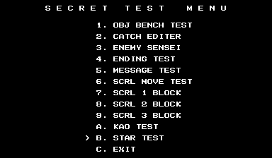

# Progear no Arashi

Progear no Arashi is noticeably strange in its program code. It doesn't seem to use most of the same patterns as most other CPS2 games (such as offset based jump tables or RAM addressing relative to the A5 register), there is redundant code and multiple ways of doing the same things, and there are chunks of data from another game. It's almost like it was written for other hardware then hastily bolted on to some existing Capcom code to get it running.

It also has some unused debug which is reminiscent of other Cave shooters. We'll take a look at all of this and more.

# Debugging Multitool and State Viewer

Let's begin by looking at two unused debugging functions that remain in the code.

In some Cave games that we've [looked at](/entry/donpachi-debug-tools-and-more) in [the past](/entry/dodonpachi-debug-tools-level-select-and-more), we've found a debugging tool with a number of functions that run all at once during gameplay, making for a cluttered usage experience. I was calling this the "Swiss Army Knife" tool, but since that's a mouthful I've taken to calling the concept a "multitool."

In Progear no Arashi, we have something similar, though perhaps not as chaotic. There is a combined task spawner, stage select and state viewer which make use of the debug DIPs to enable/disable functionality.

There are actually two pieces of code that we're going to discuss at once, as there is evidence they were meant to work together as one whole.

The first of these is the interactive piece, which is **enabled by debug DIP 1-1**. When enabled, it displays a hex value in the lower right that acts as the parameter for its two main functions: a stage select and a task spawner.


To change the value of the parameter, hold P1 Start and use P2 Stick (left/right to change the left digit; up/down to change the right).

**To activate the stage select, press P2 B1 + B2.** For this function, only values 1 to 5 are valid. Anything else has no effect.

**To spawn a task, press P2 B2 + B3.** For the task spawner, the pointer table for gameplay tasks is used, located at 0x4ec42. Note that each single task is a pair of pointers in this table, with the first entry being the init code and the second being the loop code.

(What is a "task" in this sense? It is a discrete piece of code that runs during gameplay, usually maintaining local state and displaying something on screen. In other words, it's usually an object or visual effect during gameplay: an enemy to destroy, a unique graphical element in the stage, "boss incoming" popup text, etc.)

There doesn't seem to be a way to select the position on screen for the placement of new objects, and by default they appear on the edge of the left side, often making them nearly invisible. Some tasks crash the game, for reasons discussed in the analysis section below. Moreover, a couple of the tasks are noteworthy as they themselves are debugging tools, and we'll look at those later on.

The second piece is what I'm calling the state viewer. As the name implies, it displays a number of values relating to the current state of the game and some of its elements.


Some of the displays are enabled by the debug DIPs. DIP 2-1 displays a single two digit hex value in the upper left (shown as "34" in this example image):


DIPs 3-2, 3-3 and 3-4 also toggle some displays:


Note that the display enabled by DIP 3-4 interferes with the one enabled by 2-1.

Just to make things more complicated, some of the displays can be toggled in software when the task spawner/stage select tool is enabled with DIP 1-1.


Pressing P2 Button 2 will toggle the same the displays normally shown by DIPs 2-1, 3-2 and 3-3, as well as some additional fields that are not otherwise accessible.

As for what each of these values represent in the game... I will leave that research to the fans of the game.

## Analysis and Reimplementation

### "Multitool" and "State Viewer" Relationship

There is evidence that these two pieces (the multitool and the state viewer) were meant to work together. This is based on the usage of the P2 buttons as toggles. The state viewer uses [ram address] to display [piece]. This value is only set by the multitool.

### Tasks

The task system is the same basic concept found in many games, consisting of task control blocks (TCB) to maintain state and an allocation of memory for a fixed number of those blocks. But Progear no Arashi does something I've never seen before: hardcoding the pointer to the code for each index into that array of task blocks.

Normally, a TCB holds a pointer (or an index into a pointer table) to the code to run for that task, making the allocated space for task blocks agnostic of what kind of task data they hold. In other words, a TCB can hold the data for any kind of task, and a task can be loaded anywhere within the range of space allocated for TCB. It's location in memory within the list does not affect how it is used.

Progear no Arashi does something a bit different. It has a jump table located at 0x5454 where each entry matches the index into the TCB array. That is, where your task is placed in memory *does* matter in this case as it determines what code is run for that task.

But since tasks represent on-screen elements and effects (enemies, messages, the players, etc), all of which can change as the stage progresses, does that mean there is an individual task allocated for *each and every* "thing" in the game? What if multiple instances of the same thing appear at the same time? Games need dynamicity when it comes to creating and maintaining the wide variety of gameplay elements that exist, so Progear's concept of certain task slots "reserved" only for specific tasks makes it seem like that isn't possible.

In actuality, we can see within the task jump table that the majority of the entries are duplicates. 50 duplicates to be exact, all pointing to 0x4F500. These entries are "generic" tasks, which work more in the classic sense of holding a pointer or p-table index as part of the task's state. For these tasks, there is a secondary and larger pointer table containing references to all the gameplay elements. We'll discuss that further soon.

So there is space allocated for 60 TCBs: the first five are "engine" related, followed by the 50 gameplay tasks mentioned above, then five more engine related tasks at the end. On each frame, the code will run down this list, executing the code in order for each active task block.

It's a little bit awkward but I sort of understand what they were aiming for with this design. The first five do some updates that will effect the gameplay elements that come after them, for example, updating input values and player state. After that, all of the gameplay elements run their individual pieces of code (updating their position on screen based on the input, change their state if they're hit by a bullet, etc), and finally the five remaing tasks that do the graphics update to reflect the state of the current frame. It's a logical progression, but it's just a bit strange that they integrated the engine-specific work into the task system rather than keeping it as a seperate, lower-level component.

So now we have a handle on how the task system in general works. We can now look at how the individual gameplay tasks are used, which brings some weirdness of its own.

The pointer table for gameplay element code is located at 0x4EC42. In this table, each task is a pair of pointers: the first is the init code (called just once when being spawned; essentially the "constructor") and the second is the loop code (called on each frame after being spawned).

The init code for (most of) these entries consists of only a MOVE followed by an RTS, making the code after it appear to be orphaned. What's happening here is that the calling code manually advances the pointer by 8 (the size of the MOVE/RTS) so the remaining code is also called.

<pre class="pdasm pdasm-m68k-arch">
04F48C: moveq   #$0, D7
04F48E: move.b  ($c,A5), D7    ; D7 will contain the gameplay task ID
04F492: beq     $4f488   ; branch down and exit if 0
04F494: lsl.w   #3, D7
04F496: lea     $4ec42{ptrtblGameplayTasks}, A0
04F49C: movea.l (A0,D7.w), A1  ; get the pointer to the task's init code...
04F4A0: jsr     (A1)   ; ...and jump to it
04F4A2: addq.w  #8, A1   ; then manually add 8
... [execute a handful of other commands and calls that don't modify or read A1]
04F4D0: jsr     (A1)   ; jump to init code + 8
</pre>>

I am not sure why things are done this way. [TODO take a quick closer look]

Let's address that "most of" from a couple sentences back. Indeed, some of the init code does not follow that pattern (for example, tasks 0x04 and 0x06). If you try to use the task spawner in the multitool with them, the game will crash. It seems this is only on a few of the low index tasks, so perhaps they are old code that was never updated.

So why such a boringly in depth discussion of the game's task system?

Because we're going to use those tasks to re-implement the two main debugging functions, the "multitool" and the "state viewer."

### Re-implementation

Neither the multitool nor the state viewer are referenced in the code. And as always with such unreferenced code, we can't know for sure from where it was originally meant to be called and thus any attempt to re-implement it will always be based on guesswork.

That guesswork is informed by how the code appears visually or interacts with player input. We know that our multitool code is meant to run during gameplay, for example, because using the stage select function will trigger an end of stage event and a score review, just as if we had completed it normally, before moving on to the selected stage. Besides that, the very concept of an object spawner implies that it should be done during gameplay, as the game engine needs to be running to run the elements.

So we can be pretty sure from where it should run in a broad sense, but finding a place to insert a reference to it that both works and is plausibly accurate to how it was originally used can be difficult. In this case, I decided to repurpose two of the 50 gameplay element task blocks that we discussed above. Since each TCB has a hardcoded pointer to the code associated with it, the implementation is as simple as changing the pointers for two of the blocks to the code for the two pieces of the multitool, then making sure those tasks are spawned with the other engine tasks at the start of the stage.

And with all that out of the way, here is the cheat to do what we need:

```
  <cheat desc="Debugging Multitool">
    <comment>Debug DIP 1-1 must be enabled</comment>
    <script state="on">
      <action>temp0=maincpu.od@6c744</action>
      <action>maincpu.od@6c744=3f0000</action>d
      <action>maincpu.oq@3f0000=4eb9000092ea7005</action>
      <action>maincpu.oq@3f0008=4eb9000092ea7006</action>
      <action>maincpu.oq@3f0010=4eb9000092ea4e75</action>
      <action>temp1=maincpu.od@547e</action>
      <action>maincpu.od@547e=6fd34</action>
      <action>temp2=maincpu.od@5486</action>
      <action>maincpu.od@5486=b33a</action>
      
    </script>
    <script state="off">
      <action>maincpu.od@6c744=temp0</action>
      <action>maincpu.oq@3f0000=0</action>
      <action>maincpu.oq@3f0008=0</action>
      <action>maincpu.oq@3f0010=0</action>
      <action>maincpu.od@547e=temp1</action>
      <action>maincpu.od@5486=temp2</action>
    </script>
  </cheat>
```

# Pause / Stage Advance

Residing at 0x6A06 within the code is another multipurpose debug tool which acts as a gameplay pause and slow motion enable as well as a stage progress advancer.

It requires debug DIP 2-1 to be set, and when enabled, P2 Start pauses the game and P1 Start unpauses. Hold both P1 and P2 Start to run in slow motion. While paused, hold P1 Button 2 and press P1 Up or Down to advance or rewind the stage by a whole screen. Holding P1 Button 3 instead moves it by a small chunk only.

This code is *almost* unused. While it is never called during actual gameplay, it is used on the Game Over screen, of all places, at 0xDAD0. Given its functionality, it's pretty likely that it was originally called during gameplay, or perhaps at all times. References to it were removed for the final version, with the call on the Game Over screen being an oversight.

Since we have more or less mastered the object system in the game, adding a call to this function during gameplay is pretty trivial. We don't know its original call site, but dropping it into one of the gameplay engine tasks seems suitable. Engine task 01 at 0x6AB1A is related to screen scrolling anyway, so it is as good of a candidate as any. We'll make use of some unused space in the ROM to slip in a call to the debug function and then modify the engine task:

```
  <cheat desc="Enable pause/slowmo/stage advance">
    <script state="on">
      <action>temp0=maincpu.oq@397000</action>
      <action>temp1=maincpu.oq@397008</action>
      <action>temp2=maincpu.ow@397010</action>
      <action>temp3=maincpu.oq@6ab1a</action>
      <action>maincpu.oq@397000=4eb90006ab264eb9</action>
      <action>maincpu.oq@397008=00006a064ef90003</action>
      <action>maincpu.ow@397010=2d40</action>
      <action>maincpu.oq@6ab1a=4ef9003970000000</action>
    </script>
    <script state="off">
      <action>maincpu.oq@397000=temp0</action>
      <action>maincpu.oq@397008=temp1</action>
      <action>maincpu.ow@397010=temp2</action>
      <action>maincpu.oq@6ab1a=temp3</action>
    </script>
  </cheat>
```

# Player Self-Destruct

Progear no Arashi also has a questionably useful debugging function: a player self-destruct command.

The code for this starts at 0x395b0, which is actually part of subroutine that is actively called during the game. However, it is skipped over by a branch right at the start:

[disasm 0x395b0]

As we can see, an identical skipping branch exists right below it that is contingent on the state of DIP #1-1. The hard branch in front of it was perhaps conditionally added based on the build type.

[effect: 

p1 b1+b2+b3 self destructs both players

P1 B3 will increase the power level of the player, rolling back to 0 after max

]

# Unused Strings

In another deviation from other CPS-2 games, Progear no Arashi does not use a single relative offset pointer table for the text in the game. Instead, similar to past Cave games, each string is referenced directly from within a data structure that also contains positioning metadata. The array of strings begins at 0x3D7A2 with the array of metadata structures beginning at 0x3E8D6. Many of these strings are unused and are, in fact, lefovers from previous games. Thus most of the strings aren't particularly interesting, but we'll look at the handful that are.

At 0x3DE2A we have:

```
  1999 6/24 MUTEKI VER 17:53  
```

1999-06-24 is the date that is displayed in Guwange. However, the version string displayed at the start of that game is MASTER VER. So we have a remnant of an alternate, internal version of Guwange here.

Not far below that, at 0x3DFAC, we have:

```
    1998 4/21  MASTER VER.    
```

This is significantly earlier than the last date we saw. Is this from an early version of Progear, or of Guwange...? No, it's the version string of ESP Ra De. This line is also present in the Guwange data. Derp.

Above both of those messages is the full text of Cave's infamous "FULL EXTENT OF THE JAM" copyright warning. This is, of course, not used in Progear and is anorther remnant of previous games.

At 0x3DC3B, we have a reference to the early name of the game:

```
PROPELLER WARS
```

Anf finally, far away from the string table, above the strings for the test menu, is a message that possibly comes from a location test version:

```
COMING SOON 
```

Coming Soon string @ 0x3ed1


# Build Constants

begin @ 0xc0

some are read into ram, then entirely unused

all but one seem to have no effect (but needs more research)


# "Example" Test Menu


We've touched on how CPS2 games tend to follow some of the same patterns in their code, and this extends to some of the design elements as well. The test menus, for example, all generally look the same and offer similar and sometimes identical implementations of things like the input test, sound test and so on. This seems to indicate that there was a test menu template or example code which the devs would customize as necessary.

At 0x71E98 in Progear to Arashi we have what appears an unmodified copy of such an example test menu.

The code here is a fully functioning test menu, but without customizations reflecting the game in which it resides. The button count on the input screen, for example, has a visualization for 6 buttons while Progear only uses 3. The code for the Sound Test displays a couple of strings, but has no actual playback code. And the Configuration code is nothing more than an RTS (an empty function) that causes the game to lock up.

We can't say for sure that it's unmodified example code, but that is certainly what it looks like to my eyes. If that is indeed what it is, it was probably copied into their source tree and accidentally left there, ultimately being compiled into the final binary. In any case, here's a cheat to replace the standard test menu with this one:

```
  <cheat desc="Replace Standard Test Menu with Example Test Menu">
    <script state="on">
      <action>temp0=maincpu.od@46a58</action>
      <action>maincpu.od@46a58=71e98</action>
      <action>temp1=maincpu.od@5636</action>
      <action>maincpu.od@5636=71e98</action>
    </script>
    <script state="off">
      <action>maincpu.od@46a58=temp0</action>
      <action>maincpu.od@5636=temp1</action>
    </script>
  </cheat>
```

# Leftovers from Marvel Super Heroes vs Street Fighter

Leftovers from previous Cave games, program code style that doesn't match other CPS2 games, debug functions that were not fully removed, example code making its way into the final binary... It all feels a bit messy. But there's yet another oddity in the data that hints at the somewhat chaotic nature of the program development.

Beginning around 0x110B9, we have some leftovers from an audit screen. This is actually part of the "extended" audit screen in CPS2 games, which is enabled by a certain QSound volume setting. (This is [something I stumbled upon a while back](https://x.com/suddendesu/status/1694029385429619089?s=20) and I don't believe it's been documented online yet; it will be part of yet anotehr upcoming CPS2 article.)

Below that, we have some more strings from that same setting and.. hmm, Ryu? As in Street Fighter 2? Perhaps ZAN for Zangief, CHU for Chun-li...? And are those Marvel names too? CYC for Cyclops, HUL for Hulk...?

```
CYC ----  SHU ----  RYU ----  ZAN ----  NOR ----
CAP ----  OME ----  KEN ----  VEG ----  DAN ----
HUL ----  SPI ----  CHU ----  GOU ----
WOL ----  BLA ----  DHA ----  SAK ----    ----
```

Indeed, not far below that at 0x0113B4, we have some game ID strings that definitely are not from Progear:

```
CAPCOMBGSMSH VS STREET FIGHT
CAPCOMBGSMARVEL VS STREER   
CAPCOMBGSMARVEL SUPER HEROVS
CAPCOMBGSMSHVSSTREET FIGHTER
CAPCOMBGSMSH VS STREET      
CAPCOMBGSMARVEL VS FIGHTER  
```

It looks like we have leftovers from Marvel Super Heroes vs Street Fighter in here. What's going on here?

One theory that may come to mind is that it is leftover from some development hardware that wasn't cleanly wiped, but that isn't the case. The Marvel/SF2 name strings are actually used by the code at 0x11068, which is part of the Game Data option in the usual test menu. With the "extended audit" settings manually enabled, we can see the extra values appear:


Compare this with the extended audit enabled in Marvel Super Heroes vs Street Fighter:


This doesn't mean that Progear was "built on" MvsSF, but its code (or parts of it) maye have been provided to the Cave developers as further example code.

The test menu weirdness doesn't end there though!



At 0x731CC we have *yet another* unused test menu in the game and waaaaait a minute, this looks familiar. Isn't this [the Secret Test menu from MSH vs SF](entry/cps2-debug-switches-and-the-games-that-love-them) that we looked at in the last article?


They are almost identical. The only real difference (aside from the font) is the first option, called "Obj Bench Test."

Alright, so let's look at the options.... The first one, Obj Bench Test, will alternate a display of two blocks of graphics tiles.


It does not respond to any user inputs, just displays these two screens repeatedly. P1+P2 Start will return to the menu.

And... everything else in the menu will either crash the game or exit the menu.

It is seriously perplexing to me what is going on here. The pointer table for the options in this menu is at 0x732E6. The first option jumps to working code, as we see above, while options 2 to 4 jump to invalid opcodes. Especially odd is that this invalid code is right in the middle of the working code above... which that code specifically branches over!

```
07342E: 4A2E 0003           tst.b   ($3,A6) ; continuing from the Obj Bench Test code
073432: 6704                beq     $73438
073434: 532E 0003           subq.b  #1, ($3,A6)
073438: 6000 000C           bra     $73446 ; *specifically jumps over the bad data*
secretTestOption2_3_4:
07343C: 0008                dc.w    $0006; ILLEGAL ; options 2/3/4 land here, hit bad opcodes and reset the CPU
07343E: 0008                dc.w    $0006; ILLEGAL
073440: 0008                dc.w    $0008; ILLEGAL
073442: 4E75                rts
073444: 4E75                rts
073446: 1039 00FF 2342      move.b  $ff2342.l, D0 ; and the Obj Bench Test code continues on
07344C: 0200 0003           andi.b  #$3, D0
073450: 0C00 0003           cmpi.b  #$3, D0
```

Options 5, 10 and 11 jump directly to an RTS, locking up the game. Option 6 jumps to the same code as Exit, so at least it doesn't crash. Options 7, 8 and 9 jump to valid code, identical for all three, but is code which only succeeds in copying around a bunch of junk in RAM and eventually (you guessed it) crashing the game.

I don't know what happened here and I don't know enough about the compilation tools used really even make educated guesses. It is worth noting that, code-wise, Progear no Arashi is odd compared to other CPS2 games. Most notably, practically all other CPS2 games use the A5 register as the base for RAM, usually set to 0xFF8000. The register value does not change throughout the game and all RAM references are values relative to the address in A5. Progear, however, opts for absolute addressing throughout its code. I get the feeling the build tools used for this game were either non-standard for CPS2 games or were heavily modified by the devs, and that may have introduced issues in some places.
