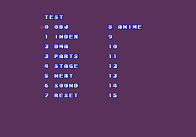
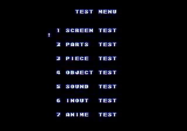
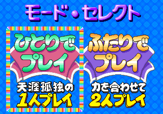
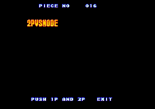
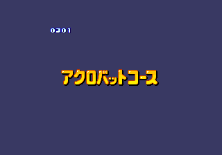
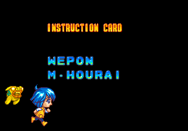

A fun color-matching puzzle game with colorful graphics and cute animations... and bunches of disabled dev functions and unused data!

<!--more-->

# Test Mode

Like many games, Pururun works by branching from the main loop into state processing based on a "program mode." Program modes can be things like the title screen, ending credits display, cutscenes, and of course actual gameplay.

There are a handful of unused program modes in the game, though only a couple are actually useful. The first one is mode 2, a test screen with a variety of data viewers.




Move the cursor with P1 Joystick and select an option with P1 Start. From within all of these options, P1 Start will cycle the background color, and P1 Start + P2 Start at the same time will return to the menu.

## OBJ


As the name implies, this is an object (which is to say, sprite) viewer. For whatever reason, it will always display the title screen logo in the background (and, annoyingly, will remain on the screen when returning to the menu).

The PATNO on the left indicates the current object ID. Interestingly, it is displayed in both hex (top) and decimal (bottom). P1 Button 1 and Button 2 will increase and decrease the value by one, respectively. P1 Down and P1 Up will move to the next or previous id in blocks of 0x100. P2 joystick moves the object around and P2 Button 1 and 2 increase/decrease the PALNO value. However, the palette will only be applied when PAL CHANGE is on. This can be toggled on and off with P2 Up and Down, which will also move the object. P2 Start will also toggle a red crosshair in the center of the screen.

## INDEX


This is similar to the object test, focusing on the individual chunks of graphics that make up the objects.

P1 Button 1 and 2 will increase/decrease the index ID, while P1 Down/Up will increase/decrease the address to the next 0x10 block.

## DMA


Shows large graphics, probably accessed via DMA for speed. P1 Up/Down to scroll through.

## PARTS


Shows objects made up of 8x8 tiles fulls assembled. P1 Up/Down to scroll by 1; P1 Left/Right to scroll by 256

## STAGE


This is one of the more useful tools for actually playing the game. With it, you an cycle through each of the puzzles in the game. Each stage has multiple layouts that are chosen at random when starting a stage for the first time. There is also a "mode" listed with values TAIIKU and BUNKA, which have no effect. These are a bit of a mystery, and we'll discuss them in depth further below.

P1 Button 1 and 2 will cycle through the stages. P1 Up/Down change the Mode. P2 Up/Down change the Type.

## NEXT


This tool will show the queue of upcoming pieces in the map. The Mode is present here as well, and once more has no effect. There are 128 Next Piece entries per stage, which are divided up into pages of 32 here.

P1 Button 1 and 2 will cycle through the stages. P1 Up/Down change the Mode. P2 Up/Down change the Page.

(Interestingly, the Next data for stage 19 is a bit short at only 96 entries. Therefore, the last page reads into the data for stage 20. This happens in gameplay as well, of course, which could make stage 19 particularly difficult.)

## SOUND


Yup, it's a sound test. P1 Up/Down to scroll through the items. P1 Button 1 plays the sound; P1 Button 2 and P2 Button 1 stop the sound instantly; P2 Button 2 will fade out.

## RESET

... doesn't actually reset, but instead ends up locking the system. Not sure if this is due to broken code or how we're calling the test menu.

## ANIME


Animation test. P1 Button 1 and 2 scroll through the values. There is actually a reference in this code to a third player 1 button, which restarts the animation. However, this button is not present in the final hardware and is thus not emulated in MAME. This seems to be the only place in the code where this third button was referenced, so I'm not going to bother writing a cheat to remap a different button to it.

Here is the cheat for the menu. It can be used at pretty much any time, though the state of the game when you use it may make it work incorrectly (for example, using it during a demo mode will cause the demo playing the inputs to be used instead of the P1 controls). A reliable place to use it is during the opening logos after reset.

```
  <cheat desc="Show Test Menu 1">
    <script state="on">
      <action>maincpu.pw@80f002=0200</action>
    </script>
  </cheat>
```

# Graphics Layout Tool


Another unused program mode is 0x13. When first switching to this mode, we get a blank screen. Pressing P1 Up or Down will bring up a number display in the upper right and some graphics in the middle of the screen. At first it seems like a simplified version of the Parts viewer from the test menu, but it is actually a relatively complex (and cumbersome) tool for visualizing and planning graphics layouts.

There are two modes of us. The first allows you to view and position the large graphics as seen in the DMA option of the Test Menu. There are two layers available. The P1 controls work on the upper layer and P2 controls work on the lower layer. For both layers, Up/Down changes the graphic to display. Holding Button 1 while using Up/Down will cause it to scroll much faster. Holding Button 2, you can then use the directional joystick to scroll the graphic around the layer. In the upper right are  two sets of numbers (one for each plane) indicating the ID and X/Y position of the graphic in use.

The second mode works with the small individual graphics from the Parts option of the Test Menu. The controls are similar: P1 Up/Down to change graphic ID; hold P1 B1 to scroll quickly; hold P1 B2 to move the graphic around. You can then use P2 Button 1 to "stamp" the graphic on to the lower layer.

When using this mode, the upper layer is cleared and used for small Parts graphics "cursor." As such, the upper layer will disappear when switching to this mode. You can switch modes freely, with the parts graphics stamped on to the lower layer being preserved. However, if you change the lower layer in the first mode, the stamped graphics will be cleared. 

It's not the most intuitive system, but it's a fun little tool to play with for a couple minutes. Here's the cheat to access it:

```
  <cheat desc="Graphics viewer">
    <script state="on">
      <action>maincpu.pw@80f002=1300</action>
    </script>
  </cheat>
```

# Other Unused Program Modes

There are several other unused program modes besides the two we've already covered. In general, there's not much left to them.

Mode 3 and mode 0x11 both essentially RTS right away, doing nothing.

Mode 0x0D has very little left to it. Early on it branches down to code that switches to mode 0x14 (start of stage cutscene). Interestingly, the opening cutscene switches to this mode at its completion.

Mode 0x0C is the only unused mode that has any substantial code left to it. Said code is disabled with an immediate switch to mode 0x0D, but we can restore it easily. Unfortunately, it doesn't seem to do anything. The screen goes black and the music from the pre-stage cutscenes plays. After about 30 seconds, it switches to 0x0D (and consequently 0x14, as mentioned before) on its own. During that time, there are no sound effects or any response to inputs.

It looks like, though the 'outer' code of the program mode loop is present, there is a piece of 'inner' code missing. That inner code comes from the object that is put on the processing stack at 0x80C000. Each object there has an associated bit of code, which is called from 0x6104. In this case, it creates an object of id 0x25, whose code was replaced with RTS. Whatever was supposed to happen here has been removed.

Since this runs on a timer which automatically moves to another program mode when complete, it seems to me this was a "player choice" screen, similar to the 1P/2P mode selection. As we'll see later in the article, there are many leftovers of probable other gameplay modes, and this is probably one of them.

# Setting the Program Mode

Just a quick note about setting the program mode manually. The mode is stored in the byte located at 0x80F002. There is also a "sub-mode" counter in the next byte, at 0x80F003. You'll need to set the sub-mode to 0 to properly initialize things, otherwise you're gonna have a bad time.

# Test Mode 2




Aside from the test menu in unused program mode 2, there is abandoned code for a similar test menu beginning at 0x7312.

P1 Start changes the background color, while P2 Start alternates between two graphics modes. One mode seems to have all graphic layers enabled while the other has some disabled. However, this is almost entirely unnoticeable on these screens.

Most of the tools are identical to the ones in the first test menu, though they may have different text or input controls.

## SCREEN TEST


Same as the DMA test in the other test mode

## PARTS TEST


Same as the Parts test in the other test mode.

## PIECE TEST


This is the only tool that isn't present in the other menu. Despite the name 'Piece Test,' it's actually a string viewer. It shows all the text that appears in the large string table at 0x372A4 with its formatting.

## OBJECT TEST


Same as the Object Test in the other test mode.

## SOUND TEST


Same as the sound test in the other menu, though this one displays the sound ID ranges for sound effects and music.

## INOUT TEST

It's unclear what this was supposed to be. When choosing it, the screen goes blank and nothing happens, though you can still exit back to the main menu.

The code references string id 0x6D, which is a null string so nothing is displayed. It also looks like it's setting up to display some graphics, though all of the submode routines after the first one just check for the P1 + P2 Start exit button sequence and do nothing else.

Judging from the name, it may have been an input test; it might even be a typo of 'input.' Whatever it was there's nothing left.

## ANIME TEST


Same as the one in the first menu, though this one shows more information. Note that you need to press P1 B1 to 'load' and play a new animation after scrolling to a new value.

Here is the cheat to use this menu. There is some code within it that suggests it was meant to be used in place of the Service Menu that is loaded when the Service Mode DIP switch is set. As such I've written the cheat to replace said Service Menu.

```
  <cheat desc="Alternate Test Menu">
    <comment>Replaces the standard service mode menu</comment>
    <script state="on">
      <action>temp0=maincpu.mq@2734</action>
      <action>maincpu.mq@2734=4eb9000073124e75</action>
    </script>
    <script state="off">
      <action>maincpu.mq@2734=temp0</action>
    </script>
  </cheat>
```

# Alternate Gameplay Modes

Similar to many puzzle games, the player advances through an overworld map, encountering bosses to defeat along the way. Unlike other games, Pururun does not have a "Puzzle Only" mode, and while there is a two player option, it's only co-op. The only way to experience the gameplay is through the story mode.

However, there are a number of strings and graphics (and even a little code) leftover in the game that indicate other gameplay styles were planned, or possibly even developed and then removed.

## Difficulty Levels

To begin, let's look at the mode select screen in the final game:




On the left is "[Lonely](https://jisho.org/word/%E5%A4%A9%E6%B6%AF%E5%AD%A4%E7%8B%AC) Single Player" and right is "Combined-Power Two Player." And that's it. You can choose single player or co-op two player.

Now, checking the Parts Viewer in either of the test menus, you'll come across these graphics:


These are all unused by the code (as far as I can tell). They suggest that there was a difficulty selection available at one time. Note that the Mode Select graphic is almost identical to the one used in the final screen. (I say "almost" because it is very slightly different: the ト katakana is a bit wider in the old graphic. Everything else is the same.)

There is a difficulty option available in the DIP switches which affects the speed at quick blocks are queued. Perhaps Beginner, Expert and Maniac refer to this drop speed.

## Puzzle and Versus modes

Next, we have a couple of entries early in the string table, at 0x0F and 0x10, that show a different, probably earlier mode selection menu. We can check them out with the Piece Viewer in the second test menu:




So it looks like, at one time, you could choose between story mode or puzzles-only mode, as well as 2P VS instead of co-op.

## Stage Mode - Bunka/Taiiku and Standard/Acrobat

In the Stage and Next viewers that are accessible from the first test menu, there is a Mode option that can be changed between two mysterious values: Taiiku and Bunka.


This setting is stored in a byte at 0x80F38F, with Taiiku having value 0 and Bunka being 1. Changing the setting has no effect on the puzzle. In fact, the bit of code that loads the puzzle data will effectively zero the Stage Mode value out before taking it into account when calculating the data's address in ROM:

```
testMenu1_stage_loadPuzzleData:
00E2B4: 1039 0080 F38F move.b  (stageMode[$80f38f]).l, D0
00E2BA: 0240 0000      andi.w  #$0, D0   ; any number AND 0 will be 0!
00E2BE: E548           lsl.w   #2, D0
00E2C0: 4BF9 0000 FACC lea     $facc.l, A5
00E2C6: 43F9 0003 B640 lea     (puzzleData[$3b640]).l, A1
00E2CC: D3C0           adda.l  D0, A1
00E2CE: 2251           movea.l (A1), A1
```

If we look at the puzzleData section, we can see that it is set up as a series of pointer tables. The Stage Mode value would act as the offset to the very first pointer table. However, that first table has only one entry, though there were two (or more...?) when this was implemented in older versions. As it stands, one entry means there's only valid value and anything else will point to incorrect data. In other words, zeroing the Stage Mode isn't done just to hide the data: it's done because the data was entirely removed.

Since this value was used in determining the offset for loading puzzle data, we can infer that the different Modes were different puzzle layouts. At least we have a general understanding of what this did, even if the data itself is gone.

So what are 'Taiiku' and 'Bunka'? Taiiku 体育 is Japanese for physical education, i.e. PE class. Bunka 文化 means culture. It doesn't seem like there's much of a connection. It's worth noting that there are '[Taiiku no Hi](https://en.wikipedia.org/wiki/Health_and_Sports_Day)' and '[Bunka no Hi](https://en.wikipedia.org/wiki/Culture_Day)' holidays in Japan, though this still doesn't mean much within the context of our game.

**UPDATE: The holidays supposition is a red herring. I asked to my wife, who is Japanese, and she mentioned that there are the cultural concepts of "bunkakei" and "taiikukaikei," which translate literally to "culture-oriented" and "sports event-oriented." This generally refers to the type of after school club someone chooses to attend: a sports club like baseball, basketball, swimming, etc, or a more study orented one, like an astronomy or literature club. They can be extrapolated to mean something akin to the schooldays duality of "jock" and "nerd." This understanding fits a little better in the game: bunka was probably a puzzle type that requires thinking and strategizing to solve while taiiku may have been about more "active" gameplay with longer chains.**

It seems likely, though, that whatever they meant in Pururun, they were probably older terms that weren't used in (or were removed from) other parts of the code. That assumption is based on a couple points.

First, those strings are located in a pointer table at 0xE9F8. (These are actually the only test mode strings referenced through a table; all the rest of the text is directly addressed.) There are actually four entries within that table: Taiiku/Bunka that are used in the test screens, and then 'BEGINNER' and '???', which are never referenced. All four of these strings are same length (9 characters, padded with spaces) and have the same text attributes, which is a pretty strong indicator that they were related. So this Stage Mode variable probably once had four valid values and no one bothered to rename any of the entries when it was reduced to only two values. Thus, these strings are most likely representative of a much older version. (UPDATE: They are likely from when the game was known as Pishaato - see the prototypes section below.)

Second, the values for the Stage Mode actually have alternate names that appear to be more finalized, which we'll look at next.

Within the high score screen code, there is a section at the end of the 'draw text and score' subroutine that is blocked off with an RTS. This disabled section is located at 0x39FE and includes a reference to our Stage Mode variable. If we remove the RTS...


We now have icons next to the stage number. ST is mode 0 and AC is 1. Note that the default high score list (set at 0x1AD8) fills in alternating values (AC, ST, AC...), though these are, of course, never normally seen.

Okay so... what are ST and AC? The answer to that lies in a couple of unused object graphics.




**UPDATE: "Acrobat" sure seems to match our newer understanding of "taiiku" as discussed above.**

It seems ST would stand for Standard and AC for Acrobat. Considering there are nice fancy graphics, integration with the high score list and many leftover checks of the value throughout the code, it's clear that this Acrobat mode was pretty far along in development before it was removed.

However, it seems that almost all traces of it have been removed. Though there are several spots in the code where the Stage Mode is checked, the data that would be used for Stage Mode value 1, for the Acrobat course, was removed or zeroed out. I don't believe there's anything substantial left.

There are some other unused bits that we'll go over below that may have been used in this mode, but there's no way to be sure.

# 1CC Ending

This falls into the "not hidden but probably not well known" category. When beating the game normally, you're treated to a brief cutscene and a simple END screen.


However, if you beat the game without losing a single credit, you'll be shown the same cutscene but with the credits this time.


Following the credits, you'll be given access to a difficult Special Stage.


Clearing this stage will get you an entry on the high score list and the satisfaction of having fully beaten the game.

If you don't want to go to the hassle of playing through all the stages, here are a couple MAME cheats to view both endings:

```
  <cheat desc="View Normal Ending">
    <script state="on">
      <action>maincpu.pw@80f392=0101</action>
      <action>maincpu.pw@80f002=1000</action>
    </script>
  </cheat>

  <cheat desc="View 1cc Ending">
    <comment>Includes Special Stage after credits</comment>
    <script state="on">
      <action>maincpu.pw@80f358=0018</action>
      <action>maincpu.pw@80f392=0000</action>
      <action>maincpu.pw@80f002=1000</action>
    </script>
  </cheat>
```

# Unused Credits

Speaking of the 1CC ending, there are a couple of lines in the credits text that are not used. Here are the full credits for reference:





(What's up with that creature hopping behind Moko? Check the next section for my notes on that.)

The credits text itself is located within the main string table. Each string is referenced by ID in pointer tables at 0xCB08 (for the section titles) and 0xCA88 (for the names). The text itself begins at 0x392CF, and in it are two section titles that do not appear in the credits: "DIRECTOR" and "CHARACTER DESIGN." Neither string is referenced in the tables and are thus completely unused.

All of the names in the string table are accounted for, so it's not obvious who should belong in these unused sections. However, two names are duplicated: DARUMA and WEPON. Daruma appears in both string ID 0x110 (unused) and 0x111 (used in Planning section). Wepon appears in string IDs 0x125 (used in Instruction Card section) and 0x126 (unused).

These names **could** be our missing director (Daruma) and character designer (Wepon). It would make sense that someone in planning would be the director. The character designer role is a bit more unclear, as you may expect someone in the Graphics section to be doing art. The [instruction cards](https://ja.wikipedia.org/wiki/%E3%82%A4%E3%83%B3%E3%82%B9%E3%83%88%E3%83%A9%E3%82%AF%E3%82%B7%E3%83%A7%E3%83%B3%E3%82%AB%E3%83%BC%E3%83%89) in Japanese arcades usually have artwork on them. (In fact, it's often the only place with any game specific art, as PCBs were interchangeable inside "generic" cabinets like the venerable [Sega Aero City](https://wiki.arcadeotaku.com/w/Sega_Aero_City), rather than game specific wooden uprights with graphic wraps like US arcades had.) It's quite plausible that the graphics section was only for digital artists/animators, while Wepon only did hand-drawn art for things like the instruction card.

Why were these sections removed? If my assumption about the duplicate names is correct, it may have been to remove redundancy, since, for example, Daruma would appear as Director and then again in Planning. But all of that is conjecture...

# What is Garma?

The game doesn't exactly have a deep plot, but it still feels like some aspects of the 'quest' were not fully planned or implemented. For example, Arapa randomly coughs up a map for you after defating him in stage 9, which has absolutely no effect on anything. It feels especially superfluous since there's been an overworld map through the entire game anyway.


There's another story element that seems to be half-baked, and that's Garma.


The newspaper during the opening cutscene is blocked in such a way that the upper and lower sections are invisible most of the time. The section of text immediately below the diamond is normally not seen. This bit of text reads ガーマ復活!! - GAAMA is back!!

The name is katakana and likely based on a foreign word. Since we don't have the original romanized name, it's difficult to know the "true" pronunication. One likely spelling and the one I'm going with is Garma.

If you look closely, the newspaper image is designed so that the normally invisible details (the top and bottom) on the left side are not drawn to begin with. However, the right side has the detailed top and the Garma text on the bottom. In the opening, the newspaper scrolls from the left to the right and stops as the scene plays. As it ends, the bars scroll away and the the full right side image (with Garma) is briefly visible before fading. This seems to indicate that glimpse of Garma was entirely intentional, as foreshadowing for quick-eyed players.

However, he never appears again in the main game. He does show up in the 1CC ending, as seen above. It appears to be chasing or possible hopping along with Moko during the credits


Interestingly, the running character here is always Moko, no matter which character you play as. At this point he's had no other appearance except the introduction cutscene and has no obvious connection to Moko.

It makes one final appearance as the Treasure Goal in the Special Stage after the 1CC credits:


It almost feels like he was meant to be the true final boss of the game; in a way, he sort of is. In the normal final stage, stage 24, the boss Mad-Carsea (the names in this game are insane) appears as the Treasure Goal, which is different from all the stages prior. Since Garma appears the same way in the Special Stage, it's like it is another "boss." The newspaper article certainly makes it sounds like it's a strong entity whose return should be feared, like a final boss.

But then there's no further explanation. After the Special Stage you're dumped to the high score screen and then the title. The game never tells us what that Garma thing is all about.

# Unused Pieces

## Playable Single Color Pieces

All of the placeable pieces in the game are dual-colored. However, there is code to support playable single color pieces:


They even have their own unique animation while in the Next queue, where they spin diagonally. The only way to use these would be to modify the Next data for a stage, which is a bit cumbersome for a MAME cheat. However, if you just want to see the animation in action, you can use this cheat to change the pieces in the Next queue:

```
  <cheat desc="Change Next queue to single color animations">
    <script state="on">
      <action>maincpu.pb@80c18e=13</action>
      <action>maincpu.pb@80c1ce=13</action>
      <action>maincpu.pb@80c20e=13</action>
      <action>maincpu.pb@80c24e=13</action>
      <action>maincpu.pb@80c50e=13</action>
    </script>
  </cheat>
```

## Colored Junk Pieces

The junk pieces are normally clear on their right side, with the background showing through, and act as single-color pieces. However, they have color variants as well. These work just like you'd expect: they act like normal junk pieces, but when popped the inner color becomes a normal single piece.


The code is actually set up to use colored junk pieces. It looks up the correct matching junk piece to use, but then ignores that value and uses a hardcoded value for blank junk:

```
0179DE: 7000           moveq   #$0, D0
0179E0: 1029 001A      move.b  ($1a,A1), D0   ; move the current object type into D0
0179E4: D040           add.w   D0, D0
0179E6: 45FA 0052      lea     (junkPieceTable[$17a3a]), A2
0179EA: 4E71           nop
0179EC: 337C 002D 0008 move.w  #$2d, ($8,A1)  ; set the current object graphic to 0x2D - blank junk piece
0179F2: 7200           moveq   #$0, D1
0179F4: 3232 0000      move.w  (A2,D0.w), D1  ; get the junk piece that matches the current piece color
0179F8: 137C 002D 001A move.b  #$2d, ($1a,A1) ; set the current piece type to 0x2D - blank junk piece
```

One reason it may have been disabled is that, when popping, the junk briefly turns into a normal looking piece before disappearing. Other than this, they seem to work perfectly. We can add them back into the game with a cheat:

```
  <cheat desc="Use Colored Junk Pieces">
    <script state="on">
      <action>temp0=maincpu.mq@179ec</action>
      <action>maincpu.mq@179ec=7200323200003341</action>
      <action>temp1=maincpu.mq@179f4</action>
      <action>maincpu.mq@179f4=00081341001a4e71</action>
      <action>temp2=maincpu.mw@179fc</action>
      <action>maincpu.mw@179fc=4e71</action>
    </script>
    <script state="off">
      <action>maincpu.mq@179ec=temp0</action>
      <action>maincpu.mq@179f4=temp1</action>
      <action>maincpu.mw@179fc=temp2</action>
    </script>
  </cheat>
```

## Playable Lock Pieces

The metal LOCK piece that appears in the map layouts may have once been a playable piece.


It's not entirely certain that it was meant to be playable, or if it just works because it's a puzzle piece, but there are a couple facts that suggest that was the case.

The item ID for the metal lock brick is 0x25. When loading the animations for the item in the queue, the code specifically checks item IDs for 0x25 and higher as items without animations. That could be just defensive programming, indicating that only items below 0x24 are valid. However, item 0x26 is the Super Pikkuru piece, which is most definitely used.

Interestingly, the wooden lock piece is item ID 0x2E and 0x2F, in its whole and broken states, respectively. If we try to use these as playable pieces, they work as intended, though their graphic is incorrect when in the player's hand. 

## Ball Shape Pieces

The final piece we'll talk about isn't actually a seperate piece but rather a different style and animation for the normal Pikkuru shape.


Notice the pieces in the Next queue. The pieces are now a ball shape. They animate in an alternating rotating pattern, though this animation may be slightly broken as one of the frames "jumps". It looks like it was meant to 'pulse,' opening and closing around the inner color. When moving into the Next window, they revert to the pikkuru shape and stay that way.

As I said above, this is not a new kind of piece but rather the usual pieces pointed to a different animation set. In particular, it's pointed to animation ID 0 in the 0x6 block. The palettes work perfectly, and we can see in the 0x7 block in the Object Test that there were a number of these ball graphics with the inner color created. It seems like it was intended to be an alternate (or early?) version of the usual pieces.

UPDATE: They are indeed from an earlier version. See the Prototypes section later in this article.

You can check out these the ball style pieces by using this cheat:

```
  <cheat desc="Use alt anim for pieces">
    <script state="on">
      <action>temp1=maincpu.md@144b8</action>
      <action>maincpu.md@144b8=4e714e71</action>
      <action>temp2=maincpu.mw@144bc</action>
      <action>maincpu.mw@144bc=4e71</action>
      <action>temp3=maincpu.md@173aa</action>
      <action>maincpu.md@173aa=4e714e71</action>
      <action>temp4=maincpu.mw@173ae</action>
      <action>maincpu.mw@173ae=4e71</action>
    </script>
    <script state="off">
      <action>maincpu.md@144b8=temp1</action>
      <action>maincpu.mw@144bc=temp2</action>
      <action>maincpu.md@173aa=temp3</action>
      <action>maincpu.mw@173ae=temp4</action>
    </script>
  </cheat>
```

# Unused Graphics

There are a number of unused or obscured graphics in the game's data, aside from the ones that have already been discussed above.

## Decorated Letters


Among the Index graphics are these six decorated letters. Each is its own graphic; they do not appear as one word like in the image above. However, that is the order they are listed in. The palettes associated with them are incorrect, but I haven't found a way to apply other palettes to Index graphics like this.

It's entirely unclear what they were used for. The Pikkuru and bomb decorations make it seem it could be an alternate, English language title screen. No matter how I arrange the letters, however, I can't come up with a word that sounds like a plausible title. It's possible that some of the letter graphics were re-used though; for example S may have been used twice. Your guess is as good as mine.

UPDATE: Apparently this is an early name for the game. See the Prototypes section later in the article.

## Generic Background


An unused puzzle field background. It may have been used in one of the mythical other modes that was discussed previously.

## Unused Stage Icons

There are some unused graphics appear to be icons for the stage designs.




These show up in the Object viewers, as part of the sprite set. They start at PATNO 0x0A30. The palettes attached to them are incorrect, but it looks like palettes starting at 0x88 match them perfectly.

They seem to match up stylistically with the six stage background designs that are present in the game:


They may have been used as part of a screen for selecting the background design for a stage. In that regard, they could be related to our much-discussed alternate gameplay modes.

Another possibility is that they are the old icons for the locations on the overworld map.


Indeed, the six locations sandwiched between the first and final areas match the six icons thematically. Also note that the background for the stages within each location matches its theme. For example, stages 5 and 6, at the location 3 with the ribbon, both have the lace background. (Of course there are only 6 designs but 8 locations: the first and last duplicate the forest and universe themes, respectively.)

UPDATE: They are indeed left over from an older version. See the Prototypes section later in the article.

## English Text

While the various graphics viewers in the game are useful, they don't actually show everything. It seems there are a handful of graphics tiles that are not used in any of the tilemaps defined in the graphics data. Therefore, they do not show up in the viewers.

Such unused graphics appear to be English text. For example:


It seems this would be an English replacement for the れんさ <em>rensa</em> text and bonus points that appear when chains occur. Indeed, it even appears in the same area as the rensa graphics.

The most intriguing find is what appears to be an English version of the instructions:


I've tried to arrange some of the tiles to be readable, but unfortunately whatever tool the dev team used to compile the graphics and generate tilemaps did some kind of crazy optimization. Very few pieces are in any sort of order and they are scattered all over the place. If someone wants to take a crack at it, keep in mind that the light and dark gray pieces should be alternating, checkerboard style, and should look like this:


It looks like they had at least started on an international version of the game. Or perhaps there's a World version somewhere out there...

# Unused Puzzle Data

Stages 6, 9, 23 and 25 (Special Stage) all have unused puzzle layouts. They can be reintegrated very easily by replacing the duplicated entries in each stage's pointer table.

The new layouts will be available as one of the random selections when the stage starts, or can be viewed within the Stage Viewer in the first test menu.

## Stage 6

Normally only has 4 variations, but contains data for 8 variations.


```
  <cheat desc="Restore Stage 6 Unused Puzzle Data">
    <comment></comment>
    <script state="on">
      <action>temp0=maincpu.md@3bde2</action>
      <action>maincpu.md@3bde2=0003beea</action>
      <action>temp1=maincpu.md@3bde6</action>
      <action>maincpu.md@3bde6=0003bf28</action>
      <action>temp2=maincpu.md@3bdea</action>
      <action>maincpu.md@3bdea=0003bf66</action>
      <action>temp3=maincpu.md@3bdee</action>
      <action>maincpu.md@3bdee=0003bfa4</action>
    </script>
    <script state="off">
      <action>maincpu.md@3bde2=temp0</action>
      <action>maincpu.md@3bde6=temp1</action>
      <action>maincpu.md@3bdea=temp2</action>
      <action>maincpu.md@3bdee=temp3</action>
    </script>
  </cheat>
```

## Stage 9

Normally only has 4 variations, but contains data for 8 variations.


```
  <cheat desc="Restore Stage 9 Unused Puzzle Data">
    <comment></comment>
    <script state="on">
      <action>temp0=maincpu.md@3c29e</action>
      <action>maincpu.md@3c29e=0003c3a6</action>
      <action>temp1=maincpu.md@3c2a2</action>
      <action>maincpu.md@3c2a2=0003c3e4</action>
      <action>temp2=maincpu.md@3c2a6</action>
      <action>maincpu.md@3c2a6=0003c422</action>
      <action>temp3=maincpu.md@3c2aa</action>
      <action>maincpu.md@3c2aa=0003c460</action>
    </script>
    <script state="off">
      <action>maincpu.md@3c29e=temp0</action>
      <action>maincpu.md@3c2a2=temp1</action>
      <action>maincpu.md@3c2a6=temp2</action>
      <action>maincpu.md@3c2aa=temp3</action>
    </script>
  </cheat>
```

## Stage 23

Normally only has 1 variation, but contains data for 2 variations.


```
  <cheat desc="Restore Stage 23 Unused Puzzle Data">
    <comment></comment>
    <script state="on">
      <action>temp0=maincpu.md@3d498</action>
      <action>maincpu.md@3d498=0003d4e6</action>
      <action>temp1=maincpu.md@3d49c</action>
      <action>maincpu.md@3d49c=0003d4e6</action>
      <action>temp2=maincpu.md@3d4a0</action>
      <action>maincpu.md@3d4a0=0003d4e6</action>
      <action>temp3=maincpu.md@3d4a4</action>
      <action>maincpu.md@3d4a4=0003d4e6</action>
    </script>
    <script state="off">
      <action>maincpu.md@3d498=temp0</action>
      <action>maincpu.md@3d49c=temp1</action>
      <action>maincpu.md@3d4a0=temp2</action>
      <action>maincpu.md@3d4a4=temp3</action>
    </script>
  </cheat>
```

## Stage 25 (Special Stage)

Normally only has 1 variation, but contains data for 2 variations.


```
  <cheat desc="Restore Stage 25 Unused Puzzle Data">
    <comment></comment>
    <script state="on">
      <action>temp0=maincpu.md@3d5d0</action>
      <action>maincpu.md@3d5d0=0003d61e</action>
      <action>temp1=maincpu.md@3d5d4</action>
      <action>maincpu.md@3d5d4=0003d61e</action>
      <action>temp2=maincpu.md@3d5d8</action>
      <action>maincpu.md@3d5d8=0003d61e</action>
      <action>temp3=maincpu.md@3d5dc</action>
      <action>maincpu.md@3d5dc=0003d61e</action>
    </script>
    <script state="off">
      <action>maincpu.md@3d5d0=temp0</action>
      <action>maincpu.md@3d5d4=temp1</action>
      <action>maincpu.md@3d5d8=temp2</action>
      <action>maincpu.md@3d5dc=temp3</action>
    </script>
  </cheat>
```

# Pururun Prototypes and Sequel

A year and a half after this article was published, someone who is a fan of this and other Metro games reached out to me with a ton of extremely rare and valuable information about Pururun prototypes as well as a sequel. He says he was very interested in Pururun at the time and was closely following news about it. He saved various notes and materials from that time, which is why he is so knowledgable on the topic now. He wishes to remain anonymous and at his request, I have resized the flyer images to be quite small in resolution and highly compresed so they cannot be reproduced. These flyers were apparently quite rare, only being given to arcade operators by hand during business visits and were not otherwise available at trade show events and the like. As such, they're a target for unscrupulous people who would reproduce them as original. However, we'll cut out the screenshots to examine in the full resolution, as we are interested only in the game's development history.

Though our source wishes to remain anonymous, I want to express my deep gratitude for reaching out and providing this content for us! Thank you!

## Pururun Prototype - Pishaato (First half of 1995)

Per my source, there were two earlier versions of the game with alternate titles: ぴしゃあと Pishaato and ぱぴぷぺぽん Papipupepon, with Pishaato being the older version. While there isn't a huge amount of information about it, we do have an arcade flyer:


So we see that the title has been romanized as PSHART and waaaaaaait a minute, that sounds familiar...




Indeed, we saw these odd characters that didn't seem to spell out anything sensical earlier in the article. I mean, it's still nonsensical, but at least we know it was an old name for the game. Let's take a closer look at the screenshots next.








There is also one more screenshot that appeared in the 1995 April 1st edition of Game Machine (volume 492), in their section on 1995 AOU show coverage:




Okay, wow, so... There are the ball pieces we also saw earlier in this article. That explains that! It also looks like the English "chain" text we saw earlier is here (though with a somewhat different font):




The gameplay board looks to be generally the same, though there are a number of changes to note. Here's a final screenshot for comparison:






Most prominently, our characters Pipi and Moko are not present, and instead we have two characters with a different design, though with the same blue and magenta hair color scheme. And while in the final, red-haired Pipi is the P1 character and blue-haired Moko is P2, it appears to be reversed here. There are no Gababa dinosaurs on the sides, and instead of Zom (the chicken-thing at the top), the next pieces are served by what seem to be guards or police officers. Finally, the bomb counter is in a different location.

Interestingly, both the characters appear at the same time in the "goal lane" at the bottom. Our source has some comments about these characters and why they're together there:

>The "prototype Moko" character with the blue hair is named Akemi. The name of the red-haired character is unknown, as no one played the 2P side.
>
>Story-wise, it seems the two are thieves who are in a rivalry to snatch the treasure first. In the game, unlike in the final Pururun, the difficulty level could be set different for 1P and 2P, and whoever filled their gauge (i.e. reached the treasure) first was the winner. Rather than a direct "versus" game, it was more of a competion gameplay system.

Considering the characters as "thieves" suddenly makes having things like guards serving puzzles pieces and having obstacle blocks called "LOCK" make a lot more sense, thematically.

We know the name Pishaato (or PSHART, but yeesh, what a stinker) was in use throughout 1995. It was shown under that title at the March 1995 AOU show. it was around this time that the game was picked up to be distributed by Banpresto, and (per our source) in the August 1995 edition of Super Gamers quotes a Banpreso PR representative as saying "Pishaato will be on sale soon. I recommend the Cultural Course."

("Cultural Course" here is 文化系コース bunkakei koosu. It seems that confirms that the "bunka" and "taiiku" strings are references to the Bunka-kei and Taiikukai-kei concepts we discussed in the Stage Modes section above and that they are indeed leftovers from when the game was called Pishaato.)

This quote was probably made a little before August, however, as that month ads for the game under the final of Pururun began to appear in Gamest and Game Machine. Considering the title for PSHART still appears in the final version and with a different logo from the flyer, it seems that the title change happened relatively late.

## Pururun Prototypes - Papipupepon?

One thing he recalls is seeing the game listed very briefly as Papipupepon. Though he doesn't exactly recall where he saw this, he believes it appeared in either Gamest or Super Gamers in 1995, in that space between its its final appearance as Pishaato and the reappearance as Pururun.

Aside from mentions about this new name, no screenshots were published of this version. Its possible the name was a very temporary effect of the game coming under Banpresto's jurisdiction and that it was never implemented.

## Purun Prototypes - Early Pururun (Mid 1995)

Our source tells us that the game was originally scheduled to be released in July 1995, was then postponed (likely due to Banpresto becoming involved as the distributor), appeared at the September AM Show, then in the first half of October had an early release at a limited number of game centers before its final official release on October 14th. With the game appearing as Pishaato in March and ads as Pururun in August, it seems the game changed considerably in those five months. 



The above ad appeared in Gamest, while a one-page variation appeared in Game Machine, with one slightly different screenshot. We'll look at the Game Machine screenshots as they are clearer.







This is clearly an earlier version of the final game. First, Zom (the chicken) is still not present, with the guard/police delivering the next block. Also, though our characters have evolved into Pipi/Moko, it looks like blue-haired Moko is the P1 character as was the case with Pishaato. (This likely also explains why it is Moko who appears in the 1CC credits, despite being the "secondary" character: she was the "main" character from earlier versions.) Finally, and most relevant to us, the world map is completely different, using the icons we found earlier and (correctly) theorized to be from an old version of the map.




## Pururun Sequel - Pikkuru

And now we come to what is possibly the biggest mystery/tragedy. It seems there was to be a sequel to the game, called "Pikkuru," which was ultimately never released. Our source provided these very rare flyers of the game.


Let's take a closer look at the screenshots, though they are, unfortunately, quite low resolution. Some have been doubled or quadrupled in size (without interpolation) to make them a little more visible.

















The game has been transformed into a rather generic falling piece puzzle game. It appears the gameplay was based on connecting three items (pikkuru) of the same color, which can only be placed vertically, with the player button switching the vertical position of the two pikkurus in the current piece. The rule card is a bit hard to read with its low resolution, but it seems similar to other games in this style, you can drop junk on your opponent in the form of LOCK pieces and Big Pikkurus by pulling off chains.




Here we see a difficulty selection screen, with Easy, Normal and a word that I can't make out that is certainly a variation of Difficult.




We see Pipi and Moko are back as the player characters in this versus mode screenshot.

Our source tells us Pikkuru was exhibited at a trade show and had a location test, and he was apparently able to play it. He tells us the story picks up right after Pururun, and describes the attract mode demo like this:

>The attract demo begins with the shattered "Deep Rouge" diamond as it appeared at the end of Pururun, surrounded by Pikkurus. The scene then switches to flying through space, with the fragments of the diamond (or maybe the "inner" diamond?) scrolling on the screen from left to right, and flashbacks of the opponents from the first game in the background. The scene changes to Pipi and Moko locking eyes and smiling, then they begin to laugh as it transitions to the title screen.

As for the game itself:

>After about four or five stages, you arrive at the last boss from the first game. but after that new enemies appear. Unfortunately, no one saw the ending and unlike Pururun, there are no between-stage cutscenes, so the story is entirely unknown.

Interestingly, he goes on to explain that the exhibition and location test version was a bit different from what was shown in ads and flyers. Namely, while the Pipi and Moko portraits appear outside the playfield in the images we have, the version our source played had them in the background of the playfiend itself, similar to Puyo Puyo Sun or Taisen Puzzle-dama.


He also comments that the animations were choppy and little more than single frame pictures. "Compared to games like Puzzle-dama, it clearly looked inferior. That may have been one of the reasons it was scrapped."

Whatever the reason, the game never saw a final release. We can only hope Pikkuru and all the olde versions of Pururun are still intact in some warehouse, waiting to be dumped...

# Other Cheats

Here are a couple other cheats I wrote up along the way while working on the disassembly analysis:

```
  <cheat desc="Reset Current Stage">
    <script state="on">
      <action>maincpu.pb@80c01f=fd</action>
    </script>
  </cheat>

  <cheat desc="Clear Current Stage">
    <script state="on">
      <action>maincpu.pb@80c01f=fe</action>
    </script>
  </cheat>

  <cheat desc="Choose stage">
    <comment>This will launch the stage immediately</comment>
    <parameter min="1" max="0x19" step="1"/>
    <script state="change">
      <action>maincpu.pw@80f358=(param-1)</action>
      <action>maincpu.pw@80f002=0e00</action>
    </script>
  </cheat>
```


That about wraps it up for Pururun, I think. SEE YOU NEXT GAME.
