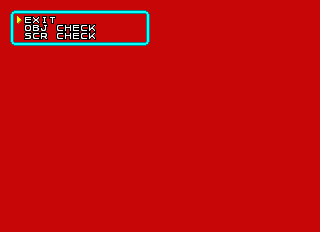
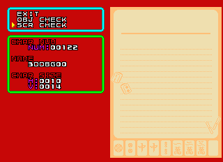
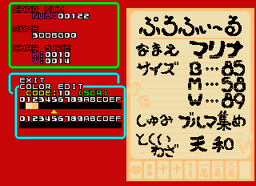
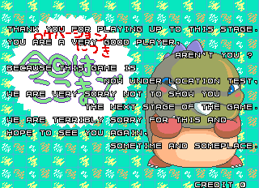

# Puzzle Bobble 3

# Debug Menu

Code begins at 0x5be4

Inject a call within the main loop (?) at 0x80a2c

Cheat:

```
  <cheat desc="Restore Debug Menu">
    <comment>Press Tilt to pause game; B3 advances frame while paused; hold P2 Start and press Tilt for menu</comment>
    <script state="on">
      <action>temp0=maincpu.md@80a3e</action>
      <action>maincpu.md@80a3e=001e6000</action>
      <action>temp1=maincpu.mq@001e6000</action>
      <action>maincpu.mq@001e6000=4eb900005be44eb9</action>
      <action>temp2=maincpu.mq@001e6008</action>
      <action>maincpu.mq@001e6008=00002e5c4e750000</action>
      <action>temp3=maincpu.mw@274e</action>
      <action>maincpu.mw@274e=4e75</action>
    </script>
    <script state="off">
      <action>maincpu.md@80a3e=temp0</action>
      <action>maincpu.mq@001e6000=temp1</action>
      <action>maincpu.mq@001e6008=temp2</action>
      <action>maincpu.mw@274e=temp3</action>
    </script>
  </cheat>
```

# OBJ/SCR Viewer




```
  <cheat desc="OBJ/SCR Test">
    <comment>Appears automatically on startup</comment>
    <script state="on">
      <action>temp0=maincpu.mq@80352</action>
      <action>maincpu.mq@80352=4ef900089bb40000</action>
    </script>
    <script state="off">
      <action>maincpu.mq@80352=temp0</action>
    </script>
  </cheat>
```

P1 Up/Down changes the value by 1; P1 Left/Right by 50. (Note that it uses decimal instead of hexadecimal as many testing tools do. It also returns to zero when scrolling past the highest value; very user freindly)

Holding P1 Button 1 while using P1 stick makes it move quickly

P1 Button 3 brings up Color Edit

# Mahjong Notepad

https://x.com/suddendesu/status/1829904976510140587






Viewable in the SCR Test above

The text reads:

Profile

Name: Marina

[Size](https://jisho.org/search/%E3%82%B9%E3%83%AA%E3%83%BC%E3%82%B5%E3%82%A4%E3%82%BA): B85 M58 W89

Hobby: Collecting buruma

Special Technique: Tenhō

This graphic doesn't appear to be used... It is only referenced in the debug tool graphics list, and no where else like most other graphics are...

Any other graphics like this?

Given its name in the viewer (3DDBG00) which is similar to the "fighting game" background graphics that appear before it, which is called 3DCBG00 and *is* used in the game during that stage's introduction animation, it seems likely that this is an old version of Marina's stage intro, before the proper mahjong game scene was added.

# More debug menus

strings at 05e156

Code that looks like it may be a part of it around 0x5e52e


# Gameplay Modes

Gameplay modes (modes specific to when the core gameplay is running, not the attract, title, etc) set at 0x41f772 (word)

## Location Test Screen



is mode 0x18

```
  <cheat desc="Show Location Test Ending">
    <script state="on">
      <action>maincpu.pw@41f772=18</action>
    </script>
  </cheat>
```

Code to set this mode seems to be removed

Looks like the text matches other Taito games

## Gameplay Settings menu

debug tools menu during gameplay

mode 0x27

```
  <cheat desc="Show Gameplay Test Menu">
    <script state="on">
      <action>maincpu.pw@41f772=27</action>
    </script>
  </cheat>
```

Code to set this mode is at 0xa111e, which appears to be uncalled

This is right below a small chunk at 0xa11114, which some code above branches to before branching back to the rts. That branch back up is also done in the unused code that sets mode 0x27.

There are two branches to 0xa1114, at 0xa108e which contingent on a cmp/bne; and at 0xa10c8, at the end of the code beginning 0xa1092 which is skipped over by the aforementioned cmp/bne

(this was going to lead into how that second call to a1114 may have been to a111e at one point, but manually doing that, it just doesn't seem to make sense)

0xa1018 does not seem to ever be called in standard gameplay.

# Sound/BGM strings

Beginning at 0x305fc is a big list of sound effect and BGM titles

Referenced by a ptr table at 0x31ce6, but this table seems to go unused

Not entirely sure these titles are from this exact game; need to compare to the sound test listing and see if the count matches and if some line up

May be a leftover from a previous game

# Alt Staff Credits

The actual staff credits appear around 0x93218

There is an alternate set around 0x52654

Doesnots eem to be from puzzle bobble 2 or 1... not sure where it comes from!

# Random Names

AND... a bunch of random names beginning around d122e

Is this possibly stage data with creator names?

SOLVED: these are the Edited By names that appear on some stages

# Unused BG GFX?

AMONGST THE GFX POINTERS, there is an address that sticks out an is not referenced

at 1e22c2

looks like it points to the same BG graphics as normal entry 99 does, but strangely the unused address seems to look better, like it was fixed...

TODO: where does this appear in game? does it show as fixed or broken?

# Audit Mode?

Gameplay modes 07 and 0A both call functions that gather the current stage name, the character name and gameplay type and do... something with it. Haven't been able to follow through with what happens to it. It LOOKS like something audit related, but haven't found an obvious function that displays anything.


# Prototype code

There is a huge chunk of prototype code within the final version.

STILL INVESTIGATING, copious notes...

The most inteersting thing so far has been finding early staff credits, see 0x52654 (older) vs 0x93218 (final)


# Scratchpad

ALSO: see strings @ 0x708f0


NEXT: character names at 0x58462, part of an audit screen?

ALSO: more strings at 0x5e156

MORE: around 0x961b2 - the code referencing this is usedby the char/stage/etc select; text itself doesn't seem to get used directly?

MORE: around 0xa3184 and 0xa32cc, 0xa4401

- Location Test Screen
- Gameplay options menu
- Variety of unused (and disconnected) test mode tools
- sound strings @ 0x305fc
- instrument strings in audio cpu code

Looks like code in the upper areas (say, 0x40000 and above?) is an older version. Makes a couple dubious jumps (e.g. 0x65a7a which jsr to 0x4818, which is definitely illegal code)

code at 0x3c72 and 0x62ff8 are very similar

same with 0x3e00 and 0x631f4

0x41f772 appears to be gameplay mode

value 0x27 is a debug menu when in game

the debug code MAY have been activated by tilt given similarities in Mizubaku Kids

https://tcrf.net/Liquid_Kids\_(Arcade)

Also the code for the debug entry is the same in darius gaiden (where is is also uncalled)

simialr ish in chase hq

https://tcrf.net/Chase_H.Q.\_(Arcade)

https://tcrf.net/Arabian_Magic

Strangely, it looks like the main loop is out at 0x80a2c

if we hijack one of the calls and inject a jsr to the debug code (and disable the usual tilt code), it works

Pressing Tilt pauses the game; B3 advances by a frame

Hold P2 Start and press tilt to access menu