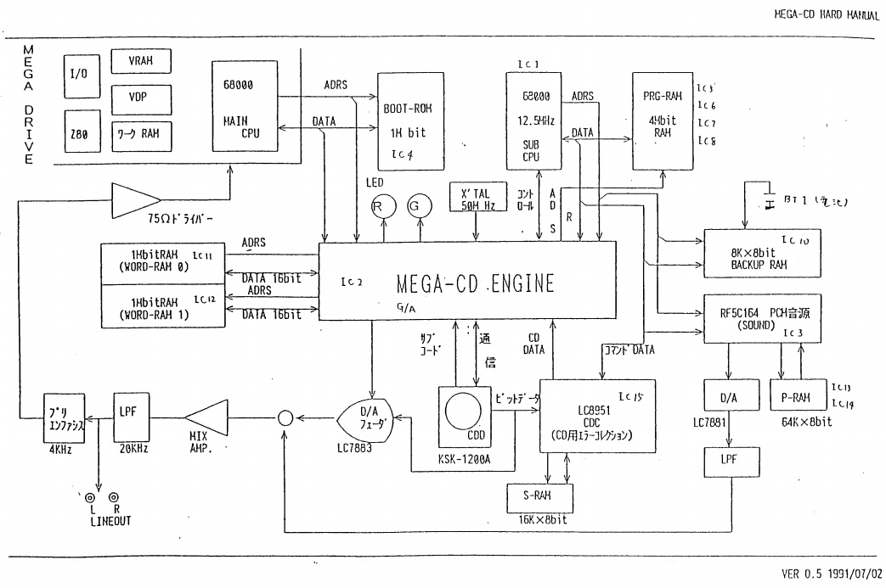
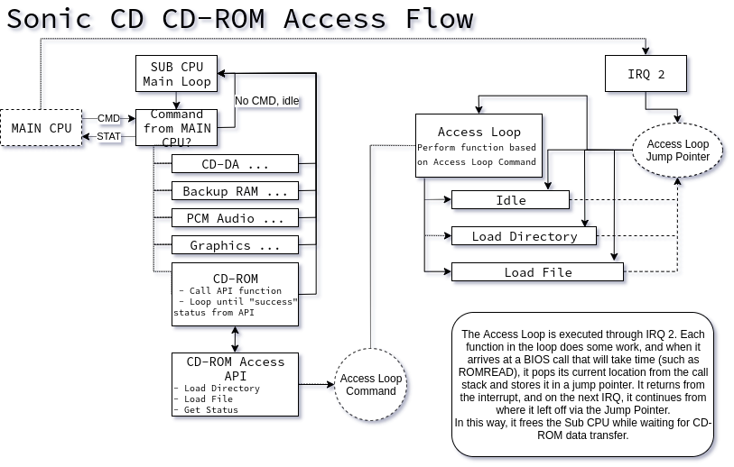

Aside from disassembling games, I also occasionally enjoy assembling them. While I don't have a lick of talent when it comes to the creative side of game creation, I love to work on the code and technical minutiae. In particular, I enjoy the Sega 16-bit era hardware, and while we have a great library for easy Megadrive development in the form of SGDK, the Mega CD is still a bit difficult to approach. I'd like to change that eventually...

<!--more-->

# Introduction

I initially wanted to do development for the Mega CD mainly to use the CD audio playback. So I dug into the official documentation that has been online for years and quickly realized there was a mountain of information to learn to even begin to utilize the hardware. The process was hampered by terse and poorly translated documentation and missing examples from undumped accompanying disks. I decided to look to actual game code for examples, and turned to the game I'm most familiar with: Sonic CD.

The first step in working with the Mega CD is, of course, loading data from the disc to be used by the Megadrive. I decided loading and executing an MMD file would be a good first step, and since I've had some surprisingly good success, I figured I'd write about it.

# What is an MMD?

And MMD is a self-contained Megadrive program. In a way, you can think of them as ROM files (though this analogy only works at a high level), as they contain all the code and graphics needed to run a Megadrive program. Each MMD files on the Sonic CD disc is a module that is loaded and executed by a relatively small master program resident in the Work RAM. For example, WARP__.MMD is the code and graphics for the 'cutscene' when Sonic does a timewarp; ATTACK.MMD is the Time Attack menu; each of the DUMMY*.MMD files is one of the hidden image screens.

(It should be noted that MMD is not a standard format, and I don't think any games besides Sonic CD use them. However, it's likely that most Mega CD games use the same concept of loading and executing individual modules.)

Since these are self contained, we can load and run (almost) any of them on their own without any special supporting code. And that also makes for a simple yet robust basis for creating our own Sega CD game.

This tutorial will go over how to load an MMD using Sonic CD's own code and how this can be applied to your own project.

# The Project and Prerequisites

[Clone the project from github here](https://github.com/RyogaMasaki/mmd_loader).

The code is written in M68000 assembly with GNU assembler syntax. It will work most painlessly in a Linux environment, but should also work fine in a Cygwin setup. You will of course need an M68k cross-compiler/toolchain. Please [see the readme for this project](https://github.com/RyogaMasaki/sgdk_nix) for some notes about the cross-architecture tools on various distros and on setting up your prefix in the makefile.

You will also need mkisofs (which should be in the cdrtools package) for creating the ISO image.

You will need a copy of Sonic CD in order to use an existing MMD file.

You'll also want to grab the official Sega documentation for reference, [which can be found here](https://segaretro.org/Mega-CD_official_documentation).

# Quick Build

To quickly see the demo in action, run "make setup" within the project root to create the work directories. Next, choose an MMD file from the Sonic CD disc (any of the DUMMY*.MMD files are a good choice, as these are the hidden artwork screens) and copy it into the "out/disc" directory. Either rename the file to "DUMMY0.MMD" or change the "mmd_filename" value in sp.s. (If you change the value of mmd_filename, be sure to preserve the ";1" version string.)

You may also need to change the region depending on your settings. It is set to Japan by default. This can be changed by uncommenting your correct version from within ip.s.

Finally, build the project with "make disc". This will generate a .ISO file in the out directory, which can be run as-is in your favorite Mega CD emulator.

Optionally, you can add an audio track. You will need an audio track in either MP3 or WAV format; copy it to the out directory. A CUE file is then necessary to map the data and audio tracks. In the cfg directory you will find "example.cue" which can be used as a basis. Copy this to the out directory and open it in a text editor. Change the filenames of the iso and audio files and save, then rename the cue file to match the iso. You can then load the CUE in your emulator of choice.

# The Mega CD Hardware

We won't go into extreme detail as that information can be found elsewhere, and if you're already familiar with the subject you can certainly skip this section. We'll focus mostly on the parts that relate to our MMD loading tool, which is to say, disc access, loading files and running code.

The Mega CD unit has a Motorola 68000 CPU, the same as the Megadrive, though clocked a fair bit faster. When the two units are connected, you have a powerful (for the time) dual CPU system. The processor inside the Megadrive is known as the Main CPU, and the one inside the Mega CD is the Sub CPU. Both are, in general, responsible for controlling the hardware within their own unit: the Main CPU works with the VDP, controller IO and Z80, while the Sub CPU manages the backup RAM, the advanced graphics functions, the PCM audio and, of course, the CD-ROM drive.

While these two workhorses are important, the real star of the show is the Gate Array.

The Sega 315-5548 ASIC, more commonly known as the Gate Array and shown in the image above as the MEGA-CD ENGINE, is the glue that holds all the Mega CD pieces together, and then some. More specifically, it provides registers to both CPUs in order to control peripherals, configuration, and data flow.

The names "Main" and "Sub" should give you an idea of the intended relationship of the two chips: the Main CPU runs the "main" program and sends requests to the Sub CPU for tasks to be executed. This communication is done through registers in the Gate Array: eight Command registers to which Main will write and which Sub will read, as well as eight Status registers for the Sub to report the status of a task. There are also 8 single-bit flags for each CPU to indicate their overall state.

This is fine for sending small commands back and forth, but how do we get large chunks of data (namely, tile graphics) from the Sub CPU which reads data from the disc over to the Main CPU to be loaded into the VDP? That is where Word RAM comes into play.

Word RAM is 2 megabits (256 kilboytes) of memory which can be used by either CPU to read or write data. It is used in one of two modes: 2M mode makes the whole 2 megabits available, though  to only one CPU at a time. So if the Sub CPU has access to Word RAM at the time, the Main CPU cannot access it, and vice versa. In 1M mode, the memory is split into 1 megabit chunks, with each CPU having simultaneous access to each opposite bank. Access to the other bank can then be swapped at any time. 2M mode is useful for loading and transferring large blocks of data around, while 1M mode is more suited for more immediate transfers, like calculated graphics or video playback. We'll be sticking to 2M mode for our purposes.

There is also PRG RAM, a 4 megabit (512 kilobyte) area of memory used almost exclusively by the Sub CPU for program code and occasionally data transfer. We won't be using it much here, but for now, know that this is where the Sub CPU program code will be loaded.

Finally, there is the 64 kilobytes of Work RAM within the original Megadrive. In addition to being used as actual runtime work RAM, it is also used for the main program code that runs on the Main CPU.

So a quick recap:

 - The Main CPU is inside the Megadrive unit and is responsible for the main program and interacting with the Megadrive hardware.
 - The Sub CPU is inside the Mega CD unit and is responsible for interacting with the Mega CD hardware.
 - The Gate Array is a chip that provides registers for CPU communication and Mega CD hardware control/configuration.
 - Word RAM is 256k of memory shared between the two CPUs, intended mostly for making large chunks of data available to the Main CPU.
 - PRG RAM is 512k of memory used primarily by the Sub CPU for program code, runtime memory and data processing.
 - Work RAM is 64k of memory used only by the Main CPU for main program code and runtime memory.

# The IP and SP

When starting the system, the drive spins up and starts to read the disc. It first verifies that it is Mega CD compatible software by checking the header, and if so will then automatically loads two chunks of code.

These are the IP (Inital Program) and SP (System Program). The IP runs on the Main CPU from Work RAM and the SP runs on the Sub CPU from PRG RAM. The data for these programs are located within the first 16 sectors of the disc. Since each sector is 2 kilobytes, that means the IP and SP must fit within 32 kilobytes.

These are the bootstrap programs for the CPUs, intended to get the system initialized into a state ready for the application and then to load the larger, main application.

This is where our focus will be with this project: writing the code for the IP and SP, which will in turn load an MMD to run.

# Diving into the code

To be clear, 99% of the code here is directly copied from Sonic CD's IP and SP, with changes to integrate macros and equates and such. Almost all of the definitions come from examples from old Sega source code (namely the 32X/CD demos) and have been re-worked for GNU assembler. There was some minor rearrangement with the CD-ROM access code and all the SP command code is different, but for all intents and purposes, this is exactly how Sonic CD starts up and does its loading from CD-ROM.

Taking a peek inside the boot subdirectory in our project, there is boot.s, cdrom.s, ip.s and sp.s. As you might have guessed, the ip.s and sp.s files are the code for the IP and SP. boot.s links the IP and SP code together and defines the header to identify itself as a Mega CD disc, which will ultimately form our 32k boot sector. Finally, there is cdrom.s, which is the API for accessing CD-ROM files.

As we mentioned earlier, the Sub CPU is intended to take requests from the Main CPU and provide data or perform an action as directed. As such, the SP acts as a server of sorts, waiting for commands from the client (the IP). Each command corresponds to a certain activity: maybe command 1 means load file "FILE1.MMD", and 2 means load file "FILE2.MMD", and 3 means save some data to the backup RAM, and 4 means play audio track 10, and so on. A command is a request to the Sub CPU to do something that only it can do.

The IP, then, is our "main" program. It starts running and issues commands to the Sub CPU when necessary. Let's say FILE1.MMD is our title screen, so it issues command 1 and waits for the data to be available. We also need our title screen music to play, so it issues command 4. Then it launches into the MMD, and when that exits (presumably by the user choosing an option, like start game), the main program moves to its next step: load FILE2.MMD and run it, and so on...

In our case, the IP is very simple: load an MMD, play an audio track and launch the MMD. The SP is a bit more complex: that is where we'll set up our table of commands and our calls to the CD-ROM API. And the CD-ROM API is really the meat of our project.

That code is located in cdrom.s in the boot folder. It is they key to everything and what makes this system viable as a basis for a real Mega CD project. So let's take a look at that next.

# The CD-ROM Access Loop

CD-ROM data is read through the CD BIOS that is built in to the system. Loading a file is not as simple as providing a filename and expecting data to show up in a buffer. Data must be located by sector offset and its length specified in the number of sectors it occupies. Moreover, loading the file is a multistep process of starting the CDD, waiting for CDC decoding then transferring the decoded data from the CDC to memory.

Thankfully, Sonic CD has a well-written wrapper for all this that, indeed, allows us to simply give a filename and have data show up in a buffer.

Here is a high-level look at how CD-ROM file access works in the game (and in our project):

As you can see, the actual disc access is managed through a loop that is triggered by IRQ 2. This interrupt is triggered by the Main CPU on every VBLANK. When one of the functions reaches a BIOS call that will take a long time (namely, a disc read), it saves its current location to a pointer and returns from the interrupt. On the next interrupt, it jumps back to where it left off via the pointer and checks if the disc function is done. Outside of the loop, the code making the API request monitors the status then continues on when the disc access is completed.

This is the basic structure of how Sonic CD disc access works. Now, I need to confess, I am not 100% sure <em>why</em> things are structured this way. It's not like moving the disc acces flow to rely on interrupts somehow frees up the Sub CPU, as it will still be waiting in a loop for the status of the disc read. I've thought about it quite a bit, and I can't think of any way that this makes things more efficient. I freely admit that I am no expert, though, so if anyone has an explanation for this, I'd love to hear it. I'd like to take apart some other Mega CD games as well to see if this is a common architecture, or if Sonic Team was just being "creative."

While not necessarily more efficient, it's certainly intertesting, so I've left this setup as-is for our project. In any case, we won't see all of that backend mess anyway, which is the point of having the API. To use it correctly, we need to do three steps:

1. Setup the INT2 vector to point to the CD-ROM Access interrupt handler
2. Call the API init code to get the loop started
3. Call the load directory API function to read and cache the filenames and their location/size

With these three steps taken care of, we can use the load_file subroutine to pass in a filename and a pointer to a buffer, and we'll have our data loaded after a few ticks.

# MMD Format

Loading Sonic CD MMDs is fine, but if you want to use this system for your own project, you'll need to know how to make your own.

As we said, an MMD is just a big binary with all the program code and resources packed together like you would find in a ROM dump. The only thing unique about an MMD is the presence of a header with some metadata. As such, an MMD is divided into a Header section and a Data section.

The header is the first 0x100 bytes of the MMD file (though most of this is empty space). It is made up of pointers and data lengths that describe where the MMD Data section should be placed as well as interrupt vectors. The layout looks like this:

|Offset|Size|Description|
|--- |--- |--- |
|0|word|Word RAM ownership|
|2|long|MMD Data section destination|
|6|word|MMD Data section size|
|8|long|Code entry point (absolute)|
|0xC|long|HINT vector|
|0x10|long|VINT vector|

Word RAM ownership - If bit 6 is set on the upper byte, then Word RAM will be given to the Sub CPU. This is done in MDINIT.MMD. Unsure if there is other functionality associated with this value.

MMD Data destination/size - This is a pointer to where the data section will be copied to and the size of the data in bytes. If this value is 0, the data is not copied anywhere.

Code entry - The pointer to jump to after the code has been copied.

HINT/VINT vector - sets the HINT and VINT vectors in the jump table. If this value is 0, the vector is not set.

After this, the rest of the header is 0 until 0x100.

# Conclusion

From here, I recommend you read through the documentation, especially chapters 1 and 4 of the BIOS Manual. Then refer to the code itself, which is pretty well documented with comments.

I would like to expand this into a full fledged SDK along the lines of SGDK, though this will certainly take some time. I'd like to disassemble some more Mega CD games to see how the same tasks were approached by different developers and come up with a "best" way to do things. Until then, hopefully this is a useful first step for anyone who wants to get started with Mega CD dev but doesn't know where to start.

As always, you can [reach me on twitter](https://twitter.com/suddendesu) for suggestions/corrections/help.
