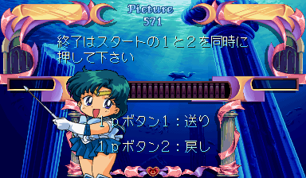
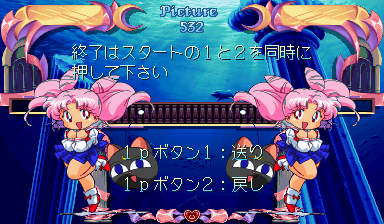
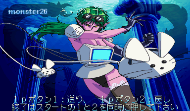
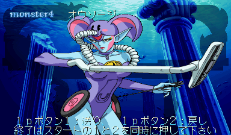
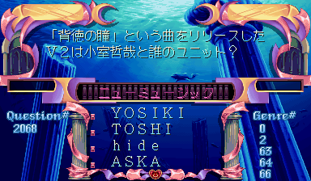
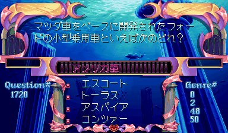
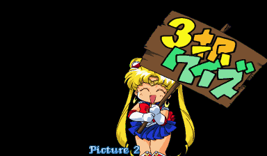
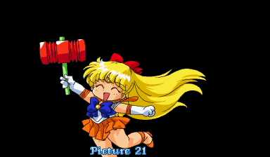

Don't feel like cheating your way through a Japanese text heavy quiz game to see some of the cute artwork in the game? I've got just what you need!

<!--more-->

# Disable warning screen

First of all, that warning screen is long and annoying. Let's get rid of it!

```
    <cheat desc="Skip warning screen">
        <script state="on">
            <action>temp0=maincpu.mb@2c81f</action>
            <action>maincpu.mb@2c81f=4a</action>
        </script>
        <script state="off">
            <action>maincpu.mb@2c81f=temp0</action>
        </script>
    </cheat>
```

# Pause/Reset game

In the game's main loop, there's a chunk of disabled code that can pause or reset the game with player inputs. It's disabled by a simple branch to the code below it, making re-enabling it a cinch: just NOP out the branch! Unfortunately, the disabled code isn't all that interesting. With it re-enabled, you can press P1 + P2 Start to reset the game, P2 Button 2 to pause and P2 Button 3 to unpause.

Here's the MAME cheat:

```
    <cheat desc="Enable pause/reset inputs">
       <comment>P2 Button 2 to pause the game; P2 Button 3 to unpause; P1 + P2 Start to reset game</comment>
        <script state="on">
            <action>temp0=maincpu.md@14c</action>
            <action>maincpu.md@14c=4e714e71</action>
        </script>
        <script state="off">
            <action>maincpu.md@14c=temp0</action>
        </script>
    </cheat>
```

# Disabled data viewers

Thankfully there are other, more interesting leftovers. We have a variety of data viewers, one for questions and three for artwork. All of them are orphaned chunks of code, with no references anywhere. As such, we need to hook them up somewhere to make them accessible. In this case, I replaced the first four options in the Test Menu with references to these functions. Here's the cheat:

```
  <cheat desc="Enable unused viewers">
    <comment>Replaces the first four options in the test menu</comment>
    <script state="on">
      <action>temp0=maincpu.mq@23894</action>
      <action>maincpu.mq@23894=000647b04ef90002</action>
      <action>temp1=maincpu.mw@2389c</action>
      <action>maincpu.mw@2389c=1d0e</action>
      <action>temp2=maincpu.mq@23ca2</action>
      <action>maincpu.mq@23ca2=00064df84ef90002</action>
      <action>temp3=maincpu.mw@23caa</action>
      <action>maincpu.mw@23caa=1d0e</action>
      <action>temp4=maincpu.mq@23e5a</action>
      <action>maincpu.mq@23e5a=000651aa4ef90002</action>
      <action>temp5=maincpu.mw@23e62</action>
      <action>maincpu.mw@23e62=1d0e</action>
      <action>temp6=maincpu.mq@23ff4</action>
      <action>maincpu.mq@23ff4=000650404ef90002</action>
      <action>temp7=maincpu.mw@23ffc</action>
      <action>maincpu.mw@23ffc=1d0e</action>
    </script>
    <script state="off">
      <action>maincpu.mq@23894=temp0</action>
      <action>maincpu.mw@2389c=temp1</action>
      <action>maincpu.mq@23ca2=temp2</action>
      <action>maincpu.mw@23caa=temp3</action>
      <action>maincpu.mq@23e5a=temp4</action>
      <action>maincpu.mw@23e62=temp5</action>
      <action>maincpu.mq@23ff4=temp6</action>
      <action>maincpu.mw@23ffc=temp7</action>
    </script>
  </cheat>
```

The first four options in the test menu will correspond to these data viewers, in this order:

## Picture viewer 1





Displays all of the artwork used during quiz scenes. P1 Up/Down or P1 Button 1/2 to scroll through the pictures. P1 + P2 Start to exit.

The code for this viewer begins at 0x647B0.

## Enemy viewer





Cycles through the monsters you meet throughout the game who challenge you to quizzes. Same controls as the picture viewer.

The code for this viewer begins at 0x63DF8.

## Question viewer





Cycles through all 8,860 (!) questions in the game. There is a genre number table to the left, though I haven't been able to figure out what it matches up with. The pink text in the bar above the answers is the text name of the genre of questions. Question 0 and 1 appear to be either test questions or broken (the genre for them is 外字1 - non-standard kanji or foreign characters).

P1 Left and Right cycle the questions by one, while P1 Up/Down cycles by 100.

The code for this viewer begins at 0x651AA.

## Picture Viewer 2





There is another image viewer, though not as well put-together as the others. There are only a handful of pictures, several of which are repeats and not positioned correctly.

P1 Up or Right to scroll up and P1 Down or Left to scroll down through the images.

The code for this viewer begins at 0x65040.

# Broken data viewers

It looks like there was one more viewer, an animation viewer, based on the string at 0x62A86. Next to it are small strings of 'X', 'Y' and '=', implying there was a position offset display.

Following this text, starting at 0x62AA0 and continuing to 0x62F54, is a large pointer table. Each of the pointers points to a line of Japanese text, which begins at 0x62F58, imediately after the pointers. Since the Japanese text uses game-specific encoding, it isn't easily made readable. I gave the first two strings a look though: they translate to Moon and Mercury. This text was probably the name of each animation, similar to the presence of the Monster name in the enemy viewer.

(As for the text format itself, it's a simple two-byte encoding, representing the offset from the start of the Japanese fonts at 0xE000 in the graphics memory. As such, one could build a text table pretty easily, but personally, my Japanese isn't good enough that I can readily recognize the hundreds of kanji present in the font.)

After this, though, the first Picture viewer code starts. There's no further trace of the Animation viewer, at least from what I've been able to find. All we have is some text remaining, no code. Which is sad, because the animation in the game is very nice.

As a final piece of weirdness, there is some leftover code that seems to be an old, though identical, version of Picture viewer 2. This occurs after the code for the four working viewers, starting at 0x65B70. The only difference appears to be a number of offsets are incorrect, off by a few bytes. It's very strange. There also some code after it (at 0x65DB2) that appears to be unrelated to the viewer, but also appears to be identical to other code that appears elsewhere. The only thing I can think of is that it's from an older build, and that binary some how got attached to this version. No idea.
