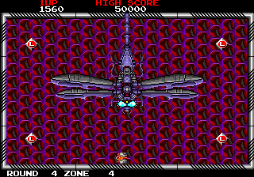
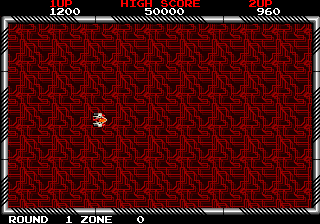
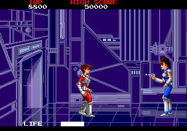
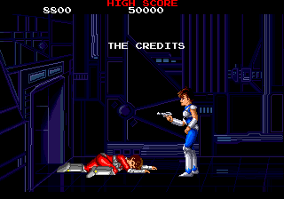

Just a quick article this time around after Zerochan, who is writing an [exhaustive Raimais guide](http://gaming.moe/?p=1794), asked me to take a look at the game and see if I could find any debug leftovers. Do level select and invulnerability count? Yes they do! I'll even throw in a bonus (possibly-)never-before-seen game ending!

<!--more-->

# Skip Warning Message

First of all, as is becoming tradition, here is a cheat to skip that long and annoying warning message on startup in the Japanese versions:

Japan:

```
  <cheat desc="Skip startup warning message">
    <script state="on">
      <action>temp0=maincpu.mw@4fc2</action>
      <action>maincpu.mw@4fc2=0000</action>
      <action>temp1=maincpu.mb@4fc4</action>
      <action>maincpu.mb@4fc4=00</action>
    </script>
    <script state="off">
      <action>maincpu.mw@4fc2=temp0</action>
      <action>maincpu.mb@4fc4=temp1</action>
    </script>
  </cheat>
```

Japan (First revision)

```
  <cheat desc="Skip startup warning message">
    <script state="on">
      <action>temp0=maincpu.mw@4fb6</action>
      <action>maincpu.mw@4fb6=0000</action>
      <action>temp1=maincpu.mb@4fb8</action>
      <action>maincpu.mb@4fb8=00</action>
    </script>
    <script state="off">
      <action>maincpu.mw@4fb6=temp0</action>
      <action>maincpu.mb@4fb8=temp1</action>
    </script>
  </cheat>
```

# Debug Flag





Setting the byte value at 0xA219 to a non-zero value will enable a debug flag, unlocking some useful tools:

## Pause

P1 Start pauses the game; pressing it while paused will advance the game by one frame. P2 Start unpauses.

## Stage Select

While not paused, P2 Start activates the stage select, shown as ROUND and ZONE in the lower left of the screen. P1 Button 1 changes the Round, while Button 2 changes the Zone. P2 Start loads the selected stage.

## Invulnerability

If bits 4 and 5 of DIP switch B are set (this is the 'Lives' switch in MAME, set to 6), the player is invincible. Note that closing door in some stages will still kill you.

## DIP Overrides

When the flag is set, it ignores the 'Allow Continue' DIP switch and will always continue after game over. Also, it ignores the Service Mode DIP switch, and will always boot into the main game instead of service mode.

# Debug Flag Technical

The debug flag is set by a build constant byte located at 0x5FFF (immediately before the ROM bank switch vector at 0x6000):

<pre class="pdasm pdasm-arch-z80">
4FA1: ld   a,$01
4FA3: ld   $8801{IOC1},a  ; switch the output port to point to DIP switch B
4FA6: ld   a,$8800{IOC0}  ; read the value of the switch
4FA9: cpl
4FAA: and  $80            ; bit 8 set? (Allow Continue switch)
4FAC: jr   z,$4FB2        ; nope, jump down
4FAE: ld   a,$5FFF{debugFlag_constant}      ; put value at 0x5FFF into A
4FB1: cpl                 ; flip the bits
4FB2: ld   $A219{debugFlag},a      ; put A in the debug flag address
</pre>

It first checks a value on DIP switch B, the 'Allow Continue' switch, and will only proceed to load the constant if it is set. In this way. the 'Allow Continue' switch also acts like a physical on/off switch for the debug tools. If the DIP is set it copies the XORed constant to 0xA219.

The value at 0x5FFF is 0xFF in all the dumps we have. In the code above, this value has all its bits flipped and is then checked if the new value is 0, so debug will always be disabled. We can change this to literally anything that isn't 0xFF to enable debug.

# MAME Cheat

With that in mind, we have two codes: one which does things 'correctly' by changing the debug build constant (and which will require the 'Allow Continues' DIP switch to be set), and another which bypasses all that and just holds the value in RAM. The only difference is that the RAM method will always have the flag enabled despite what the 'Allow Continues' switch is set to.

```
  <cheat desc="Enable debug flag (via constant)">
    <comment>'Allow Continues' DIP switch must be set! P1 Start to pause game, hold P1 for slow or press P2 Start to unpause; press P2 Start to bring up level select, use P1 Buttons to select, then P2 Start again to start level; set Lives DIP to 6 for invulnerability</comment>
    <script state="on">
      <action>temp0=maincpu.mb@5fff</action>
      <action>maincpu.mb@5fff=00</action>
    </script>
    <script state="off">
      <action>maincpu.mb@5fff=temp0</action>
    </script>
  </cheat>

  <cheat desc="Enable debug flag (via RAM)">
    <comment>P1 Start to pause game, hold P1 for slow or press P2 Start to unpause; press P2 Start to bring up level select, use P1 Buttons to select, then P2 Start again to start level; set Lives DIP to 6 for invulnerability</comment>
    <script state="run">
      <action>maincpu.pb@a219=ff</action>
    </script>
  </cheat>
```

I'd recommend not enabling the cheat while you're at the title screen, because P1/P2 Start pause functions will be enabled. You'll insert a coin and start and sit and wonder why the game stopped... or at least that happened to me several times.

# UPDATE: The super secret endings!

Zerochan wrote about a couple lines of apparently unused spoken dialogue that seemed to hint at a major plot twist and a darker ending. This was intriguing, so I slogged through the disassembly further (the game does ROM bank switching, which makes things *less than pleasant* when trying to follow a disassembly) and found the game endings code. Sure enough...





New endings, one with the previously discovered "unused" dialogue! These endings are **accessible in the normal game with no cheats or hacking necessary**; however, **the requirements are extremely difficult**. You must:

 - Reach the final scene in 16 or less stages
 - Not die. Ever.

As Zerochan is far more familiar with the gameplay than me, [I'll let her comment on the difficulty and the plot twist](http://gaming.moe/?page_id=1951). We'll go over some of the technical details here.

There are three byte-size variables (per player) that determine which ending you see:

 - 0xA211 / 0xA212 - Stage clear counter (for P1 / P2, respectively)
 - 0xA213 / 0xA214 - Player obtained the mirror
 - 0xA215 / 0xA216 - Player miss (death) count

The game uses those values and this logic to choose the ending:



With this logic, we have a path for Standard endings and a path for Special endings. The Special path is used when there is a no miss + <17 stages cleared combination from the player; the Standard path is used when either or both of those requirements are not met. On both paths, the final determinant is the presence of the Light Mirror. So, we have four endings:

<table>
	<thead>
		<tr>
			<th>Ending ID</th>
			<th>Type</th>
			<th>Description</th>
		</tr>
	</thead>
	<tbody>
		<tr>
			<td>2</td>
			<td>Special + Mirror</td>
			<td>Makoto was the bad guy all along!</td>
		</tr>
		<tr>
			<td>3</td>
			<td>Special</td>
			<td>Molto with gun (alternate dialogue), Makoto dies</td>
		</tr>
		<tr>
			<td>4</td>
			<td>Standard</td>
			<td>Molto with gun, Makoto dies</td>
		</tr>
		<tr>
			<td>5</td>
			<td>Standard + Mirror</td>
			<td>Molto with gun, use mirror and rescue Makoto</td>
		</tr>
	</tbody>
</table>

While the dramatic surprise ending is exciting, the other Special ending is woefully lacking. It's the same as the mirror-less Standard ending, save for one different line of speech from Molto. Kind of a rip-off when you consider how difficult it is to get on the Special path.

If you want to take the challenge, here is a MAME cheat that you will find useful. It displays the values of the three ending variables, as well as the ending ID, so you can keep track of how you're doing in game. Note that the ending ID is only set in the code right before the final cutscene; it won't be updated throughout the game.

```
  <cheat desc="Display ending settings">
    <script state="run">
      <output format="P1 stages cleared count: %02d">
        <argument>(maincpu.pb@a211)</argument>
      </output>
      <output format="P1 has mirror: %1d">
        <argument>(maincpu.pb@a213)</argument>
      </output>
      <output format="P1 death count: %02d">
        <argument>(maincpu.pb@a215)</argument>
      </output>
      <output format="P2 stages cleared count: %02d">
        <argument>(maincpu.pb@a212)</argument>
      </output>
      <output format="P2 has mirror: %1d">
        <argument>(maincpu.pb@a214)</argument>
      </output>
      <output format="P2 death count: %02d">
        <argument>(maincpu.pb@a216)</argument>
      </output>
      <output format="Current ending: %1d">
        <argument>maincpu.pb@ac2b</argument>
      </output>
    </script>
  </cheat>
```

Or if you want to avoid the effort altogether, here's a MAME cheat to let you choose your ending:

```
  <cheat desc="Choose ending">
    <parameter min="2" max="5" step="1">
      <item value="2">2 - Makoto as Molto</item>
      <item value="3">3 - Makoto dies (alternate dialogue)</item>
      <item value="4">4 - Makoto dies</item>
      <item value="5">5 - Rescue Makoto using mirror</item>
    </parameter>
    <script state="change">
      <action>maincpu.pb@AC2B=(param)</action>
    </script>
    <script state="run">
      <action>maincpu.pb@AC2B=(param)</action>
    </script>
  </cheat>
```

Since the Special path was always available (just very well hidden), it's possible that someone in an arcade somewhere has uncovered this before, but I think these endings will be a surprise for most Raimais fans.

# And more...

There's an easter egg in the game and lots of unused content too, which [Zerochan has written about in detail](http://gaming.moe/?p=1794). Continue there for more on Raimais!
