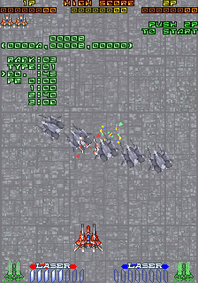

A solid shooter from Taito with impressive scene transitions and even better music from Zuntata. And a handful of debug tools that took some wrangling to get working. But wrangled they have been!

<!--more-->

# Skip ROM Check

Though it doesn't explicitly announce it, the game performs a checksum routine on startup. Any of the cheats in this article will cause it to fail, resulting in an locked black screen, so you'll need to activate this cheat first:

```
  <cheat desc="Skip ROM check">
    <script state="on">
      <action>temp0=maincpu.md@5e2</action>
      <action>maincpu.md@5e2=4e714e71</action>
      <action>temp1=maincpu.mw@5e6</action>
      <action>maincpu.mw@5e6=4e71</action>
    </script>
    <script state="off">
      <action>maincpu.md@5e2=temp0</action>
      <action>maincpu.mw@5e6=temp1</action>
    </script>
  </cheat>
```

Note that this does not skip the "WAIT A MOMENT" countdown on startup, which seems to be a "warm up" perdiod and has nothing to do with the actual ROM check.

To reiterate, *you need the Skip ROM Check cheat active to use any other cheats here.*

As a secondary note, all the cheats here will work with any of the Ver 2.3 dumps of the game, but not with the Ver 2.0 dump. If for some reason the cheats are needed for the older version, let me know on twitter and I can whip them up.

# Stage Select


Rayforce implements [the Taito Code](/entry/the-taito-code), which displays a rudimentary stage select.

# Startup Menu


The code at 0x800C is a debug menu with several test options, all of which work to varying degrees.

Let's quickly run through the options listed.

## Normal Game, Debug Game


As you might have guessed, Normal Game starts the game normally while Debug Game starts the game... debug-ly? In this gameplay debug mode, there is a text display indicating enemy stats, the time in the stage, the player rank, and what is likely to be the randomizer seed.

The enemy stats is interesting as it's actually showing two values, separated by the comma. The upper value is at 0x4048CE and indicates the total "value" of enemies destroyed in your current life. Weak enemies may be worth 1 point, while stronger are worth 2 or 4 and so on. This value seems to be what feeds into your Rank

Second number is like a bonus, when it increases, rank immediately goes up one. It is somehow related to the stage difficulty setting, but needs more research to determine exactly what it represents.

Time and Rank are pretty much self explanatory. The line marked ???? took a bit of poking, but I believe it has to do with randomness, possibly the seed. The first value of the three (at 0x4038C6) is based on when you inserted a coin. So, if you insert a coin during the WAIT A MOMENT screen, this value will always be one. I haven't been able to determine how the other two values, at 0x4038CA and 0x4038CC, play into things.

Another, less noticeable effect of debug mode gameplay is that there will be an "electronic" sort of sound effect that plays whenever your rank goes up. It's code 05 in the sound test, if you want to give it a listen.

## MASK CHR TEST


Very little going on here. Shows the 8x8 CHRs. P1 Left/Right change the color palette.

## CHR TEST


Garden variety tile viewer. P1 Up/Down scroll the graphics, and P1 Left/Right change width (the number of tiles per line). P1 B1/B2 will change the color palette. P1 Start switches between SCR and OBJ mode, which have different sets of graphics. While in OBJ mode, P2 B1/B2 will zoom in and out.

## SCREEN TEST


This seems to be a tool for visualizing and testing the parallax and Z positioning of layers. There are settings for Zoom and Z-Pos for each layer. P1 stick moves the Player One ship, as well as the menu cursor at the same time. P1 Button 1/2 will change the value of the highlighted option by one; P1 Start/P2 Start will change the value quickly. P2 Up/Down will move the camera vertically.

## FFV TEST


It's unclear what this is supposed to be. It feels like another tool for visualizing something, but there isn't much going on.

P1 Left/Right moves the camera to the left and right. The rows of ships have some parallax to them.

P1 Up/Down does something (increases/decreases long @ 0x40569C) but produces no noticeable visual change. It also looks like P1 Button 1/2 are meant to increase/decrease a value as well, but the value they are changing is being overwritten by 0x28ca8.

Could use more research by someone feeling up for a challenge.

## MAKE TABLE


This tool is ultimately pretty pointless, but for those who like to get deep into weird dev leftovers, it's pretty interesting.

When chosen from the menu, you'll see the screen above appear for a few seconds, followed by a game reset. That's it. No inputs, nothing. It may seem like it's broken, but after looking at the code, you'll see it's fully functional.

So what is it doing? It's creating a bunch of data and storing it in RAM in the range listed in the second line, then entering an infinite loop. At the beginning of the routine, it disables interrupts, which causes the watchdog to reset the system after it sits in that loop for a few seconds.

And what's the point of doing that? Most likely, it was to generate data for the developers to use in one way or another. With the watchdog disabled or execution paused by the debugger, the data can then be captured from RAM. Kind of like a roundabout way of writing a small script to generate some numbers. What exactly the data was used for we can't say.

There are actually a number of these "make table" subroutines in the code, six others to be precise, though two of them are exact duplicates (U OVER POSITION) and another two have somewhat different code but the same title (REDUCE), so enjoy these thrilling screenshots of the four text strings that are unique:


The first one, with the scrambled text, actually says "angle table," but lowercase text was used, which is clearly not supported by the character set.

Considering how infrequently such a tool would be used, the dev likely only referenced one as needed and recompiled. Though there are nine empty slots in the startup menu, so perhaps they were all listed at one time. In any case, those empty slots are a perfect place to drop in references to the other, unused Make Table subroutines. This cheat does just that:

```
  <cheat desc="Add extra Make Table functions">
    <comment>These will occupy the first six blank slots after CHR TEST</comment>
    <script state="on">
      <!-- angle table -->
      <action>temp0=maincpu.md@7f68</action>
      <action>maincpu.md@7f68=000a2ac0</action>
      <!-- wall vsize -->
      <action>temp1=maincpu.md@7f6c</action>
      <action>maincpu.md@7f6c=000a2c0e</action>
      <!-- u over position -->
      <action>temp2=maincpu.md@7f70</action>
      <action>maincpu.md@7f70=000a2c6e</action>
      <!-- u over position 2 -->
      <action>temp3=maincpu.md@7f74</action>
      <action>maincpu.md@7f74=000a2ce2</action>
      <!-- reduce -->
      <action>temp4=maincpu.md@7f78</action>
      <action>maincpu.md@7f78=000a2d56</action>
      <!-- reduce 2 -->
      <action>temp5=maincpu.md@7f7c</action>
      <action>maincpu.md@7f7c=000a2dc0</action>
    </script>
    <script state="off">
      <action>maincpu.md@7f68=temp0</action>
      <action>maincpu.md@7f6c=temp1</action>
      <action>maincpu.md@7f70=temp2</action>
      <action>maincpu.md@7f74=temp3</action>
      <action>maincpu.md@7f78=temp4</action>
      <action>maincpu.md@7f7c=temp5</action>
    </script>
  </cheat>
```

We can't add in text to the menu entries as they are zero bytes in length, but it still works as intended. The first six blank entries after CHR TEST in the menu will now jump to the Make Table functions.

Useless, sure, but at least it's available for anyone who wants to research it.

## FSC TEST


Another visualization test. This time we have a flat textured plane which can be rotated with P2 Left/Right. P1 Stick moves the camera around.

## ENEMY TEST




This is a rather thorough and aptly named tool for testing enemies by spawning them at will.

You are initially presented with a stage select, and after choosing a stage, the game begins to run as usual but with no players present. It moves through the normal progression of the level, with all the usual enemies and objects along the way. At any time, you can insert coins and press P1 or P2 Start to spawn a player and begin playing.

The actual tool is the menu on the left side of the screen, which can be controlled by holding P2 Button 3 and using P2 Joystick to move the cursor and change values. "No." is the enemy object ID, and "Type" seems to be subtypes/arrangements of that enemy. Rank is your player rank, of course. I'm not yet certain of what the PM options do, though changing PM 0 will change the color of one of the enemies for types that have them in arrangements. I'll leave that to someone else to fully work out.

When you have settings the way you'd like them, press P1 Coin to spawn the enemies. Note that some (lots) of combinations of No. and Type will cause the game to crash from an exception, so you'll likely want to use a savestate if you plan to play with this to quickly reload after a crash.

P2 Coin will pause the game, causing all sprites to disappear. You can navigate the menu and change settings while game is paused this way.

Something you won't notice right away is a targeting reticle, the same used by the player ships for bombs but with a different color (yellow and green) than either player uses. This will point to where certain enemies and objects (like explosions) will appear when spawned. Hold P1 Button 3 and use P1 Joystick to move the reticle around the screen; hold P1 Button 3 and use P1 Button 1/2 to change the Z-pos of the reticle. The reticle X/Y/Z position is displayed as the numbers above the menu.

So, it's a neat tool, and it wouldn't surprise me if there are a couple of unused enemies or objects or animations that can be made accessible with it. I'll leave that to the hardcore fans of the game to discover. There are a couple issues, however.

The most obvious is that, as the game is running as normal, all the normal enemies in the stage appear along the way, making it difficult to work with only the enemies you want to spawn. Thankfully there seems to be a test screen just for this. When you are shown the stage select at the start of the tool, choose stage 8. It's is a single, unmoving gray screen with no enemies, shown in the left screenshot above. This is extremely helpful for actually testing things.

The next and bigger problem is the input mapping. For whatever reason, spawn and pause are mapped to P1 and P2 Coin inputs. These were likely something generic on the development system, but on the final hardware it poses a problem. The number of coins allowed to be inserted is limited to 9. After that value is reached, the coin inputs no longer register. This means we can, at most, spawn enemies 9 times and pause the game 9 times. After that it simply won't work any more.

Well, let's fix that. Here is a cheat that will remap the spawn button to Service 1 ('9' in MAME) and pause to Service 2 ('0' in MAME).

```
  <cheat desc="Change Enemy Test Inputs">
    <comment>Remaps Spawn Enemy to Service 1 and Pause Game to Service 2</comment>
    <script state="on">
      <action>temp3=maincpu.mb@a38d1</action>
      <action>maincpu.mb@a38d1=10</action>
      <action>temp4=maincpu.mb@a3683</action>
      <action>maincpu.mb@a3683=20</action>
    </script>
    <script state="off">
      <action>maincpu.mb@a38d1=temp3</action>
      <action>maincpu.mb@a3683=temp4</action>
    </script>
  </cheat>
```

That should make things a bit more usable.

# Startup Debug Menu - Details & Cheats

The code for this menu is unreferenced, but the options for a "Normal Game" and "Debug Game" indicate it was probably meant to be displayed on startup. There's already a fully working developer tool that runs on startup in the form of the Taito Code stage select we mentioned first, so the easiest way to get this menu working is to hijack that stage select code. Nice n' easy.

```
  <cheat desc="Show Startup Menu">
    <comment>This will replace the Taito Code stage select</comment>
    <script state="on">
      <action>temp0=maincpu.md@44de</action>
      <action>maincpu.md@44de=0000800c</action>
    </script>
    <script state="off">
      <action>maincpu.md@44de=temp0</action>
    </script>
  </cheat>
```

This doesn't require holding any inputs; it will automatically be shown when the game is reset.

Since there's no stage select in this menu, there's no way to use the debug mode on stages except for the first one. One solution is to enable the debug mode directly in RAM with this cheat:

```
  <cheat desc="Enable in-game debug monitor">
    <comment>Cannot be used with Startup Menu cheat</comment>
    <script state="run">
      <action>maincpu.pw@402326=0001</action>
    </script>
  </cheat>
```

And then the Taito Code stage select can be used, giving us the debug display in any stage. Just one small caveat: this should not be used with the Startup Menu cheat above. The reason for this is because the programmer decided to be clever. The variable that enables debug mode, the word at 0x402326, is also used to track the position of the cursor in the startup menu. Notice that Normal Game is the first entry, so the cursor index will be 0. The next entry is Debug Game, and when highlighted, the cursor index will be 1. Code-wise, both options do the exact same thing: simply start the game. But if Debug Game was chosen, that cursor value will be 1, and the game checks if that value is greater than 0 to show the menu. Yeah, okay, cute.

Our cheat to always enable the debug monitor freezes this value at 1, meaning navigating the menu will be impossible, as MAME won't allow the cursor value to change. In any case, the Startup Menu cheat replaces the Taito Code check altogether, so the two can't be used at the same time regardless. But just a heads up to not leave the the "debug always on" cheat enabled if you plan to use the Startup Menu.

# Gameplay Debug Menu


There is another menu with a variety of debug tools that is meant to run during actual gameplay. It is activated by the Tilt input (mapped to T by default in MAME), which also pauses the game. P1 Up/Down moves the cursor, and P1 Button 1 chooses an option.

## Cancel, Reset

They do just what they say: Cancel closes the menu and Reset will restart the game.

## Process Meter


This will enable a horizontal gauge and number on the lower part of the screen indicating CPU load.

## Task Status


This enables a list on the right side of the screen indicating the IDs of active tasks.

## Player No Hit

Well... From the name, it's safe to assume this was a player invincibility flag. However, it doesn't work. We'll rant about that in the technical section below.

## Color Edit


A surprisingly well-made palette editor. P1 Button 1 / Button 2 scroll through the list of colors, while P1 Left/Right selects the RGB color channel (on the bottom of the list), and P1 Up/Down changes the value. P2 Up/Down changes the palette ID by 1, and P2 Left/Right changes the palette by 0x10.

## ENE Options


These options are all fundamentally the same in appearance: a column of hex values on the left side of the screen. As their names imply, they are related to the enemies on screen. The first option, "ENE ENTRY," seems to be the ID of each type of enemy on screen, but it is unclear what the rest represent exactly. I leave that research to the hardcore fans of the game.

# Gameplay Debug Menu - Technical

Getting this menu working took some creative thinking.

The menu is activated by the Tilt input, but this is tricky because, as with many Taito games, there is already code that actively monitors for that input. When pressed, you'll be shown this underwhelmingly terse screen followed by a system reset.


Even if we bypass the Tilt check and get the menu up and running, we'll find that most of the options simply don't do anything. There are no issues with the code itself: most of it is simply setting or clearing flags. But the subroutines that check those flags are also unreferenced, ultimately rendering the menu mostly useless.

So we have to correct three things here:

1. Add a call to the unreferenced menu in the program loop
2. Remove the Tilt input check
3. Add calls to the code for the unreferenced menu options

We're faced with our old twin enemies when dealing with restoring orphaned code: context and space. From where are these functions supposed to be called? And when we've figured out a likely context, where do we find the space to make a jump to them?

The unreferenced tools are the debug displays: the Process Meter, Task Status and Enemy lists. From the type of tools they are, it's clear their meant to be called on every frame. So that gives us context easily enough.

But what about space? Suddenly, the Tilt check becomes a blessing in disguise. We want to disable the check anyway, so why not use its space to make the calls to our disabled meters, as well as the menu itself? This works out perfectly and kills two birds with one patch. We replace the tilt check code with jumps to the menu and the debug displays and suddenly everything works beautifully.

Well, almost. If we bring up the menu this way, everything works... for about 4 seconds or so, after which the game resets. While I haven't dived into this too deeply, this is almost certainly due to the interrupts being disabled early in the vblank routine. With the menu creating a local loop to pause the game, it's not escaping back into the vblank routine where the interrupts are re-enabled a little later on, thus likely preventing a watchdog kick somewhere. In any case, we clearly we can't have the reference to the menu there.

There happens to be another piece of relatively useless code that occurs after the interrupts are re-enabled, and that is the routine that plays a sound effect when a coin is inserted. Indeed, if we replace it with a jump to the menu code with the debug displays still residing in the old tilt check code, the game no longer resets when in the menu. Of course, we've lost the sound effect that occurs when a coin is inserted, but sacrifices must be made, I guess. So **now** everything is working perfectly...

Well, almost. The player no hit option still doesn't have any effect. The menu sets or clears the byte at 0x4000F0. This value, though, is not used anywhere else in the code. I have checked both the dumps we have (version 2.0 and 2.3), and neither uses this variable. Unlike the other options, which were their own free-standing functions that were present but disconnected, the code that used this variable was likely embedded somewhere within the heart of the gameplay engine, and it seems to have been completely excised.

# Unused Strings

At 0xA7530, there is a pointer table referencing 7 strings, each of which are repeated three times.

```
YOU DEAD AT ROUND ONE.  
YOU DEAD AT ROUND TWO.  
YOU DEAD AT ROUND THREE.
YOU DEAD AT ROUND FOUR. 
YOU DEAD AT ROUND FIVE. 
YOU DEAD AT ROUND SIX.  
YOU DEAD AT LAST ROUND. 
```

From their wording, it sounds like they would have appeared on the Game Over screen, which maps out how far you progressed.


Indeed, these strings are actually referenced in the code, in the same subroutine that displays the window with the stage preview and the AREA text, at 0xA6310. The string to match the stage is correctly indexed, and the pointer to the first copy of the string is stored in memory. That pointer is never used, though, so the text also goes unused.

That's all for Rayforce for now. See you next game!
