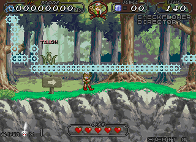
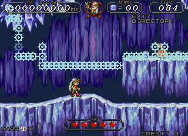
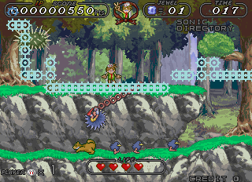
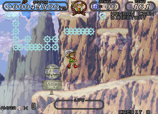

Platformer arcade games are a bit rare, so it's a shame that Recalhorn (that's ree-cal-horn, according to the katakana) never got past the location test stage. The graphics are quite nice, even beautiful in some backgrounds, and while the gameplay isn't ground-breaking, it's classic and solid. But other people [have written better reviews](http://retrovania-vgjunk.blogspot.com/2017/03/recalhorn-arcade.html) than I ever could, so let's just jump into what I found...

<!--more-->

# Object Debugger





Anyone who has ever taken a look at the Recalhorn data will have undoubtedly noticed the huge amount of plain text floating around which clearly did not appear in the game. It starts at 0xEDA0 and consists of 342 entries of 11 byte, zero-terminated strings. These aren't leftovers, however. They are used by a rather elaborate object monitor and testing tool.

When enabled, the monitor displays a visualization of the object list currently in memory (which are stored at 0x400FB2), as seen in the screenshots above, with each of the blue 'wheels' being an object. The P2 Joystick will move a cursor (appearing as a darker blue wheel, more visible in second screenshot), but only Right and Down work; you cannot go back in the list. You will, eventually, cycle past the right side and loop back to the beginning, at the top left.

The list actually cuts off the right side of the screen usually and it does not scroll as you move your cursor. You can see what item you're on, at least, by the text in the upper left. The lower lines tells you the highlighted object name.

The upper line indicates the name of the items you have selected to spawn, and this leads us into this tool's other function as an object killer/spawner, somewhat similar to [the task list in Mouja](/entry/mouja-unused-test-menu-debug-functions-easter-eggs-and-more). P2 Button 3 will cycle through the list, P2 Button 1 spawns that object and P2 Button 2 destroys the existing object selected with the cursor as well as all of its child objects. Also, to spawn items, you will need to have the cursor on a Directory type object into which the item will be created.

Like the object cursor, Button 3 only cycles forward. This can be really, **really** annoying when you consider there are 341 objects in the list. So I've also created a cheat that lets you specify an object ID with the value selector built in to MAME. You'll need to tab in and out of the cheat menu to change the object, but its still much faster than having to cycle through the entire list one by one.

Here are the cheats:

```
  <cheat desc="Enable Object Debugger">
      <script state="on">
          <action>temp2=maincpu.mq@ca0</action>
          <action>maincpu.mq@ca0=303c000447ed0fb2</action>
          <action>temp0=maincpu.mq@ca8</action>
          <action>maincpu.mq@ca8=4eb9000100724e75</action>  
          <action>temp3=maincpu.md@d9a2</action>
          <action>maincpu.md@d9a2=00000ca0</action>
      </script>
      <script state="off">
          <script>maincpu.mq@ca0=temp2</script>
          <script>maincpu.mq@ca8=temp0</script>  
          <script>maincpu.md@d9a2=temp3</script>
      </script>
  </cheat>

  <cheat desc="Select object">
    <parameter min="0" max="343" step="1"/>
    <script state="run">
      <action>maincpu.pw@400fec=param</action>
    </script>
  </cheat>
```

# Objects and Directories

"Object" may not be the most semantically correct term for these pieces of data, but coming from the world of object-oriented programming, it's how I think of them naturally (though even then it doesn't really match what an OOP object is, but I digress). I say that because while many 'objects' are actual, in-game things, like enemies or obstacles or stage items, there are also many that represent a non-visual piece of game code, such as an end of stage trigger or code to change opacity on graphics layers. Basically, any sort of interactive or dynamic aspect of the game, anything that isn't a static graphics tile, is an object.

To get a little more technical, each of the objects is essentially an entry in a [doubly-linked list](https://en.wikipedia.org/wiki/Doubly_linked_list) structure, with a pointer to a parent (previous) and child (next) object. The game processes objects by starting with the first one at 0x400FB2, running it's loop code, then moving on to the child object. This continues to the end of the object list, after which it jumps back up to the start.

There are four large pointer tables in the code with entries for each object. The first table (at 0xDA0E) is object initialization code and the second (at 0xE08A) is object loop code. That is, when an object is initialized (spawned), the corresponding code in that first init table is run once to set it up. After that, the loop code is run each time the object is processed in the loop mentioned above. So, for example, when the player is spawned the init code may set things like the starting position and first graphics frame, health, etc, just once, and the loop code will update sprite position based on the current player input, change animation frames, etc, over and over. The third table starts at 0xE706, containing word size values which indicate the size (in bytes) to allocate on the memory heap for the object. Finally, at 0xEA44, we have more pointers, this time to the object name strings that are used in the normally disabled debugger.

(It's quite interesting (to me, anyway) that there is so much space in the ROM dedicated to the object names: 1,372 bytes in pointers to name strings, and 4,248 in ASCII text. That's 5,620 bytes essentially 'wasted' in a debugging tool that will ultimately have no use in the final product! Though it could be argued they planned to remove the debugger before production builds, but who knows...)

The Directory object that was briefly mentioned before is a special kind of object. It is analogous to a directory on a computer (usually called folders these days). That is, it simply 'holds' other objects. You can create one of these with the debugger then spawn further objects into it. Directories are used to group objects together to be processed in a certain order. Besides the child/parent pointers, directories have a third pointer to the first object in its directory. That first object then points to the next, and so on, until the final item points back to the outer directory. As such, directories are used to group objects to be processed in a certain order.

The debugger display visualizes this processing flow. Each line downwards is a new directory; objects to the right are children of that directory.

# Interesting Objects

## DIRPRINT

This is the debugger outlined above. Essentially, the MAME cheat I wrote hacks in a reference to this object among the other objects that are initially created when a stage loads. There's no need to spawn another of these since you already have the debugger running via the cheat.

## EXIT

An unused object (as best as I can tell) allowing you to immediately move to the next stage. Spawning it will not cause this to happen right away, however. Instead it sets up an input check: P1 Start + P2 Start will activate it. Of course, you'll need to spawn it again when you get to the next level if you want to advance further.

Interestingly, there is an unused string in the code for this EXIT function. At 0x2786 we have 'ARE YOU SURE?' followed by a blanking string of the same length immediately after it. It seems there was once a confirmation before leaving the stage (or at least an intention to add such a confirmation).

## SONIC




There's nothing particularly interesting about this object. It is just another enemy that appears in game, in the second stage actually: the swinging blue hedgehogs, with white gloves and red shoes... Hmmmm... The imagery alone is suggestive enough, but the name of the object removes any shadow of doubt: SONIC.

## KANBAN CRUM




This (and a couple other objects with the same word) give us the name of the player character: Crum. However, the sign (kanban) has it written as 'CRAM.' This is because they attempted to transliterate the name from Japanese into English. It's pretty safe to bet that his name was originally クラム (Kuramu) in Japanese. Crum and Cram are both valid ways of re-shaping that word into English pronunciation.

# Unfinished Crash Debugger

There looks to be an unfinished crash screen located at 0x18DE. It's not particularly interesting: it simply moves the values in the registers into RAM locations, then returns. I imagine this was a very early piece of code, and the RAM locations were known values that devs could look at directly. But they probably planned to expand the code, as immediately after it is an unused list of strings for the standard M68k exceptions and each of the registers.

# Sound CPU Strings

Starting at 0x6E9F and at 0x6FF4 in the sound CPU ROM are a handful of strings that appear to be names of sound effects:

```
JWEL   LAYER
1*UP   LAYER
TEKI*BOSS   
P*DAMAGE    
TEKI*DAMAGE 
HANA   LAYER
P*SINU LAYER
P*LIFE*UP   
BELT   LAYER
JUMP   LAYER
RAM CHAN    
NOISE       
COIN        
JUEL        
KUSARI      
P-JUMP*     
STEELDOOR   
BOSSBOMB    
LIFE-ALM    
```

They don't seem to be referenced in the code anywhere, so I get the feeling they were the internal names of whatever data structure holds the sound effects in that ROM (such as some kind of soundbank created by an external program).
