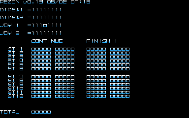

Rezon is a fun little shooter with a couple interesting leftovers (maybe one is an easter egg?). Sadly, neither finds are as [amazing as the game's ending](https://twitter.com/suddendesu/status/620807610342584320).

<!--more-->

# Audit/Test Menu



It's a basic input test and what appears to be tracking for game continues and finishes and total plays. It may be a leftover from a location test. It doesn't seem to actually track anything, though, from the quick test I gave it. Which makes it... pretty useless!

To access it, **hold P2 Start + P2 Left + P2 Down + P1 Button 1 while the machine starts**. You'll need to hold it through the RAM test. When it appears, you can let go of all buttons except P1 Button 1; letting it go will exit the menu.

# ASCII art logo

And at 0xD6B0 in the data, we have...

```
               ZZZZZZZZZ                
RRRRRRR EEEEEEE       Z  OOOOO  N     N 
R     R E            Z  O     O NN    N 
R     R E           Z   O     O N N   N 
RRRRRRR EEEEEE     Z    O     O N  N  N 
R  R    E         Z     O     O N   N N 
R   R   E        Z      O     O N    NN 
R    RR EEEEEEE Z        OOOOO  N     N 
               ZZZZZZZZZ                
```

ASCII art! Is it an easter egg, or was it actually used in the code? Each line is a fixed width, separated by 0x00's, which isn't either of the usual newline characters. That makes me think it could have been used by the code at one time, maybe as a temporary title screen. It doesn't seem to be referenced anywhere anymore though, so who knows. It's interesting at least.

