Every now and then I strike gold: not another tile viewer or a meaningless data viewer, but something that is really interesting and unique. Riot City was such a gold mine: an English localization for a game that supposedly was onlty released in Japan, and an alternate, spicy ending! Oh, and I guess there's some data viewers in there too...

<!--more-->

# English Localization

As far as I can tell from online sources, Riot City never had a release outside Japan. So it may be surprising to learn that there is a full localization for both World and US regions within the game.

It's a scrolling beat-em-up with the text all in English anyway, so it's not like this affects the gameplay. It's just the attract mode story and the ending that get translated.

But the translation is *glorious.*

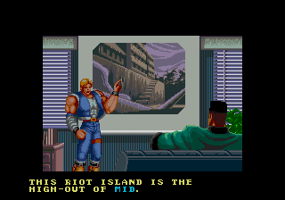

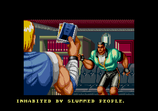

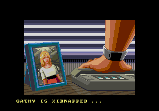

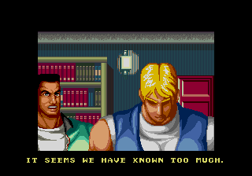

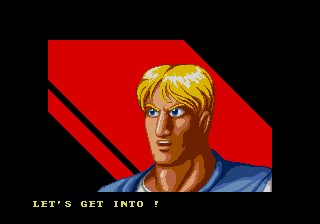

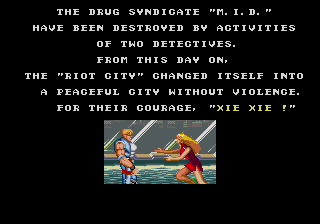

The World and US regions are identical, except that the US adds that good ol' Winners Don't Do Drugs screen in the attract mode.

Was there actually an overseas release, and we just don't yet have a dump (like what happened with [Kōtetsu Yōsei Strahl](https://sudden-desu.net/entry/english-text-in-koutetsu-yousai-strahl/))? Quite possibly. But until we discover such a version, we'll have to use a cheat to change the region:

```
  <cheat desc="Set region">
    <parameter>
      <item value="0x01">Japan (default)</item>
      <item value="0x00">World</item>
      <item value="0x02">US</item>
    </parameter>
    <script state="change">
      <action>temp0=maincpu.mb@137d</action>
      <action>maincpu.mb@137d=param</action>
      <action>maincpu.pb@ffecde=param</action>
    </script>
    <script state="off">
      <action>maincpu.mb@137d=temp0</action>
    </script>
  </cheat>
```

# Debug Tools

There are a handful of debug tools in the game, fully implemented and connected.

The debug flags are stored in the byte at 0xFFECE8. Most of them are simple position viewers, making them kind of useless, but it's still neat to have them unearthed and available.

## Bit 0 - Display 1's

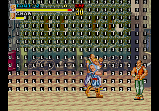

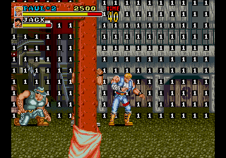

When set, a 1 tile is displayed in a pattern on the background layer. It's unclear what this was for. Perhaps a rudimentary collision viewer?

## Bit 1 - Distance Into Stage

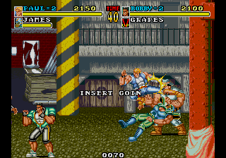


Displays a four digit value at the bottom center of the screen. It appears to be how far into the stage the player has progressed, as it does not reduce when moving back to the left.

## Bit 2 - Player X/Y Position

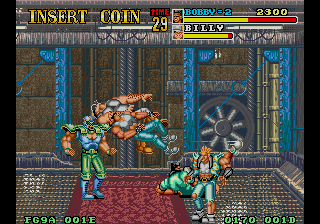

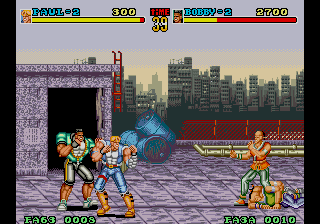

Displays the X and Y positions for both players.

## Bit 3 - Stage Position

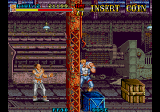

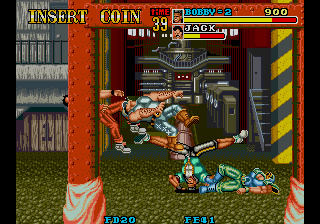

Displays the scroll position of the stage.

## Bit 4 - ???

I haven't been able to figure out what setting bit 4 does. It skips something at the beginning of a stage, but what that is, I'm not sure. The check is at 0x81F2, where it increases the pointer in A2. That pointer's address is related to the stage layout in some way, perhaps the "script" of events.

It bears deeper research. If someone figures it out, let me know!

## Bit 5 - Distance to End of Stage

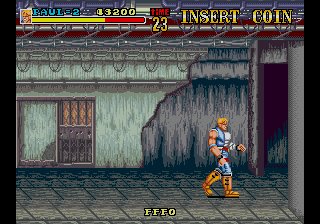

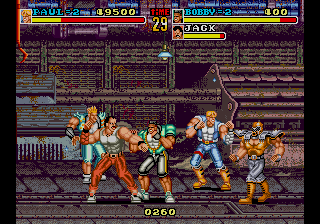

Displays a decreasing value that corresponds to the player distance from the end of the stage.

## Bit 6 - Enemies Do Not Spawn

Just as it says. Existing enemies on screen remain, but no new enemies spawn going forward.

## Bit 7 - Disable Timer

Just as it says. The timer does not decrease.

And here's the cheat to eneable the debug tools. Since they are bitfield flags, multiple tools can be enabled at once.

```

  <cheat desc="Debug - Display 1 Pattern">
    <script state="on">
      <action>maincpu.pb@ffece8=(maincpu.pb@ffece8 | 01)</action>
    </script>
    <script state="off">
      <action>maincpu.pb@ffece8=(maincpu.pb@ffece8 BAND ~01)</action>
    </script>
  </cheat>

  <cheat desc="Debug - Display Distance Into Stage">
    <script state="on">
      <action>maincpu.pb@ffece8=(maincpu.pb@ffece8 | 02)</action>
    </script>
    <script state="off">
      <action>maincpu.pb@ffece8=(maincpu.pb@ffece8 BAND ~02)</action>
    </script>
  </cheat>

  <cheat desc="Debug - Display Player X/Y Position">
    <script state="on">
      <action>maincpu.pb@ffece8=(maincpu.pb@ffece8 | 04)</action>
    </script>
    <script state="off">
      <action>maincpu.pb@ffece8=(maincpu.pb@ffece8 BAND ~04)</action>
    </script>
  </cheat>

  <cheat desc="Debug - Stage Scroll Position">
    <script state="on">
      <action>maincpu.pb@ffece8=(maincpu.pb@ffece8 | 08)</action>
    </script>
    <script state="off">
      <action>maincpu.pb@ffece8=(maincpu.pb@ffece8 BAND ~08)</action>
    </script>
  </cheat>


  <cheat desc="Debug - bit 4">
    <comment>Unknown effect on the game; checked at the start of a stage</comment>
    <script state="on">
      <action>maincpu.pb@ffece8=(maincpu.pb@ffece8 | 10)</action>
    </script>
    <script state="off">
      <action>maincpu.pb@ffece8=(maincpu.pb@ffece8 BAND ~10)</action>
    </script>
  </cheat>

  <cheat desc="Debug - Display Distance to End of Stage">
    <script state="on">
      <action>maincpu.pb@ffece8=(maincpu.pb@ffece8 | 20)</action>
    </script>
    <script state="off">
      <action>maincpu.pb@ffece8=(maincpu.pb@ffece8 BAND ~20)</action>
    </script>
  </cheat>

  <cheat desc="Debug - Enemies Do Not Spawn">
    <script state="on">
      <action>maincpu.pb@ffece8=(maincpu.pb@ffece8 | 40)</action>
    </script>
    <script state="off">
      <action>maincpu.pb@ffece8=(maincpu.pb@ffece8 BAND ~40)</action>
    </script>
  </cheat>

  <cheat desc="Debug - Disable Timer">
    <script state="on">
      <action>maincpu.pb@ffece8=(maincpu.pb@ffece8 | 80)</action>
    </script>
    <script state="off">
      <action>maincpu.pb@ffece8=(maincpu.pb@ffece8 BAND ~80)</action>
    </script>
  </cheat>
```

# "Good" Ending

Did you know there's an alternate ending to the game? The game ends with Paul and Bobby rescuing Cathy after apprehending the final boss. It looks like this for most players:

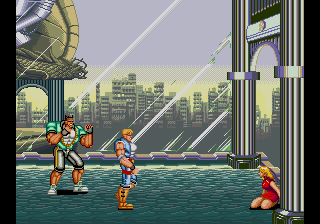

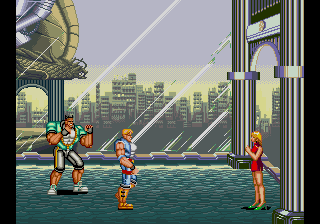


But if you beat the game without a single game over, you'll see this instead:

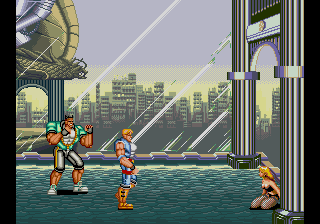

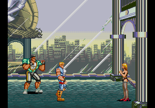

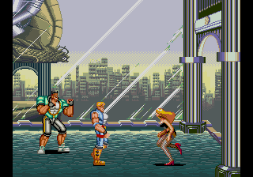

Cathy now appears in fishnets and black lingerie. Ahh, fan service!

Oh, you'd like to see it without having to fight through the whole game perfectly? Well, alright, sure. This cheat will keep your game over count at 0:

```
  <cheat desc="Good Ending">
    <comment>Equivalent to getting no game overs</comment>
    <script state="run">
      <action>maincpu.pb@ffecf1=0</action>
    </script>
  </cheat>
```

---

That's all we have for Riot City for now. Admittedly this was a (very) quick analysis, as I was excited to get the localization discovery published, so who knows, maybe we'll find more!
