The end of 2025 is upon us! Let's see if we can squeak in one last quickie article before the end of the year. Let's take a brief look at the disabled debug tools inside Rockman 2: The Power Fighters (or Megaman 2, I suppose, if you're the kind of person who pronounces NES as "ness").

<!--more-->

Somewhat surprisngly and in stark contrast to [past articles](entry/lucky-wild-disabled-art-viewers-sound-test-and-round-select/) which I [thought would be quick work](entry/progear-no-arashi-debug-tools-and-code-weirdness/) but instead [blossomed into months long projects](entry/magical-crystals-debug-functions-unused-content-and-the-kaneko-toybox-system/), Rockman 2 has a couple of hidden dev features and... that's about it, as far as I can tell. Of course there may be unused content lurking withing, but as always I leave it to fans who know the game in detail to take the tools I've uncovered and use them to find some more fun stuff.

Let's start with...

# CPS-2 Debug DIPs

[As discussed previously](entry/cps2-debug-switches-and-the-games-that-love-them/), the CPS-2 development hardware had a series of physical switches that could be used to enable/disable debugging features at runtime. And Rockman 2 does not seem to use them at all! There are no references to the debug DIP memory location (0x8040B0 to 0x8040B2) in any of the code. It's possible that they were used at one time (the debug tool that we will discuss at the end shows some tenuous evidence for this) and the code referencing them was completely ripped out.

# Secret Test Menu

Like [some](entry/secret-menu-dungeons-dragons-shadow-over-mystara/) [other](entry/pocket-fighter-secret-menu-re-enabled/) CPS-2 games, this one has a SECRET TEST menu.

Note that some tools make use of a non-existant Button 4. If you're a game data research dweeb like me and have the MAME source regularly pulled and ready to compile for test builds, then this can be easily fixed by changing the `rockman2j` driver (or whatever variant you'd like) to use the `cps2_2p4b` input map. If not, you'll need to compromise on accuracy a bit and use the cheat in the Character Test section, which is the only tool where this button really matters.

For all options, press P1 Start + P1 B1 to return to the menu.

Before we examine the tools, here is a cheat to replace the standard test menu with the unused Secret Test:

```
  <cheat desc="Secret Test Menu">
    <comment>Replaces the standard Test Menu</comment>
    <script state="on">
      <action>temp0=maincpu.oq@2f34</action>
      <action>temp1=maincpu.od@2f3c</action>
      <action>maincpu.oq@2f34=4eb90000b0ea4e71</action>
      <action>maincpu.od@2f3c=4e714e71</action>
    </script>
    <script state="off">
      <action>maincpu.oq@2f34=temp0</action>
      <action>maincpu.od@2f3c=temp1</action>
    </script>
  </cheat>
```

## Object / Scroll 1/2/3 Test

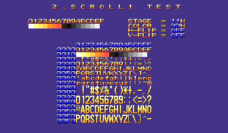

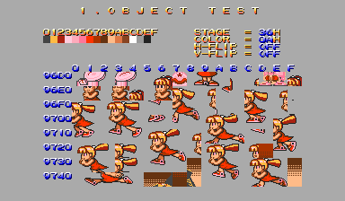

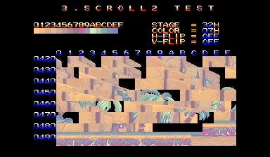

These are graphic tile viewers, similar to ones we've seen in other CPS-2 games. The controls are the same across all four viewers:

- P1 Up/Down - Scroll (Hold P1 Button 1 to scroll quickly; hold P1 Button 2 to scroll by page)
- P2 Left/Right - Change stage by 1
- P2 Up/Down - Change stage by 0x10
- P1 Left/Right - Change color palette
- P1 Button 3 - "explode" view into individual 8x8 tiles
- P1 Button 4 - Change background color
- P2 Button 1/2 - Toggle H/V flip, respectively

## Character Test

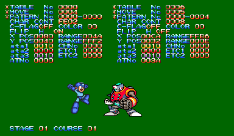

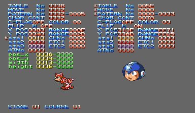


A sprite frame and animation viewer with a data editor. This is the most complex of the debug tools and it took a fair bit of work to suss out all the details.

We have two instances of sprites, with the left column controlled by P1 controls and the right by P2. The asterisks on the left side of each column act as a cursor of sorts, indicating the current mode. When there are three asterisks at the top, that column is in "view graphics mode" while an asterisk in next to one of tha `ata` fields indicates "modify data" field.

P1 Button 4 changes between the two modes, which is a problem since the final hardware uses only 3 buttons. I imagine most people won't be recompiling MAME just to play with this, so I have prepared a patch cheat below that changes the mode switch to P1 Start. (Note that this implementation is slightly inaccurate, as it toggles the mode for both columns, whereas the proper Button 4 usage only toggles for the side it belongs to. But for reasons we'll discuss in the technical section, it was a pain to even get this working, and it's good enough.)

View graphics mode is the default and its functions, as the name implies, relate to viewing sprites and their animations. Since there are so many options, the game implements a "modifier key," similar to shift/alt/ctrl on a PC keyboard. Holding one of these modifier buttons switches the function of the joystick.

So... what/where are these modifier buttons? This is where things get weird. It seems that there was an additional set of controls was enabled during development, possibly the P3 and P4 control ports. These are only used by the Character Test (though the Block Tests reference them without actually doing anything with them), with no matching code anywhere else to copy from a hardware mapping to RAM, as we would often expect with controller reads. We will examine this in greater detail in the technical section below, but suffice to say, we're not going to fully re-implement these mystery inputs. Instead, we'll simulate holding one of these modifiers with a cheat.

These are the default controls (i.e. when no modifiers are held):

Up/Down - Change Table No.
Left/Right - Change Move No.
B1 - Hold to play the animation
B2/B3 - Advance or rewind animation by one frame
Test Menu (F2 in MAME) - Change background color
Service (9 in MAME) - Toggle text layer

When holding modifier 1 (which was probably button 1 on the mystery controller), the joystick can be used to move the sprite around the screen, which updates the `XPOS` and `Y POS` valuesas well as the `RANGE`, which appears to be the relative distance between the two sprites.

Holding modifier 2 (probably button 2) allows you to change the `STAGE` (Left/Right) and `COURSE` (Up/Down) values on the bottom left of the screen. These appear to load different sets of color palettes.

Holding modifier 3 (you guess it, probably button 3) changes the `COLOR` (Up/Down) and `FLIP H` (Left/Right) flag.

The cheats below will activate these modifiers for either column:

```
  <cheat desc="Change Character Test Graphics Mode (P1)">
    <comment>Changes the input mode in Character Test in order to access additional functionality</comment>
    <parameter>
      <item value="0x00">Default</item>
      <item value="0x01">Move Sprite</item>
      <item value="0x02">Change Stage/Course</item>
      <item value="0x04">Change Color/H-Flip</item>
    </parameter>
    <script state="change">
      <action>maincpu.pb@fffbfa=param</action>
    </script>
    <script state="off">
      <action>maincpu.pb@fffbfa=0</action>
    </script>
  </cheat>

  <cheat desc="Change Character Test Graphics Mode (P2)">
    <comment>Changes the input mode in Character Test in order to access additional functionality</comment>
    <parameter>
      <item value="0x00">Default</item>
      <item value="0x01">Move Sprite</item>
      <item value="0x02">Change Stage/Course</item>
      <item value="0x04">Change Color/H-Flip</item>
    </parameter>
    <script state="change">
      <action>maincpu.pb@fffbfc=param</action>
    </script>
    <script state="off">
      <action>maincpu.pb@fffbfc=0</action>
    </script>
  </cheat>
```

The last thing to talk about with the Character Test tool itself is the data modification mode. Pressing Button 4 moves the cursor to the three `ata` entries in the lower section. While there, the joystick will modify the `pos_x` and `pos_y` values. Holding Button 1 and using the stick will modify the `width` and `height` entries. Changing these has no obvious effect, though I will guess that they are hitbox positions and sizes.

The cheat below will replace the check for Button 4 with P1 Start in order cycle through the `ata` entries:

```
  <cheat desc="Toggle Character Test Data Modify Mode">
    <comment>Press P1 Start to toggle through the data modification sections (ata1-3)</comment>
    <script state="on">
      <action>temp0=maincpu.oq@3aa000</action>
      <action>temp1=maincpu.oq@3aa008</action>
      <action>temp2=maincpu.ow@3aa010</action>
      <action>temp3=maincpu.ow@d404</action>
      <action>temp4=maincpu.od@d406</action>
      <action>maincpu.oq@3aa000=102d0054122d0055</action>
      <action>maincpu.oq@3aa008=4601c20008010004</action>
      <action>maincpu.ow@3aa010=4e75</action>
      <action>maincpu.ow@d404=4eb9</action>
      <action>maincpu.od@d406=3aa000</action>
    </script>
    <script state="off">
      <action>maincpu.oq@3aa000=temp0</action>
      <action>maincpu.oq@3aa008=temp1</action>
      <action>maincpu.ow@3aa010=temp2</action>
      <action>maincpu.ow@d404=temp3</action>
      <action>maincpu.od@d406=temp4</action>
    </script>
  </cheat>
```


## Block 2/3 Test


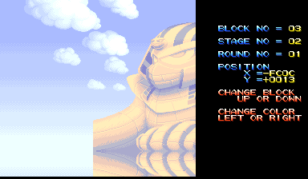

Another graphic viewer, but this time for the fully assembled background pieces.

- P1 Up/Down - Change block number by 1
- P1 Left/Right - Change block number by 0x10
- Hold P1 Button 1 + P1 Stick - Change X/Y position
- Hold P1 Button 2 + P1 Left/Right - Change stage number
- Hold P1 Button 2 + P1 Up/Down - Change round number, when applicable

# Secret Test Menu - Technical

The Secret Test itself isn't particularly interesting at a technical level. The code begins at 0xB0EA, fully intact and usable but not referenced anywhere. So we hijack the standard Test Menu to branch off to the Secret Test instead and everything is working. (It should be noted that the Secret Test, with its Exit option, was probably originally accessed as an item in the standard menu, just for accuracy's sake.)

But what is more interesting is the Character Test. The multitude of modifiable settings in the tool necessitates some kind of control scheme beyond the three (four) buttons available. Well, there is evidence of the presence of additional inputs available during development...

Before we look at that, I'm going to rant (briefly, I hope...), as this game has one of the more annoying controller input processing schemes that I've had to deal with. Most games read the state of the controller hardware once per frame and then store that value in RAM to be used by the game logic. Most games copy that value again so that in the next frame, the controller state of the current and previous frames can be compared to see if a button or stick position has changed, usually with a boolean NOT/AND combo. This ultimately allows us to read the buttons and the joystick in one of two ways: as a *hold* or a *tap*.

Rockman 2, however, is not most games. It does not do this button tap calculation automatically. Any part of the game that wants to read a button as a tap needs to write its own code to check the difference between the current/previous values. And since that's such a common thing, we see this pattern duplicated all over the place in the disassembly. It's just a couple extra opcodes so it doesn't weigh down CPU processing much, but it *is* ineffecient and I have no idea why they chose to do things this way.

(It proved to be a pain in the ass when I was trying to "emulate" Button 4 in the Character Test with P1 Start. The solution was to write our own tap generation code for P1 Start in an unused part of the ROM. It's an entirely over-engineered solution for something that is ultimately pretty pointless. You're welcome.)

Okay, rant over. Now let's have a look at the very start of the Character Test loop code, at 0xD2E6:

<pre class="pdasm pdasm-arch-m68k">
00D2E6: 48E7 0002      movem.l A6, -(A7)
00D2EA: 41ED 0300      lea     ($300,A5){char_test__data_block_p1}, A0
00D2EE: 116D 0050 0060 move.b  ($50,A5){input_copy_p1}, ($60,A0){char_test__input_copy_p1}
00D2F4: 116D 0051 0061 move.b  ($51,A5){input_copy_p1_prev}, ($61,A0){char_test__input_copy_p1_prev}
00D2FA: 116D 7BFA 0063 move.b  ($7bfa,A5){input_copy_unknown1}, ($63,A0){char_test__input_copy_unknown1}
00D300: 116D 7BFB 0064 move.b  ($7bfb,A5){input_copy_unknown1_prev}, ($64,A0){char_test__input_copy_unknown1_prev}
...
00D32C: 41ED 0700      lea     ($700,A5){char_test__data_block_p2}, A0
00D330: 116D 0052 0060 move.b  ($52,A5){input_copy_p2}, ($60,A0){char_test__input_copy_p2}
00D336: 116D 0053 0061 move.b  ($53,A5){input_copy_p2_prev}, ($61,A0){char_test__input_copy_p2_prev}
00D33C: 116D 7BFC 0063 move.b  ($7bfc,A5){input_copy_unknown2}, ($63,A0){char_test__input_copy_unknown2}
00D342: 116D 7BFD 0064 move.b  ($7bfd,A5){input_copy_unknown2_prev}, ($64,A0){char_test__input_copy_unknown2_prev}
</pre>

We also have this chunk of code at 0xE74E and a duplicated copy at 0xEC1C, which are called by the Block 2 and Block 3 Tests, respectively:

<pre class="pdasm pdasm-arch-m68k">
00E74E: 102D 0050      move.b  ($50,A5){input_copy_p1}, D0
00E752: 122D 0051      move.b  ($51,A5){input_copy_p1_prev}, D1
00E756: 4601           not.b   D1
00E758: C200           and.b   D0, D1
00E75A: 1B41 0362      move.b  D1, ($362,A5){input_copy_p1_tap}
00E75E: 102D 7BFA      move.b  ($7bfa,A5){input_copy_unknown1}, D0
00E762: 122D 7BFB      move.b  ($7bfb,A5){input_copy_unknown1_prev}, D1
00E766: 4601           not.b   D1
00E768: C200           and.b   D0, D1
00E76A: 1B41 0365      move.b  D1, ($365,A5){input_copy_unknown1_tap}
00E76E: 4E75           rts
</pre>

In the first case, it is copying the P1/P2 inputs to the character test work area in memory, and then it does the same for two mystery locations: 0x0FFFBFA/0x0FFFBFB for Player 1 side and 0x0FFFBFC/0x0FFFBFD for Player 2 side. (Note that all the RAM locations are represented as offsets to A5 (premanently set to 0xFF8000 during runtime) in the disassembly, which is how pretty much all CPS-2 games do their memory access.) And in the second block of code, we see it doing the NOT/AND dance mentioned before with these mystery locations, though only for the P1 side.

These are the only places in the code where these locations are referenced. The way they are treated in these examples (especially with the generation of the tap value) makes it clear like they were controller inputs of some sort. Yet these are all reads: there are no matching writes, no copies from a mapped hardware address, to these locations anywhere else. The CPS-2 supports 4 players, so perhaps P3 and P4 were mapped and copied for dev purposes, with that code excised for the final build.

The Character Test still uses whatever these controller inputs were, as we discussed in that section, while the Block 2/3 tests that call the second block of code above don't actually use these values. I'm going to guess that the call is due to someone copying/pasting code from somewhere else rather than the Block viewers actually using the controls in the past. There's just not enough functionality in them to justify it.

There is some further weirdness within this tool. Beginning at 0xD372, there are three called to very small functions that perform checks on the "system" input (that is, the port for things like P1/P2 Start, the Service button, the coin inserted triggers - things that are less related to the game itself and more to running of the hardware and program). Two of these calls deal with the Test Menu button that changes the background color and the Service button that toggles the overlay text. But there are three more which check against bits on the system input that are otherwise unmapped. 

The routine at 0xDCEA, for example, checks against bit 0, at 0xDD14 it checks against bit 1, and at 0xE19C it checks against bit 6. None of these are ever set with the final hardware mapping. Its probably safe to assume that whatever controller the devs would use had a button for each bit position.

But do these bits of code do anything interesting or useful? No, not really. 

0xDCEA is called first, checking for whatever button mapped to bit 0 on the system input. When pressed it toggles a video register setting via 0xFF803A which in turns puts the screen in an odd state:


It displays a plane of dark red pixels in a "halftoen" pattern overlaid with a blue plane, with the red plane offset by 16 pixels from the top and the blue plane shifted by 16 pixels from the left. The shifting kind of makes it look buggy, but considering how well the CPS-2 is understood these days I doubt it's an emulation issue. The only thing I can think of for which this may be useful is to check the edges of sprites on a patterned background instead of just a solid color.

0xDD14 is called next, and when activated it disables the background color, going to black.

0xE19C is last and it first checks that the background color is disabled from the previous routine. If so, when activated, it sets a flag that skips some kind of processing of the sprite's data block, but this has no obvious visual impact, so it's unclear exactly when it was supposed to do.

These last oddities with the system input were discovered right as I was wrapping up the article, so lest I be dragged into another week or two or more of research, I'm keeping them brief. Someone else to explore deeper someday.

# Runtime Debug Viewers

There are three debug tools mean to used as the game is running. You will need to enable the "Restore debug functions" cheat first before the viewers will work.

```
  <cheat desc="Restore debug functions">
    <script state="on">
      <action>temp0=maincpu.oq@1432</action>
      <action>temp1=maincpu.od@fb4</action>
      <action>maincpu.oq@1432=4eb90000ab444e75</action>
      <action>maincpu.od@fb4=4e714e71</action>
    </script>
    <script state="off">
      <action>maincpu.oq@1432=temp0</action>
      <action>maincpu.od@fb4=temp1</action>
    </script>
  </cheat>

  <cheat desc="Display gameplay data debug viewer">
    <comment>"Restore debug functions" must be enabled</comment>
    <script state="on">
      <action>maincpu.pb@ff805d=(maincpu.pb@ff805d | 10)</action>
    </script>
    <script state="off">
      <action>maincpu.pb@ff805d=(maincpu.pb@ff805d BAND ~10)</action>
    </script>
  </cheat>

  <cheat desc="Display sound effect history debug viewer">
    <comment>"Restore debug functions" must be enabled</comment>
    <script state="on">
      <action>maincpu.pb@ff805c=(maincpu.pb@ff805c | 20)</action>
    </script>
    <script state="off">
      <action>maincpu.pb@ff805c=(maincpu.pb@ff805c BAND ~20)</action>
    </script>
  </cheat>

  <cheat desc="Display debugging grid viewer">
    <comment>"Restore debug functions" must be enabled</comment>
    <parameter>
      <item value="0x04">Large red grid</item>
      <item value="0x08">Small white grid</item>
      <item value="0x0c">Green corner marks</item>
    </parameter>
    <script state="change">
      <action>maincpu.pb@ff805c=((maincpu.pb@ff805c BAND 0xf0) | param)</action>
    </script>
    <script state="off">
      <action>maincpu.pb@ff805c=(maincpu.pb@ff805c BAND 0xf0)</action>
    </script>
  </cheat>
```

## Gameplay Data Viewer

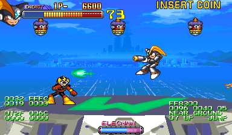

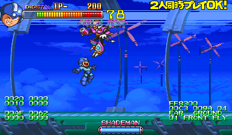

Displays the stage scroll and player positions on the left side while the right side displays the data block offset for the enemy as wella s their location in the stage and their current action.

## Sound Effect History Viewer

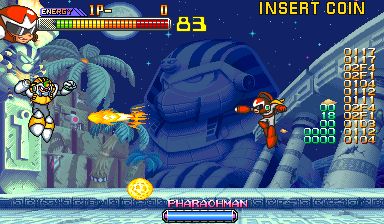

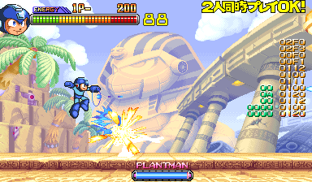

This is interesting just because I don't think I've seen such a tool before. The right column in yellow displays the last 12 sound effects played, with the values matching those found in the sound test in the standard test menu. The left column in green is a sound playback status of some sort, though the details are unclear.

## Grid Display

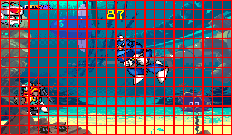

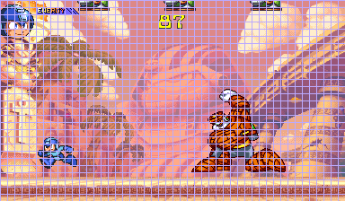

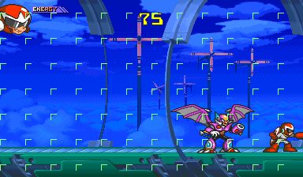

Renders a grid overlay on the screen in one of three styles. Probably used for element positioning.

# Runtime Debug Viewers - Technical

The code for the data viewers begins at 0xAB2E, which is unreferenced anywhere. While we don't know its calling context, given its nature of printing values to the screen, it seems likely that it was meant to run every frame as a data viewer. So we can restore it easily enough by putting it in some code that is called on every vertical blanking interval. We have a perfect spot at 0x1432 which makes a call to a tiny subroutine at 1436 that would normally clear the debug flags. So we kill two birds with one stone by using the code that would normally disable debugging entirely to call the debug routine.

The tools themselves are enabled by bit field at 0xFF805C and 0xFF805D. I have a suspicion that these locations were originally the RAM copies of the CPS-2 debug DIPs that we mentioned near the start of the article. The only evidence for this is that they A) use bits as flags, which is commonly done when representing the state of on/off switches in memory, and B) the two values are consecutively placed in memory. If this is true, it implies that 0xFF805E would also have been used as the third row of debug DIP switches, but the code doesn't make any reference to it.

Also consider that we have already seen that other hardware inputs in this game (our "mystery controller" from the Character Test screen) have had their hardware state copy code completely removed. It would fit the pattern for the debug DIP copy code to be removed instead of just disabled (as we have seen with other CPS-2 games).

Finally, consider that each of these viewers has a cleanup routine that removes the text from the screen when it has been turned off, as opposed to just leaving the last state rendered to VRAM. It strongly implies they were meant to be turned on/off as necessary during gameplay by some kind of switch.

It's all circumstantial evidence at best, but it seems likely to me that the game used the debug DIPs in development then removed all references to them later on.

