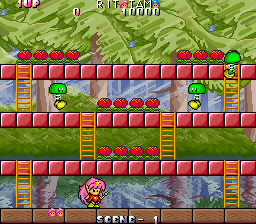
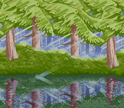

Ah, Rod Land, the colorful and popular Jaleco platformer known mostly for its home computer ports, especially on the Amiga. The arcade version is the original, though, and has the most content and best graphics.

It's been [more than two years](https://twitter.com/suddendesu/status/570750823212437504) since I first started taking the game apart. I was new to disassembling code at that point and was making pretty slow progress on understanding what I was finding. Every few months I would pick it back up and chip away at it some more, but never formalized anything into an article.

Well, I decided to finally power through it about a month ago, and here we are. This is the most thorough disassembly I've done to date, and this article covers all the interesting bits.

<!--more-->

# Rod Land Prototype Version


Let's talk about the Rod Land prototype first, commonly called R&T. Unfortunately, there doesn't seem to be much information (i.e. almost none at all) about the prototype: where it was found, how it was acquired, pictures of the PCB. Anything like that would might give us more clues into the ROM's history.

**EDIT: Not long after I posted the article, the one who did the actual ROM dump, [System11](https://twitter.com/System11b), got a hold of me on Twitter. He was kind enough to share some history behind the dumping of the data. I've incorporated his information into the article. Thanks again!**

[Here's what the game's commit to the MAME driver has to say about the game](https://github.com/mamedev/mame/pull/234):

>It's an original Jaleco board, it has the correct Rod Land priority PROM and the same encryption chip as JP rev. Graphics banks are split and descrambled, title screen is changed, there's no hidden selectable set of extra levels. Sound effects are played at the wrong times compared to a normal one, the PCB does this too. Original Jaleco ROMs on the sound ROM so no idea what's going on there considering the sample ROMs are the same as normal except for being split. ROM 17 is possibly missing, maybe that would normally contain some extra level graphics. Rest of the data doesn't quite match the existing sets so not sure if the gap could or should be filled in. Is this data even used on the normal board with a single 27C040?
>
>My best guess given the encryption and presence of real parts is that it's either a prototype / location test version. I've named the sample ROMs as they should have been because I could see where proper JALECO labels had definitely fallen off them, and one from each bank is present.

I can say with certainty that it is an older version of the game, and I think there are enough data points in the code to confirm that it is a location test in particular.

First of all, the game is complete, or at least Chapter 1 is. You can get up to and defeat the final boss and get the ending cutscene. Second, the game is in international mode, giving it the English cutscenes and alternate title screen (more on that in a moment). To me, this indicates it was probably in a public space, ready for someone to play all the way through if they had the money/time, and was built for a location outside Japan.

With new information from [System11](https://twitter.com/System11b) on the PCB's history, there is external evidence for this as well:

>It came from a haul from Electrocoin in London, and was sold to a guy on the Retrogamer forums. I tracked it down from some old forum posts and he told me it was broken, so I offered to repair it if he'd let me dump the ROMs and put them in MAME. Electrocoin were one of 'the' distributors in the UK by the way, they even made their own cabinets for games like Sagaia, Operation Wolf etc. It's not surprising at all that it originated there.

Finally, consider that there is a fully-functional audit screen in the game, accessible via an input code, which is blatantly titled "Location Test Table."

# Location Test Data


An audit screen like this would have been used by the developers (and certainly by the business above them) to determine the popularity of the game: how many coins were inserted each session, how far players got, how long they took. This could be used to refine the game in a final version.

The screen can be accessed by a simple input code, no internal hardware access necessary. At the attract mode title screen (i.e. the title screen in the attract loop, with NO coins inserted), use the Player 1 controls to enter:

**D U B1 D D B2 U U B1 B2**

This remains enabled on the final version as well.

In any case, whether it's a location test or not, it's definitely an earlier version. As such, I refer to it as the 'prototype.' Many people refer to it as 'R&T', thinking this was the old name for Rod Land. They're half correct, but there's more to the story.

# Alternate Game Title - R&T

The MAME commit above mentions that the title screen has changed. This is true: instead of ROD・LAND in block letters, we get R&T in a stylized font with a rainbow behind. At first glance, it would seem that prior to final release, the game's working title was R&T instead of Rod Land, but that isn't exactly the case. In actuality, R&T was the name of the game in international regions while it was called Rod Land in Japan.

Here's why we know this: in all versions, the value at 0xF0D7A is the region flag used by the game, 0 for Japan, 1 for International. In the proto, this value is initialized to 1, the international version. If we change this to zero...


Prototype with region set to Japan

... we get the logo from the final game.

The original international title screen is still in the final Japanese version. If we change the value there, we get the R&T logo:


Final Japan with region set to World

For reasons unknown, they decided to stick with Rod Land as the title for the final international version. Changing the value in that version just gives us the same Rod Land logo, but with the Japanese subtitle restored:


Final World with region set to World (left) and Japan (right)

The green tildes are suddenly very noticeable when you realize text is meant to be there...

# Chapter 2?

The MAME commit above mentions that the 'hidden selectable set of extra levels' are not present. This is correct, but if we use the DIP switch to set the default chapter to 2:




Prototype with Chapt. 1 (left) and Chapt. 2 (right)

The title screen, introduction, stage layouts don't change, but as you can see above, we do get the alternate enemies of the second chapter.

Using the tile viewer (more on that below), we can also see that the images from the Chapter 2 cutscenes are present:


So while it's not accessible, we know that the second chapter was in at least the early stages of development.

# Unused Music and Sound Effects

Among the most noticeable changes from the final are the different music and odd sound effects. Actually, most of the music in the prototype is also used in the final, just at different points. There is only one song, 0x10, which is used in the proto that is not used in the final.

There are 26 pieces of music in the game. The prototype uses 14 of them, and the final uses 20 of them. The unused tracks across both versions are 0xA, 0xF, 0x13, 0x17, and 0x18. These can all be heard in the sound test in the standard service menu.

(Rather than playing through both versions, listening and noting, I figured this by using the disassembly to find all references to the 'play sound ID' memory location at 0xF0D64. I saw a couple of spots that were setting this location from a register instead of with a constant, so it's possible these 'unused' tracks may be used somewhere. If there's a Rod Land expert who can confirm that are not used, I'd appreciate it!)

One of the strangest aspects of the prototype are the player sound effects, which are very different from the final version. They seem to use samples of sounds made by human voices. For example, the sound when Tam collects a flower is food-munching sound, and when Rit creates a ladder, there's a 'oof' sound; when a bomb explodes there's a 'P-P-PLEH' sound. They don't really work as good sound effects and stand out noticeably. I can't decide if they were placeholders or if it was a stylistic choice. The voice samples remain in the final version: they can be heard in sound IDs 20 through 25 in the standard sound test.

Another difference is that Rit and Tam have different sound effects. Collecting flowers, creating ladders, capturing and bashing enemies; these sounds are different for the two characters. In the final version, they're the same. I kind of like the idea of having the two players have different sounds, to help identify who did what. Too bad the player sound effects aren't very good in the proto...

The MAME commit above talks about the sound effects being played at the wrong time, and the driver source mentions that the sound effects are 'scrambled.' They claim that the actual PCB is the same way. I'm not sure what they mean by this. The timing seems to be just fine in emulation. Perhaps these strange, voice-based, earlier sound effects were just unexpected and sounded like they were broken. The first time you watch the attract mode demo, it's hard to identify what events are triggering what sound effects, since the style really doesn't match the actions. I can imagine someone being confused could think the sound was broken. But if someone knows what the MAME team is talking about here, I'd love to know...

System11 provided some commentary on the sound as well. He suggested that the odd sound effects in the prototype may have been mismapped. I don't think this is case, as those sound effects are not used in the final as far as I can tell. Also there is the code that specifically plays different sound effects for player 1 and 2; if that was intentional, then these sound effects probably are too. On the other hand, some of the effects are so odd for the related action that they may very well be mapped incorrectly. Perhaps they were intentional, but a few are broken?

He went on to recall that the sound also played too slowly on the hardware, and pointed out that in emulation, these ROMs use the Rod Land driver. If there were any problems with the PCB, they wouldn't be emulated. That explains why it sounds fine in MAME..

# Stage Editor

The biggest find in the prototype is the presence of a mostly-functional stage editor. While that's cool, what's really intriguing to me is the fact that it is still enabled and accessible, no code hacks necessary. To access it in the prototype, simply enable DIP switch 0 (in MAME, it's the very first one, marked as 'Unused').

Inside of a stage, you'll see this:


(The black backgrounds are from the final version. More on that later.)

We have a tile map editor, two graphics viewers, 'hit data' editor, flower editor and enemy placement editor. From this menu, the cursor moves with P1 Up/Down and options are selected with P1 Button 1.

Oh, and there's actually a line of text on this screen that goes unused: 'EXIT IS START BUTTON', which has metadata to render it below final line at the bottom. It lacks any reference, however.

## MAP EDITOR


In this tool, you can place the 8x8 tiles on the SCROLL1 plane to, essentially, draw a level. If you enter this mode while in a normal level, the level tiles are cleared.

The white outline indicates your cursor, which can be moved around with P1 Joystick. The text in the upper corner indicates your currently selected palette (COL) and tile ID (CHR), as well as the ID of the tile your cursor is over (NUM). P1 Button 1 will place the currently selected tile at the cursor; holding P1 Button 1 and pressing P1 Left/Right will simultaneously cycle through the tiles and edit the tile at the cursor. It works similarly for the palette: hold P1 Button 2 and pressing P1 Left/Right to cycle through/set the palette.

## BG2 CHR DISPLAY


A simple tile viewer for the 8x8 SCROLL1 tiles.

Nothing too special here, though it is certainly useful if you're looking for a tile to use in conjunction with the Map Editor. Controls are similar as well: hold P1 Button 1 and use P1 Left/Right to cycle through tiles, and hold P1 Button 2 and P1 Left/Right to cycle the palette.

## BG1 SCROLL DISPLAY




A graphics viewer for the SCROLL0 backgrounds.

P1 Joystick moves the background around, and P1 Start returns to the menu. This tool is broken in the final version of Rod Land; we'll talk more about that later.

## HIT DATA EDITOR


Given the name and the very basic functionality here, I assume this sets which tiles on the map have collision. P1 Joystick to move the red cursor; P1 Button 1 to set a tile (blue outline); P1 Button 2 to unset it.

## FLOWER EDITOR


Exactly as the name implies, you can place or remove flowers on your map in this editor. P1 Joystick to move the cursor; P1 Button1 to place a flower; P1 Button 2 to remove a flower.

## ENEMY PUT EDITOR


It looks like this is an unfinished tool. You can move the cursor around and... that's it. Even looking at the disassembly, there's code for the cursor movement and position text rendering but nothing more. I assume from its title that it was originally intended to place enemies.

## Playing the Stage

There isn't a direct way to leave the editor and return to the game, except for turning off the DIP switch. When you do so, you'll find that any changes you made aren't applied: flowers you placed aren't collectible, blocks marked in Hit Data Editor aren't solid. If you went to the Map Editor option, which clears the loaded level's tiles, there's a good chance the game will crash.

So was this actually an editor for changing stage data, or just a tool for mocking up stages in the engine before coding them in? Or was it meant for an even earlier version? There's no real way to be sure. On one hand, I find it interesting that it loads the editor only when in a playable stage, and not during the attract mode demo, or the title screen, or anywhere else. That could mean it was meant to be loaded and unloaded with the DIP switch at will to test changes in the stage as it was playing. On the other hand, the fact that the Enemy Put Editor is clearly unfinished makes me wonder how seriously this tool was ever used.

Lots of questions here, but no answers.

# PCB

System11 also provided a fantasic hi-res image of the prototype PCB. There's nothing particularly interesting about it (except for the 'Twilight Asset No.' sticker; System11 suggested that Twilight may be the name of the arcade location where it was deployed), but it's here for posterity now.



# Rod Land Final Version

And now let's discuss the final, including things present in both versions.

# Broken Startup Memory Check

Many games have an algorithm that checks the fidelity of the RAM and ROM on startup, often times displaying the status on the screen. Rod Land is no different, though it only checks RAM and it doesn't display any status to the screen during the check. If there's a problem, though, Rod Land displays a message...


Or at least it tries to. Depending on which part of memory was being checked, we may get this screen, covered in 16x16 tiles with ちたてつ kana. So, uh.. what's going on here?

It's a bug in the code, as far as I can tell. The display processor is in the wrong mode at this point. It looks like it's grouping four sequential 8x8 tiles into 16x16 tiles. However, we need to be in the standard 8x8 tile mode to make things work.

Early in the machine init, we set the video mode correctly:

<pre class="pdasm">
0214E2: 0079 0010 0008 400C        ori.w   #$10, REG_SCROLL2_MODE[$8400c] ; sets bit 1 of the word at 0x8400C (one of the video registers)
</pre>

It then checks the palette RAM. Since the video processor is in the right mode, if there's a problem, we'll see the error properly:


But right after this part of the RAM check code, it clears the tile memory and resets the video registers for each plane:

<pre class="pdasm">
021524: 7000                       moveq   #$0, D0
021526: 43F9 0009 0000             lea     $90000, A1 ; start of video tile RAM
02152C: 45F9 0009 BFFF             lea     $9bfff, A2 ; end of video tile RAM
021532: 22C0                       move.l  D0, (A1)+    ; fill it with 0's
021534: 22C0                       move.l  D0, (A1)+
021536: 22C0                       move.l  D0, (A1)+
021538: 22C0                       move.l  D0, (A1)+
02153A: B3CA                       cmpa.l  A2, A1       ; are we at the end?
02153C: 65F4                       bcs     $21532       ; nope keep it up
02153E: 41F9 0008 4200             lea     REG_SCROLL0_POSX[$84200], A0 ; clear one of the video registers...
021544: 4298                       clr.l   (A0)+ ; (three word size registers per plane)
021546: 4258                       clr.w   (A0)+
021548: 41F9 0008 4208             lea     REG_SCROLL1_POSX[$84208], A0 ; and another...
02154E: 4298                       clr.l   (A0)+
021550: 4258                       clr.w   (A0)+
021552: 41F9 0008 4008             lea     REG_SCROLL2_POSX[$84008], A0 ; and another...
021558: 4298                       clr.l   (A0)+
02155A: 4258                       clr.w   (A0)+        ; this puts us in the wrong mode!
</pre>

The code then checks the tile memory that it just zero'd, and if there are any problems it displays the error message... except now it's in the wrong mode, giving us the mess above.

The fix is simple: we just NOP out that word-sized CLR at 0x2155A. With that, the error screen appears as intended:


Here's a MAME cheat, if you really care enough to fix the bug:

```
  <cheat desc="Fix startup error display">
    <script state="on">
      <action>temp0=maincpu.mw@2155a</action>
      <action>maincpu.mw@2155a=4e71</action>
    </script>
    <script state="off">
      <action>maincpu.mw@2155a=temp0</action>
    </script>
  </cheat>
```

# Skip Startup Checks

And now that we've fixed the startup checks... let's skip them! The game doesn't do any checksums on the ROM, but it does check RAM, so any cheats that modify RAM will cause the errors mentioned above.

Rod Land (Japan):

```
  <cheat desc="Skip startup memory checks">
    <script state="on">
      <action>temp0=maincpu.mq@214be</action>
      <action>maincpu.mq@214be=4ef90002163e4e71</action>
    </script>
    <script state="off">
      <action>maincpu.mq@214be=temp0</action>
    </script>
  </cheat>
```

Rod Land (World):

```
  <cheat desc="Skip startup memory checks">
    <script state="on">
      <action>temp0=maincpu.mq@215e6</action>
      <action>maincpu.mq@215e6=4ef9000217664e71</action>
    </script>
    <script state="off">
      <action>maincpu.mq@215e6=temp0</action>
    </script>
  </cheat>
```

Rod Land (Proto):

```
  <cheat desc="Skip startup memory checks">
    <script state="on">
      <action>temp0=maincpu.mq@2c7b0</action>
      <action>maincpu.mq@2c7b0=4ef90002c9304e71</action>
    </script>
    <script state="off">
      <action>maincpu.mq@2c7b0=temp0</action>
    </script>
  </cheat>
```

# Reversed Chapter Select Codes


So this one confuses me. It's well known that you can switch between Chapter 1 and Chapter 2 story modes at the title screen with an input code. What is less known is that the code is different based on the region.

For whatever reason, the devs added a check for the region (the word value at 0xF0D7A, as mentioned above) when reading the input code. If it's set to 0 (Japan), the code is Up Up Up for Chapter 2 and Down Down Down for Chapter 1; if it's set to 1 (World), it's Down Down Down for Chapter 2, and Up Up Up for Chapter 1.

But... why?

Oh, on a somewhat related note, in the Japanese version, the subtitle changes based on the input code to reflect which chapter you're about to play. In the World version, the subtitle is removed, and since there's no sound effect to indicate code entry, you have no way of knowing if the code was input correctly or not. Oh well!

# Unused error handler


Another one from the department of 'intriguing but ultimately boring' finds. If you crash the game in Rod Land, it will simply freeze instead of displaying any useful debugging information, like many other games do. There is a fully working error handler present in the code but it's been blocked out by an infinite loop right at its entry:

<pre class="pdasm pdasm-arch-m68k">
errHandler:
000476: bra     $476{errHandler} ; all exceptions jump here
000478: ori     #$700, SR ; the loop above blocks this code...
00047C: move.w  #$0, $84008{REG_SCROLL2_XPOS}
000484: move.w  #$0, $8400a{REG_SCROLL2_YPOS}
00048C: lea     $88400{PALDATA_SCROLL2}, A0
</pre>

If we remove that blocking loop, the error handler works fine. In the prototype, the loop is missing and the handler works as expected.

The only explanation for this that I can come to is that they didn't want users to see the debugging text if the game did happen to raise an exception. I'm not sure if a frozen game is more user-friendly than text indicating an error, though...

A couple of people have suggested that was done to cause the [hardware watchdog](https://wiki.neogeodev.org/index.php?title=Watchdog) to reset the system, and that's a logical assumption. A couple of things to consider, though: if there is a system watchdog that restarts the system on a lockup, it's not being emulated in MAME properly. The game never restarts. Also, at the end of the disabled error handler, there is another infinite loop. Removing the error handler to implement a watchdog trigger loop would be pointless since there is already an identical loop at the end.

In any case, though it's somewhat useless, we can restore the error handler by replacing that loop with a NOP. Here's the cheat:

Rod Land (Japan & World):

```
  <cheat desc="Restore error handler">
    <script state="on">
      <action>temp0=maincpu.mw@476</action>
      <action>maincpu.mw@476=4e71</action>
    </script>
    <script state="off">
      <action>maincpu.mw@476=temp0</action>
    </script>
  </cheat>
```

# Unused Strings

There are a couple of strings that are unused in the code, probably from earlier revisions. First we have 'DEMO PLAY', which was more than likely meant to be shown during the attract mode demo gameplay. It would look like this in-game:


It's a bit hard to see, but there you have it. The string is actually referenced in the code starting at 0x2E34, but that code is never referenced anywhere else.

There's a similarly formatted string for 'GAME OVER', rendered in game like this:


This was of course replaced by an actual graphic. There is code to display this text too, at 0x7C5E, which is right in the middle of the routine to display the 'Game Over' graphic that is normally used - but there is a branch above it that skips it. Interesting that it wasn't just removed from the code.

If you've played the game often, you may recognize this double-space, dash-seperated, bright green text. It's used in the final version when you run low on time, telling you to 'HURRY UP':


If you take a look at the tile graphics in memory, it looks like there was probably a colorful graphics replacement for this text:


Notice the rainbow colored 'HARRY UP' in the middle. Though I haven't found a reference to these tiles, I think it's pretty clear that this was meant to be used instead of the text, much in the way the Game Over graphic replaced its original text. "HARRY" would be a 'valid' mistransliteration of the Japanese pronunciation of "hurry," after all. Why it wasn't used is a bit of a mystery. Maybe they realized it was mistakenly written.

And by the way, all of this applies to the prototype as well, same unused strings and graphics.

# Vertical Text Mode

This one confuses me a bit. There are a couple places in the game where it looks like they were implementing vertical instead of horizontal text. It's not a 'tate' mode, as the text isn't rotated, it's just... lined up vertically instead of horizontally.


The first bit of vertical text can be seen by setting the word value at 0xF0D5E to non-zero. Basic text like score and credits will be written vertically. At least, it works for the memory value text; hardcoded strings (like PRESS START) are broken, in that only the first letter is drawn. So... not sure what the purpose of this was, but it's clearly broken or unfinished.

There's another place in the code where vertical text is used: the location test audit screen:


The code for this audit screen is separate from the standard one above, but is almost entirely identical, the difference being the text position values. This version is not normally accessible, even if the 'vertical text' flag mentioned above is set: though it's referenced in the game audit function jump table at 0x132A, the value to choose it is never passed anywhere else in the code.

We can have the code call this vertical version instead of the usual one by changing the switch reference when the audit function switcher is called from the input code check:

```
  <cheat desc="Use vertical audit screen">
    <script state="on">
      <action>temp0=maincpu.mb@292f</action>
      <action>maincpu.mb@292f=9</action>
    </script>
    <script state="off">
      <action>maincpu.mb@292f=temp0</action>
    </script>
  </cheat>
```

# Leftover Stage Editor

The stage editor from the prototype remains (almost) entirely in the final version. The method for accessing it has been removed, however, so if we want to use it, we'll need to hack it back in. Since we know how and where the editor is called from the proto, we can restore it in the final easily. Here's the MAME cheat to do so:

Rod Land Japan:

```
  <cheat desc="Restore Map Editor">
    <comment>Enable DIP Switch 0 to activate this; it will show up inside a gameplay stage</comment>
    <script state="on">
      <action>temp0=maincpu.mq@4264</action>
      <action>maincpu.mq@4264=000fe5004e714e71</action>
      <action>temp1=maincpu.mw@426c</action>
      <action>maincpu.mw@426c=4e71</action>
    </script>
    <script state="run">
      <action>maincpu.pq@fe500=4eb90000071e4eb9</action>
      <action>maincpu.pq@fe508=0000394408390000</action>
      <action>maincpu.pq@fe510=0008000766084eb9</action>
      <action>maincpu.pq@fe518=0002809060e24e75</action>
    </script>
    <script state="off">
      <action>maincpu.mq@4264=temp0</action>
      <action>maincpu.mw@426c=temp1</action>
    </script>
  </cheat>
```

Rod Land World:

```
  <cheat desc="Restore Map Editor">
    <comment>Enable DIP Switch 0 to activate this; it will show up inside a gameplay stage</comment>
    <script state="on">
      <action>temp0=maincpu.mq@4384</action>
      <action>maincpu.mq@4384=000fe5004e714e71</action>
      <action>temp1=maincpu.mw@438c</action>
      <action>maincpu.mw@438c=4e71</action>
    </script>
    <script state="run">
      <action>maincpu.pq@fe500=4eb90000071e4eb9</action>
      <action>maincpu.pq@fe508=000039ec08390000</action>
      <action>maincpu.pq@fe510=0008000766084eb9</action>
      <action>maincpu.pq@fe518=000281b860e24e75</action>
    </script>
    <script state="off">
      <action>maincpu.mq@4384=temp0</action>
      <action>maincpu.mw@438c=temp1</action>
    </script>
  </cheat>
```

As with the proto, you'll need to set DIP switch 0 make it work.

Now, I said the code *almost* entirely remains. The one difference between the proto and final is the broken BG1 Scoll Display function. It's broken because the background tile data pointer table is, for unknown reasons, empty. You can see this for yourself: in the proto, at 0x31E60, there are 18 pointer entries, while at 0x28C00 in the final, there's nothing.

It's strange to me that of all things things to change or remove, it's this. It's so odd that I can't imagine it being intentional. I assume that a coder removed the references as part of a larger task that either went unfinished or ended up being unrelated to this part of the code. But who knows...

It's an easy enough fix: just load up the pointers in RAM and repoint the code to them there:

Rod Land Japan:

```
  <cheat desc="BG1 Scroll Offsets 1">
    <script state="on">
      <action>temp9=maincpu.mq@28a16</action>
      <action>maincpu.mq@28a16=224845f9000fe000</action>
    </script>
    <script state="run">
      <action>maincpu.pq@fe000=0002B95E0002BB5E</action>
      <action>maincpu.pq@fe008=0002BD5E0002BF5E</action>
      <action>maincpu.pq@fe010=0002C05E0002C15E</action>
      <action>maincpu.pq@fe018=0002C25E0002C35E</action>
      <action>maincpu.pq@fe020=0002C45E0002C55E</action>
      <action>maincpu.pq@fe028=0002C75E0002C85E</action>
      <action>maincpu.pq@fe030=0002C95E0002CA5E</action>
      <action>maincpu.pq@fe038=0002CB5E0002CC5E</action>
      <action>maincpu.pq@fe040=0002CD5E0002CE5E</action>
    </script>
    <script state="off">
      <action>maincpu.mq@28a16=temp9</action>
    </script>
  </cheat>
```

Of course, there are actually more than 18 background tile data sets in the game. I've personally played around with adding references to other tilesets, including ones from Chapetr 2, and it works so long as you keep the total to 18. Unfortunately, the palette values seem to be hardcoded when you scroll. It could probably be changed too, but honestly, I don't think it's interesting enough to develop the different versions of this MAME cheat.

# System Constants?

In the game init, there's a block of code that initializes values for what appear to be system constants:

Rod Land (Japan):

<pre class="pdasm pdasm-arch-m68k">
mainInit3:
0022FA: move.w  #$0, $f0d5e{vertFlag}
002302: move.w  #$0, $f0d7a{regionFlag}
00230A: move.w  #$0, $f3012{uk__skipCutscenesFlag}
002312: move.w  #$0, $f3014{drawCopyrightFlag}
</pre>

They are all very basic options the game, and throughout the code they are read, but never written to beyond this initial value. These were probably compile-time constants that would be manually set before a build. Since these values would never change in the course of the program, we'll never normally see their 'alternate' behavior, and that automatically makes them interesting.

We have the vertFlag which puts the text into the vertical mode, and the regionFlag which changes between World and Japan, both of which we talked about above. There are two more that we haven't talked about yet.

Let's cover the less interesting one first. When set, drawCopyrightFlag (word at 0xF3014) will disable the copyright message on the title screen. The only reason I can think this flag exists was for possible licensing deals in different regions. Exciting, right?

And then we have uk__skipCutscenesFlag (word at 0xF3012). This value is particularly intriguing. Setting it has a variety of effects on the game:


 - Skips cutscenes
 - Blanks the scroll0 background on some screens, namely the title and ranking screens
 - Changes the in game 'lives remaining' icons
 - Player sprites have the wrong palette

The most visible changes are the plain black backgrounds on the title screen and the ranking screen. Also, our player characters are spawned with an incorrect palette. Somewhat less noticeable are the lives icons, which have changes from head portraits to basic heart symbols.

Another effect is skipping cutscenes. This happens in the bit of code that plays back the images and text: if the value is set, it simply returns. Above that, there are functions for each of the cutscenes, which each run their own unique code before calling the cutscene player. What's really interesting is that three scenes actually have 'alternate' cutscene code that is run if the code is set.

These alternate versions are for the game's three endings: Chapter 1, Chapter 2 and True. This is because they have extra code to display the chapter change code popup (for Chapter 1 & 2) or the credits (for True). In the case of Chapter 1 or 2 endings, it just jumps straight to showing the appropriate chapter switch code graphic on a blank screen:


The alternate True ending is rewritten to skip the credits and jump back to the Ranking screen.

The one thing all these changes have in common is that they remove or alter the characters and the game story in some way but don't touch the gameplay. It's almost like they were testing a 'generic' version of the game. Or maybe not generic, but another version with less of the kiddy art and story and more focus on gameplay. Maybe to appeal to a different audience?

In any case, it looks like to be half-finished at best. It's not present in the prototype, and the code that is related to it feels very much like it was patched on, not a part of the original game plan.

I think that covers it with Rod Land. Let me know what you think or if I missed anything!
