Still alive, just been busy with life and other hobbies in the meantime. Data hacking has been on my mind though, and it's about time to get back to that. For now, I still have a handful of things in my queue to post about, including Shadow Over Mystara for the CPS-2 system!

<!--more-->

# Secret Test Menu

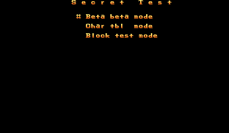

Here is the Secret Test menu, with its three intriguing options. **In any of these modes you can hit P1 Start + P1 Button 1 to return to the main menu.**

## Beta beta mode

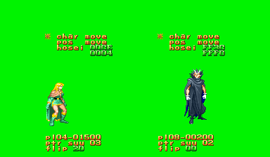

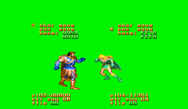

It's a sprite viewer for player characters and other objects. Pretty straightforward, and a little bit of a letdown after seeing its promising title of not just beta, but BETA beta. There are three modes of operation here. In the default mode, you can hit Up or Down to select between the other modes, char move and pos move. While in the default mode, you can do a horizontal flip of the sprite with Button 1. Pressing Start will select from the other two modes.

In char move, you can cycle through the sprite sets. Left and Right cycle between the characters/objects. Button 3 and Button 4 cycle up and down, respectively, through the framesets; Button 1 and 2 scroll up and down through individual frames. It doesn't load the correct palette for any of the non-player characters, and it doesn't have a way to switch palettes, unfortunately.

In pos move, you can move the sprite position around the screen. You can hold Button 1 to move it one pixel at a time.

These controls are mirrored for both P1 and P2.

## Char tbl mode

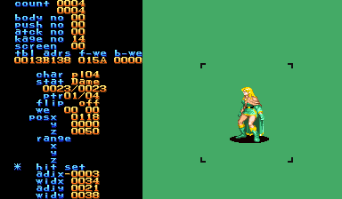

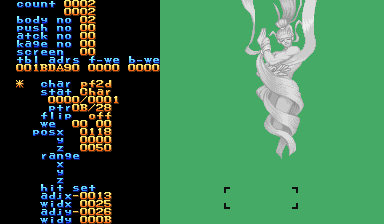

Similar to the mode above, this is a sprite animation viewer and hitbox editor, but with much more information. The lower half of the blue text is a menu, with the asterisk as the cursor. In the default mode (with the cursor orange), P1 Up/Down cycles through the menu options, while P1 Left/Right cycles the animation sets. Holding P1 Button 1 will play the current animation; P1 Button 2 advances by frame, and P1 Button 3 resets to the beginning.

To select one of the menu options, press P1 Start; the cursor will turn blue. Some options are changes by P1 Right/Left, some by P1 Button 1. The 'char' options cycles through available characters. 'stat' is state, I assume; it switches the group of animations to cycle through. 'flip' is horizontal flip. I haven't been able to figure out what 'we' does. 'pos' changes the position of the sprite, and 'hit_set' is a hitbox editor.

## Block test mode

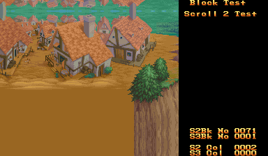

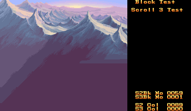

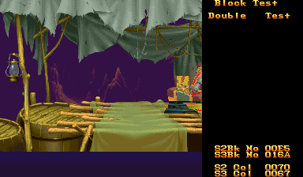

A graphics/stage viewer. There is some really nice art in this game...

There are four modes: Scroll 2 Test, Scroll 3 Test and two Double Test modes. Scroll 2 is the foremost plane, and Scroll 3 is the background. In either of these modes, use these inputs:

 - P1 Up/Down - Move image up or down
 - P1 Left/Right - Cycle through images
 - P1 Button 3/4 - Cycle through palette

Finally there's Double Test, which shows both planes at the same time. This has two modes, one where Scroll 2 is in the front as normal, and the other where the priority is reversed. The controls are the same as above but with P1 controlling Scroll 2 and P2 controlling Scroll 3.

The most interesting feature of the block test mode is a collision viewer for all the Scroll 2 screens:

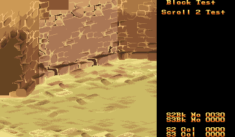

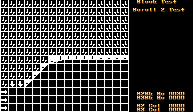

This shows where the borders of the map are, where the character can walk and can't. Neat! You can turn this view on and off by hitting P1 Button 1.

So, the Secret Test menu normally only has three options, as seen above. But wait, if you check the string table, you'll find there are actually a few more options, all of them related to the text in the game! With a little bit of magic we get...

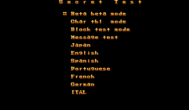

## Message test


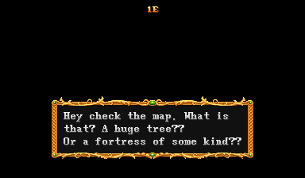

Exactly what its name implies. Cycle through the game text in the default language. Use P2 Button 1 to increase the message number, and P2 Button 2 to decrease. P1 Button 1 shows the message (which is timed and goes away on its own after a couple seconds).

### Japan

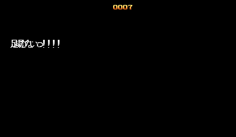

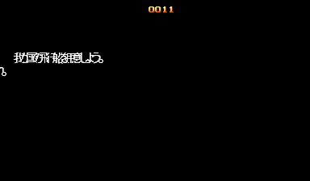

Well, it's Japanese text alright, but it's clearly mangled. It looks like it's shifted left, probably using the kerning from the Western alphabet. This menu is similar to the one above but the text doesn't have an animated reveal. Use P1 Button 1 to increase the message number, and P1 Button 2 to decrease.

### English

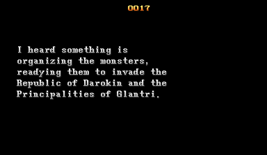

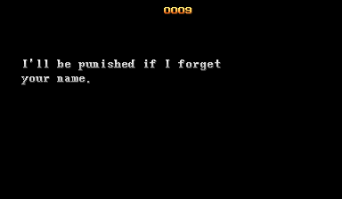

Just like above, but in English.

### Spanish, Portuguese, French, German, Italian

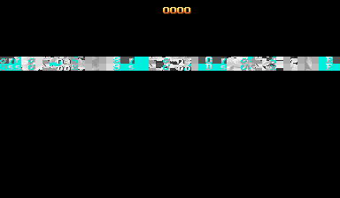

All broken. Just like the two menus above, but the text is just random graphics. Pressing P1 Button 1 or 2 causes the game to crash.

Interestingly, the game still has the text for the full set of menus that (I assume) were part of a standard CPS-2 SDK. However, also like some other CPS-2 games, only the strings remain and the code behind those menus is gone (aside from the normally accessible test menu, of course). The Secret Test menu we uncovered above seems to be a heavily modified version of the old menus. It's odd to me that the devs would go out of their way to make their own debug menu when there was an existing template from the SDK. And not only that, but then disable half that menu (the message tests) anyway.

Anyway, here's the MAME cheat to experience all this for yourself:

```
  <cheat desc="Enable Secret Test Menu">
    <comment>Replaces the standard test menu</comment>
    <script state="on">
      <action>temp0=maincpu.mw@C0</action>
      <action>temp1=maincpu.mb@EE093</action>
      <action>temp2=maincpu.mb@ED43F</action>
      <action>temp3=maincpu.mb@ED429</action>
      
      <action>maincpu.mw@C0=0001</action>
      <action>maincpu.mb@EE093=2F</action>
      <action>maincpu.mb@ED43F=14</action>
      <action>maincpu.mb@ED429=14</action>
    </script>
    <script state="run">
      <action condition="(b@FF1D56 EQ 00)">maincpu.pb@FF1D56=01</action>
    </script>
    <script state="off">
      <action>maincpu.mw@C0=temp0</action>
      <action>maincpu.mb@EE093=temp1</action>
      <action>maincpu.mb@ED43F=temp2</action>
      <action>maincpu.mb@ED429=temp3</action>
    </script>
  </cheat>
```
