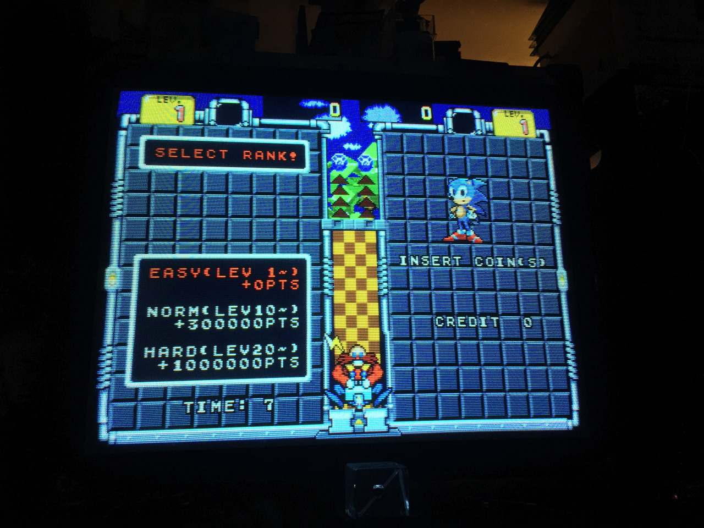

So it looks like after the Waku Waku Patrol Car and the Popcorn Machine dumps, we may have another rare Sonic arcade game on our hands. This one was unreleased though, never making it past the location test stage.

<!--more-->

With a name like 'SEGA SONIC BROS.' it's easy to dismiss this as a hoax, but [the news](http://shoutime.tumblr.com/post/138666888103/sega-sonic-bros-ac-its-the-megaton) is coming from well-respected arcade collector and contributor ShouTime, who has previously brought us rare gems like the unreleased shooter Wing Force. (Seriously,  [look at this guy's collection.](http://shoutime.tumblr.com/post/138187567168/real-sokoban-reorganization-of-my-storage-area)) It's also a bit early for April Fool's so I'm inclined to believe this is real. He claims it was designed by [Mitsuji Fukio](https://en.wikipedia.org/wiki/Fukio_Mitsuji), probably most well known as the creator of Bubble Bobble. On twitter, Hardcore Gaming 101 [chimed in by saying they had heard of the game, and that the concept was later turned into the Game Gear title Poplis](https://twitter.com/HG_101/status/695703755027849217). I certainly trust HG101 too, but I'm dying to know their source for this.


([Image Source](http://shoutime.tumblr.com/post/138735367028/sega-sonic-bros-ac-play-with-yourself-or))

So far, ShouTime has only released a couple screenshots, but I'm watching his feed like a hawk for more info. On twitter,  [@sebmal summarized this situation the best](https://twitter.com/sebmal/status/695746212725559296): "The sonic prototype/unreleased game community is one of the oldest and most meticulous i can think of, so the idea that someone can just go "HERES A NEW ONE" out of nowhere and slam down a game nobody's even HEARD OF is insane to me."

EDIT 1: [A Sega Bits user has posted this from the March 1992 Electronic Gaming Monthly](http://segabits.com/blog/2016/02/04/segasonic-the-hedgehog-arcade-prototype-supposedly-uncovered-presenting-segasonic-bros/):


EDIT 2: [This Japanese post was found describing one person's memory of the game and it's gameplay](http://ittells.jp/community/topicdetail.htm?topicId=99&articleId=126607). I've done a quick translation of the text (though a couple lines were just a bit too complex or vague for me to get a solid understanding):

```
"A is for Arcade"
#15 'Sonic Brothers' (1992, Sega)
Mitsuji Fukio, known as MTJ and for the design of games like 'Puzzle Bobble,' 'Sylvalion,' and 'Omega Fighter,' was the director of 'Sonic Brothers.' Though he designed and developed the game, it was cancelled after the location test and was never brought to market.
I can only remember playing it a few times, but it seems there aren't many people who have written down their memories of the game, I'll attempt to describe it as I remember it. I'd be happy if any who knows the game could point out any errors:
The game was a falling-block puzzle game using 'Sonic the Hedgehog' (similar to Tetris or Puyo Puyo).
The multi-colored Sonics in round spin attack form a 田 shaped block, a set of 4 fall downwards. You can rotate the block, and they will pile up at the bottom, and when Sonics of the same color surround a different colord Sonic, it disappears.
This can happen by forming a ring with the same colors or by using the walls. I've drawn the possible scenarios below. This character ■ (Same color) represents the Sonics that surround × (which can be any color) which are Sonics that will disappear:
Using the bottom
□□□□□□
□■■■■□
□■××■□
□■××■□
Using bottom + one side
□□□□□□
■■■■□□
×××■□□
×××■□□
Using bottom + both sides
□□□□□□
■■■■■■
××××××
××××××
Not using the bottom (for example, making a ring) might have been allowed too, and I think you could drop one block to complete two enclosures at once, but I can't quite recall what would happen in that case (but I imagine that they disappeared in any case like that).
If you're a puzzle game lover, you can probably imagine the game was a bit frustrating and difficult. If you make just one mistake with placement, your plan will fall apart, and it's extremely difficult to start stacking over again. It's also problematic that there so many blocks, since they come down in fours.
Since the surrounded blocks can be any color, as a bit of advice, it becomes extremely important to pay attention to the color as the game progresses. It's infuriating to throw away a block when it turns out you needed it, --unsure of the rest of this sentence --
Not just limited to the falling blocks, the game further adopted the concept of 'encircling.' While playing, (according to the rules) while keeping track of the situation inside and outside of the boundaries, it's necessary to follow the tracks of the boundary line. It's a difficult game where your eyes have to take in wide scope of things all at once. That concept reappeared in some later, released games.
That's about all I remember of 'Sonic Brothers.' There may also been a kind of support item that looked like the gems from 'Coumns,' but I can't recall.
I think a more polished example of the 'Sonic Brothers' idea is the Taito game 'Cleopatra's Fortune.' The encircling idea greatly resembles it, but the parts that surround and can be surrounded are different, and there's much easier to understand gameplay.
I think MTJ's forte as a designer is to start with a single catchy idea and forcing it to work as problems arise.
-- unsure of this line --
I had only played the game a few times, and there are no materials, so the rules and such might differ from how it actually was. I'd appreciate any knowledge anyone has about it.
I think it's awful that I won't get to experience 'Sonic Brothers' once more. It might be amusing to program a game with the same structure..
```

EDIT 3: ShouTime has posted a third screenshot, this time from the game tutorial:


([Image Source](http://shoutime.tumblr.com/post/138802251938/sega-sonic-bros-ac-great-detective-work-bros))

Translation:

>When they're surrounded by the same color they disappear! The three sides (left, right and bottom) can be used to enclose.

EDIT 4: Another screenshot!



([Image Source](http://shoutime.tumblr.com/post/138931379548/sega-sonic-bros-ac-sonic-says-to-select-rank))