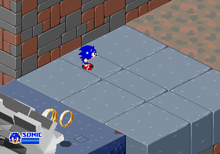
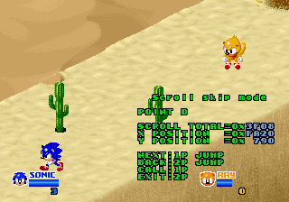

The game responsible for bringing Mighty and Ray into the world also has a bunch of debugging tools, a ton of cut content, and an interesting development history tucked away.

<!--more-->

# Game Versions

We currently have two dumps of the game, labeled Revision A and Revision C. These are known as such due to the markings on their PCB.


Revision C is the final version and thus the common one. Revision A is often referred to as a "prototype," which may be true from the standpoint of the dictionary definition, but among game researchers the word tends to have implications of being an internal build not intended for public release.

In fact, Revision A is more accurately a *location test*, a nearly-but-not-quite complete version of the game placed in a limited number of arcades (locations) to test how well it performs financially. Games that don't do well may be scrapped entirely; [SegaSonic Bros.](http://info.sonicretro.org/SegaSonic_Bros.) is one of the more famous examples of that very situation.

The game itself has evidence for this. At the end of Desert Dodge Zone, "To Be Continued" appears on the screen and the game ends.


This is the sort of thing we often see in such versions, with a temporary ending screen either explicitly telling the player this is a location test or, as with SegaSonic Arcade, being more coy and suggesting there's more to come later.

There is also this [twitter post from the music composer Kawaguchi Hiroshi](https://twitter.com/Hiro_H10th/status/1091301275201810432) with some glimpses of the game's planning documents. One image is particularly interesting:

[](img/segasonicarcade-document4.jpg")

The table on the top half of the page is a list of the stages and their theme along with notes about what style of music should be composed. Between stages 3 and 4 is a darker line, and on the right side of the page is ロケテス, location test. This confirms the existence of a location test and that it originally planned to cut off after stage 3. This document is a bit early (there isn't even a design theme for stage 6 yet, which would have been Wild Waterways), so as the development situation evolved the location test was expanded to stage 5, as it is in our Revision A dump.

(We're going to take a closer look at this image in the next section.)

## Revision B

The presence of a Revision A and a Revision C implies the existence of a Revision B. Aside from the the logic of version increments, there's no definitive evidence that such a version existed.

However, there was a music CD produced in 1995 with a remix of tracks from a variety of Sega arcade games, *Sega Arcade Selection D-RAM Remix*. One of those tracks is a megamix of SegaSonic the Hedgehog music. The game's logo is actually featured on the album cover.


As it turns out, that title screen logo may be from Revision B! Inside the CD booklet is the same image of the logo in a larger resolution:


The first thing you'll notice is the empty background: no sky, ocean, island or Eggman puttering around. This is how it appears in Revision A, with the logo centered on a plain black screen. However, Ray and Mighty are not present on the Rev. A title screen.

You could write this off by saying this is the logo from the final version and that it was edited to remove the background for use as album artwork. If this were just the front of the case, I might agree. But the image appears seperately inside of the book too. The black in the screenshot background is a distinctly different shade from the black of the booklet page, indicating it's a full shot from a screen. It may be a little difficult to see from the scan, but there's also a bit of brightness "bleed" from the logo into the black, indicating the whole thing was captured from a CRT.

The real proof is in the sprites themselves, however. Though they aren't used by the code, there are complete title screen graphics for Ray and Mighty within the Rev. A data. 



Let's compare these to the title screens for all the revisions:


It's probably not immediately obvious, but the characters in the Revision A data are not identical to the final version. None of them have white "shines" in the eyes and appear only as solid black; Sonic's upper spine is shorter and less rounded; and finally, Ray has no tail.

In the screenshot from the CD booklet (what we believe to be Revision B), notice that none of the characters have "eye shines" and that Sonic's spine is shorter. These are clearly the Revision A sprites, though, notably, Ray's tail is present. The very presence of the characters in the screenshot indicates this is a version newer than Rev. A in which there is code which makes use of these graphics.

There are two other screenshots of the game in the booklet:


Neither one is particularly interesting, but there is some information we can glean. First, none of the players have a ring counter below their health bars. In the final, this is always present from the very start, even if it's 0. Second, these character graphics are newer than the ones in Rev. A, but are not the same as the ones in the final. (Actually, the graphics in these screenshots are present in the Rev. C data. We'll take a closer look at them in the Unused Content section below.)

Finally, though the artwork is newer, the player order is still that of Rev. A. Note that the left to right position of the *characters* do not match the position of the *players*, that is, the icons at the bottom of the screen. In the final version, the character order matches the player order. Here are Rev. A and C to compare:


These CD album booklet screenshots, for as little as they show, actually tell us quite a bit. There are elements of Rev. A (unused Mighty/Ray title screen graphics, no ring counters, mismatched player/character ordering) and Rev. C (unused running animations). Given the evidence we can say for certain that the screenshots are from a version that fits between the two dumps we have. We can't say this is Revision B for certain simply because we don't have an actual PCB, but it seems very likely.

The game had an ad in GAMEST #110 and a review from the 1993 Amusement Machine (AM) Show in #111, and in both cases we see more screenshots of what is likely Revision B.

[](img/sonicarcade_ad.jpg)

[](img/sonicarcade_review.jpg)

Once again, we see the character positions do not match the player order in the opening, and the ring counts are missing. The other screenshots are pretty uninteresting from the standpoint of showing us anything new or different.

(If you look closely, there is some line art in the background of the review text of Mighty and Ray, which are likely concept or promotional art that I don't believe has been seen before... I would love to find a cleaned up version!)

In fact, aside from the intro cutscene and its updated sprites and player order, these screenshots look as if they could have come from Revision A. Except for one, tiny little thing which I would have never noticed if I hadn't been elbow-deep in this game for the past six months. It involves this screenshot:


Trap Tower had some pretty big changes going from Rev. A to C, becoming overall less challenging by removing the the pop-up Eggman barriers, reducing the number of electric shock posts and, notably, adding the ability to break boxes. In Rev. A, the boxes can only be pushed and only up to a certain point where the orange and yellow bars stop them. The players can then run around and past the boxes. In Rev. C, these boxes are fully breakable and cannot be pushed at all.

And that's what makes this screenshot indicative of a version between Revision A and C. If you look closely, there is a smashed box. In Revision A, players cannot break boxes. It must be noted that the broken box graphics are present and used in Revision A, but only appear after the gear has rolled over them. That clearly hasn't occurred yet, with the gear still behind the barrier. And in Revision C, this section was completely changed, with only the two outer boxes remaining in the stage layout. This screenshot, and certainly the others from this and other magazine reviews, are likely from our mysterious Rev. B.

However, all of this will invariably raise the question: what WAS Revision B?

My guess is that it was the build for the 1993 AM Show. Even though the handful of screenshots we have of the game from the show are likely Sega PR stills (since they are re-used across all the gaming magazines at the time), they probably came from the actual version that was on display. It wouldn't have made sense (in my opinion) to have a second location test, but it is quite reasonable to have a build to show off at a trade show.

The only way we'll know more is if we someday find a Revision B board.

# Design Document Mysteries

Let's go off on a quick tangent and take a closer look at that [tweet from Kawaguchi-san](http://twitter.com/Hiro_H10th/status/1091301275201810432):

[](img/segasonicarcade-document4.jpg)

Perhaps you notice that there's some text coming through from the sheet behind it! It is pretty hard to make out, but with some image manipulation trickery, some parts become clearer. The upper part is particularly interesting and raises some new questions. Here's what I've been able to make out, along with an approximate translation:

ソニックサウンド？？書

<table>
	<tbody>
		<tr>
			<td>
			Prologue
			</td>
			<td>
			外
			</td>
			<td>
			エッグマン独占領域

			明るいエイジス
			</td>
			<td>
			ソニック？
			</td>
		</tr>
		<tr>
			<td>
			Stage 1-1
			</td>
			<td></td>
			<td>
			エッグマン独占領域

			（急？）流、？？
			</td>
			<td>
			？ンボを変える
			</td>
		</tr>
		<tr>
			<td>
			Stage 1-2
			</td>
			<td>
			内
			</td>
			<td>
			第一の塔
			</td>
			<td>
			前半（歯？）車に追いかけられる　後半？？
			</td>
		</tr>
		<tr>
			<td>
			Stage 2-1
			</td>
			<td>
			外
			</td>
			<td>
			（崩？）、岩？
			</td>
			<td>
			前方？？が？れる　後半火山及び？？連？
			</td>
		</tr>
		<tr>
			<td>
			Stage 2-2
			</td>
			<td>
			内
			</td>
			<td>
			第二の塔
			</td>
			<td></td>
		</tr>
		<tr>
			<td>
			Stage 3-1
			</td>
			<td>
			外
			</td>
			<td>
			砂（浜？）
			</td>
			<td></td>
		</tr>
		<tr>
			<td>
			Stage 3-2
			</td>
			<td>
			内
			</td>
			<td>
			第三の塔
			</td>
			<td></td>
		</tr>
		<tr>
			<td>
			Stage 4-1
			</td>
			<td>
			外
			</td>
			<td>
			？の世界
			</td>
			<td></td>
		</tr>
		<tr>
			<td>
			Final
			</td>
			<td>
			内
			</td>
			<td>
			全能の塔
			</td>
			<td></td>
		</tr>
	</tbody>
</table>

Translation:

Sonic Sound ?? Document

<table>
	<tbody>
		<tr>
			<td>
			Prologue
			</td>
			<td>
			Outside
			</td>
			<td>
			Eggman’s Private Domain

			Bright Aegis
			</td>
			<td>
			Sonic ???
			</td>
		</tr>
		<tr>
			<td>
			Stage 1-1
			</td>
			<td></td>
			<td>
			Eggman’s Private Domain

			（急？）流、？？
			</td>
			<td>
			??? change into ??mbo
			</td>
		</tr>
		<tr>
			<td>
			Stage 1-2
			</td>
			<td>
			Inside
			</td>
			<td>
			First Tower
			</td>
			<td>
			First half, chased by (gear?) vehicle, second half ??
			</td>
		</tr>
		<tr>
			<td>
			Stage 2-1
			</td>
			<td>
			Outside
			</td>
			<td>
			(Crumbling?), Rocks ??
			</td>
			<td>
			The front ?? (verb), second half is volcano or ???
			</td>
		</tr>
		<tr>
			<td>
			Stage 2-2
			</td>
			<td>
			Inside
			</td>
			<td>
			Second Tower
			</td>
			<td></td>
		</tr>
		<tr>
			<td>
			Stage 3-1
			</td>
			<td>
			Outside
			</td>
			<td>
			Sand (Beach?)
			</td>
			<td></td>
		</tr>
		<tr>
			<td>
			Stage 3-2
			</td>
			<td>
			Inside
			</td>
			<td>
			Third Tower
			</td>
			<td></td>
		</tr>
		<tr>
			<td>
			Stage 4-1
			</td>
			<td>
			Outside
			</td>
			<td>
			World of ?
			</td>
			<td></td>
		</tr>
		<tr>
			<td>
			Final
			</td>
			<td>
			Inside
			</td>
			<td>
			Omnipotent Tower
			</td>
			<td></td>
		</tr>
	</tbody>
</table>

Certainly, the most intriguing thing here is right near the, the "Bright [Aegis](https://www.merriam-webster.com/dictionary/aegis)." It certainly sounds like an Eggman device.

There's also mention of multiple towers. I have a suspicion this may be related to Trap Tower, which appears as three levels on the overworld map. But more interesting than that is that Trap Tower has a different stage transition in Revision A. 




In Revision A, the stage ends with an elevator platform bringing the characters up to a doorway, through which they exit. In Rev C, the stage simply ends with no elevator. I can't help but wonder if you originally ascended to the next part of the tower.

In any case, I'm reluctant to draw too many conclusions from this image as the text is very hard to read. It certainly adds more mystery to an already mysterious game, however.

# Debug Leftovers



*Above is the accompanying video for this article. Several of the debug tools and unused objects are illustrated there.*

There are a bunch of debugging tools and portions of tools remaining from the game's development. Both versions share some of the same debugging code, logically, but the final version has more of it removed. The one thing that all of the tools share in common is that none are normally accessible and all require at least some degree of hacking to get working.

## Stage Select Mode


When enabled, this will display text in the lower middle part of the screen. P1 Left/Right will change the value, while P1 Start will jump to the stage. It's that simple.

The number of stage slots varies between 17 and 18 in different points in the code. For example, the list of stage objects has 17 slots, while stage events has 18. In any case, there appear to only be 15 unique stages in the final, and 8 in Rev. A.

What defines a "stage" isn't straightforward. The tutorial is a stage, for example. So is the intro cutscene where the players are captured, and the ending. A stage can be full length, or it can be short sections. So to say "15 unique stages" may give the impression that there are lots of unused, full-length gameplay stages, when that isn't the case.

The stage IDs (i.e. the ones listed in the stage select tool) do not coincide with the order of gameplay. The order of stages can be found as a list of 16-bit values at 0x1AC4 in the loc. test and at 0x2639 in the final:

<table style="width: 25%;">
	<thead>
		<tr>
			<th>Loc. Test</th>
			<th>Final</th>
		</tr>
	</thead>
	<tbody>
		<tr>
			<td>0x07</td>
			<td>0x07</td>
		</tr>
		<tr>
			<td>0x06</td>
			<td>0x06</td>
		</tr>
		<tr>
			<td>0x05</td>
			<td>0x05</td>
		</tr>
		<tr>
			<td>0x08</td>
			<td>0x08</td>
		</tr>
		<tr>
			<td>0x03</td>
			<td>0x09</td>
		</tr>
		<tr>
			<td>0x04</td>
			<td>0x0A</td>
		</tr>
		<tr>
			<td>0x09</td>
			<td>0x03</td>
		</tr>
		<tr>
			<td>0x0A</td>
			<td>0x04</td>
		</tr>
		<tr>
			<td>0x0A</td>
			<td>0x10</td>
		</tr>
		<tr>
			<td>0x0A</td>
			<td>0x0C</td>
		</tr>
		<tr>
			<td>0x0A</td>
			<td>0x0D</td>
		</tr>
		<tr>
			<td>0x0A</td>
			<td>0x0E</td>
		</tr>
		<tr>
			<td>0x0A</td>
			<td>0x0F</td>
		</tr>
		<tr>
			<td>0x0A</td>
			<td>0x0B</td>
		</tr>
		<tr>
			<td>0x0A</td>
			<td>0x11</td>
		</tr>
		<tr>
			<td>0x0A</td>
			<td>0x0A</td>
		</tr>
		<tr>
			<td></td>
			<td>0x0A</td>
		</tr>
	</tbody>
</table>

As you can see, stage ID 1 and 2 are not used in either version, though both are just copies of the layout/graphics of the tutorial (stage ID 7), which is in turn based on stage ID 3 (Trap Tower). Though not listed in the order here, the later stages are still present in Rev. A, though they lack objects and events. 

In the loc. test version, the stage select only goes up to value 0x0F, which makes stage 0x10 (Wild Waterways) unable to be selected. A code change to correct this has proven to be complex beyond what should be necessary for such a small fix, and since there's only one extra stage that is unavailable (anything above 0x10 causes a crash), we deal with it a different way.

In the cheat below to show the stage select menu, the default value will be set to 0x10, the normally unselectable stage. Changing this value with the trackball will reset it to its usual values (0 to 0xF), so you'll need to "set" the cheat again if you want to select stage 0x10. It's a "good enough" fix. Note that we use the same cheat for both versions, so you can feel free to remove the second line of the cheat (which sets the default value) for the final version, if you wish.

Both Versions:

```
  <cheat desc="Show Stage Select">
    <comment>Set cheat during gameplay</comment>
    <script state="on">
      <action>mainpcb:maincpu.pb@20f061=08</action>
      <!-- The line below sets the default stage -->
      <!-- It is set to 0x10 for the loc. test -->
      <!-- and can be removed for use in the final -->
      <!-- version if you wish -->
      <action>mainpcb:maincpu.pw@20f06e=10</action>
    </script>
  </cheat>
```

## Stage Select Technical

The stage select code is implemented as a *gameplay mode*. To briefly go on a tangent about what we mean by a mode: while retro game architectures certainly vary, practically all of them work on the concept of a main loop in which hardware and game state is updated during each vertical blanking interval. Many games work on the concept of a mode, which can be thought of as a high-level game state. For example, the title screen display could be a mode, the character select could be a mode, the attract mode could be, well, a mode. Basically, this is the value that the main loop uses on each iteration to determine to where it should branch.

SegaSonic Arcade uses such a pattern. In addition to the global modes (attract mode, service menu, gameplay, etc) there are gameplay specific sub-modes for things such as the cutscenes and the end of stage tally and the like. The current gameplay mode is stored at byte 0x20F061, and the stage select is mode 8.

The fact that the Stage Select is a gameplay mode doesn't affect anything, per se, but it does give us context: we know it should be used while gameplay is running as opposed to e.g. startup or in the test menu. It also means that it is not *unreferenced* code, as it appears in the gameplay mode jump table, though it is *unused* in that there is no normal way to set the gameplay mode to 8.

Normal is the key word here, though, as there is actually a small bit of code that does set mode 8 based on inputs. That code appears immediately before the main stage select code, at 0xC41 in the loc. test and at 0x1459 in the final, but is not referenced anywhere else. Back when it was a part of the code, it would have checked for an input combination to trigger the stage select mode: P1 Start + P1 Button 1 in Rev A, and Service + P1 Button 1 in the final.

Purely for research, we can restore this unused subroutine to "correctly" activate the stage select. I've done this only for the final version, as it takes a bit of code juggling to get working:

Final Version:

```
    <cheat desc="Restore Stage Select">
    <comment>Hold Service and press P1 B1 to show stage select during gameplay</comment>
    <script state="on">
      <action>temp0=mainpcb:maincpu.mw@11a000</action>
      <action>mainpcb:maincpu.mw@11a000=f3e8</action>
      <action>temp1=mainpcb:maincpu.md@11a002</action>
      <action>mainpcb:maincpu.md@11a002=00001459</action>
      <action>temp2=mainpcb:maincpu.mw@11a006</action>
      <action>mainpcb:maincpu.mw@11a006=f3e8</action>
      <action>temp3=mainpcb:maincpu.md@11a008</action>
      <action>mainpcb:maincpu.md@11a008=00015f80</action>
      <action>temp4=mainpcb:maincpu.mb@11a00c</action>
      <action>mainpcb:maincpu.mb@11a00c=ca</action>
      <action>temp5=mainpcb:maincpu.md@992</action>
      <action>mainpcb:maincpu.md@992=0011a000</action>
    </script>
    <script state="off">
      <action>mainpcb:maincpu.mw@11a000=temp0</action>
      <action>mainpcb:maincpu.md@11a002=temp1</action>
      <action>mainpcb:maincpu.mw@11a006=temp2</action>
      <action>mainpcb:maincpu.md@11a008=temp3</action>
      <action>mainpcb:maincpu.mb@11a00c=temp4</action>
      <action>mainpcb:maincpu.md@992=temp5</action>
    </script>
  </cheat>
```

(Note: We use a slightly modified version of this cheat to get the Scroll Skip Mode working, so don't use both at the same time.)

## Ground Check Mode (Gameplay Mode 9)


It's unclear, exactly, what this tool is meant for. As its name implies, it does seem to be related to *checking the ground*, but whatever information it's meant to convey is now known only to the devs. It's likely it's a simply tool to test the "chunks" of the path within the stage.

When activated, the players disappear and are replaced with a large yellow rectangle. P2 Button will move the rectangle around, constrained to the floor. In some areas, the position of the rectangle will cause the map to scroll forward; moving the rectangle to a more backwards position stops the scrolling. And finally, pressing P1 Start will move to the next stage.

Both Versions:

```
  <cheat desc="Start Ground Check Mode">
    <comment>Should be run while in a gameplay stage</comment>
    <script state="on">
      <action>mainpcb:maincpu.pb@20f061=09</action>
    </script>
  </cheat>
```

## Ground Check Mode Technical

As with the Stage Select, this tool is implemented as a gameplay mode, mode 9.

In the final version, the code has been mostly gutted. While there are gameplay engine calls to keep things running, the actual ground check subroutine has been completely replaced with a return. While this has no effect in the final version (aside from stopping player effects in the stage), the cheat will still work in both versions, since it's just setting a gameplay mode. This will be useful in the final version when we look at the next debug tool, which is...

## Scroll Skip Mode




This works as a sort of stage viewer by moving to a specified point in the map. It's a bit buggy, with the players rarely following where the camera goes and occasionally causing resets, but this is likely due to how we're calling it.

It is activated differently depending on the version. In Rev A, P1 Start + P2 Start will bring up the menu, while in the final version it is Service + P2 Start. The controls to actually use the tool are helpfully printed on the screen while it runs.

## Scroll Skip Mode Technical

The code is located at 0x1D6E4 in the loc test and at 0x1A798 in the final. It is fully implemented in both versions, with some minor changes. The version in the final seems to work a bit better, but I can't say quantatitvely that it's less buggy.

The cheats are a little less straightforward than usual, because we're hijacking the Ground Check Mode, which has the necessary engine calls in its gameplay mode wrapper to keep things running in the background. You'll need to enable the cheat below, then use the "Start Ground Check Mode" from the previous section to actually get things loaded. You can, at least, use the inputs mentioned above to get the menu to display.

Rev A:

```
  <cheat desc="Replace Ground Check with Scroll Skip">
    <comment>Use the "Start Ground Check Mode" after enabliung this to switch to Scroll Skip Mode; press P1 Start + P2 Start to show the menu</comment>
    <script state="on">
      <action>temp1=mainpcb:maincpu.md@d2e</action>
      <action>mainpcb:maincpu.md@d2e=1d6e4</action>
    </script>
    <script state="off">
      <action>mainpcb:maincpu.md@d2e=temp1</action>
    </script>
  </cheat>
```

Final Version:

```
  <cheat desc="Replace Ground Check with Scroll Skip">
    <comment>Use the "Start Ground Check Mode" after enabliung this to switch to Scroll Skip Mode; press Service + P2 Start to show the menu</comment>
    <script state="on">
      <action>temp1=mainpcb:maincpu.md@1582</action>
      <action>mainpcb:maincpu.md@1582=1a798</action>
    </script>
    <script state="off">
      <action>mainpcb:maincpu.md@1582=temp1</action>
    </script>
  </cheat>
```

## Pattern Viewer


This is an unused and rather over-engineered graphics viewer within the code for Rev. A. It seems to have been completely removed from Rev. C.

When enabled, it displays a crosshair that acts as a cursor which is controlled by P2 Trackball and P2 Button 1 acting as the select button. This is used to select from the options listed at the bottom of the screen.

<table>
	<thead>
		<tr>
			<th>Option</th>
			<th>Effect</th>
		</tr>
	</thead>
	<tbody>
		<tr>
			<td>OBJECT</td>
			<td>Locks the cursor; P2 Trackball Y-axis will change the ID of the current object; P1 Trackball will move the object around the screen; P2 B1 unlocks the cursor</td>
		</tr>
		<tr>
			<td>CLEAR</td>
			<td>Removes all existing objects and spawns new one with default settings</td>
		</tr>
		<tr>
			<td>COLOR BANK</td>
			<td>Locks the cursor; P2 Trackball Y-axis will change the palette of the current object; P2 B1 unlocks the cursor</td>
		</tr>
		<tr>
			<td>BASE POINT</td>
			<td>This changes the relative location of the current sprite. It is indicated by the 3x3 small gray grid in the upper left; the red dot indicates the current position</td>
		</tr>
		<tr>
			<td>ZPOS</td>
			<td>Changes the Z position (the "layer") of the current object; P2 B1 increases, P1 B1 decreases</td>
		</tr>
		<tr>
			<td>16 - 256</td>
			<td>Changes the tile color depth - 4 bit (16 colors) or 8 bit (256 colors)</td>
		</tr>
		<tr>
			<td>SAVE</td>
			<td>Presumably writes the data to a certain address for use by external hardware or directly by the devs; TODO - needs more research</td>
		</tr>
		<tr>
			<td>H-V FLIP</td>
			<td>Sets or clears horizontal or vertical flip flags on the current object</td>
		</tr>
		<tr>
			<td>ZOOM</td>
			<td>Locks the cursor; P2 Trackball Y-axis resizes the current object; P2 B1 unlocks the cursor</td>
		</tr>
		<tr>
			<td>EXIT</td>
			<td>Quits the viewer</td>
		</tr>
		<tr>
			<td>END FLAG</td>
			<td>Sets or clears the end flag on the current object; this will fix the graphics on objects that have random horizontal lines</td>
		</tr>
		<tr>
			<td>NEW OBJECT</td>
			<td>Spawns a new object, using the current object's settings</td>
		</tr>
	</tbody>
</table>

As you may have guess from the use of "object" above, the tool can create multiple instances of a graphic, each of which can be uniquely modified. The current object will blink, and P1/P2 Start can be used to cycle through all the objects on the screen.

## Pattern Viewer - Technical

The entry for the tool is at 0x8E3F0, where it checks for P2 Button 1 before appearing.

It is unreferenced and it's unclear from where it was meant to be called. Requiring a button press to display the tool seems to indicate it was meant to "interrupt" something running, as opposed to (for example) being selected from a menu. This style of activation is similar to the Ground Check and Stage Select gameplay modes we'vre already looked it which have (or had) button combinations in order to be enabled. However, it doesn't seem likely that it would have been called during gameplay, as the game state running in the background causes all sorts of problems.

The only plausible scenario that comes to my mind is that there may have been a pause mode at one time, during which the viewer could have been activated. But this is purely speculation.

It's worth noting that it specifically calls the Read Inputs routine, which is normally left to the code within the main loop. In fact, we need to remove that "extra" call as part of the cheat, or else inputs will not work. The presence of a manual call to this subroutine may indicate it was tool originally meant to be used outside the current main loop. Or perhaps it is a remnant of an older program architecture.

In any case, with a bit of wrangling we can get it working by hijacking one of the global modes from startup, removing the extraneous input check and disabling the annoying "CREDITS" text in the middle of the screen.

Rev A:

```
  <cheat desc="Pattern Viewer">
    <comment>Reset game after enabling then press P2 B1 to bring up the tool</comment>
    <script state="on">
      <action>temp0=mainpcb:maincpu.md@3f6</action>
      <action>mainpcb:maincpu.md@3f6=0008e3f0</action>
      <action>temp3=mainpcb:maincpu.mw@b9</action>
      <action>mainpcb:maincpu.mw@b9=00c5</action>
      <action>temp1=mainpcb:maincpu.md@8e57c</action>
      <action>mainpcb:maincpu.md@8e57c=cdcdcdcd</action>
      <action>temp2=mainpcb:maincpu.mw@8e580</action>
      <action>mainpcb:maincpu.mw@8e580=cdcd</action>
    </script>
    <script state="off">
      <action>mainpcb:maincpu.md@3f6=temp0</action>
      <action>mainpcb:maincpu.mw@b9=temp3</action>
      <action>mainpcb:maincpu.md@8e57c=temp1</action>
      <action>mainpcb:maincpu.mw@8e580=temp2</action>
    </script>
  </cheat>
```

# English Translation & Localization


Perhaps the most intriguing and puzzling aspect of the game is the fact that within its data is a complete English translation of the (admittedly few) lines of dialogue and a full makeover of Eggman, turning him into Robotnik of the "SatAM" cartoon series that was airing on TV around the same time of the game's development. Neither the Robotnik graphics nore the English translation are implemented in the code and go entirely unused.

It's not that this localization was started then abandoned half way: it is complete in practically every respect. And there's evidence for both a World region version as well as a US version. But as far as anyone knows, it has never had a release outside of Japan.

It is possible that it *was* actually released in foreign markets, but it in such low numbers that practically no one knew about it. On the other hand, considering the popularity of Sonic games in online fan communities and the amount of attention the games have been given from researchers over the years, one would expect at least a handful of people to come forward with memories of an English version if one existed. It seems more likely that, even after all the graphics were finished and ready, something prevented a wider release.

Whether there is or is not an undumped version out there, the final version has everything needed to reconstruct an English version with a pretty high degree of certainty. So we've done just that. Below are two MAME cheats which will show the text in English and convert Eggman into Dr. Ivo Robotnik.

English Version:

```
  <cheat desc="English Patch">
    <comment>Requires reload to clear</comment>
    <script state="on">
      <!-- tutorial -->
      <action>mainpcb:maincpu.mw@95772=9f90</action>
      <action>mainpcb:maincpu.mw@95774=0a20</action>
      <action>mainpcb:maincpu.mw@95776=0130</action>
      <action>mainpcb:maincpu.mw@95778=0018</action>
      <action>mainpcb:maincpu.mw@9577a=9f90</action>
      <action>mainpcb:maincpu.mw@9577c=0a20</action>
      <action>mainpcb:maincpu.mw@9577e=0130</action>
      <action>mainpcb:maincpu.mw@95780=0018</action>
      <action>mainpcb:maincpu.mw@95782=9ff8</action>
      <action>mainpcb:maincpu.mw@95784=0a70</action>
      <action>mainpcb:maincpu.mw@95786=0078</action>
      <!-- kutabare sonic -> this is only the beginning (intro stage) -->
      <action>mainpcb:maincpu.mw@95792=9f28</action>
      <action>mainpcb:maincpu.mw@95794=8800</action>
      <action>mainpcb:maincpu.mw@95796=0130</action>
      <action>mainpcb:maincpu.mw@95798=0020</action>
      <!-- kutabare ray -> this is only the beginning (intro stage) -->
      <action>mainpcb:maincpu.mw@957ea=9f28</action>
      <action>mainpcb:maincpu.mw@957ec=8800</action>
      <action>mainpcb:maincpu.mw@957ef=0130</action>
      <action>mainpcb:maincpu.mw@957f1=0020</action>
      <!-- kutabare mighty -> this is only the beginning (intro stage) -->
      <action>mainpcb:maincpu.mw@957f2=9f28</action>
      <action>mainpcb:maincpu.mw@957f4=8800</action>
      <action>mainpcb:maincpu.mw@957f6=0130</action>
      <action>mainpcb:maincpu.mw@957f8=0020</action>
      <!-- anshin suru no wa hayai... -> can you escape robotnik's island (water explosion)-->
      <action>mainpcb:maincpu.mw@9579a=9f40</action>
      <!--
        This line actually has two English versions: one with Eggman, one with Robotnik
        This patch uses Robotnik by default. Replace the line above with this line
        to use Eggman instead:

      <action>mainpcb:maincpu.mw@9579a=9f30</action>
      -->
      <action>mainpcb:maincpu.mw@9579c=8800</action>
      <action>mainpcb:maincpu.mw@957a0=0038</action>
      <!-- kono shima no osoroshisa... -> I'll show you what terror means (volvanic vault)-->
      <action>mainpcb:maincpu.mw@957a2=9f48</action>
      <action>mainpcb:maincpu.mw@957a4=8800</action>
      <action>mainpcb:maincpu.mw@957a6=0130</action>
      <action>mainpcb:maincpu.mw@957a8=0038</action>
      <action>mainpcb:maincpu.mw@85df5=0050</action>
      <!-- kondo wa kou da -> try to get through this (icy isle)-->
      <action>mainpcb:maincpu.mw@95762=9f58</action>
      <action>mainpcb:maincpu.mw@95764=8800</action>
      <action>mainpcb:maincpu.mw@95766=0130</action>
      <action>mainpcb:maincpu.mw@95768=0020</action>
      <!-- futtonde shimae -> I'll blow you away (desert dodge)-->
      <action>mainpcb:maincpu.mw@957c2=9f80</action>
      <action>mainpcb:maincpu.mw@957c4=8800</action>
      <action>mainpcb:maincpu.mw@957c6=0130</action>
      <action>mainpcb:maincpu.mw@957c8=0020</action>
      <!-- mada mada -> you'll never escape (trap tower)-->
      <action>mainpcb:maincpu.mw@957ba=9f70</action>
      <action>mainpcb:maincpu.mw@957bc=8800</action>
      <action>mainpcb:maincpu.mw@957be=0130</action>
      <action>mainpcb:maincpu.mw@957c0=0020</action>
      <!-- ending lines -->
      <!-- chikusho! -> doggonit!-->
      <action>mainpcb:maincpu.mw@957ca=a1b8</action>
      <action>mainpcb:maincpu.mw@957cc=8800</action>
      <action>mainpcb:maincpu.mw@957ce=0130</action>
      <action>mainpcb:maincpu.mw@957d0=0020</action>
      <!-- kore de saigo da -> this is the end -->
      <action>mainpcb:maincpu.mw@957d2=9f78</action>
      <action>mainpcb:maincpu.mw@957d4=8800</action>
      <action>mainpcb:maincpu.mw@957d6=0130</action>
      <action>mainpcb:maincpu.mw@957d8=0020</action>
      <!-- tou morotomo futtonde... -> you'll never escape -->
      <action>mainpcb:maincpu.mw@957da=9f70</action>
      <action>mainpcb:maincpu.mw@957dc=8800</action>
      <action>mainpcb:maincpu.mw@957de=0130</action>
    </script>
  </cheat>
```

Robotnik Graphics:

```
  <cheat desc="Robotnik Patch">
    <comment>Requires reload to clear</comment>
    <script state="on">
      <!-- between level cutscene -->
      <action>mainpcb:maincpu.mw@9619e=0b70</action>
      <action>mainpcb:maincpu.mw@96253=0b70</action>
      <action>mainpcb:maincpu.mw@96367=0b70</action>
      <action>mainpcb:maincpu.mw@964a4=0b70</action>
      <action>mainpcb:maincpu.mw@96197=b088</action>
      <action>mainpcb:maincpu.mw@9624c=b088</action>
      <action>mainpcb:maincpu.mw@9635e=b088</action>
      <action>mainpcb:maincpu.mw@963d0=b088</action>
      <action>mainpcb:maincpu.mw@9649a=b088</action>
      <action>mainpcb:maincpu.mw@963dd=b0c0</action>
      <action>mainpcb:maincpu.md@95c18=17235e</action>
      <!-- fix x position to match initial tilemap -->
      <action>mainpcb:maincpu.mb@961b1=b3</action>
      <action>mainpcb:maincpu.mb@96266=b3</action>
      <action>mainpcb:maincpu.mb@9637a=b3</action>
      <!-- dropdown anims -->
      <action>mainpcb:maincpu.mw@12b46=8b90</action>
      <action>mainpcb:maincpu.mw@12c35=b128</action>
      <action>mainpcb:maincpu.mw@12c37=b130</action>
      <action>mainpcb:maincpu.mw@12c39=b138</action>
      <action>mainpcb:maincpu.mw@12c3b=b198</action>
      <action>mainpcb:maincpu.mw@12c3d=b1a0</action>
      <action>mainpcb:maincpu.mw@12c3f=b1a8</action>
      <action>mainpcb:maincpu.mw@12c41=b1b0</action>
      <action>mainpcb:maincpu.mw@12c43=b1b8</action>
      <action>mainpcb:maincpu.mw@12c45=b1c0</action>
      <action>mainpcb:maincpu.mw@12c47=b1c8</action>
      <action>mainpcb:maincpu.mw@12c49=b1d0</action>
      <action>mainpcb:maincpu.mw@12c4b=b1d8</action>
      <action>mainpcb:maincpu.mw@12c4d=b1e0</action>
      <action>mainpcb:maincpu.mw@12c4f=b1e8</action>
      <action>mainpcb:maincpu.mw@12c51=b1f0</action>
      <!-- final stage, control room cutscene -->
      <action>mainpcb:maincpu.mw@14057=b000</action>
      <action>mainpcb:maincpu.mw@1405e=9210</action>
      <action>mainpcb:maincpu.mw@1426d=b000</action>
      <action>mainpcb:maincpu.mw@1426f=b008</action>
      <action>mainpcb:maincpu.mw@14271=b010</action>
      <action>mainpcb:maincpu.mw@14273=b018</action>
      <action>mainpcb:maincpu.mw@14275=b020</action>
      <action>mainpcb:maincpu.mw@14277=b028</action>
      <action>mainpcb:maincpu.mw@14279=b030</action>
      <action>mainpcb:maincpu.mw@1427b=b038</action>
      <action>mainpcb:maincpu.mw@1427d=b040</action>
      <action>mainpcb:maincpu.mw@1427f=b000</action>
      <action>mainpcb:maincpu.mw@14281=b048</action>
      <action>mainpcb:maincpu.mw@14283=b050</action>
      <action>mainpcb:maincpu.mw@14285=b058</action>
      <action>mainpcb:maincpu.mw@14287=b060</action>
      <action>mainpcb:maincpu.mw@14289=b068</action>
      <action>mainpcb:maincpu.mw@1428b=b070</action>
      <action>mainpcb:maincpu.mw@1428d=b078</action>
      <action>mainpcb:maincpu.mw@1428f=b080</action>
      <!-- game over -->
      <action>mainpcb:maincpu.mw@235f=aff0</action>
      <action>mainpcb:maincpu.mw@2366=8b50</action>
      <!-- credits - large name badge -->
      <action>mainpcb:maincpu.mw@1d302=9858</action>
      <!-- ending - flying in ship - tilemap -->
      <action>mainpcb:maincpu.md@1be67=00172aa5</action>
      <!-- ending - flying in ship - small sprite -->
      <action>mainpcb:maincpu.mw@1d738=12a0</action>
      <action>mainpcb:maincpu.mw@1d731=af98</action>
      <action>mainpcb:maincpu.mw@1d959=af98</action>
      <action>mainpcb:maincpu.mw@1d95d=afa0</action>
      <action>mainpcb:maincpu.mw@1d961=afa8</action>
      <action>mainpcb:maincpu.mw@1d965=afb0</action>
      <action>mainpcb:maincpu.mw@1d969=afb0</action>
      <!-- ending - falling from sky -->
      <action>mainpcb:maincpu.mw@1da6e=0100</action>
      <action>mainpcb:maincpu.mw@1da75=af90</action>
      <action>mainpcb:maincpu.mw@1da7c=1290</action>
      <!-- map robotnik tower label -->
      <action>mainpcb:maincpu.mw@96cb1=9fd0</action>
      <!-- map icons -->
      <action>mainpcb:maincpu.mw@96c21=b0f0</action>
      <action>mainpcb:maincpu.mw@96c23=0b80</action>
      <action>mainpcb:maincpu.mw@96c2d=b0f8</action>
      <action>mainpcb:maincpu.mw@96c2f=0b80</action>
      <action>mainpcb:maincpu.mw@96c39=b100</action>
      <action>mainpcb:maincpu.mw@96c3b=0b80</action>
      <action>mainpcb:maincpu.mw@96c45=b108</action>
      <action>mainpcb:maincpu.mw@96c47=0b80</action>
      <action>mainpcb:maincpu.mw@96c51=b110</action>
      <action>mainpcb:maincpu.mw@96c53=0b80</action>
      <action>mainpcb:maincpu.mw@96c5d=b118</action>
      <action>mainpcb:maincpu.mw@96c5f=0b80</action>
      <action>mainpcb:maincpu.mw@96c69=b120</action>
      <action>mainpcb:maincpu.mw@96c6b=0b80</action>
    </script>
  </cheat>
```

## Patch Notes

Normally when we write cheats, we save the original values of what we're changing into temporary variables so the code can be restored, allowing the cheats to be turned on/off. Unfortunately, there are only ten of these variables available to a cheat, and as you can see, there are way more than ten changes per cheat. As such, these changes are permanent to your play session. You'll need to do a full reset (Shift + F3) or restart MAME in order to clear them.

There are a couple things to note regarding the English language patch in particular.

Though there is evidence that they were considering dynamic text (there are blank text bubbles and a full font, neither of which are used), all the messages in the game, Japanese and English, are composed of hardcoded graphics. This means we're stuck with whatever English lines were provided. The translation is good enough as is, though. For the most part, Eggman just antagonizes the player with lines like "Take this!" and "You'll never escape!" Many of the English lines are not direct translations of the Japanese, but convey the same general idea. And that's fine, but it does make it difficult to accurately pair the English lines with the Japanese lines. Moreover, the dialogue graphics are scattered a bit internally, so we can't match them up by order.

So, there's a bit of "artistic license" in choosing which English lines to use. All of them convey, at least in part, the same message of the Japanese, if not the same words. The biggest difference would be the ending, however. In Japanese, it's the only remaining mention of Eggman's tower. (In an older version, there was a whole expository scene where Eggman spoke about his Almighty Tower, which we'll talk about later). In English, there's no mention of the tower at all. In fact, it's hard to say which of the English lines we have are meant for the ending scene as they're all pretty generic. The cheat has comments on which lines were chosen to be replaced.

The other point to cover with the English patch is the presence of both Eggman and Robotnik in the dialogue, e.g.:

```
Can you escape from Robotnik's island of traps?
Can you escape from Eggman's island of traps?
```

This is the primary evidence for the suposition that there would have been separate World and US releases: a World version with English text but use of Eggman name and Japanese character graphics, and a US verison that would have gone full Robotnik.

As such, in the English patch above, you can choose which of these lines you wish to use. Assuming most people will play with Robotnik graphics, the default is set to that name. There are instructions within the cheat on how to change it to Eggman.

## Localization Data Details

One of the things I discovered while working on the Robotnik patch was that there are at least a couple other pieces of localization data still remaining. In particular, I'm talking about tilemaps.

For the most part, changing the graphics to Robotnik was not overly difficult. Most of the smaller graphics, what we would usually call sprites, are identified by a pattern number. So, it's a simple matter of find all references to one Eggman pattern, update them to the Robotnik pattern, and you're good. But some graphics, usually the larger, mostly static "pictures" and backgrounds are just raw tiles laid out with a seperate tilemap. This includes things like the ending with Eggman falling into the water or the start of the between-stage cutscene, where it fades in to Eggman sitting at the computer.

Since these don't use patterns, it was not as simple to get these working. In fact, they caused quite a bit of trouble at first. Once I had a better understanding of the tilemap format, it became clear I was going to have to find the raw tiles myself and create tilemaps from scratch. That would have been neither easy nor fun, to understate things.

But then I noticed an unused tilemap, immediately following the Eggman one I was working on. It looked similar-ish and on a whim pointed the code to it just to have a glance at what it was. And, indeed, it turned out to be the tilemap for the Robotnik version.

Not only did this save a lot of time and my own sanity, it also goes to show just how far along the localization was. It means that we don't just have "leftover graphics." Instead we have graphics that were likely fully implemented in code, but are simply unreferenced in our version.

It was quite common for arcade games that were planned to be released in multiple regions to have all the localized content included in one big data set, with the only changes being flags that indicate the region and thus which code path to follow and which data to reference. Neo-Geo games are a great example of this: all the region and language data is there on one cartridge and what you see depends on the hardware settings.

One of the first things I did was check if SegaSonic the Hedgehog had such an architecture. Unfortunately, it does not.

Instead, most of the graphics and and content IDs are directly hardcoded into the program. I imagine the developers had region-specific code and settings split up, with their build system choosing which to compile. The non-program data, things like the graphics and apparently tilemaps and such, were not split up by region and just lumped all together, it seems. Which could explain why they ended up in our Revision C dump.

So while it seems very likely that there were complete English language builds, they were likely never released to the public for reasons that remain unknown.

# Unused Content

Aside from the localization, the game has bunches of unused or removed graphics and even some code to go along with them. The TCRF pages for the [location test](https://tcrf.net/Proto:SegaSonic_the_Hedgehog) and the [final version](https://tcrf.net/SegaSonic_the_Hedgehog) have already identified and ripped most of them, but we'll take a look at some that were missed or need correction.

## Intro Running Animations

It seems like they just couldn't get the animation for the opening scene quite to their liking.

The final version (Revision C) has two versions of the running animation for each character, one of which is used and one which is not. The two variations have minor differences, including fixes to shading and proportions. It turns out that the unused variation appears in the screenshot within the D-RAM Remix CD booklet, as we discussed above in the Revisions section, and are thus leftovers from an earlier version, which may have been Revision B.

Each character has a normal run and a "panicked" run, when Eggman's tank is right about to capture them. In each of the examples below, the first set of graphics is the unused (earlier) version and the one below it is used, for comparison.

### Sonic



*From Revision C data, unused.*



*From Revision C data, used in the game.*

The only real change was to Sonic's hands. The size at medium depth was reduced and the finger articulations were removed at far depth. These changes were not made to the panicked running animation and it retains the bigger hands and fingers.

There is actually a duplicate copy of the used sprites which appears later in the pattern list, right before the final revision of Ray's running animations. This could have been the basis for a redraw of Sonic which they never got around to. In any case, the later copy is not referenced in the code.

### Mighty

Normal


*From Revision C data, unused.*


*From Revision C data, used in the game.*

Panicked


*From Revision C data, unused.*


*From Revision C data, used in the game.*

Mighty had all his running animations rerdawn for Revision C. In the normal run, the changes are pretty miniscule. His pupils were widened to give them more presence and his eyes don't dip as far into the bridge of his nose. The panicked animation was a huge change, however. His pupils changed to a squint and his grimace was made less severe. In both running modes, the shine on the middle of his brow, between his eyes, was darked with a red tint.

### Ray


*From Revision C data, unused.*


*From Revision C data, used in the game.*

The changes to Ray's normal animation are also pretty miniscule, while his panicked animation went unchanged. The top of his hair was given a bobbing effect by lessening the jagged pointiness in some frames. Moerover, the shading around his abdomen and legs was smoothed quite a bit.

Here is the screenshot from our suspected Revision B. 


As you can see, Ray's hair still has the jagged spike for this frame and Migty still has the bright white shine on his brow. The white of his eyes also dips into the bridge of his nose further. These are definitely the unused running animations within the Revision C data, indicating they are from an earlier version.

## Eggman Hologram


Within both Rev. A and C is a set of full-body Eggman sprites, showing him materializing, using a remote control then throwing the remote in anger. They are identical in style to the Eggman in the Ending scene, but are not used anywhere in the game. They have been known about for a while, and [can be seen on the TCRF page](https://tcrf.net/SegaSonic_the_Hedgehog#Eggman_Sprites).

However, it turns out these graphics are still implemented in the code, though the entity remains unused. We don't know the location in the game from which it would have been used, but we can at least restore it to see the object was animated. Here's a couple cheats to do just that:

Rev. A - Replaces the boss and the end of Landslide Limbo with the animation.

```
 <cheat desc="Eggman Unused Anim test">
    <comment>Replaces the boss at the end of Landslade Limbo with an unused boss</comment>
    <script state="on">
      <action>temp0=mainpcb:maincpu.mw@109c1c</action>
      <action>mainpcb:maincpu.mw@109c1c=0a700</action>
      <action>temp1=mainpcb:maincpu.mw@109c1e</action>
      <action>mainpcb:maincpu.mw@109c1e=1b80</action>
      <action>temp2=mainpcb:maincpu.mw@109c20</action>
      <action>mainpcb:maincpu.mw@109c20=0130</action>
      <action>temp8=mainpcb:maincpu.mw@109c24</action>
      <action>mainpcb:maincpu.mw@109c24=001b</action>
      <action>temp9=mainpcb:maincpu.md@109c2a</action>
      <action>mainpcb:maincpu.md@109c2a=ffffffff</action>
    </script>
    <script state="off">
      <action>mainpcb:maincpu.mw@109c1c=temp0</action>
      <action>mainpcb:maincpu.mw@109c1e=temp1</action>
      <action>mainpcb:maincpu.mw@109c20=temp2</action>
      <action>mainpcb:maincpu.mw@109c24=temp8</action>
      <action>mainpcb:maincpu.md@109c2a=temp9</action>
    </script>
  </cheat>
```

Final Version - Replaces the Eggman in the final scene, before he self-destructs the tower

```
  <cheat desc="Replace Eggman in final scene">
    <comment>Replaces Eggman in ending cutscene with unused animation</comment>
    <script state="on">
      <action>temp0=mainpcb:maincpu.mw@140d2</action>
      <action>mainpcb:maincpu.mw@140d2=f36d</action>
      <action>temp1=mainpcb:maincpu.mw@101058</action>
      <action>mainpcb:maincpu.mw@101058=e0</action>
    </script>
    <script state="off">
      <action>mainpcb:maincpu.mw@140d2=temp0</action>
      <action>mainpcb:maincpu.mw@101058=temp1</action>
    </script>
  </cheat>
```

## Angry Eggman





Yet another full body Eggman animation, and this time he looks to be hopping mad.

## Landslide Limbo Unused Boss


Seem this was probably the original boss for Landslide Limbo, as it ejects fireballs which appear in the stage right before this area. The object still works almost perfectly, though there are some palette issues and mis-mapped sound effects (namely, it plays Ray's "Tokenai yo!" voice clip whenever it slams down). It also displays one of the unsed Eggman lines when defeated, along with some broken broken graphics that may have been Eggman graphics in an older version.

Here's a cheat to see it for yourself:

Rev A:

```
  <cheat desc="Unused Boss">
    <comment>Replaces the boss at the end of Landslade Limbo with an unused boss</comment>
    <script state="on">
      <action>temp1=mainpcb:maincpu.mw@109c1e</action>
      <action>mainpcb:maincpu.mw@109c1e=1b40</action>
      <action>temp2=mainpcb:maincpu.mw@109c20</action>
      <action>mainpcb:maincpu.mw@109c20=00f0</action>
      <action>temp8=mainpcb:maincpu.mw@109c24</action>
      <action>mainpcb:maincpu.mw@109c24=0004</action>
      <action>temp9=mainpcb:maincpu.md@109c2a</action>
      <action>mainpcb:maincpu.md@109c2a=ffffffff</action>
    </script>
    <script state="off">
      <action>mainpcb:maincpu.mw@109c1e=temp1</action>
      <action>mainpcb:maincpu.mw@109c20=temp2</action>
      <action>mainpcb:maincpu.mw@109c24=temp8</action>
      <action>mainpcb:maincpu.md@109c2a=temp9</action>
    </script>
  </cheat>
```

## Blade Enemy


This too was partially discovered previously on TCRF, but missing some parts. The code for the enemy is still present, though it seems to be a very basic form. It will periodically spin its outer blades and... that's it. It has some unused graphics that suggest it had some other planned functionality, including shooting vertical spikes and extending a suction cup arm.



Here's a cheat to replace the Landslide Limbo boss with this enemy so you can play with it yourself.

Rev A:

```
  <cheat desc="Unused Blade Enemy">
    <comment>Replaces the boss at the end of Landslade Limbo with an unused enemy</comment>
    <script state="on">
      <action>temp1=mainpcb:maincpu.mw@109c1e</action>
      <action>mainpcb:maincpu.mw@109c1e=1b60</action>
      <action>temp2=mainpcb:maincpu.mw@109c20</action>
      <action>mainpcb:maincpu.mw@109c20=00f0</action>
      <action>temp8=mainpcb:maincpu.mw@109c24</action>
      <action>mainpcb:maincpu.mw@109c24=0009</action>
      <action>temp9=mainpcb:maincpu.md@109c2a</action>
      <action>mainpcb:maincpu.md@109c2a=ffffffff</action>
    </script>
    <script state="off">
      <action>mainpcb:maincpu.mw@109c1e=temp1</action>
      <action>mainpcb:maincpu.mw@109c20=temp2</action>
      <action>mainpcb:maincpu.mw@109c24=temp8</action>
      <action>mainpcb:maincpu.md@109c2a=temp9</action>
    </script>
  </cheat>
```

## Spike Wall


This is a wall obstacle with spikes on one side and a push pad on the other. When pushed, it turns half way, pauses briefly, then continues so it is flat again. It was intended to be used on Icy Isle. We know this because its code is in between other objects from the stage and it is also the only place where the palette is correct.

You can play with the wall yourself with this cheat, which places one of the walls in the area after the initial sliding ice blocks section:

Rev A:

```
  <cheat desc="Unused Spike Wall">
    <comment>Adds an unused spike spin wall to Icy Isle, after the initial ice block section</comment>
    <script state="on">
      <action>temp0=mainpcb:maincpu.mb@15e90</action>
      <action>mainpcb:maincpu.mb@15e90=ca</action>
      <action>temp4=mainpcb:maincpu.mw@109dc6</action>
      <action>mainpcb:maincpu.mw@109dc6=3600</action>
      <action>temp1=mainpcb:maincpu.mw@109dce</action>
      <action>mainpcb:maincpu.mw@109dce=0011</action>
      <action>temp2=mainpcb:maincpu.mw@109dc8</action>
      <action>mainpcb:maincpu.mw@109dc8=0d80</action>
      <action>temp3=mainpcb:maincpu.mw@109dca</action>
      <action>mainpcb:maincpu.mw@109dca=0810</action>
      <action>temp9=mainpcb:maincpu.md@109dca</action>
      <action>mainpcb:maincpu.md@109dd4=ffffffff</action>
    </script>
    <script state="off">
      <action>mainpcb:maincpu.mb@15e90=temp0</action>
      <action>mainpcb:maincpu.mw@109dc6=temp4</action>
      <action>mainpcb:maincpu.mw@109dce=temp1</action>
      <action>mainpcb:maincpu.mw@109dc8=temp2</action>
      <action>mainpcb:maincpu.mw@109dca=temp3</action>
      <action>mainpcb:maincpu.md@109dd4=temp9</action>
    </script>
  </cheat>
```

## Desert Dodge Enemies

Aside from the tornadoes, there are two enemies within Desert Dodge. The first one looks like this:


Left is from Rev. A, which looks like something out of a pinball stage from other Sonic games, and right is from Rev. C, where its palette was updated in the final to better match its environment

And then there is this guy who only appears in Revision A. It's a centipede looking robot, which blocks your path as it walks off the edge.


There are four of these on the upward path. In the final version, they were removed and replaced with... these.


Some pretty boring ball shapes that jump in and out of the sand like a worm. I guess the assumption was the original version was too easy, as simply walking off the edge and out of your way is hardly menacing or difficult. The newer enemy never leaves the path, continuously undulating and forcing you to maneuver around it.

I feel like this was a change for the worse. The later version an incredibly boring enemy made of incredibly boring graphics. It turns out, however, it originally had a little more going on. Within the data in the final, there appears to be a head and tail, of sorts, for facing two directions.



The two directions of the head and tail imply it would have had horizontal movement similar to the original centipede version. The angle certainly isn't suitable for the vertical, wave motion of the final version. To me, it suggests that the original idea was to "slither" across the screen, similar to the motion of the final version but horizontally, along the ground. In that case, the head and tail angles would work, for the most part.

It's unfortunate that this went unused as it has a bit more character than the balls-only version we ended up with. The original centipede version is still in the final version, though, so at least we can replace the balls with the more visulally interesting older version:

```
  <cheat desc="Replace ball enemies">
    <comment>Replace the ball enemies in Desert Dodge with original centipede enemy</comment>
    <script state="on">
      <action>temp0=mainpcb:maincpu.md@100d2a</action>
      <action>mainpcb:maincpu.md@100d2a=00150008</action>
      <action>temp1=mainpcb:maincpu.md@100d2e</action>
      <action>mainpcb:maincpu.md@100d2e=00c00101</action>
      <action>temp2=mainpcb:maincpu.md@100d26</action>
      <action>mainpcb:maincpu.md@100d26=0a3008ce</action>
      <action>temp3=mainpcb:maincpu.md@100d38</action>
      <action>mainpcb:maincpu.md@100d38=00150008</action>
      <action>temp4=mainpcb:maincpu.md@100d3c</action>
      <action>mainpcb:maincpu.md@100d3c=02c00100</action>
      <action>temp6=mainpcb:maincpu.md@100d54</action>
      <action>mainpcb:maincpu.md@100d54=00150008</action>
      <action>temp7=mainpcb:maincpu.md@100d58</action>
      <action>mainpcb:maincpu.md@100d58=00c00101</action>
      <action>temp8=mainpcb:maincpu.md@100d50</action>
      <action>mainpcb:maincpu.md@100d50=088608a3</action>
    </script>
    <script state="off">
      <action>mainpcb:maincpu.md@100d2a=temp0</action>
      <action>mainpcb:maincpu.md@100d2e=temp1</action>
      <action>mainpcb:maincpu.md@100d26=temp2</action>
      <action>mainpcb:maincpu.md@100d38=temp3</action>
      <action>mainpcb:maincpu.md@100d3c=temp4</action>
      <action>mainpcb:maincpu.md@100d54=temp6</action>
      <action>mainpcb:maincpu.md@100d58=temp7</action>
      <action>mainpcb:maincpu.md@100d50=temp8</action>
    </script>
  </cheat>
```

## Buffed Up Characters


There is an unused animation with the characters flexing their muscles. It's unclear what this was used for, but it has been theorized that it was intended to be shown when continuing after losing a life.

Though unused, the code for this animation is still implemented. If you want play with it yourself, here's a rather ridiculous cheat to replace the  jump button with the muscles animation. Enjoy, I guess.

Rev A:

```
  <cheat desc="SWOLE MODE">
    <comment>Replaces player jump with the unused muscles animation</comment>
    <script state="on">
      <action>temp1=mainpcb:maincpu.mw@2213</action>
      <action>mainpcb:maincpu.mw@2213=1ce4</action>
    </script>
    <script state="off">
      <action>mainpcb:maincpu.mw@2213=temp1</action>
    </script>
  </cheat>
```

Final Version:

```
  <cheat desc="SWOLE MODE">
    <comment>Replaces player jump with the unused muscles animation</comment>
    <script state="on">
      <action>temp1=mainpcb:maincpu.mw@3009</action>
      <action>mainpcb:maincpu.mw@3009=20e9</action>
    </script>
    <script state="off">
      <action>mainpcb:maincpu.mw@3009=temp1</action>
    </script>
  </cheat>
```

## Sega Logos



This is the same as the Sega logo used at the top of the staff roll, but with "Enterprises" added. It may have been intended for a foreign release.



A small Sega logo. Unclear where it would have been used.



A somewhat more elaborate version of the copyright text on the title screen. (It's implemented as text with a basic font in the code.) It appears right in the middle of Robotnik graphics in the pattern list, so it's possible it was intended as a small improvement in an international release.

## Mysterious Door


In the cutscene between the intro stage and Volcanic Vault, before Eggman launches Sonic into the sky with a jet of water, there is a building behind Sonic with a doorway. The open doorway is actually an overlay, and the original base graphic has a closed door, decorated with a sun symbol. The event code at 0x13CFF in the loc. test and at 0x8458b in the final loads the overlay This is presumably because the scene starts with Sonic walking forwards, as if he just left the building. But it also begs the question: why didn't they just modify the original tilemap?

On a related note, the design on the door strikes me as odd. After all, we're on Eggman's island of death traps, right? What's with the sun, moon and star motif here?

## Unused Eel Enemy





(The palettes here are likely not correct.)

This is an unknown and unimplemented enemy with a jaw that opens. It appears to have a front and back angle, implying it appeared on both sides of the stage walkway. There appears to be a gun of some sort inside its mouth, so it may have fired a projectile. Like the centipede enemies in Desert Dodge, this one appears to be made up of individual parts which, presumably, connected to give it length and fluid movement.

It's not really clear how the parts were meant to fit together, but it seems it was snake/dragon-ish. I only went with "eel" in the description as I believe it appeared in Wild Waterways, since it is sandwiched along with other graphics from that stage. It also comes with a hole in the ground graphic in two parts, presumably as layers to give it the effect of emerging from its hole.

You may notice that the ground pattern doesn't match the smooth surface of the underwater section of Wild Waterways. However, in Revision A, the ground has a bumpy texture which matches.


## Unused Electric Obstacle



This was included among the [previously known discoveries on TCRF](https://tcrf.net/Proto:SegaSonic_the_Hedgehog#Unused_Graphics), but I will expand upon it and make some corrections here.

Originally, it was assumed that this was meant to rest on top of a then-unidentified "dome," which we now know is the base of the unused Landslide Limbo boss. In actuality, it looks like it sat on its own. There is a front "gate" that opens up and down, from which some kind of attack emerged, presumably.

In the data, it is broken up into a top and bottom section, each of which has its own palette, which gives it a greater range of color. These palettes are only loaded in Landslide Limbo, so it's likely that was the stage in which it appeared.





In the pattern list, these unused graphics are sandwiched directly between the arcing electricity animation and the posts used to fence in the player during the Landslide Limbo boss fight.


If you look closely, you'll see that the fence posts are identical to the ones on either side of the unused obstacle. It's possible they could have been chained together to form a wall in the stage, with the obstacle in the middle to be destroyed and the fence on either side preventing the player from going around it.

I also think it's likely that the arcing electricity also would have appeared between the two "antennae" of the upper part of the obstacle, which is how I have portrayed it in the first image in this section.

## Eggman Controls









At the start of most of the stages, Eggman appears at the top of the screen, taunts you and pushes a button. It seems, though, that instead of just the button push, there was a second animation that went unused, in which he works the control sticks on his panel.

Oddly, even though it is unused, it also received the Robotnik treatment.

## Eggman's Ship



We've know about [Eggman's unused ship and it's bomb tossing arm](https://tcrf.net/SegaSonic_the_Hedgehog#Eggman_Sprites) for a while, but the are further frames for displaying it from any angle.

## Unknown Cube Obstacle



(The palette here is likely incorrect.)

These graphics only appear in the final and are unreferenced in the code. It looks like it was an obstacle that either exploded on its own or could be destroyed by the player. It has a destroyed version which is similar to the destroyed boxes in Trap Tower. Note the cube with different colors on the top. I have a feeling this part turned red or otherwise indicated it was about to explode. Unfortunatly, I can't find a palette that really seems to match it perfectly.

The animation of the smaller cube was like the particles flying away after being destroyed.

## Wooden Wall



The graphics for the wall itself are only in the Rev A data, while the broken pieces of wood made it in to the final. It's possible the wood pieces are used somewhere in the final, but I couldn't find any direct references to them in the code.

The wall is in three pieces, and looks like the players were meant to bust through it. The image of it whole was manually pieced together.

## Old Stage Names



Rev A has placeholder* stage names which are displayed on the overworld map like in the final. However, since it only plays up to Desert Dodge, the remainng labels are not used. (Note that since you are dropped into Volcanic Vault from the intro stage, that entry is not used either. This applies to the final version as well.)

I put a star beside placeholder above because these likely would have been the finalized names if there hadn't been any localization work done. We've already talked at length about the unused English version, and it's worth noting that the finalized version of the map labels appear immediately after the translated dialogue when going by pattern order.

Now, we've said before that adjacency doesn't always mean correlation... but sometimes it does. If you view the graphics as they are ordered by pattern ID, you see a clear lineation of old to new, with most of the localized graphics appearing later in the list. And this is logical anyway: why rearrange old entries in your list of resources if it's not necessary? You can just add new entries to the end of the list. If the finalized stage labels are lumped near the English strings, it implies a relationship.

Besides that, given the amusingly alliterative aspect of the final stage names and given the track record of Japanese game developers from that era attempting to translate text to English on their own, there's a good chance the localization staff had a hand in crafting the stage names. After all, their names do appear in the Special Thanks section of the staff roll, even when none of their more obvious work was used (that we know of...).

## To Be Continued



This is present in the Revision A graphics, and was clearly meant to be shown to players when reaching the end of the location test stages. Instead, this was used:


Why they chose to use text and a font instead of the (IMO) much better looking graphic is unknown. Then again, we can say the same for the title screen Mighty/Ray graphics that are present in the Rev. A data but go unused. In all cases, it probably related to the artists having completed their side, but the programmers concentrating on other aspects leading up to deadlines.

Consideirng those updated-but-unused Mighty/Ray graphics showed up in our probable Revision B screenshots, it's quite possible this graphic ended up being used in that version as well.

## Top 20



In the final version, the high score screen has text at the top reading "TOP 15," which is text using a scaled font. However, it looks like the plan was for 20 entries at first.

## Staff Roll Changes

I couldn't find any sign of code for the staff roll in Rev A, but most of the graphics are already present. A couple of them have a couple of quirks, though.



First of all, there's a typo with Eggman's voice actor's name. That should be Satoh, not Satho.



Sonic's VA name is correct, but his agent company, Aoni Productions, is included here. In the final version, Aoni Pro is given its own entry in Special Thanks.

The final version staff roll has a couple graphics that are not used.





It appears there was once a seperate section for the character design work.



This was likely an alternate title for the Voice Actor section.

## Shepard Co., Ltd.



This one's a pretty big mystery.

Given its font, it was probably part of the credits, possibly in the Special Thanks section. There are no other mentions of this name anywhere. It appears near the end of the pattern list, which implies it was added pretty late in development. Given that and its non-Japanese name, it seems to hint that they were part of the localization in some way.

The name appears in another video game: Sexy Parodius, of all things. In the [arcade version credits](https://w.atwiki.jp/game_staff/pages/227.html), it is listed as Shepard Productions, and in the [Saturn port](https://segaretro.org/Sexy_Parodius#Production_credits) as Shepard Co., Ltd. That game had also had an English localization for its Asian region release, though that's really the only thing the two games share in common.

(As a side note, when taking a quick peek at Sexy Parodius, I saw the infamous Winners Don't Do Drugs screen among its graphics, though we only have Japan and Asia region dumps. It would be interesting to see if there's evidence for a US region version inside. Looks like another game I'll need to investigate... someday.)

There are two Sega localization staff members who do appear in the credits: [S. Burton](https://segaretro.org/Steve_Burton) and [J. Spahn](https://segaretro.org/James_Spahn). It's unknown how they contributed since they are listed in the nebulous Special Thanks section. Perhaps they did some translation work. Perhaps they came up with the finalized stage names, which is why they remain listed in the game, and perhaps Shepard Co. worked on the original Robotnik art, which is why their name is not used here, but may have been in a US releease,

Lots of conjecture but no evidence, unfortunately. I actually managed to find both Burton and Spahn online and contacted them. I received a response from Mr. Spahn who was actually quite eager to help. Unfortunately, after a couple emails back and forth, he has not yet responded to my questions about the game. I'm sure it's mostly due him being quite busy with work, so I can understand not having the time to respond to questions from some internet weirdo about a game from 30 years ago. But I'm hopeful he will find that time eventually, and I'll be sure to update once I have his take on things.

So for now, Shepard Co., Ltd. remains a mystery.

## Old Introduction Dialogue


We've known for some time of the [existence of an unused dialogue between Sonic and Eggman](https://tcrf.net/Proto:SegaSonic_the_Hedgehog#Unused_Dialog) from an older version. In fact, those dialogues are still implemented in the code. Gameplay mode 0xF is responsible for displaying them, as shown above. Unfortunately, there isn't much to the code itself: it simply displays the text boxes and nothing else. There isn't any sign of graphics associated with it.

Still, it at least gives us an idea of how this scene played out at one time. Given the content of the text, it was likely from an introduction and could have been played after the initial capture sequence, or perhaps in place of it.

The position of the bubbles implies that Sonic was on the lower part of the screen while Eggman was above. Note that Eggman's dialogue is shifted somewhat to the right. I think this scene involved his unused ship, with him floating above and delivering his evil spiel before taking off to the tower control room.

After the text playback, it sets gameplay mode 3 (normal gameplay) directly, which tells us it took place inside an already loaded stage layout then transitioned directly into gameplay when finished. Whatever graphics components it may have had were likely a part of the stage layout at the time and are long gone.

Gameplay mode 0xF still exists in the final version, though its pattern IDs are meant for the older version. As such, we get some correctly positioned and animated garbage.

Both Versions:

```
  <cheat desc="Show Old Introduction Dialogue">
    <comment>Activate while in a gameplay stage</comment>
    <script state="on">
      <action>mainpcb:maincpu.pb@20f0e2=00</action>
      <action>mainpcb:maincpu.pb@20f061=0f</action>
    </script>
  </cheat>

```

# Miscaellaneous Finds

## Old Continue Screen


Gameplay mode 0xE is a apparently the Continue screen from an older version. If the timer counts down, it's a Game Over, as expected. In the final version, if you press Start, you'll be taken to the tutorial screen. In Rev. A, you will continue as usual.

This is presumably pretty old as even in Revision A the newer Continue function, with the question appearing in the player icon area, is implemented. It is still present and functional in both versions, however.

Both Versions:

```
  <cheat desc="Show Old Continue Screen">
    <comment>Activate this while in a gameplay stage</comment>
    <script state="on">
      <action>mainpcb:maincpu.pb@20e5af=09</action>
      <action>mainpcb:maincpu.pb@20f061=0e</action>
    </script>
  </cheat>
```

## Leftover Text

There is a handful of unused text from older versions scattered throughout the data

```
Ranking Mode
Title Mode
Demo 1 Mode
Demo 2 Mode
```

This appears at 0x463 in Rev. A and at 0x60D in the final. It's unclear if it was a menu or just a text indicator, but the entries correspond to the attract mode loop.

```
Game Mode
Fence Set Mode
Stage Change
Stg St Wait
RING BINUS
```

Starting at 0x19F9 in Rev. A and at 0x254D in the final is a block of strings, some of which are used and some are not. We've included only the unused text above. The first four lines appear to be related to debug tools which are no longer present. (It's worth noting that the strings for Stage Select Mode appear here.) Fence Set Mode may be the name for the unknown debug tool discussed above, but that's just a guess.

RING BINUS is clearly a typo for Ring Bonus, and probably appeared below the player health icons to label the ring counter. This assumption is made based on the fact that all the ALL CAPS text in the game appears in that area, such as CONTINUE? after losing a life. It was probably removed because it takes up a fair bit of space and just clutters the screen.

```
 PLayer Select
```

This string appears only in the final, at 0x27E2, immediately before some code related to, you guessed it, the character select screen. The capital L is not a typo. It was likely placeholder text.

```
NAME ENTRY
PLAYER SELECT
```

These strings are only in the final, appearing at 0x11413E. They appear to be placeholder text below the player icons.

# Theory: SegaSonic Bros. & Game Origins


We'll end the article with a theory I have: I believe SegaSonic Arcade is the descendant of SegaSonic Bros.

Before I go any further, I don't have a shred of proof for this. The "evidence" I have is circumstantial at best. Actually, just from looking at the title screen side by side above, you probably already know where I'm going with this. The idea struck me during the course of hacking apart the game, when I would cycle through palettes and Sonic would occasionally pop up with Might or Ray's palette.



The palettes for all three characters line up perfectly, meaning you can have blue Mightys and red Rays and any kind of Sonic you'd like. And I suddenly realized: these are the same colors as the SegaSonic "Brothers!"

In a May 1993 interview, Al Nilsen spoke of two previously developed Sonic arcade titles that were not released, and one that was in production. Given the timing, it's a pretty safe assumption that the one in production was SegaSonic the Hedgehog, and one of the two unreleased games was SegaSonic Bros. In Japan, Sega was, and still is, primarily known for their game centers and the machines they produce. Nintendo had always been the king of home consoles, and it made sense to push for a Sonic presence in the arcades when the Mega Drive did not have a large market share.

After the failure of the Bros. location tests, I suspect that Sega felt that an action game similar in style to the original series would perform better. The concept of multiple, different colored Sonics was still fresh and probably seemed like a good way to implement a multiplayer game, a simple way to have give each player the same gameplay. This was dropped very early on, with Mighty and Ray becoming the surrogate multiplayer Sonics.

There are some small bits that support this, namely the text in the game. The order of the strings has "Kutabare, Sonic!" very early on, with the Mighty and Ray versions added towards the end. This suggests the two new characters were added a bit later on, after some of the game had been developed. I also think it's telling that the unused dialogue between Sonic and Eggman from a very old version involves only... well, Sonic and Eggman. Eggman specifically calls out Sonic, and only Sonic, by name. You don't need to worry about different name strings if all the players are Sonic, after all.

Going back even further, I have a sneaking suspicion that this trackball controlled, isometric, "on-rails" chase game was not even a Sonic game to begin with. Perhaps it was just a proof of concept or was in the early stages of being developed as an original game before they dropped Sonic on to it. Once again, I don't have any proof for this; it's just a feeling. But something that really clinches that idea for me is the covered up door graphic we talked about earlier.


The door was covered to look "open" since Sonic had just walked outside. Okay, that's fine. But that sun/moon/star motif... There's something about that design that completely throws me off. On one hand, it has that sort of whimsical, fantastic, somewhat surrealistic style reminiscent of something like the special stage from the first Mega Drive game. On the other hand... you've been dropped on to Eggman's island of robotic death traps and you're at the foot of his control tower. Mystical stars and moons are not really what I would associate with an evil genius obsessed with killer robots.

Nowhere else in the game does this sort of imagery appear. To me, it feels like something left over from something very old, possibly predating the incorporation of Sonic. 

My theory for the origin of this game, then, is that someone at Sega had a proof of concept for a multiplayer, trackball-based game right around the same time as a new arcade game was needed to get that Sonic the Hedgehog character out into game centers. Draw some Sonic sprites and drop them in, and they're halfway there. Then someone comes up with the idea of reworking the multiplayer characters into something original, and the rest is history.

I want to emphasize, again, I haven't found any sort of real proof for any of this. The disjointed stage progression, some of the odd design decisions, the amount of cut content... I just have a feeling this game has a peculiar history that we don't know about. It's a history I'd love to learn about someday.
