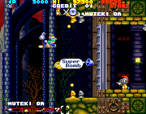
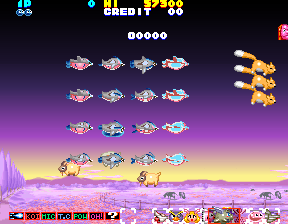
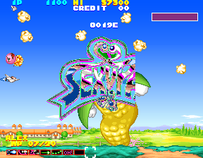
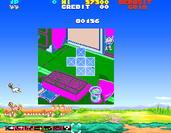
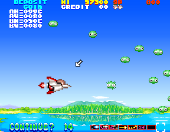
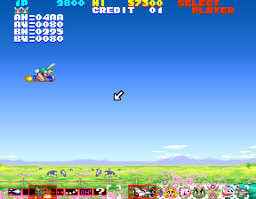
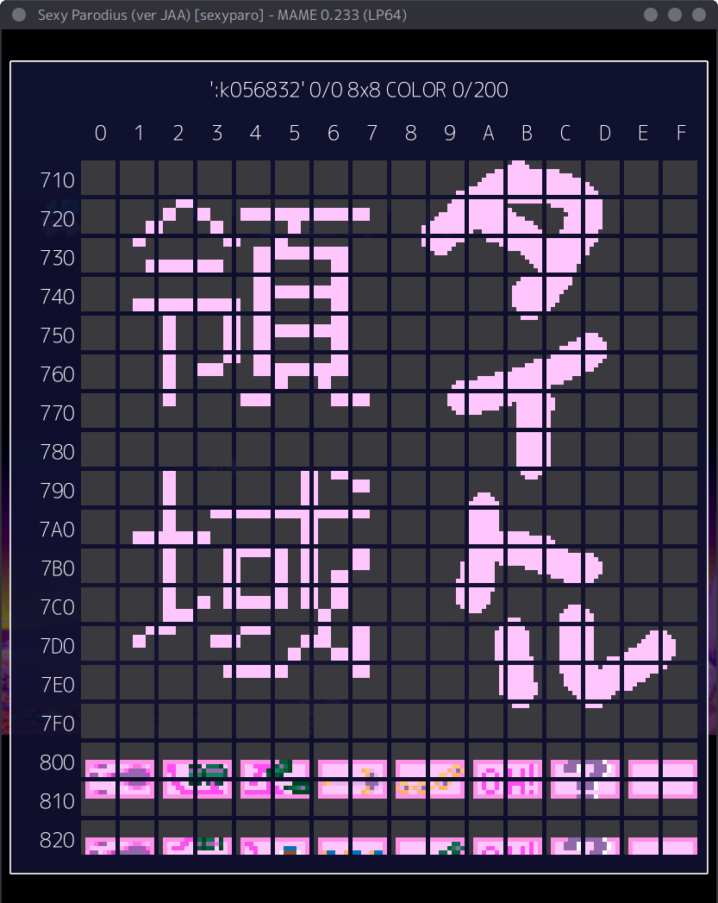

It's Sexy Parodious! Flying pigs, a horny octopus, and a really janky debug tool hidden away in there.

<!--more-->

# Debug Tool

(All memory offsets referenced and MAME cheats listed in the article for are intended for the Japanese region dump.)

Within the code is a rather janky "Swiss Army Knife" debugging tool. It tries to do a little bit of everything but isn't all that useful at much of anything. It has three main modes: gameplay settings, graphics viewer, and positioning tool.

The main debug flag is toggled by P1 Start. When set, it enters the first mode, the gameplay settings mode. Pressing P2 Start will advance to the graphics viewer, and finally the positioning tool. There is no way to return to the previous mode and P2 Start does not cycle back to the first mode. Instead, you must reset the main debug flag by pressing P1 Start to disable, then again to enable and return to the gameplay settings mode.

Here is the MAME cheat to enable the debug tool during gameplay:

```
  <cheat desc="Enable Debug Tool">
    <comment>Enables debug tool during gameplay. Press P1 Start to enable/disable and P2 Start to cycle the modes</comment>
    <script state="on">
      <action>temp1=maincpu.mb@28ac4f</action>
      <action>maincpu.mb@28ac4f=08</action>
      <action>temp2=maincpu.md@28ac5a</action>
      <action>maincpu.md@28ac5a=2990fc</action>
    </script>
    <script state="off">
      <action>maincpu.mb@28ac4f=temp1</action>
      <action>maincpu.md@28ac5a=temp2</action>
    </script>
  </cheat>
```

To make things more convoluted, there is no visual indicator whether the debug flag is set, nor for the gameplay settings tool that we'll look at next. You may want to use this cheat in conjunction with the one above to display the tool's status on screen:

```
  <cheat desc="Display gameplay debug settings">
        <script state="run">
      <output format="Debug Enabled: %04X">
        <argument>(maincpu.pw@c10994)</argument>
      </output>
      <output format="Debug Mode: %04X">
        <argument>(maincpu.pw@c00634)</argument>
      </output>
      <output format="No Damage: %04X">
        <argument>(maincpu.pw@c109ac)</argument>
      </output>
      <output format="Volume (P1 Up/Down): %04X">
        <argument>(maincpu.pw@c102a2)</argument>
      </output>
      <output format="Unknown (P1/P2 B3): %04X">
        <argument>(maincpu.pw@c107f2)</argument>
      </output>
    </script>
  </cheat>
```

## Gameplay Settings Mode

The first of these modes is the gameplay settings tool, which is at once the most useful of the debugging tools while also being the most frustrating. The frustration stems from the fact that all of the settings are controlled via player inputs during active gameplay.

Let's have a look at what it can do:

P1 Left/Right - Toggle no damage mode. The toggle is not bound to a direction, meaning pressing the same direction twice will enable then disable it.

P1 Up/Down - Volume up/down. This is the same memory location used for the volume control in the game configuration. However, the volume does not seem to actually change on either on the config screen or during this debug mode. This may be an emulation issue.

P1 (or P2) Button 1 - Selects the next powerup. However, Button 1 is also used to activate the powerup in normal gameplay, meaning it will be used right away instead of simply moving the powerup cursor, which seems to be the intent. Oops.

P1/P2 Button 3 - Increases (P1 B3) or decreases (P2 B3) the word value at 0xC107F2. It's unclear what this value does. The value is actually treated as the upper 16 bits of a long by the code, acting like a fixed point value, and its full value is read and increased on each frame. It may be related to skill in some way, as it is decreased on player death.

P1 Button 2 - End the stage immediately with Mission Incomplete status.

Hold P1 Button 1 + 3, press P1 Button 2 - End the game immediately (jumps to "Thank You For Playing!").

With no on screen indication of whether debug mode is actually on, you can understand how it's easy to accidentally disable invincibility or immediately end the stage with a single button press. The whole thing is pretty awkward.

On a related note, there is an unused string at 0x2FD757, "[MUTEKI](https://jisho.org/search/muteki) ON". It would have appeared in the lower left, like so:



So perhaps the debug tool had at least an invincibility indicator at one time.

## Graphics Viewer



The second debug tool is a simple graphics viewer. But broken. Kind of.

When you cycle into this mode, you'll see the graphics in the image above, with a layout of Ivan's sprites and a number above them. The graphics are displayed using player 1's character palette, so unless you've chosen Ivan, the palette will be incorrect. You'll notice that it doesn't respond to any inputs and the graphics can't be changed.

We'll discuss why in a minute, but before that, here is a cheat which fixes the tool:

```
  <cheat desc="Fix graphics viewer">
    <script state="on">
      <action>temp2=maincpu.md@29920c</action>
      <action>maincpu.md@29920c=c1ff00</action>
      <action>maincpu.pw@c1ff00=0001</action>
      <action>maincpu.pb@c1ff04=8f</action>
    </script>
    <script state="off">
      <action>maincpu.md@29920c=temp2</action>
    </script>
  </cheat>
```

And with this enabled, we now have a working graphics viewer... that displays while the game is running. Once again, pretty awkward.





P2 Left/Right will cycle through the graphics. Holding P2 Button 1 will step the value by 0x10 while holding P2 Button 2 will step by 0x100. 

Conspicuously missing is an option to change the palette of the graphics viewer, but we can add a MAME cheat parameter to force the palette that is used:

```
  <cheat desc="Set graphics viewer palette">
    <comment>Requires the "Fix graphics viewer" cheat to be set</comment>
    <parameter min="0" max="0xff" step="1"/>
    <script state="run">
      <action>maincpu.pb@c1ff07=param</action>
    </script>
  </cheat>
```

So, the reason the tool doesn't work is because it is attempting to write values to read-only memory space. The data beginning at 0x22F52C is a sprite definition, a data structure specifying a graphics tile index, color palette, position on screen, and other attributes used by the graphics hardware to render a sprite object on the screen. The graphics viewer uses this sprite definition for its display and attempts to write to 0x22F52E, which is its tile index. Since this is part of the program ROM space, it is read-only and the value can never actually change, making the tool appear to be unresponsive.

It's possible that the hardware on which this was developed loaded the program data into writable memory to allow for easy testing and debugging, which would have allowed this to work. Assuming that is true, it is also possible that the programmer decided to do it this way in order to have the sprite definition already initialized. Whatever the reasoning behind it, the patch to make it work on the final hardware is simple: setup an identical sprite definition in writable memory (RAM) and repoint the code to that location. Problem solved.

## ARROW MODE





The third mode of the debug tool is a bit of a mystery. It displays an arrow on the screen, which can be moved with the P2 stick. Holding P2 Button 3 makes the arrow move faster. The values in the upper left relate to the position of the arrow, plus its horizontal location within the stage as it scrolls.

And that's... it. I've examined the disassembly and don't see it doing anything else, so it's unclear what it's purpose was.

## Debug tool technical

The code for the debug tool begins at 0x2990FC and is unreferenced anywhere in the code. So, say it with me: "No reference, no context." With no reference to the code, we can't be sure of the context in which it was called. So we have to make an educated guess.

Unfortunately, given how fiddly and odd this tool is, it's difficult to make such a guess. On one hand, the fact that settings are changes by player controls instead of from a menu suggests it was meant to run during gameplay. On the other hand, the presence of the graphics viewer suggests it was meant to be called on its own, with gameplay *not* running in the background.

One possible scenario is a pause mode. If the tool was activated while the game was paused, then everything sort of works. I haven't investigated the actual gameplay engine much, so if there was such a pause function, it may still be tucked away somewhere.

In any case, we have made the cheat active during gameplay, as that seems like the best way to use its most useful aspect, the gameplay settings mode. If we do uncover a pause mode, I'll try to rewrite the cheat to make it work with it.

# Placeholder title screen graphics



Within the data is an unused block of graphics with text reading タイトル領域 *taitoru ryōiki*, Title Area.

# Hidden Images on Player Select Screen


There are some small illustrations in the background of the character select screen which can only be briefly seen in full as the foreground animates in. The full image is above.

If the region is set to anywhere but Japan, only the upper half of the image is displayed. The lower half is an [aiaigasa](https://japan-cc.com/umbrella.htm), with the names of some of the characters: Hikaru-chan on the left, and on the right, Takosuke crossed out and replaced with Viper.

And that's all for Sexy Parodious for now!
