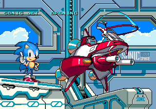
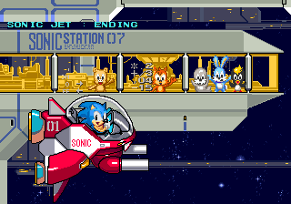
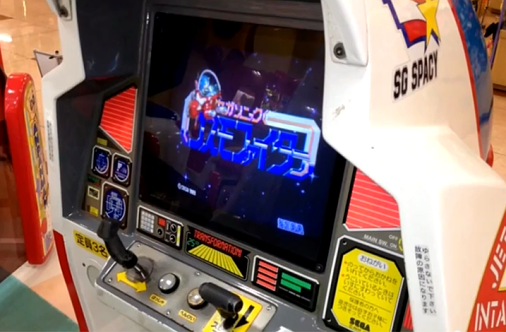

I cut my teeth on game hacking and research in the Sonic communities of the early 2000's - Area 51, SSRG, CulT - and the Sonic arcade games were always something of an enigma to us. It's been especially exciting to see that these rarities have been finally dumped, including Cosmo Fighter.

I opened the data not expecting to find much and, unfortunately, I was correct. But there are a couple interesting tidbits worth looking at...

<!--more-->

# Unused mode name display function





The most interesting thing here is a set of strings starting at 0x4F2 that indicate that the game may have been called 'Sonic Jet' while in development:

```
SONIC JET : TEST MODE         
SONIC JET : WARNING           
SONIC JET : TITLE             
SONIC JET : DEMO              
SONIC JET : OPENING           
SONIC JET : GAME              
SONIC JET : ENDING            
```

These roughly correspond to the different modes the program runs in (which are referenced starting at 0x36A), though with some differences. Namely, the warning screen is now in the init code and not a separate game mode, there are two title screen modes (more on that later) and there is an extra mode that occurs after the credits which displays bonus stars. Clearly this list is for an older version.

Now, let's work backwards. There is a reference to this set of strings in code beginning at 0x4C0. It's a short bit of code that simply calls the text display routine (at 0x3DCC) with a pointer to one of these strings based on the current program mode (at 0xFF8000). In other words, it just displays what mode the program is currently in.

*That* chunk of code is then referenced by code right above it, starting at 0x390, which is... not referenced anywhere. It's orphaned code. Calling it directly displays the text (as expected since there is a branch to the display code) and corrupts some graphics, but the game continues on.

This code looks very, very similar to the init/warning screen code that is used at 0x5FC, with only a couple of differences. In fact, you can repoint the jump to 0x5FC (normal init code) to 0x390 (old init code) and the game will boot just fine. Also given the proximity of this old code to the central game mode switching loop right above it, I'd say the code at 0x390 is the original init code.

As the init code was not meant to run in a loop, the mode display code is only called once. I think this implies that, originally, it was meant to be called at the start of code for each program mode.

Anyway, it's a relatively useless function now. I've tried a couple simple methods to get it re-enabled in some meaningful way, but haven't been successful. It's not really worth the effort to implement something complicated, especially since we already have the most interesting information: the name 'Sonic Jet.' You can call the mode display code directly (0x4C0) from the debugger to see it, though it may corrupt some graphics; I've taken a couple screenshots of it above to save you the time.

# Two title screen modes

This is kind of boring, so I'll mention it quickly. It seems there are two title screen modes, 04 (which is used) and 08 (which is not used). I haven't been able to discern a difference. 08 is longer and looks to have some init code while 04 doesn't. In fact, if you call 04 directly after the warning screen, as the very first mode switch, the screen is blank. However, if you call 08 as the first mode switch, it displays the screen fine.

There's more research to be done here, though, frankly, I'm not sure I'll ever follow up.

# Debug inputs

Finally, we come to some actual working debug code. Leftover in the game are functions to pause and run in slow motion. These are fully enabled in the final code. The only catch is that they are mapped to inputs that are not available on the final hardware.



The game has two buttons, one to shoot and one to transform, and two direction controls, which are mapped to standard player 1 direction input. MAME, however, lists the full 2 player, 3 button input mappings for the machine. I imagine this was an oversight on the MAME dev part, but for now it means the debug inputs are readily available in the emulator.

So here we go: P2 Button 1 will pause/unpause the game (the pause flag is at 0xFF800A). P1 and P2 Start will decrease and increase the slow-motion rate of the game, respectively. Since normal speed is 0, hitting P1 start during normal speed will roll the value over to 7, the slowest setting. The speed flag is the word length value at 0xFF8006. Amusingly, you can manually set the negative flag on this value (i.e. enter 8 for the highest digit, such as 0x8007) to make the game run faster.

This makes me wonder if the other non-standard gaming hardware Sonic arcade games that also run on the C2 hardware (like Popcorn Shop and Patrol Car) also have debug functionality on the unused inputs. MAME correctly maps the controls for these games, so it's not as easy to discover, but it's a project for a rainy day.

So there you have it. Not the most interesting analysis in the world but at least it was quick.
