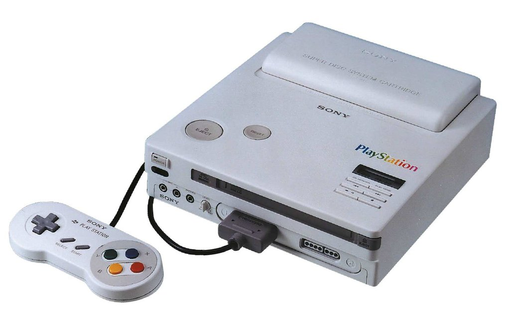

I want to believe...

<!--more-->

Recently on r/gaming on reddit, [a user popped up with pictures and a video](https://www.reddit.com/r/gaming/comments/3bwyj0/it_took_forever_but_i_finally_got_some_pics_of_my/csrasff?context=3) of an actual Play Station Super Disc unit. Here are the [pictures](http://imgur.com/a/Ll9kS) and [video](https://www.youtube.com/watch?v=CV6RusogAk). There's also [a very active thread on Assembler Games](http://assemblergames.com/l/threads/nintendo-snes-playstation-finally-uncovered.57166/#post-818735) with the owner providing more info. We can't be 100% certain that it isn't fake, but the yellowing plastic and proper Japanese on the cartridge certainly lend some credibility. If it is a fake, it's amazingly well done (and my heart would be broken).

It certainly matches the prototype pictures we've seen before:

He supposedly has a Super Disc with it as well (somewhere in his attic; here's hoping there's no heat damage). Of course, my opinion is that it should be sent to someone with experience in ROM dumping and get all the chips dumped, especially the all-important BIOS. Get the cartridge and disc dumped as well. The [technical documents for the hardware](https://docs.google.com/file/d/0B4cc2TZRufDtWERQV2FHZFhFaU1odEdTbWlTTHB1REJRNXdr/preview) were dumped last year, so... emulation wouldn't be impossible. Can you imagine?
