A Tecmo game featuring boobs? Simply unheard of!

**WARNING: This article is slightly NSFW. Turn back now if you're in a sensitive area or are offended by low resolution pixel breasts.**

<!--more-->

# In-Game Nudity

I was discussing Tecmo game history with a Japanese acquaintance on twitter a couple days ago (regarding a certain long-awaited but forthcoming article), and he mentioned something tangentially related:

>There's a Tecmo trackball-based golf game called Tee'd Off, and supposedly during its development, every time you got a hole-in-one, the girl would take off her clothes. Someone found the graphics in the game data, but their account is now private. It seems the guys at the Tecmo office at that time had the nude version. Anyway, it's practically become an urban legend in Japan, so you may want to investigate that. It could be big news.

Well! That's about as intriguing as it gets. Let me just drop everything and have a look real quick...

The girl in question appears normally in the game, though notably not nude, sporting a red top with the Tecmo logo.

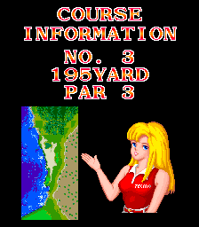

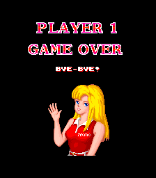

She makes an appearance during the attract mode to introduce the courses as well as the game over screen.

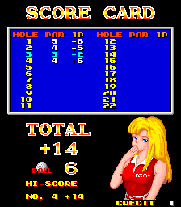

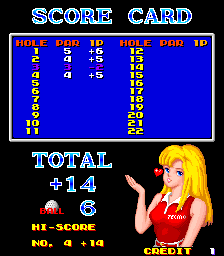

She also appears on the score card screen, where her animation varies depending on your score. For par, you'll get a wink. Under par, a blown kiss and a wink. And for a hole in one or 3+ under par, a kiss, a wink *and* floating hearts. However, no matter your score, her top remains in place throughout the game.

But this urban legend does have merit. There are indeed graphics for this young lady in a state of immodesty within the character ROM, and they're easy to spot.

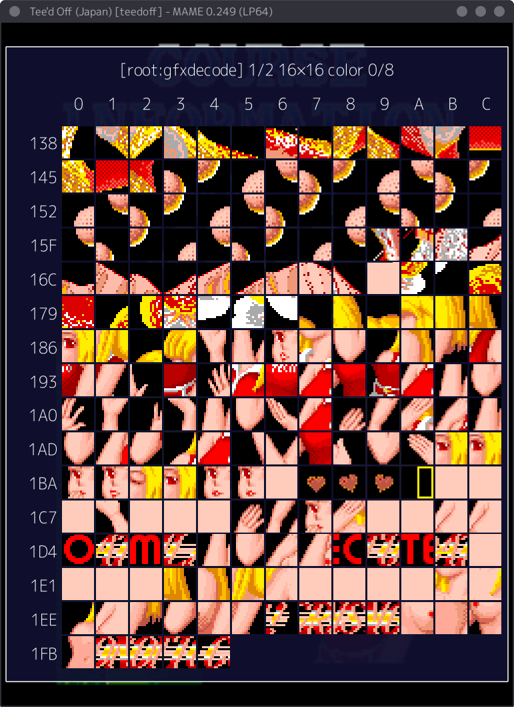

That's a promising start to unraveling this mystery. The graphics remain, but does the code/data actually reference them?

After a few hours of reverse engineering, we find that the tilemaps for the young lady's graphics are located in the sub CPU ROM, referenced in rudimentary animation scripts that contain simple positioning and timing information. Those scripts are then referenced in a pointer table at 0x174D.

```
ptrtblGirlAnims
 ram:174d   addr       spranimHoleInOne
                          ; index 0 is for under par
 ram:174f   addr       spranimHoleInOne
                          ; index 1 is for 3 under par or hole in one
 ram:1751   addr       spranimPar
                          ; wink
 ram:1753   addr       spranimUnderPar
                          ; blows kiss
 ram:1755   addr       spranimGameOver
                          ; waving
 ram:1757   addr       spranimCourseIntro
 ram:1759   addr       spranimCourseIntroHandAnim
 ram:175b   addr       spranimCourseIntroKiss
                          ; shown at the end of the course intros
```

Notice the first two entries which point to the same data. These are the animation scripts for under par and for hole in one. Both of these are the blow kiss/wink animation on the scorecard screen, with the only difference being that hole-in-one has includes floating hearts while under par does not.

But those floating hearts are not part of the animation scripts or tilemaps. Instead they are animated in the subroutine at 0x1DC6 in the sub CPU ROM, which checks bit 0 of 0xCAA0. This routine is called whenever the girl is on screen, so we can make the hearts appear any time we wish, regardless of the graphic used.

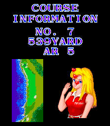

I say all that to emphasize the next point, which is that there's no reason to have two animation script slots since the only difference is the hearts, and the hearts have nothing to do with the animation script itself.

If there was only one animation planned for both under par/hole-in-one from the start, they could both use that same slot. The existence of two slots implies that there *could* have been a different animation script in place for either under par or for hole-in-one at one time.

And remember the "urban legend" we're investigating: that she appeared nude when scoring a hole-in-one.

So aside from the existence of the nude graphics, which proves that there certainly were boobs in the game, we have some possible evidence indicating support for the rumor of how those boobs were revealed.

A bit of digging around the data and we find there are four unused tilemaps. Forcing them to load, we get...

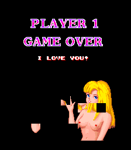

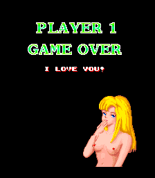

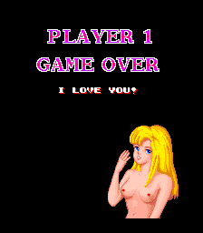

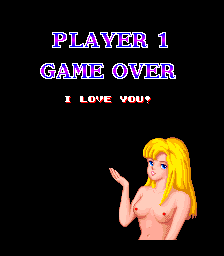

There she is, bearing her laser-red nipples to the world.

The first map is obviously a little broken, and the second map also has a tile a little bit out of place. I don't have a good explanation for why this is, unfortunately. The randomness of it would make me think perhaps a bad dump of the data, but I would expect to see issues in other parts of the game if that were the case. Perhaps the source data was damaged along the way and no one noticed since it had been removed. I'm really not sure.

But even with the broken image, we can see she's doing the blowing kiss animation, further lending credence to this being shown after a hole in one. The broken tilemaps are relatively simple to fix, so it looks like we have everything we need to restore the nudity.

Almost. One thing that is notably missing is the animation script. We can't just modify the existing one since, as mentioned above, it is shared between the hole-in-one and under par states. (Or, probably more accurately, the hole-in-one animation was removed and now points to the under par animation.)

Our only option is to copy and modify the existing animation. Once again, not too difficult. There's some unused space towards the end of the ROM, so we'll set it up there.

Let's put it all together into a MAME cheat:

```
  <cheat desc="Change hole in one/3 under par girl graphics (NSFW)">
    <script state="on">
      <!--fix the broken wave frame-->
      <action>temp2=sub.mb@1b3a</action>
      <action>sub.mb@1b3a=13</action>
      <action>temp3=sub.mb@1b3e</action>
      <action>sub.mb@1b3e=23</action>
      <action>temp4=sub.mb@1b82</action>
      <action>sub.mb@1b82=43</action>
      <action>temp5=sub.mb@1b77</action>
      <action>sub.mb@1b77=97</action>
      <!--fix the broken kiss frame-->
      <action>temp6=sub.mw@1bbc</action>
      <action>sub.mw@1bbc=3433</action>
      <!--anim script based on existing one-->
      <action>sub.mw@7d00=8718</action>
      <action>sub.mb@7d02=01</action>
      <action>sub.mw@7d03=1b0e</action>
      <action>sub.mb@7d05=78</action>
      <action>sub.mw@7d06=1c67</action>
      <action>sub.mb@7d08=05</action>
      <action>sub.mw@7d09=1b85</action>
      <action>sub.mb@7d0b=20</action>
      <action>sub.mw@7d0c=1c67</action>
      <action>sub.mb@7d0e=02</action>
      <action>sub.mw@7d0f=1bf4</action>
      <action>sub.mb@7d11=20</action>
      <action>sub.mw@7d12=1cda</action>
      <action>sub.mb@7d14=05</action>
      <action>sub.mw@7d15=1ce5</action>
      <action>sub.mb@7d17=05</action>
      <action>sub.mw@7d18=1cf0</action>
      <action>sub.mb@7d1a=05</action>
      <action>sub.mw@7d1b=1cfb</action>
      <action>sub.mb@7d1d=01</action>
      <action>sub.mw@7d1e=0</action>
      <!--repoint the table entry for hole in one to our anim-->
      <action>temp1=sub.mw@174f</action>
      <action>sub.mw@174f=7d00</action>
    </script>
    <script state="off">
      <action>sub.mw@174f=temp1</action>
      <action>sub.mb@1b3a=temp2</action>
      <action>sub.mb@1b3e=temp3</action>
      <action>sub.mb@1b82=temp4</action>
      <action>sub.mb@1b77=temp5</action>
      <action>sub.mw@1bbc=temp6</action>
      <action>sub.mq@7d00=ffffffffffffffff</action>
      <action>sub.mq@7d08=ffffffffffffffff</action>
      <action>sub.mq@7d10=ffffffffffffffff</action>
      <action>sub.mq@7d18=ffffffffffffffff</action>
    </script>
  </cheat>
```

And there we have it:

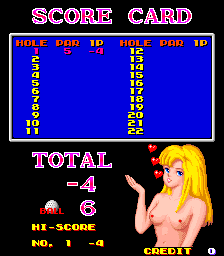

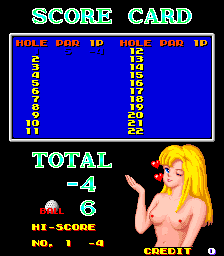

So it seems there was some truth to that "urban legend" after all: there is indeed nudity in the game data, which was probably originally accessible in a location test version and which almost certainly was displayed when achieving a hole-in-one shot, but references to the data have been replaced in the final version.

But wait, there's more...

# Hidden Dev Credits

The first thing that actually caught my eye when I first started disassembling the game was the group of messages at 0x2FBF in the main CPU ROM:

```
2fbf   addr       s__SEE_YOU_AGAIN!_ram_2fc9
                          ; = "     SEE YOU AGAIN!    "
2fc1   addr       s__BYE-BYE!_ram_2fe1
                          ; = "        BYE-BYE!       "
2fc3   addr       s__THANK_YOU!_ram_2ff9
                          ; = "       THANK YOU!      "
2fc5   addr       s__COME_AND_SEE_US_AGAIN!_ram_3011
                          ; = " COME AND SEE US AGAIN!"
2fc7   addr       s__I_LOVE_YOU!_ram_3029
                          ; = "      I LOVE YOU!      "
```

The first four lines are displayed on the game over screen and are implied to be emoted by our young lady who also appears there. The messages change as you progress further through the courses, but the amorous "I Love You!" line is never used. Such a phrase would certainly match the titillating scene I was searching for, so I looked into that first.

It turns out there's a check at 0x2F75 in the main CPU ROM to specifically use the I Love You text:

```
2F72: 21 6F C0 ld   hl,$C06F
2F75: CB 66    bit  4,(hl)
2F77: 28 02    jr   z,$2F7B
2F79: 3E 04    ld   a,$04
2F7B: 21 BF 2F ld   hl,$2FBF
...
```

So it looks like the byte at 0xC06F is the key. If bit 4 is set, we should get the I Love You text! Perhaps the nudity was kept in as an easter egg!

Let's give that a shot...

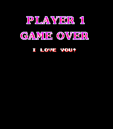

Hmm. We have our text, but the lady has disappeared entirely. Maybe there are other variables that need to be set appropriately as well. So how is bit 4 of 0xC06F set within the game?

I'll spare you the next couple hours of reverse engineering that occurred, as it was basically just a lot of poking the code with the debugger and seeing how it reacts. But the result is this: there is a hidden staff roll within the game, and when that is enabled, our bit 4 on 0xC06F is set.

How to trigger the staff roll? It's surprisingly simple: on the very first course, for the very first shot, let it time out. Then, on course 10, once again on the very first shot, let it time out again. And that's it.

You'll still need to make it through all 22 courses in the game, which will bring you to the usual ending screen.

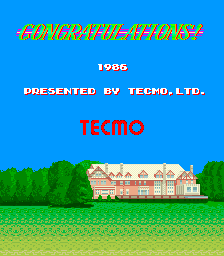

However, after the Tecmo logo scrolls down, the music will change, a couple of small graphics appear on the bottom, and the logo is replaced with staff names scrolling in and out horizontally.

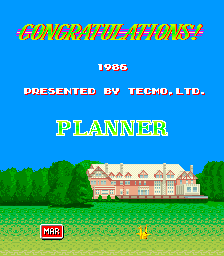

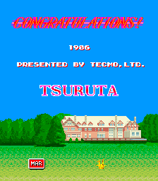

<div class="embeddedContent oembed-provider- oembed-provider-youtube" style="text-align: center;"><iframe allowfullscreen="true" frameborder="0" scrolling="no" src="//www.youtube.com/embed/e8x--WppFlc?wmode=transparent&amp;jqoemcache=KRCcs" title="Tee'd Off - Hidden Staff Credits" width="60%" style="aspect-ratio: 3 / 4"></iframe></div>

One of the graphics at the bottom is an origami crane, and the other is an icon reading MAR. It's unclear what exactly they relate to, but I'm sure they mean something to someone on the staff.

After the credits end, we are shown the game over screen like usual. And look, our I Love You text is there!


... but the girl is still missing, even after we've triggered everything properly. Hmm.

Do you remember the animation pointer table we discussed in the first section? It has eight entries, followed immediately by code and data. The "I Love You" screen above is trying to referenced a ninth entry in this list, which of course doesn't exist. It hits a zero and doesn't display anything.

What does this mean? Something was removed, or it never worked in the first place. Considering we already have proof of nudity being removed and given the nature of the text on this screen, my bet is it was another nude image, likely a variation on one of the existing animations. The code here does not set things up for the floating hearts, so if it was the blowing kiss animation, it wasn't exactly the same as what we have on the score card screen.

We could change the reference to the hole-in-one animation, but it would not be centered on the screen (as the girl normally is on the game over screen). We could copy the existing animation again, reposition it, and move the pointer table somewhere else and add the ninth entry... but that just seems unnecessary work at this point. We don't know *for sure* what this "I Love You" screen displayed, so for us to display any of the girl animations here is no longer restoration but creating something new. That's not really something I'm interested in doing.

Besides, we've restored her in the score card screen, and I think that resolves things pretty thoroughly. So I'm calling the mystery of Tee'd Off's titties resolved.
