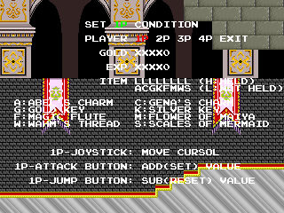
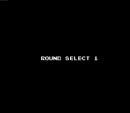
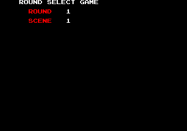
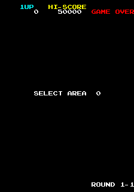
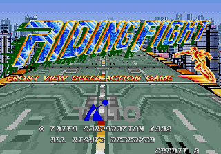
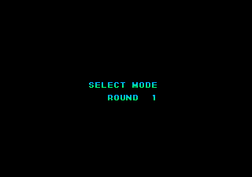
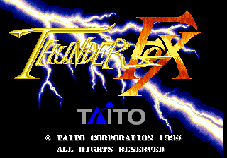
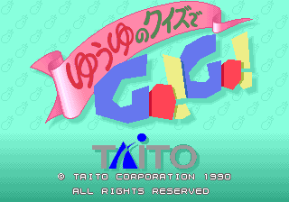

Around 1988, Taito began implementing a standard level select code into many of their arcade games. The code was not available to normal players, as it requires the use of the Service button, inside the cabinet. Considering the timing required to press Start and Service in quick succession, it may not have been for cabinet owners either, but instead for the developers who had direct access to the hardware and who may have had those special buttons mapped to something more accessible for testing.

Indeed, some games have more than just level selects, including basic map or object editors and viewers. Some menus allow you to select level numbers well beyond what actually exist in the game, loading non-existant game data when selected. Some menus are very plain, while others obviously had some work put into them. Besides the obvious bonus of easily exploring the game levels without so much work, the menus themselves are sometimes a fascinating look at the developer's side of the game.

<!--more-->

**The code itself is as follows: hold the Service button while turning on/resetting the system until the Service Switch Error text appears on the screen. Then quickly enter Start, Start, Start, Service, Start (where Start is P1 Start). With the default MAME input mappings, this translates to: with the game loaded, hold 9 and press F3 to reset; when the error text appears, release 9 then press 1, 1, 1, 9, 1.**

On many games the menu appears right away, but on others you may have to insert coin, wait for the startup countdown, pick a player, etc. Also note that on some games (like the ZN-1 hardware games) you don't need to start holding Service until near the end of the startup countdown. Also, some games seem to vary in the speed of input (possibly due to emulation issues or CPU speed?). If it doesn't work, try again a little faster or a little slower.

Actually, I wasn't the [first](https://tcrf.net/The_NewZealand_Story_(Arcade)) to [find](http://www.mameworld.info/ubbthreads/showflat.phpt=&Number=333834&page=0&view=expanded&sb=5&o=&vc=1) this [code](https://tcrf.net/Chuuka_Taisen_(Arcade)), though I did discover it independently [while disassembling Riding Fight](/entry/level-select-in-riding-fight). I assumed it was unique to that game, and only tried it on another Taito game after that on a whim. When that (surprisingly) worked, I tried it on more and more Taito games... and ended up with the list below. I don't think anyone up till now has realized just how widespread the code is.

So far I've identified 71 Taito games that have the code enabled, which made for a pretty expansive list. Whew!

**Enjoy!**

# Akkanbeder / Space Invaders '95

Level select; menu appears immediately after entering the code. P1 Up/Down to select, P1 Start or P1 button 2 to start

# Arabian Magic

Level select; menu appears immediately after entering code. P1 Up/Down to select, any P1 button to start

# Arkanoid Returns

Level select; menu appears after startup countdown. P1 Analog to select, P1 Start to start

# Bubble Bobble II / Bubble Symphony

Level select; menu appears after inserting a coin, pressing start, and selecting a character. Note that the code works for the Bubble Bobble 2 prototype, but the menu text is not displayed.

# Bubble Memories: The Story of Bubble Bobble III

Level select;menu appears after inserting a coin, pressing start, and selecting a mode.

# Cadash

Level select and setup; menu appears after inserting a coin, pressing start, choosing a character and entering your name. After selecting a level, you're given a character setup screen to give yourself gold, experience and items.

# Cameltry

Level select; menu appears after pressing P1 or P2 Start. P1 analog to select, P1 Button 1 to start.

# Champion Wrestler

Level select; menu appears after pressing P1 or P2 Start. P1 Left/Right to select, P1 Start to start.

# Chuuka Taisen

Level select; menu appears immediately after entering code. P1 Up/Down to select, P1 Button 1 to start.

# Cleopatra Fortune

Level select; menu appears immediately after entering code. P1 Up/Down to select, P1 Button 1 to start.

# Command War

Broken level select; menu appears after entering the code. Note that you cannot select anything from the menu; P1 Start will leave the menu and start the game. Note also that this is actually the menu from Riding Fight!

# Crime City

Level select; menu appears immediately after entering code. P1 Left/Right to select round; P1 Up/Down to select scene. P1 Start to start.

# Darius II

Level select; menu appears immediately after entering code. P1 Left/Right to select; P1 Button 1 to start. Works on the triple screen version as well.

# Don Doko Don

Level select; menu appears immediately after entering code. P1 Up/Down to choose round; P1 Left/Right to chooce omote (front) or ura (back). P1 Start to start.

# Enforce

Level select; menu appears immediately after entering the code. P1 Up/Down to select; P1 Start to start.

# Fighting Hawk

Level select; round select text appears in the upper right after entering code. P1 Down to select; P1 Start to start.

# Final Blow

Level select; menu appears after pressing P1 or P2 Start. P1 Left/Right to select; P1 Button 1 to start.

# Flipull / Plotting

Level select; menu appears immediately after entering code. P1 Up/Down to select; P1 Start to start. The code entry seems to be a little finicky; try entering it a bit slower than usual.

# G-Darius

Level Select; menu appears after inserting a coin. P1 Left/Right to select; P1 Start to start.

# Galactic Storm

Level select; menu appears immediately after entering code. P1 Analog Left/Right to select; P1 Start to start. Definitely the most bland level select screen: just the number of the round, nothing more.

# Grid Seeker

Level select; menu appears after inserting a coin and selecting character. P1 Up/Down to select and P1 Start to start.

# Gunbuster

Level select; menu appears immediately after entering code. P1 Up/Down to select' P1 Button 1 to start.

# Go For The Gold / Recordbreaker

Level select and so much more! Menu appears immediately after code. P1 Button 1 / Button 2 to select; P1 Button 3 to start.

# Gun Frontier

Level select; menu appears immediately after entering code. P1 Up/Down to select; P1 Button 1 to start. Doesn't seem to be a way to change the Area...

# Hat Trick Hero / Football Champ

Level select; menu appears immediately after entering code. P1 Up/Down to select, P1 Button 1 to start.

# 

# Hat Trick Hero '93 / Taito Cup Finals

Level select; menu appears immediately after entering code. P1 Up/Down to select, P1 Button 1 to start.

# 

# Hat Trick Hero '94 / International Cup '94

Level select;menu appears immediately after entering code. P1 Up/Down to select, P1 Button 1 to start.

# Hat Trick Hero '95 / Taito Power Goal

Levelselect; menu appears immediately after entering code. P1 Up/Down to select, P1 Button 1 to start.

# Insector X

Level select; menu appears immediately after entering code. P1 Left/Right to select; P1 Button 1 to start.

# Jigoku Meguri / Bonze Adventure

Level select; menu appears after selecting P1 or P2 character.

# Kirameki Star Road

Level select; menu appears right after entering the code. Idling brings you to the Taito screen, then to the P1 or P2 Start screen. I assume, from its name, it's supposed to show the attract mode and demo play. However, because the Service buttons gives you credits, it skips the demo and starts the game. I think anyway.

Play Chr chooses the 'idol' girl for the level. Janru in Janru Way is Japanese for genre (taken from the French pronunciation); it chooses the music genre for that level. Finally Story Demo loads the level, with the cutscene first.

# Kuri Kinton

Level select; appears immediately after entering the code.

# Light Bringer / Dungeon Magic

Level select and screen editor. You'll need to insert a coin after entering the code to make the menu appear. Left / Right changes between Game Mode and Screen Editor. Hold Button 1 + Left / Right to change Round. Start to start the game. All inputs work the same for P1 or P2. Can't figure out how to change Scene...

The Screen Editor is interesting. Only P1 for input. There are two modes, Scroll and Edit. Start switches mode. In Scroll mode hold B1, B2, or B3 and hit Up/Down to scrolls through the PRI, COND, and ZxHI columns, respectively. Moving any direction moves the camera around the map. In Edit mode, B1 cycles through the shapes. Moving any Direction moves that piece on its Y and X axes. I'm not sure what the shapes represent (boundaries?), or if there's any way to test the levels.

# Magical Date / Magical Date EX

Level select and motion editor; menu appears immediately after entering code.

The motion editor also functions as a model viewer. It involves using 2P inputs as well. Haven't really spent the time playing with it to figure everything out, so I leave that to someone else...

# Master of Weapon

Level select; menu appears immediately after entering code. P1 Start to start.

# Majestic Twelve - Space Invaders Part IV / Super Space Invaders '91

Level select; menu appears after pressing P1 or P2 start. Interestingly, the level numbering is different between Japan (left) and World (right)

# Mizubaku Adventure / Liquid Kids

Level select; appears immediately after entering the code. The list goes all the way to Round 60, but note that the higher levels crash the game.

# Mega Blast

Level select; Round Select Ok !! appears immediately, then you will need to choose a player before the menu appears.

# Metal Black

Level select; menu appears immediately after the code. P1 Up/Down to cycle round; P1 Button 1 or Start to start. Note that I can't find a button to change the Area...

# Night Striker

Level select; you'll need to hit Start to bring up the menu. The level select is really cool: it scrolls the level name and plays the mission object cutscene for level as you cycle through them.

# Puchi Carat

Level select; menu appears after system startup. P1 analog changes the Start Line, but I can't figure out how to change the Start Round..

# PuLiRuLa

Level select; menu appears immediately after entering the code.

# Puzzle Bobble

Level select; menu appears after inserting a coin and choosing 1 or 2 player mode. The timing on entering the code seems to be a little sensitive...

# Puzznic

Level select; appears after pressing P1 or P2 Start.

# Quiz Chikyuu Bouei-gun

Level select; the player select screen appears immediately after you enter the code, followed by a short intro, then the Round Select menu.

(The title means Quiz Earth Defense Force, in case you were wondering.)

# Quiz Quest

Level select; menu appears immediately after entering code. P1 Button 1 / Button 2 to select; P1 Start to start. With a helpful stage selection guide!

# Quiz Torimonochou

Level select; menu appears immediately after entering code. P1 Button 1 and Button 2 to cycle through rounds; P1 Start to start. It's a cute select screen.

(The title means Quiz Detective Story, in case you were wondering.)

# Rambo III

Level select; menu appears after warning screen.

# Rastan Saga II / Nastar / Nastar Warrior

Level select; menu appears immediately after entering the code.

# Ray Force / Gunlock

Level select; menu appears immediately after code. P1 Up/Down selects, P1 Start to start.

# Ray Storm

Level select; menu appears immediately after entering code. P1 Left/Right to cycle, P1 B1 to start.

Note that for these ZN-1 hardware games, you only need to start holding Service at the end of the startup countdown.

# Riding Fight

Level select and object viewer/editor; menu appears after warning screen and Taito logo.

The object editor is a mess of unintuitive button combos. Check [my original post on this game](/entry/level-select-in-riding-fight) for more information about the editor.

# Ring Rage

Instead of a level select, a PROG bank checksum list is displayed. The game resets after a couple seconds.

# Solitary Fighter

Level select; menu appears immediately after entering code.

# Space Gun

Level select; menu appears immediately after entering code.

# Special Criminal Investigation

Level select; menu appears after inserting a coin and pressing start. P2 Left/Right selects, P1 Start to start.

# Super Chase - Criminal Termination

Level select; menu appears after pressing Start. P1 Button 3 to select round.

# Super Cup Finals

Level select; menu appears immediately after entering code. P1 Up/Down to select, P1 Button 1 or P1 Start to start.

# Superman

Level select; menu appears after selecting P1 or P2 start.

# Syvalion

Level select; menu appears after selecting P1 or P2 start.

# The NewZealand Story

Level select; menu appears immediately after entering the code. P1 Up/Down to select, P1 Start to start.

# The Ninja Kids

Level select; menu appears immediately after entering code. Note that after selecting a level, it takes you to the character select, but it is graphically broken. You can still select your characters, you just can't see who you're choosing!

# Thunder Fox

Level select; menu appears immediately after entering code.

# Top Landing

Level select; menu appears immediately after entering code. P1 Analog Left/Right to select; P1 Start to start.

# Top Ranking Stars

Level select;menu appears immediately after entering code. P1 Left/Right to select, P1 Button 1 to start.

# Twin Qix

Level select; code appears after inserting a code and choosing single or match play.

# Violence Fight

Level select; menu appears immediately after entering code.

# Warrior Blade - Rastan Saga Episode III

Level select; menu appears immediately after entering code. P1 Left/Right to select, P1 Button 1 to start.

# World Grand Prix

Level select; menu appears immediately after entering code. P1 Button 4 to select; P1 Start to start. P1 Button 3 selects No Hit, which disables running into other riders on the track.

# Yukiwo

Level select; menu appears immediately after entering code.

# Yuuyu no Quiz de GO!GO!

Level select; menu appears immediately after entering code. P1 Button 1 / Button 2 to select; P1 Start to start.
