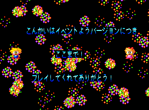
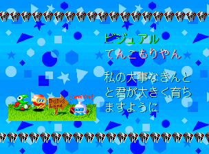

I've been playing around with the MAME debugger recently. I loaded up Tinkle Pit, a cute, simple (at first...) maze game recently and started playing around with altering memory values. I found what appeared to be the value for the current game mode, and began messing with it, and then came across an odd screen...


<!--more-->

**THREE YEARS LATER UPDATE:** This was the first "real" post I made on this site and was the impetus for everything else I've done here since. My discoveries here were very much a product of trial and error and a bit of luck. In the three years since this was posted (almost to the day!), my understanding of the M68k processor and reverse engineering disassemblies in general has improved tremendously, so I've been going back over some of my older posts to make corrections and improvements. And there were definitely many improvements to make here. The article has been entirely rewritten with a bunch of new stuff found. Enjoy!

# Unused Game Modes

The basic structure of the Tinkle Pit code consists of a main loop with a jump to the code for the game's current "mode." The game mode can be things like the Namco logo in the beginning, or the Title Screen, or Attract Mode, or the Ranking Screen, or actual Gameplay, etc. The pointer table for the modes begins at 0xC00786, with 0x2B entries.

The current mode is stored in RAM at 0x310A . Rather than pointing to the index of the pointer table, this value holds the offset of the entry in the table. Since every offset in the table is a long (4 bytes), this means we need to multiply the index we want by 0x4 to get the correct value. For example, if we want to see the game ending, which is the point at index 0x24, we'll need to set 0x310A to (0x24 x 0x4) = 0x90. Most of the games modes actually consist of a pair of entries containing initialization code and loop code. Using the game ending example again, 0x24 is the init code, while 0x25 is the loop code; mode 0x25 is set at the end of 0x24 automatically. As such, while these are two seperate indices in the pointer table, they are functionally the same game mode. It's important to call the init code first so things works properly.

All but three game modes are used. Indices 0x4 and 0x5 were probably an init/loop pair, but now both point to RTS's. Whatever code they once had has been removed. Nothing to be done about that.

But there are a couple more unused modes that have code present...

(For simplicity's sake, we'll reference the mode ID of the init code. The loop code index is that value + 1.)

## Stage Select

Mode 0xC is actually a fully working stage select!


P1 Up/Down scrolls through the available stages, and any player button starts the game. You can scroll past the Final Stage and select later levels, but these look broken and are probably junk rather than older/unused maps. Pressing P1 Left shows a text overlay using dashes/hashes, apparently outlining the stage's collision. P1 Right returns to the main view.

If you hold P2 Up as the game is starting, before the stage select appears, it will start the selection at the FINAL STAGE map. If you continue to hold P2 Up and press a button, it will load the end game cutscene and credits. This also works if you've scrolled through the stage select already: as long as you're holding P2 Up at the Final Stage map, it will load the cutscene/credits instead. There's a small bug here in that the audio is not reset and the music will be in the key of the last map that was shown. Also, when showing the game ending this way, it will display the 1cc Special Credits (which we'll talk about below) instead of the normal credits (because we're loading this from the beginning of the code, so the 'used coins' variable is initialized to zero). Set 0x6089 to any value greater than zero to see the normal credits.

Finally, and least interestingly, there are a couple unused strings in its code: "STAGE SELECT MODE" and "PUSH BUTTON TO START." at 0xC04AEC.

Simply setting the mode in memory while the game is running seems to cause some problems. Instead, here's a MAME cheat to display the stage select right at the beginning, after the memory test. If you're already in the game when you load the cheat, do a soft reset (default is F3 in MAME)

```
  <cheat desc="Enable stage select">
    <script state="on">
      <action>temp0=maincpu.mb@32d</action>
      <action>maincpu.mb@32d=30</action>
    </script>
    <script state="off">
      <action>maincpu.mb@32d=temp0</action>
    </script>
  </cheat>
```

## Event Version screen

The final unused mode is 0x1A, but it in turn calls 0x14, which is not used anywhere else. So technically there are two unused modes in play here. Here's what we see if we set the mode to 0x1A:




It first loads the map for Stage 4-5 (left), though without any enemies or items. The screen shakes, and there is some dissonant 'music' followed by a couple electricity sound effects. After a few seconds, it switches to a black screen with fireworks (right), dancing player characters, and a message that scrolls up from the bottom:


>こんかいはイベントようバージョンにつきここまで！プレイしてくれてありがとう！
>
>"This is as far as you can go for now in this event version! Thank you for playing!"

Quite interesting. It seems there was once an "event version" of the game which ended at Stage 4-5. What that event was remains a mystery, however. My guess it was a trade show of some sort, such as [AOU](https://segaretro.org/AOU_Show).

We can access this easily in a MAME cheat using the same method as the stage select:

```
  <cheat desc="Unused Event Mode screens">
    <script state="on">
      <action>temp0=maincpu.mb@32d</action>
      <action>maincpu.mb@32d=68</action>
    </script>
    <script state="off">
      <action>maincpu.mb@32d=temp0</action>
    </script>
  </cheat>
```

As a protip to anyone else looking to do MAME cheats on Namco NA-1 hardware: the CPU code is really wacky, being loaded at 0xC00000 (with no vector table!). Cheats addressing ROM area are relative to the data itself rather than where the system has it mounted, so they need to be have a base of 0. So, for example, the address above is 0xC032D in the disassembly, but we need to reference it as 0x32D in the cheats.

# 1CC Special Credits

If you clear the game on one coin, you'll get special messages from the devs in the credits. To start with, here are the normal credits:


Simply the names and roles, as well as a hint to 1CC the game. If you manage to do so, the credits change drastically. Each of the staff listed above gets their own screen and a short message. Here they are, with translations:

<div class='imgtrans'>

<div>
<p>Game Design - <a href='https://en.wikipedia.org/wiki/Noise_(company)'>Kenjou Kouji</a></p>
<p>Congrats on the 1 coin clear!!! And thank you! Until we meet again!</p>
</div>
</div>

<div class='imgtrans'>

<div>
<p>Program - Nimura Kaeru</p>
<p>If you clear your mind, you can overcome anything.</p>
<p>[This is a quote attributed to the Zen monk <a href="https://ja.wikipedia.org/wiki/%E5%BF%AB%E5%B7%9D%E7%B4%B9%E5%96%9C" target="_blank">Kaisen Jouki</a>. More literlly, it's "If you clear your mind, even fire is cool to the touch."]</p>
</div>
</div>

<div class='imgtrans'>

<div>
<p>Visual - Kankan</p>
<p>Hello to the elder-- ...Oh wait, he's not coming this time! Wahaha!</p>
</div>
</div>

<div class='imgtrans'>

<div>
<p>Visual - Wasabi Nakajima</p>
<p>I'm so happy that I was able to draw <a href="http://pacman.wikia.com/wiki/Pooka" target="_blank">Pooka</a> that I've loved for so long.</p>
</div>
</div>

<div class='imgtrans'>

<div>
<p>Visual - Angel Misaki</p>
<p>Thank you for everything, Miyuki-chan ❤️</p>
</div>
</div>

<div class='imgtrans'>

<div>
<p>Visual - Perorincho Shunin</p>
<p>See you in Nebulas Ray as well.</p>
</div>
</div>

<div class='imgtrans'>

<div>
<p>Visual - Tenkomoriyan</p>
<p>Praying that my precious Kintoto-kun grows up big</p>
</div>
</div>

<div class='imgtrans'>

<div>
<p>Visual - Enokeso</p>
<p>Now that you've 1cc'ed the game, someone should treat you to a meal or something. Wouldn't that be nice?</p>
</div>
</div>

<div class='imgtrans'>

<div>
<p>Visual - Ecchi Daio</p>
<p>Yo. I'm doing the backgrounds in Nebulas Ray, so take a look! It builds my self-confidence.</p>
</div>
</div>

<div class='imgtrans'>

<div>
<p>Graphics - Hideaki</p>
<p>If you do nothing but play games, you'll turn stupid! Go study!</p>
</div>
</div>

<div class='imgtrans'>

<div>
<p>Graphics - Piropiro</p>
<p>Shoutout to K, Pyonkichi, Chaamii, and Ken-chan!</p>
</div>
</div>

<div class='imgtrans'>

<div>
<p>Sound - Strong Yoshie</p>
<p>Please do something about the static electricity</p>
</div>
</div>


<div class='imgtrans'>

<div>
<p>Special Thanks!</p>
<p>YOU who played through!</p>
<p>VS Development Department Staff</p>
<p>Future Namco games</p>
<p>[This is mostly the same as the normal credits above, but the first line is different. It normally reads "Everyone who played" instead of specifying you directly.]</p>
</div>
</div>

<div class='imgtrans'>

<div>
<p>You've Done It!</p>
<p>Now go put in a High Score Application to <a href="https://ja.wikipedia.org/wiki/%E3%83%9E%E3%82%A4%E3%82%B3%E3%83%B3BASIC%E3%83%9E%E3%82%AC%E3%82%B8%E3%83%B3" target="_blank">BaMaga</a> and <a href="https://en.wikipedia.org/wiki/Gamest" target="_blank">Gamest</a>!</p>
</div>
</div>

Aside from the different credits, it looks like that final spanking image is not used in the normal ending.

This is another one of those things like <a href="/entry/mouja-unused-test-menu-debug-functions-easter-eggs-and-more">the bonus shooting game in Mouja</a> or <a href="/entry/raimais-pause-and-level-select">the hidden ending in Raimais</a> where it's possible that someone has seen this before but the requirements to get to it are hard enough that such people are pretty rare. In any case, I didn't see it documented anywhere in my cursory google searches (though [this site](https://strategywiki.org/wiki/Tinkle_Pit/Final_Battle) has the special credits listed out, but doesn't mention the 1cc requirement, which makes me think it was beaten using savestates and the author didn't realized it was a special ending). Another obscure easter egg brought to light!

# Alternate Copyright


If you set the word value at 0x3642 to non-zero, then here will be an extra copyright on the titlescreen above the usual Namco line:

>©MTJ/TENGEN LTD

MTJ is [Mitsuji Fukio](https://en.wikipedia.org/wiki/Fukio_Mitsuji), creator of Bubble Bobble, who had also worked with Tengen. It's unclear what his role is in Tinkle Pit as his name doesn't appear in the credits, though [according to this page](http://gdri.smspower.org/wiki/index.php/Blog:RIP_Fukio_Mitsuji) it wouldn't be the first time he was uncredited. It's also worth noting that his initials MTJ are one of the ranking name substitutions, changing to Sylvalion, another game he worked on.

The memory location affecting this is set to 0 early in the game's startup code and never changes to anything else, making it seem like a build constant.

I would love to know more about why this is here and what Mitsuji's relationship to the game is, but there's not much to go on...

# Name Entry Substitutions

There are a bunch of text substitutions for the name entry screen when you get a high score, which <a href="/entry/tinkle-pit-name-substitutions">I wrote about in a later post.</a>

I think that finally wraps up Tinkle Pit, three years after I started with it!
