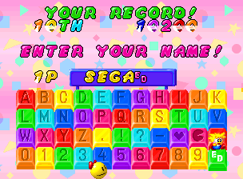
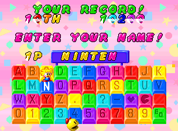
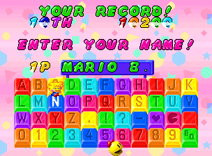
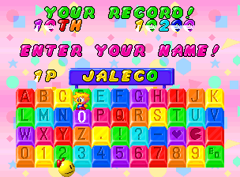
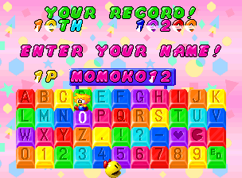

I took a look at Tinkle Pit [a few months back](/entry/tinkle-pit-leftover-demo-screen-and-level-select), and recently I've tried tackling it again to see if I can't get that wonky Level Select working. While I've made some progress with that (maybe?), I also stumbled across some interesting name substitutions in the High Score Entry screen..

<!--more-->

Checking the player input for offensive words is pretty common. Tinkle Pit certainly does that, checking mostly for sexual words and replacing them with "sports" (heh), but it also has a bunch more:












(Forgive the graphics errors; MAME doesn't properly support savestates for the game.)

Yup, the majority of the name substitutions are references to developers and games of that era. Note that you can only input a max of 6 characters, but there are 8 characters allotted to the string on the high score menu, so using some of these secret substitutions gets you a special, longer name on the screen. Here's the full list of substitutions, pulled directly from the code:

|Input:|Becomes:|
|--- |--- |
|SEX|LOVE|
|FUCK|SPORTS|
|OMEKO|SPORTS|
|OMANKO|SPORTS|
|MANKO|SPORTS|
|BOBO|SPORTS|
|PENIS|SPORTS|
|CHINPO|SPORTS|
|INKEI|SPORTS|
|OPPAI|SPORTS|
|KILL|BIRTH|
|CORELA|PENGO|
|BANPRE|ULTRAMAN|
|DENKI|HEIANKYO|
|EAST|SELFEENA|
|NAMCO|PACMAN|
|SEGA|FLICKY|
|SEIBU|K.TAIKUN|
|SETA|P2 P3 P4|
|TAITO|CHACK'N|
|TECNOS|M.MONKEY|
|TOA|PERFORMN|
|TECNON|DRACURA|
|TAD|CABEL|
|CAPCOM|HIGEMARU|
|KONAMI|GATTANG.|
|KANEKO|PCGENJIN|
|SNK|MARVIN'S|
|TECMO|TEHKAN|
|TEHKAN|BOMB JK.|
|DECO|HAMBURG.|
|IREM|LOT-LOT|
|JALECO|[MOMOKO12](/entry/unused-ending-in-momoko-120-1)|
|NMK|BUTA-SAN|
|NICHIB|FRISKY T|
|UPL|PGN.WARS|
|ORCA|SPRINGER|
|OM|GAIKOTSU|
|OHMORI|SPACE G.|
|SUN|PETTAN.P|
|SUCCES|OTHELLO|
|SANRIT|BANK PC.|
|UNIVER|MR.DO!|
|SIGMA|SPIDERS|
|VSYS|HATRIS|
|ATARI|GOTCHA|
|WESTON|WONDER B|
|WILLIA|ROBOTRON|
|WING|YOSAKU&D|
|WOODP|THE DEEP|
|ALPHA|DORACHAN|
|NINTEN|MARIO B.|
|CHUN|TORUNEKO|
|BENT|YAMASITA|
|DEMPA|[BASIC M.](http://ja.wikipedia.org/wiki/%E3%83%9E%E3%82%A4%E3%82%B3%E3%83%B3BASIC%E3%83%9E%E3%82%AC%E3%82%B8%E3%83%B3)|
|SINSEI|GAMEST|
|GAMEST|MARUGEYA|
|MARUGE|COSMOPZL|
|[KENJOH](http://en.wikipedia.org/wiki/Noise_(company))|NICE GUY|
|[MTJ](https://en.wikipedia.org/wiki/Fukio_Mitsuji)|SYVALION|
|SNIMRA|KEROKERO|
|SNIMURA|KEROKERO|
|NIMRA|KEROPPI!|
|NIMURA|KEROPPI!|
|KUMANO|THANKS!|
|SINOBU|NICE GUY|
|KAERU|S.NIMRA|
|SUPPON|TABETAI!|
|FUGU|TABETAI!|
|FUKU|MACHA|
|MINT|JAMIR|
|DRAGOON|DARAGOON|
|GALBOSS|MINIMON|
|WAYAHIME|GUZUTA|
|PUCKMAN|AKABEI|
|PINKY|AOSUKE|
|S.FLAG|MAPPY|
|MUKIES|DIGDUG|
|POOKA|FYGAR|
|DIGDUG|POOKA|
|KEMICK|MOLECK|
|NYAMCO|COSMO|
|LIBBLE|RABBLE|
|MUSHRIN|KAGEKIYO|
|PINO|ACHA|
|BERABOW|BAKUTA|


Towards the end, the developers put their own names in. Apparently someone there was a gourmand (suppon is Chinese soft-shelled turtle, and fugu is puffer fish; the 'tabetai!' they turn into is Japanese for 'I want to eat it!').

[When I initially looked at the game](/entry/tinkle-pit-leftover-demo-screen-and-level-select), I found a leftover 'end of demo' screen. Given it's wording of being at an "event," it indicates to me that the game demo was on display at some kind of trade show (perhaps AOU?). Which makes me wonder if all the game developer references were intended for the attendees of that event, who were probably employees of these other major companies. Maybe I'm over-thinking things, but I think that's a fun explanation.

---

**2018-01-22 Update:** I've since re-written the original Tinkle Pit article and in doing further research I found that I missed a number of name in the list! I've added them above; everything after FUKU/MACHA was missing before.

I also discovered a couple small problems in the code. First of all, there are some player input entries in the list, especially towards the end, which are too big to be put in the name entry. There are only six spaces available for use, yet some are seven or eight characters long. Which means they can never be used. Oops.

However, there ARE eight characters available in the name string. We can see this in some of the substitutions above, such as "NINTEN" being translated to the eight-letter "MARIO B." Since some of the player input entries are greater than six characters, perhaps you were originally allowed to use the full eight?

The second problem is that there are 0x56 entries total in the substitution list above, but the code only checks up to 0x45. Which means the remaining 0x11 entries will never be substituted. Oops.

We can fix both of these problems, though! We'll tell the code the full size of the list and increase the input character limit to eight. We'll even remove the indent so all eight characters fit nicely inside the sign:

```
  <cheat desc="Use full list of name substitutions">
    <script state="on">
      <action>temp0=maincpu.mb@1caf5</action>
      <action>maincpu.mb@1caf5=56</action>
    </script>
    <script state="off">
      <action>maincpu.mb@1caf5=temp0</action>
    </script>
  </cheat>

  <cheat desc="Allow 8 characters in name entry">
    <script state="on">
      <action>temp0=maincpu.mb@1c7b5</action>
      <action>maincpu.mb@1c7b5=8</action>
    </script>
    <script state="run">
      <action>maincpu.pw@60ce=1</action>
    </script>
    <script state="off">
      <action>maincpu.mb@1c7b5=temp0</action>
    </script>
  </cheat>
```

There's one final thing to cover: lazy name substitutions. If you don't feel like entering a name and leave it blank, or fill out all six characters with same letter, it will replace the name with a random selection from a list of 136 Namco games. Here is that list:

```
GEE BEE 
BOMB BEE
GALAXIAN
CUTIE Q 
NABALON 
KAITEI.T
XEVIOUS 
 MAPPY  
BOMB BEE
 S.O.S. 
PACMAN  
PUCKMAN 
KING&BAL
TNK BTLN
RALLY-X 
NEW RLYX
WARPWARP
GALAGA  
BSCNIAN 
DIGDUG  
POLE POS
S.PACMAN
XEVIOUS 
8HOURS 2
PAC&PAL 
POLE P.2
PHOZON  
L.RABBLE
LIBBLE.R
SXEVIOUS
GAPLUS  
T.DRUAGA
PACLAND 
GROBDA  
D.BUSTER
DIGDUG 2
HP.MAPPY
MTRCROSS
BARADUKE
MOTOS   
SKYKID  
SKYKIDDX
TOYPOP  
R.ISHTAR
T.CEPTOR
GENPEI.T
RTHUNDER
TCEPTOR2
WONDERMM
YOUKAI.D
D.SPIRIT
BLAZER  
QUESTER 
PACMANIA
GALAGA88
FINALLAP
WRLDSTDM
ASSAULT 
BERABOW 
MCN.MAZE
BAKUTOTS
ORDYNE  
MTL.HAWK
WD.COURT
SPLATTER
MR.NINJA
FACE OFF
WNG.RUN 
PHELIOS 
ROMPERS 
BLASTOFF
LGD OF W
DIRTFOX 
W.STDM89
FST.HOUR
B.FORCE 
FOURTRAX
W.SUZUKA
DNGRSEED
MARVEL.L
GAL.3   
KYUKAI.D
W.STDM90
FNL.LAP2
D.E.LINK
PISTOL.D
SOUKOBAN
D.SABER 
D.EYES  
R.THNDR2
STEELGUN
ST.BLADE
SOLVALOU
W.RUN 91
S.W.STDM
FNL.LAP3
8 HOURS 
TNKFORCE
STEELGN2
CG.VIDEO
S.W.S.92
QUIZ MAQ
F/A     
CGPUZZLE
KNUCKLE 
K.HEADS 
LUCKY&WD
SW.COURT
GEKITOU 
DRAGOON 
EMERALD.
XEVIGAMP
A.COMBAT
BTROUBLE
GY!GHOST
SCHINESE
ASLTPLUS
QSTR S.E
SIMDRIVE
EXVANIA 
PHANTOMS
F.TENNIS
FSTADIUM
ADV OF W
BTL.CITY
BABEL   
QUEST KI
S.LUSTER
RIDGE R.
GREAT S.
NUMAN A.
X-DAY   
QUIZ TOU
NEBULAS.
CYBER S.
TINKLE P
```

That should cover it. Enjoy abusing the name entry screen!
