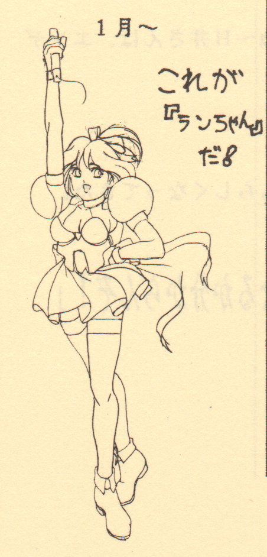
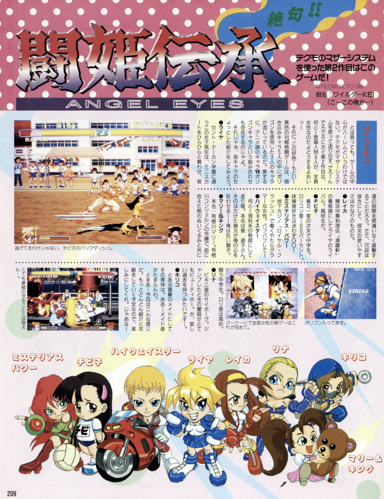
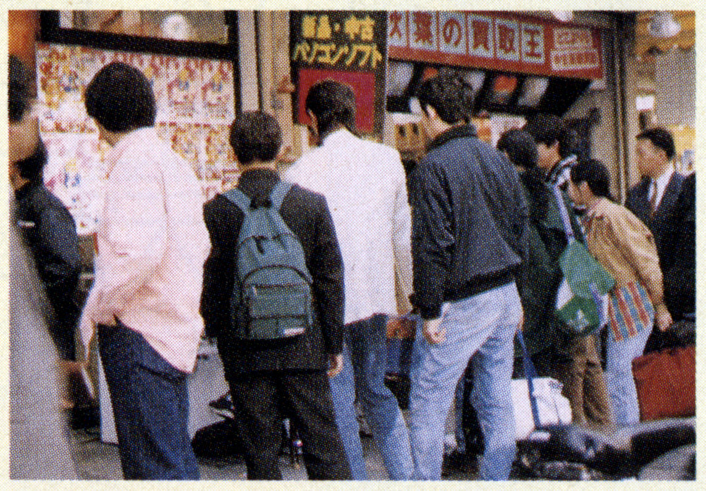
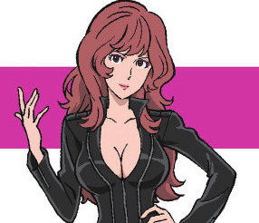
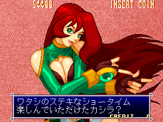
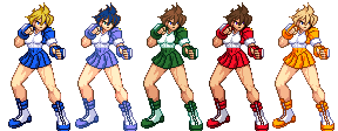
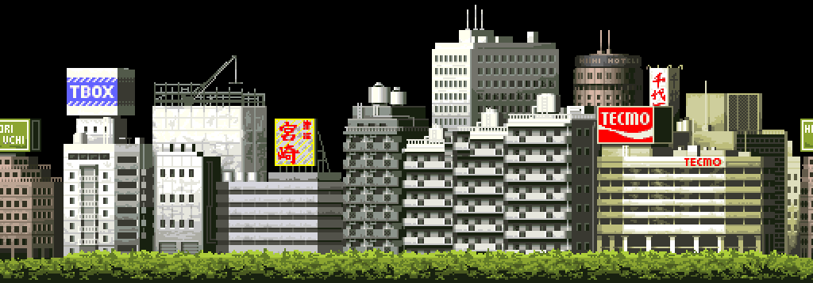

Tōki Denshō may not be the most refined or serious fighting game in the world, but it's quirky and has a unique place in Tecmo history. It's also a miracle that the game even made it to release, suffering during development from an understaffed team, threats and bad ideas from upper management, bad location test results, and the spectre of Dead or Alive that was stealing away the few resources they had.

The details of Tōki Denshō's development were compiled by the game's main planner, Jun, as part of the *Tōki Gentei* dōjinshi. Now, [more than six years after I initially promised it](/entry/touki-denshou), here is a translation and commentary on that development diary.

<!--more-->

This article is divided into two sections: the English translation presented as a readable document along with translation and content footnotes and some accompanying images, and the original Japanese presented (as best as possible) with its original formatting.

Before we dive in, [here is a PDF of a scan of the text](touki_denshou_dev_diary.pdf), including several pages of early character designs and cut characters.

And without further ado, here is the story of Tōki Denshō's development...

# English Translation

The project that faced the most adversity in the history of the world (?)

Tōki Denshō Production History

Note: Star marks ☆ indicate the author's own personal comments. My apologies.

[*And italicized blocks of text in square brackets indicate the translator's notes. My apologies as well.*]

## 1994

### July 22nd

Project Formation (3 teams: Action Team A, Team B, Team C)

Three teams were formed to re-use the program, data and graphics from the cancelled Neo-◯eo game "Ninja Gaiden II" in order to create new fighting games, with each team creating a separate game.

☆ Ohhh! If things had actually gone this way, our company would have released 3 versus fighting games all at once.

[*Throughout the text, the author "censors" the names of other companies and products. This is common in Japanese documents and articles as a way of avoiding copyright infringement and libel and such, whether it's actually necessary or not. I imagine most of these references should be easily guessed by the reader, but in cases where it may be more obscure, I will note the likely intended word.*]

### August

Each team is working is working intently together to come up with ideas.

### September

The teams have decided on a plan together.

They are...

Team A - Ninja Fighting Game

Team B - Fairy Tale Fighting Game

Team C - Horseback Fighting Game

... And we are Action Game Team A.

One day, all the team members were suddenly summoned to the president's office, where the discussion was "Why don't we make a game for [Sega's MODEL 2 hardware](https://segaretro.org/Sega_Model_2)?" I wonder how that will go......

☆Actually, that story goes to a different team. As for what happened... well, those who know already know.

[*Of course, this was the genesis of Dead or Alive, a game that would very soon overshadow Tōki Denshō in most every way.*]

### October

Big changes!

With the basic concept still in place, the characters have changed from "ninjas" to "girls!" (And why is that..? They said "Ninja characters don't have a strong impact, so do something else!" and here we are.)

So the new plan is a "beauty pageant fighting game." The setting will be a contest where women and competing in beauty and strength......

Thus began a period of character creation chaos. All we could do was think about characters. There had to be more than 100 we came up with. I don't know what we're going to do...

Also, it was around this time that Anny, I-i and K-ra joined as graphic artists and began drawing characters.

[*Similar to the censoring of outside companies, surnames of staff are transliterated and shortened to the first letter of its romanization and the last Japanese character. For example, the two names listed above are printed as Ｉ井 and Ｋら.*]

☆For some of those characters, please see the "Rejected Character Gallery."

[*Scans of the Rejected Character Gallery pages appear in the [PDF file](touki_denshou_dev_diary.pdf).*]

### November

We've purchased "Shin Samurai Spirits" as research and development materials. It's been decided that the game will be marketed with an emphasis on "mid-air battle."

It was around this time that the number of staff grew, with planner Neri and programmer M-zaki-kun joining. These two were originally members of the above named "Action Team C."

☆So what happened with Action Team C? Well... exactly what you think.

[*That's certainly vague. My guess is that the Team C project was cancelled pretty early on, perhaps "cannibalized" by the growing influence of Dead or Alive.*]

And as for Action Team B... they made a different game. One with kind of a "deroooon" feeling.

[*That would be [Dero~n Dero Dero](https://en.wikipedia.org/wiki/Tecmo_Stackers)*]

### December

Because we were helping out with other projects, there hasn't been much progress. That's not good.

## 1995

I feel like the project is beginning in earnest from this point.

### January

The basic program is nearly complete, with characters able to be moved around. But since we're unable to do any artwork... the idol singer character "Ran" from the previously mentioned "Ninja Gaiden II" has become our test subject.



Deguchi, who designed Ran, will join our project.

We use scanners to digitize our character animation keyframes, but our company doesn't have many scanners. So we asked them to purchase one for our team... and were flatly denied. We couldn't get them to buy one for us. It seems they don't have very high hopes for our project? Thanks to that, our graphics work is behind schedule.

☆And yet a certain Model 2 project is buying how many ◯ndy machines...?

[*Likely referring to the SGI Indy workstations, which were popular at that time for 3D modeling work. The "Model 2 project" he refers to is, of course, Dead or Alive.*]

### February

Even though we're still using only Ran, it's starting to feel like a real game. Things like registering attacks have been implemented.

The combos and air attacks feel similar to a certain monster fighting game from Ca◯com.

[*Likely referring to the Vampire/Darkstalkers series.*]

### March

The character art has been progressing wonderfully, but we still don't have a complete character. To practice creating data, we've made various techniques for Ran. Things like "Ra◯ing Storm" and "Re◯ken".

[*Likely "Raging Storm" and "Reppuken," special attacks from the Garō Densetsu (Fatal Fury) games.*]

### April

We've begun to say, "Let's start making things outside of the core gameplay!"

But... One of our programmers, M-zaki-kun, was pulled on to a different team. Even though our project doesn't have sufficient staff.

☆As I recall, this is when we began to very rapidly lose people.

### May

For some reason, perhaps because there was no other work for them to look forward to, our project became the focus of the company.

But just like that, things went back to how they were before...

Thanks to the hard work of the graphics staff, our first character is complete!! (Temporarily complete, anyway.)

It's... Highway Star. Not Raiya, actually. But now Ran finally has a companion.

Graphic artist Kubotan joined around this time.

But the creator of Chibiko, H-i, has left the company. Deguchi has taken over for her. Thank you for your hard work.

☆But... Even after leaving, H-i still helped out in various places, such as illustrating the ending.

### June

Finally, temporarily-complete Raiya has been added. It's looking like a real game.

Things changed suddenly from last month, with upper management suddenly announcing, "We don't know what's gonna happen with you guys if this game doesn't sell!" Waaah!

### July

We've finally begun play testing within the company! But, the rating is... not very good.

☆I don't know how many nights I spent at the office while making this game, but... now that I think about it, this was just the beginning.

### August

Everyone's idol (?) Chibiko has finally been added. But the adjustments needed were quite difficult.

(Because Chibiko was the only one without keyframes, in order to keep work efficiency up.)

As we approach the climax, 3 graphic artists were added to the team. M-moto-kun, Y-guchi-kun, and 9-kun.

☆But one person has disappeared, the creator of Mysterious Power, I-i-san. Leaving to "manage a company." Thanks for your work.

### September

Nightmarish September! At last we come to the birth of Lina the Great.

Well, she began as an experiment based on the reasoning of, "wouldn't it be faster to make a model, then animate and render the frames instead of drawing each one by hand?"

When Lina appeared on the screen, everyone's brains went blank. But for some reason, upper management seemed satisfied.

☆Surely our team wasn't treated as some kind of experimental test subject... right? Yeah, it's just my imagination.

### October

Ran has finally disappeared! We were out of space for character data. Thank you for everything! Rest in peace...

We've begun work on "New Mysterious Power"!

The person in charge of MysP was replaced with Kubotan, so she has been renovated with a new design by M-moto-kun.

Around this time, N-mi, who is said to be the top background artist at our company, suddenly joined our team and began work on the background art! Thank you so much.

And we've had our second round of in-house play testing. The rating was... "I guess it's better than last time?" or so.

Aside from that, it seems like there may have been a "Use Kanji In Your Title" declaration from upper management...

☆Our company loves kanji. But we had already decided on "Angel Eyes" as the title... (This became the subtitle.)

One of the suggestions that was floated was "Jonanken"...

[*Jonan translates to "trouble with women," as in trouble arising from romantic escapades or being tricked by a cunning lady. Ken means fist and is used often in fighting games (Tekken, hadōken, etc). So, "Fist of the Trouble with Women" or something like that. Blech.*]

### November

Following the instructions of upper management who were happy with Lina's success (?), Reika, Kiriko, and Angel (the boss character) will be "outsourced" to 3D modeling.

All of the team was shocked, but... this is what it means to be a salaryman. Many said they couldn't stand it or were full of anger.

On the same topic, we'll also be relying on motion capture.

☆There's no way our team was treated as some kind of experimental test subject... right? Yeah, yeah, it's gotta be my imagination. By the way, regarding the motion capture... in the end it wasn't used in this game much at all.

### December

Ah, Marie & King is already moving! (It was actually some time back that it happened...)

But our progress is still not fast enough! Please try your best, Anny! (Not Anii.)

☆But Anny is perfectionist, so they have a considerably difficult time making progress. And yet Marie & King... has the largest number of animations in the game!

[*Not entirely sure about the Anny/Anii thing here. We've established there is a staff member named Anny, appearing in Japanese as アニィ. In his "joke" above, the author says, "Not Anii (アニー)," which is just a very slight change in pronunciation. It's unclear what this is referencing though. It may be ani as in 兄, older brother, something you might hear in various contexts regarding hierarchies (e.g. your boss or sempai). Not sure.*]

Neri, one of our planners, suddenly went to the hospital!! Perhaps he was overcome with fatiue, or maybe...

☆I, one of the other planners (that is, the only other planner) turned white as a sheet... Anyway, I'm glad he was discharged in a little under a month.

As expected, I couldn't take a proper new year's holiday!

## 1996

... Things might get even more tragic from here on out...

### January

The game was actually scheduled to be complete in December but... It's not ready yet! It's about 70% complete?

The project is now facing severe criticisms. We've had many bad experiences...

☆But those details are a company secret!

Speaking of, the size of our staff has once again decreased. K-tani, who worked with the 3D polygonal art, and newcomer Asamin were pulled off to another team.

☆Even though we're already late and have a shortage of help...

At this point, even with all the characters (including the boss) working, everyone is staying the night far too often and is half-dead.

The voice work has now been added. The voice actress group "Peach Angel," who are friends with the staff, came and did the work for us. For such an "extraordinary" payment... Thank you so very much.

☆...The money came out of the staff's pocket. It was just a small amount but... we couldn't come to an agreement. (The company wouldn't provide any funds.)

We were told, "Get one of the female staff to do it!" (This is a common pattern at our company.)

... See? That's how low they think of this game!

I don't know what we would have done if those girls weren't around...

### February

It's been decided that the location test will begin on the 14th and the game will be exhibited at the AOU Show on the 22nd, so we've created the parts outside of the core game (such as the character select).

☆We absolutely do not have enough people! No matter how many times you stay the night, you can't do the impossible~

(By the way, lately I, the writer, have been drinking 2 bottles of Jun◯er every day.)

[*Likely referring to Junker (a word of German origin, pronounced "yoon-ker"), a supplement/energy shot sold in Japan. I slam one when I really need to "lock-in" on a project. Two per day is... excessive.*]

Somehow, we've managed to get a temporary character select, the victory display (the scene that's shown when a round is won), and a temporary opening/ending (which is kind of poor quality?).

The location test began four days late. But...

The income was awful and it was stopped after 3 days.

Waaaah～ (It was probably because the game is still so incomplete.)

☆In one day, it made about 3 to 4,000 yen. To compare, when location testing a Ca◯com versus fighting game, it can bring more than JPY 10,000 to 20,000, even 30,000 yen each day depending on the location.

People are saying "Don't exhibit the game at the AOU show!" but the sales department won't budge and it will be on display. In the popularity contest held at the event by Gamest, the game came in 19th place. That's in spite of the zero advance publicity it has had.

☆Thank you so much to F-kun in the Sales Department, who unwillingly (?) transported the PCB to the event! If you hadn't been there, the game would have disappeared without catching anyone's eye!

We had a look at some of our competitor's games:

◯Ninja Masters ... I'd like to think this is only a five minute game, but...

◯Shinōken ... I don't think we have any competition here. (Sorry for the rude comments.)

◯Waku Waku 7 ... Even at the last show (back in February), it was already so high quality... why hasn't it been released yet? (It's currently November 1996.)

### March

At this point, for various reasons, graphic artist K has left. Waaaah～

In addition, again for various reasons, Y-guchi-kun and 9-kun have also left.

☆K disliked our team (and our whole company for that matter). Thank you all the work you've done till now.

At the beginning of the month, the boss called the whole team together and announced:

"We're shelving it!!"

☆By "shelving it," they mean "we won't offer it for sale." That happens a lot, right? There are many games that have appeared in articles but were never released! (Tōki Denshō hadn't appeared in any publications yet, though.)

☆I thought with this announcement that everyone would lose their motivation... but that wasn't the case.

"Let us finish and polish the game, we'll show you our pride!!"

I was happy that no one gave up. I guess this is what they call "love."

Perhaps out of pity, they've given us one more chance for a location test, on March 14th.

We frantically completed the parts that were not finished. It was around this time that we created the opening, which was strongly influenced by a certain anime. In "perfect synchronization" with the music, we completed all of it in two full days and nights without sleep.

And we worked on the endings at the same time! On weekdays we'd come up with ideas, then the design team would mobilize to color them.

☆We were spending the night at the office every day at this point. Actually, since January, I had lost all sense of "days of the week." There were only "normal days" and "New E◯angelion episode days". Those were the days I returned home.

[*Indeed, the "certain anime" referenced a couple paragraphs back is Neon Genesis Evangelion which had begun its original broadcast run in 1995 and was ending around this time in March 1996. The opening of Tōki Denshō does bear a certain resemblance to the Evangelion opening with its use of quick flashes of full screen images. The mention of working in perfect synchronization with music is likely a reference to [episode 9 of the series](https://en.wikipedia.org/wiki/Both_of_You,_Dance_Like_You_Want_to_Win!). This illustrates just how big of an impact that anime series had on the otaku types of the era.*]

Even though we were once again late by five days, the location test began on March 19th. Since it looks like it's being shelved anyway, this is our farewell to the game...

But we did everything that was asked of us, so we have no regrets!

And then...

### April

The location test is still going on! What a surprise!

I don't know what happened, but it seems to be making reasonable income.

(8,000 to 15,000 yen in a day)

It even seems like our company is leaning towards releasing it after all.

It was a surprise to hear our hard-headed bosses to say something like, "Maybe an all-girl game will sell after all."

Some people even said, "Our company is New Wave!"

☆And yet, within the company, it felt like it was only our staff that believed it could sell.

☆Oh, and also a huge thanks to everyone throughout the country who came to play the location test (especially those who came from Kagurazaka)!! It was thanks to everyone who came and inserted coins that allowed the game to see the light of day and this book to be produced. We are truly grateful!!

We had our first interview with Gamest and the article was published. The game was treated very much as a second-class product.

☆They actually came to interview for a different game. It was for THAT game, THAT one.



[*"That game" is once again Dead or Alive. Here is the first preview of the game from GAMEST #170, 1996 May 15. It is one page only... and immediately following it is a four page special preview for Dead or Alive. Tōki Denshō would appear as a preview a couple more times (GAMEST #171, #173) but it was clear that the publications were far more excited for DoA.*]

And after the completion of adjustments based on the players... On April 10th, it was finally "project dissolution day." (It was decided suddenly!)

☆I would like to really, really thank all the staff for their hard work. As I was writing this chronology, I became quite sentimental.

### May

Location testing outside of our company's game cenetrs has begun. Places like Carrot and GiGO and other famous places.



[*One of the public Tōki Denshō location tests, taking place in front of Messe Sanoh in Akihabara, from GAMEST #173, 1996 June 30.*]

Income here was 20,000 to 30,000 yen, a huge surprise! Thank you so much, everyone.

☆They decided to finally put the game on sale! It was a real "Dreamy Days" feeling.

[*"Yume no You na Hibi" (Dreamy Days) is in quotes, so its likely a song reference. Though there is a song by superstar rock band B'z with that title, it wasn't released until 1999 while the Tōki Gentei dōjinshi was released in late 1996. It is possibly a reference to the B-side of the only single released by the obscure, otaku-oriented idol unit FEEL, who starred in the Sega Saturn exclusive [Omakase! Sabers](https://www.youtube.com/watch?v=Bs3tmLYlHvU). Yes, this is an extremely long and over-researched footnote for a throwaway line.*]

It will be released on June 6th! Though the first 800 copies of the initial production run were sold out before the release date. Thank you, sales department! And thank you, GAMEST (for publishing that article)!

(The End)

And now... the bonus section!

## A Revelation of Secrets

I'll tell you some secret stories from the development period.

### It was all just an afterthought!?

Actually, the whole "angels posessing humans" was something I came up with quickly as we were making the opening. How irresponsible is that? But we had decided on the title long before that...

Some other story ideas we had:

- An alien invasion storyline (The polygon based characters had been hit with a "polygon beam" and were being controlled by the aliens)
- Everyone is actually a spy storyline (All agents from major countries)
- A video game world storyline (polygon characters bs anime characters)
- Invasion of the Robo-Angels

[*Literally any of these would have been better than what they ended up with, IMHO.*]

Something else that was pretty crazy was the "character backgrounds"!! We had decided on practically nothing. (We basically had only the personalities and relationships decided.) We finally planned that out... when we made the opening!

The opening is "Let's show the daily lives of the girls!" so the CG team came up with their own ideas and... we got what we got.

So it was all decided then, that Chibiko was poor, Marie was very rich (though this was kind of already decided), Lina was a hitman, Reika was a Chinese restaurant waitress, Michiko was a teacher and Fujiko was a card dealer.

And the greatest of them all... the animal-loving maid Kiriko.

I had originally gone with the concept of "ruthless killing machine" and wrote her victory lines around that, but... due to artist Kubotan's powerful love for "maids and girls with glasses," we changed it.

I really had decided on her victory lines before that~ (I was sad to see that several magazines comments that Kiriko's lines and such were strange.)

### Goodbye Chibiko-chan and Hello Fu~jiko-chan

There was a certain person in upper management who made a big deal about the type of girl he preferred.

One day, when that person saw Chibiko, he said, "This kind of character is no good! There's no way she'd be popular!" and tried to have her removed. "She's already nearly complete," I said and managed to escape, but it was a close call.

When he saw our "wooden sword wielding bad-girl character," we were told, "No good! Do it over!" The character was reborn as "Mysterious Power" in the style of American comics. And why did we do that?

When he saw her humongous boobs swaying, he was in ecstacy and said

"Yes, this is it! Fu~jiko-chan!"

He was so pleased that she became "Fujiko-chan."




[*This is almost certainly a reference to the famously well-endowed Mine Fujiko from the Lupin III series.*]

### America is the land of ninjas!

At first, there were no "kunoichi" in the game, but then a big shot said, "Get a female ninja in there!"

The idea was this: our company has the hit game Ninja Ryūkenden (called Ninja Gaiden overseas), so let's put a kunoichi as the main character and sell it as the sequel! We'll call it "Lady Ninja Gaiden!"

... Well that idea disappeared before we knew it.

Incidently, I'm sure they had no idea their "kunoichi" would become a "maid" in the end.

### It almost became another "FI○T"!?

Here's another one from the bosses: "How about we add one or two male characters for impact?"

... That went nowhere, thankfully.

[*The reference here is likely to [FIST](https://supercombo.gg/2022/08/14/pretty-fighter-and-its-shockingly-longer-than-one-game-series/), the kind-of sort-of sequel to the Pretty Fighter games. While Pretty Fighter, as the name implies, featured an all-female roster, FIST shook things up by adding some male characters. It was not a good decision. Thanks to [Zerochan](http://gaming.moe/) and her [encyclopedic knowledge of kusogee](https://bsky.app/profile/devilrei.bsky.social/post/3ligkwysqhk2n) for pointing out the reference.*]

### That’s right, no connection at all

Kiriko’s real name is “Kasumi Kiriko,” and though she is looking for her long lost brother, there is absolutely no connection to the kunoichi who loves mille feulle (which I happen to love as well) from a certain other game from our company.

Furthermore, while Reika’s real name is read as “Lei Fang,” I’m sorry to say there is no relation to the Chinese woman tracking down a man, who appears in that certain other game from our company.

[*References to Dead or Alive, of course. The DoA character profiles describe strawberry millefeulle as Kasumi’s favorite food, and the original storyline for Lei Fang is basically her tracking down Jann Lee from China in order to defeat him.*]

### "Chibi" is just a pattern, just a pattern!

Tōki Denshō was actually available in Korea and Hong Kong. Have a look for it next time you travel there.

And as for the Korean version, there is a hard and fast rule in that country: "No Japanese text, songs, etc. allowed."

(Have a look at SF ZERO Alpha sometime. Not a single Japanese character anywhere, right?)

[*Another example: [Makoto's regional changes in Mach Breakers](/entry/mach-breakers-all-sorts-of-debug-tools/#makoto-regional-changes)*]

I mean, Japan did do some pretty terrible things to the Koreans during the war, so it's natural that they'd hold a grudge but... isn't it about time to move on?

So I thought I removed every trace of Japanese from the game for the Korean version, but...

Chibiko's name is written on her shirt.

That is burned in to the graphics ROM, so there's really no way to take it out. (Don't get me started on the technical details.)

"The fastest solution is to just remove Chibiko," was one solution, but in the end we said:

"That's just a pattern on her shirt. Not text, just a pattern!"

And it cleared customs without any issues. Man, we really just barely manage to get by in this world sometimes.

### When you think of girls you think of "Toki○ki"!

There was feature article in a certain Famicom magazine that said:

"They should they put 'To○meki' in the title of that fighting game in development right now."

Fighting game? Huh? ... Do they mean our game?

"Tokime○ Tōki Denshō" ... Hmm?

"Toki○ki Angel Eyes" has a nice ring to it, yeah?

[*They are referencing the king (queen?) of classic dating sims, [Tokimeki Memorial](https://en.wikipedia.org/wiki/Tokimeki_Memorial).*]

### It's not exactly "Something-Something '96"

This game has lots of "parody," or you might say "fun" in it. It's really quite casual.

[*Which means the title of this section is likely referencing the super serious "KOF '96".*]

But we've received many letters saying "This is a reference to ○○, isn't it?" Thank you for those messages.

How many have you noticed?

- The opening was inspired by the opening of a certain famous anime WHOSE MOVIE YOU CAN'T PURCHASE AN ADVANCE TICKET FOR.

[*As we discussed earlier, it's Evangelion. I guess they didn't allow pre-purchase of tickets for the movies.*]

- The five colors of Raiya's costumes... are from a certain Sailor something-something.



[*Referencing Bishōjo Senshi Sailor Moon. The Sailor Mercury colors are a little off, but close enough I guess.*]

- If you abbreviate the first two words of Highway Star's "Attack Trance Field" in English... it comes out like "AT Field".

[*Another Evangelion reference.*]

- MysP's finger snap is a reference to The Fabulous Fitzcarraldo. (Have you heard of it?) It is not referencing Paul Maki.

[*Fabulous Fitzcarraldo/Fitzgerald is a character from the 1995 Giant Robo OVA [who can apparently slice enemies in half by snapping his fingers](https://www.youtube.com/watch?v=mG-SJhVem3k). Paul Maki was a comedian of middling fame, known his bit where [he snaps 100 times in a short period of time](https://www.youtube.com/watch?v=q90v2G4UzaA). Several [other examples](https://www.youtube.com/results?search_query=%E3%83%9D%E3%83%BC%E3%83%AB%E7%89%A7) available on Youtube. Yeah, I had to look these up.*]

I think that covers it.

Bonus Section #2

## The Men who Made the Tōki

No, not the manga from a certain magazine. I will introduce the game's staff.

[*A pretty vague reference. There are several manga that have titles like "The Men who Made/Built/Created the \[thing\]"...*]

We were understaffed. Roughly 12 people at any given time.

Can a commercially viable fighting game be made from scratch in (just over) one year? What do you think, huh Ca○com?! S○K?! (I'm actually really jealous of them, yeah...)

### The staff who made it safely (?) to the end:

Program:

- Mr. M-da - Sometyhing like the leader. Thanks for your hard work.

- Shegchi~ - Mainly in charge of the game content. My specification document was kind of crap, so he ended up with a lot of work thanks to me.

Planning:

- Neri - Primarily in charge of character data. Please don't go back to the hospital again.

- Jun - Primaily in charge of everything outside of the game itself. That would be me. Had a record of working 54 days straight in the office!

CG:

DEGUCHI - Mainly in charge of Chibiko and Highway Star. Also the opening animation artwork. All the illustrations for magazines and such are by him.

Kubotan - Mainly in charge of Mysterious Power. Also responsible for the way Kiriko turned out.

Anny - Primarily in charge of Marie & King. A super hard worker with the number one record for staying overnight at the office. Quit the company when the game was completed (for various reasons...)

M-moto - In charge of all the visuals and the finishing touches on Raiya. Also worked on MysP and all the polygon character designs, to name a few. Quite a hard worker. Quit the company when the game was complete.

Sound:

T-hashi - From sound effects to background music, he did it all! I'm sorry for all the pressure put on you~

### Others who contributed:

CG:

Mr. H-da, Mr. M-mae, Mr. Y-da, Mr. T-hashi - All members of the design team. They helped us with many visuals in the game, including the ending, thought did not have to do so. Thank you all so much.

Mr. N-mi - One of the best background artists at our company. So very grateful for his work in creating all the stages within a 3 month period.

Mr. K-be - Only with us for about 2 months, but helped finish Marie/King and created options (like hit marks). Thank you very much.

Sound:

Mr. H-oka - Even though you were so busy, thank you for contributing a BGM track.

Voice Actresses:

Everyone from Peach Angel - I don't know how to express my gratitude to you for doing such a great job for such a small amount of money, no matter how much you are friends with the staff. I hope a lot of work comes your way. Keep it up.

### Those who made it about half way:

Program:

Mr. M-zaki - An outstanding programmer, so he was pulled over to work on something else. (But congratulations on the release of your masterpiece)

Planning: (or rather, related to 3D graphics, which is why they were pulled over to that other project.)

Mr. K-dani - In charge of all 3D characters except Lina.

ASAMIN - Primarily worked on Lina, but also did some adjustments for other polygonal characters.

CG: (quite a few people here!)

H-i - Creator of Chibiko

I-i - Worked on the former Mysterious Power

K - In charge of the drawings of Raiya. And there was one other character...

[*Probably referencing the cut "9th Tōki" that we discussed in [the first article](/entry/touki-denshou).*]

Y-guchi - In charge of the victory screens. Exactly when you'd expect from a former animator?

9 - In charge of the characters in the background. How are you doing?

Everyone had their own circumstances to deal with. Thank you all for your work.

### Those who got in our way:

??? - Of course I can't write their names, but there were number of them, huh?

## Final Thoughts...

Making a game is hard work. Really hard!

Before I joined the company, I was making what is called "dōjin software." 

I don't want to forget the joy I felt seeing the various people who came to play what we made and receiving comments and feedback. In the end... I'm glad I chose this career.

There were times when I couldn't return home and my body was in rough shape and I would think "I gotta get out of here!" and "I want to quit this job"...

But as I look on those days, I feel they were actually enjoyable and fulfilling.

I guess I'll just keep on with what I've been doing~

... So don't think, "Wow, I don't think I'll work in the games industry after all" after reading this timeline. I'm sure it will turn out good.

So long.

Tōki Denshō Staff, Planner: Jun

# Staff Names

The various staff names are censored throughout the document, but we can take an educated guess at a few of them. For two of them, we're lucky to have the full name:

 - Ｍ崎 - [Miyazaki Eigo (宮崎英悟)](https://w.atwiki.jp/game_staff/pages/797.html), listed as a programmer on both TD and Dead or Alive.
 - Ｎ美 - [Niimi Hideki (新美秀樹)](https://w.atwiki.jp/game_staff/pages/632.html), listed as graphic artist for TD and stage texture artist for DoA

Some others we can pair with the credits:

 - Ｈ田 - Likely HARADA from the Artworks credits
 - Ｍ本 - Likely MATSUMOTO from the Graphicers credits
 - Ｍ前 - Likely MIYAMAE from the Artworks credits
 - Ｙ田 - Likely YAMADA from the Artworks credits
 - アニィ - Anny from the Graphicers credits

And while we're on the topic of names...

On Chibiko's school stage, in the far background is a city skyline. If we look closely at the text on these buildings...



We have some names! Starting on the right side, TECMO is obvious, and looking behind that we have 千代 *Chiyo*, possibly short for 千代田 *Chiyoda*, a neightborhood of Tokyo where the Tecmo headquarters were located. Though the line peeking up for the third kanji doesn't seem to match for 田, so not really sure here.

Above and to the left of that, is Niimi Hotel, which is a bit hard to see with the dark gray color. This is the artist listed above, Niimi Hideki, sneaking his name into his own artwork. To the left towards the center of the image, we have 宮崎 *Miyazaki*, which is teh programmer Miyazaki Eigo, also listed above.

Further to the left, we have a couple of mysteries: TBOX and Horiuchi. TBOX is clearly a nickname, and I can't find anything that would line up with Horiuchi...

# Japanese with original layout

Being a product of its time, the typesetting for the document is charmingly old-school. I've preserved the layout here as best as I can, except for things like font size changes. Therefore I recommend reading along with [the scanned document](touki_denshou_dev_diary.pdf) for the full effect.

Note that this was typed by hand and there may be a typo here or there. Corrections are appreciated.

```
史上最強？の逆境プロジェクト
闘姫伝承（とうきでんしょう）
製作年表

注）☆印は作者の勝手なコメントです。あしからず。

<９４年＞
７／２２
プロジェクト結成（アクションＡ班、Ｂ班、Ｃ班の３班）
発売が見送られたネオ◯オ用アクションゲーム「忍者外伝Ⅱ」のプログラム、
データ、ＣＧを流用することによって、格闘ゲームを製作するということで３
つの班が結成され、各々が別のゲームを作ることとなった。

☆おおおぉぉ～！これが実行されていたら、一気に３つもの対戦格闘ゲームが
　我が社から発売したんですね～

８月～
各班共に、ただひたすら企画の検討。

９月～
各班共に企画が決定。
それぞれ……
Ａ班　　忍者格闘
Ｂ班　　メルヘン格闘
Ｃ班　　騎乗格闘　　　　　　　　　となった。

……そして我々は、アクションＡ班でした。

ある日突然、班員全員が社長室に呼ばれて、セガ「ＭＯＤＥＬ２」基板でゲー
ムを作らないか？という話が。一体どうなることやら……

☆実はこの話は他の班へと引き継がれます。どうなったかは……分かる方だけ
　分かって下さいね。

１０月～
路線変更！
基本コンセプトはそのままで、キャラクタを『忍者』から『女の子』に変更！
（なんでだろ……忍者のキャラがインパクトが弱いので、他のものを！と言う
ことで話し合ったらこうなっていたのでした）

ちなみにこの頃の企画は『ミスコン格闘』でした。女性の美しさと強さを競う
コンテスト、という設定で……

そしてキャラクタ混乱期。ただひたすらにキャラが考えられた。その数は総数
１００は下らないだろう。どうなってしまうのか……
なお、この頃よりアニィ、Ｉ井、ＫらのＣＧスタッフがプロジェクトに加わり
キャラクタを描き始めた。

☆その一部は、その本の『ボツキャラギャラリー』でご覧下さい。

１１月～
開発資料と称して『真侍魂』を購入してやったりしてました。
この頃から『空中戦』を売りとするゲーム性が決まってきた。

この頃スタッフが増えました。企画のＮｅｒｉ氏と、プログラマーのＭ崎君。
この二人は上記の「アクションＣ班」のスタッフでした。

☆じゃあ「アクションＣ班」はどうなったんでしょうね？それは……あなたの
　ご想像の通りです。
　ちなみに「アクションＢ班」はというと……別のゲームになってました。で
　ろ～んな感じです。

１２月～
他のプロジェクトのお手伝いとかで、なかなか進まないです。こまったもんだ

＜９５年＞
ここからプロジェクト本格始動、って感じです。

１月～
基本プログラムはかなり完成してきたので、キャラクタを動かすことに。でも
絵はできていないので……例の『忍者外伝Ⅱ』のキャラクタである『ラン』と
いうアイドル歌手に実験体になってもらうことになりました。

この『ラン』をデザインしたＤＥＧＵＣＨＩ、プロジェクトに加わる。

キャラのアニメ原画をＣＧにするのにスキャナを使用するのですが、我が社に
はスキャナがあんまりない。そこで我が班専用のスキャナ購入を希望して……
敗れ去った。買ってもらえなかったのでした。あまり期待されていないのでし
ょうか？おかげで絵の作業が遅れます。

☆某ＭＯＤＥＬ２プロジェクトは◯ンディとか何台も買っているのに……

２月～
未だにキャラクタは『ラン』のみですが、かなりゲームらしい感じになりまし
た。攻撃判定などもついたし。
連続技や空中戦の感じが、某カ◯コン社のモンスター格闘に近かったです。

３月～
キャラクタの絵の方も結構進んできましたが、まだ完成したキャラはなかった
ので、データ作成の練習で『ラン』にいろいろな技を作ってみました。『レ◯
ジング・ストーム』とか、『烈◯拳』とか……

４月～
そろそろゲーム外の作成も始めましょう！ってことで始めました。
でも……プログラマの１人、Ｍ崎君が他の班引き抜かれてしました。結構頭
数が少ないのに、このプロジェクトは。

☆思えばこれが「どんどん人数減少」の始まりでした。

５月～
他に期待作がなかったのか、なぜか突然会社の注目プロジェクトになりました
一瞬で元の扱いに戻ったけど……

ＣＧスタッフの努力により、ついに１体目のキャラクタが完成！！（仮完成な
んですけど）
それは……『ハイウェイ・スター』でした。『ライヤ』じゃないの。でもこれ
でついに『ラン』にも仲間ができましたね。

ＣＧクボタンこの頃加入。

しかし、『ちび子』生みの親、Ｈ井が会社去りました。ＤＥＧＵＣＨＩが後
を引き継ぎました。おつかれさまでした。

☆でも……この後もいろんな所で協力してくれましたね～Ｈ井さんは。エンデ
ィングの絵を描いてるし。

６月～
ついに『ライヤ』の仮完成Ｖｅｒも入りました。ゲームらしくなってきた。

先月とうってかわって、突然上層部より
「このゲームが売れなかったら、お前達その後はどうなるか分からんぞ！」
宣言をされた。とほほ～

７月～
ついに初の社内テストプレイ開始！でも、その時の評価は……今一つでした。

☆これ作るのに、何日も会社に泊まったんだけど……今思えばこの頃は『序の
口』でした。

８月～
ついにみんなのアイドル？『ちび子』が入りました。でも調整が大変なのさ～
（作業効率ＵＰの為、ちび子だけ原画がないから）

そろそろ佳境になってきたんで、ＣＧスタッフが３人追加になりました。Ｍ本
くんと、Ｙ口くんと、９くん。

☆でも１人いなくなちゃったんだよね。ミステリアスパワーを描いていたＩ
　井さんが。「会社の都合」ってヤツで。ごくろうさまでした

９月～
悪夢の９月！ついにあの『リナ』様の誕生です。
まあ、理由としてはいちいち絵を描くよりも、モデルを作って、動きを作って
レンダリングした方が絵の完成が早いのではないか？ということの実験からな
んですが……

リナが画面に表示されるなり、みんな脳味噌が真っ白になりました。なぜか上
層部の方は満足そうでしたが。

☆なんか、どっかの班の実験台でやらされたようなことは……きっとないだろ
う。気のせいだ、ウンウン。

１０月～
ついに『ラン』消える！キャラクタデータ用の容量が足りなくなってきたのだ
今までありがとう！安らかにお休み下さい……

『Ｎｅｗミステリアスパワー』作成開始！
ミスＰの担当者がクボタンに代わったので、Ｍ本くんのデザインによってリニ
ュアルされました。

この頃から背景も、急きょ当班に入ってもらった、社内一の背景名人と言われ
るＮ美氏の手によって作成開始！どうもありがとうございました。

それで、第２回社内テストプレイもやりました。評価は……前回よりはよかっ
たかな？ってレベルでした。

他にはこの頃、上層部からの
「タイトルは漢字にしろ宣言」
があったようななかったような……
☆漢字が好きなんです、ウチの会社。もうタイトルはこのころには『ＡＮ
ＧＥＬ　ＥＹＥＳ』って決まってたのに……（これはサブタイトルになりま
した）
候補として『女難拳』なんてのが挙がってたような気が……

１１月～
『リナ』の成功？に気を良くした上層部の指示により。『レイカ』、『キリコ
『エンジェル（ボスキャラ）』のモデルを外注しました。
スタッフ一同あきれる所ですが……これがサラリーマンと言うものです。
やりきれない人や、怒りに満ちた人も多数出現しました。

ついで？に話題の「モーションキャプチャー」も依頼しました。

☆やっぱり、どっかの班の実験台でやらされたようなことは……きっとないだ
　ろう。ないない、気のせいだ、そうなんだったら。
　ちなみに、そのモーションキャプチャーは……結果的にはこのゲームではあ
　んまり使われておりません、はい。

１２月～
あっ、いつのまにか『マリキン』が動いてる！（ホントはもっと前からいた
んですけど……）
でもまだ作業進行度は今一つ！頑張って下さい、アニィ！（アニーではない）

☆でもアニーはこだわりやさんなので、なかなか次へ進まないのだ。しかもマ
　リキンは……このゲーム中最大のアニメ枚数なのです！

企画のＮｅri氏、突如入院！！
疲れが貯まりすぎたのか、それとも……

☆もう１人（しかいない）の企画だった私は真っ青になってしまいました……
　１カ月足らず退院したからよかったけど。

やっぱりまともな年未・年始は迎えら
れませんでした！

＜９６年＞
……ここからが今までに輪をかけて悲惨なのかな……

１月～
ホントは１２月一杯（１年間）で完成の予定が……まだできていません！完成
度は７０％程度か？

このころから当プロジェクトへの風当たりが超強くなりました。いろいろ酷い
目にあったもんだ……

☆でも詳細は企業秘密です！

そういえば、またスタッフが減りました。３Ｄ関連（ポリゴンです）関連のお
仕事をしていたＫ谷氏と、新人のＡＳＡＭＩＮ。またどっかの班に引き抜かれま
した。

☆ただでさえ遅れていて、人手が足りないと言うのに……

この頃はもう全キャラ（ボスもね）動いていたんだけで、みんなお泊まりしす
ぎで半分死んでました。

そしてついに声が入りました。スタッフの友人である、
『ピーチ・エンジェル』
っていう声優さんのグループがやってくれました。超破格の仕事料……本当
にありがとうございました。

☆……このお金は、スタッフが自前で出しました。ほんの僅かなお金なんだけ
　ど……稟議が降りなかった（会社が出してくれなかった）のだ。
　「女性社員でやれ！（我が社はこのパターンが多い）」といわれたけど…
	…ねぇ？こういうゲームなんだから！
	本当に彼女らがいなかったらどうなっていたことやら……

２月～
１４日からロケテスト、２２日からのＡＯＵショーの出展が決まったので、
それに合わせてゲーム外（キャラクタセレクトとかね……）を作りました。

☆絶対に頭数が足りないよ～！どんなに泊まったって、無理なものは無理～
　（ちなみにこれを書いている私は、この頃毎日２本のユン◯ルを飲みまし
　た……）

なんとか、仮のキャラクタセレクト、勝利ディスプ（勝利時の演出のことです
仮OP・ED（ちょっとお粗末なデキかな？）を作りました。

ロケテスト、４日遅れて始めました。でも……
インカムが悪くて、３日で打ち切られました。
とほほ～（やはりまだ『完成度』が低かったせいかも）

☆１日に３～４,０００円でした。ちなみに某カ◯コン社の対戦格闘ゲームが
　ロケテを行うと、１日１０,０００～２０,０００円、場所によっては３０
　０００円以上行くところもあります。

「AOUシューの出展をやめろ！」
という話もあったんだけど、販売部のオシでなんとか出展、『ゲーメスト』が
会場で行った人気投票では、最高１９位まで入りました。前宣伝ゼロだったの
にもかかわらず……

☆会場に基板を無理やり？運んでくれた、販売部のＦくん、本当にどうもあり
　がとう！貴方がいなければ、このゲームは人の目に触れずに消えたことでし
　ょう！

このころ、我々が勝手にライバル視していたゲームは以下のゲームです。

　　　　◯ニンジャマスターズ　　　……　　５分の勝負であったと思いたい、
　　　　　　　　　　　　　　　　　　　　思いたいけど……
　　　　◯神皇拳　　　　　　　　　……　　これには勝てたかな？（失礼な発
　　　　　　　　　　　　　　　　　　　　言をお許し下さい）
　　　　◯わくわく７　　　　　　　……　　この時（２月）のショーでもなか
　　　　　　　　　　　　　　　　　　　　なかのデキだったのに……なんで
　　　　　　　　　　　　　　　　　　　　まだ出てないの？（９６年１１月
　　　　　　　　　　　　　　　　　　　　現在）
３月～
ここに来て、諸事情でのCGのK氏がいなくなってしまいました。とほほ～
他にも、これまた諸事情でY口くんと９くんもいなくなりました～

☆K氏は以前からウチの班（引いては当社）いやがってたもんね。みなさんい
　ままでどうも御疲れ様でした。

月始めにスタッフ一同、課長に呼ばれて言われてしまった。

『オクラ入り宣言』！！

☆「オクラ入り」ってのは「発売しないよ～」ってことなんです。今までにも
　たくさんあったでしょ？本には記事が掲載されたけど、発売しなかった数々
　のゲームが！（闘姫はこの頃はまだ、本に掲載されてないけど）

☆この宣言で、みんなやる気なくすと思ったのに……そうじゃなかったですね
　「立派にゲームを完成させて、
　　俺達の意地をみせてやろう！！」
　ってみんなあきらめなかったのは嬉しかったです。やっぱり「愛」かな、愛

超お情け？で３月１４日から、もう１回だけロケテストをやらしてもらえるこ
とになりました。

必死で完成していない部分を作りました。某アニメの影響を強く受けている、
例のオープニングも作ったのはこの頃です。音楽と「完全シンクロ」させるの
に、丸２日徹夜しました。

エンディングも平行作業！平日でアイデア出し、デザイン班の人たちまで総動
員して着色してました。

☆ぜ～んぶ泊まってたな、このころ。
　そういえば、１月頃からは「曜日感覚」がなかったです。あったのは「普通
　の日」と「エ◯ァの放送日」だけ。家に帰るのもこの日
　くらいでした。

また５日遅れたけど、３月１９日からロケテスト開始しました。でもオクラ入
りなんだし、これでこのゲームともお別れ……

でもやるべきことは全てやったんで、悔いは残らないでしょう！


そして……

４月～
……まだやってる、ロケテスト！驚きだ！
何か分からないけど、それなりのインカムらしい。
（１日に８、０００円～１５、０００円）

なんか、会社側も『売ってみるか』って方向に傾きかけてい
るような感じ。
頭の硬かったお偉方なんかは「こんな女の子ばかりのゲームなんか売れるのか
と驚いていた。

『我が社のNEWウエーブだ！』と言われたこともありましたね……

☆と言うよりも、社内でこれが売れると思っていたのは……我々スタッフだけ
　だったみたい。

☆それからそれから、ロケテストでプレイしてくれた全国のみなさん（特に神
　楽坂付近の方々）、本当にどうもありがとうございました！！みなさんがお
　金を入れてくれたからころ、このゲームを世に出せて、こんな本が作れたわ
　けですね。本当に感謝しています！！

初めてゲーメストの取材を受けて、記事も掲載されましたね。超イロモノ扱い
でしたが。

☆ホントは別のゲームを取材に来たんですよ。アレですったら、ア・レ！

客種調整も終え……４月１０日、ついに『プロジェクト解散日』となりました
（急に決定！）

☆ホントに、ホントにスタッフのみなさん、お疲れ様でした。·　いろいろと思い出しながら、これ（年表）書いていたら、なんか１人で感傷
　にひたってしまいました。

５月～
外部でのロケテストげ始まりました。
キャロットとか、ギーゴとか有名どころばっかです。
ここでのインカムは２０，０００～３０，０００円と、超驚き！みなさんっ、
本当にありがとうございました。

☆やっと発売も決定しました～
　なんか「夢のような日々」って感じでした。

６月６日に発売！なんだけど、初回生産分８００枚は、発売日前に完
　　　　売しちゃったそうです。ありがとう販売部！ありがとうゲー
　　　　メストさん（記事掲載してくれたから）


　　　　（売）


　　　そしてここからは　……　オマケコーナーです

＜一部ネタ暴露しちゃいます＞

いくつか製作秘話？をバラしちゃいます。

（みんな後付け！？）

　　　実は「天使達が地上の人間達に乗り」ってストーリーは、オープニング作る時に早急
　　　に決めた話なんです。なんていいかげん？タイトルはかなり前から決まってたというのに……

　　　その他には、こんなストーリー案もありました。

　　　　　　　・宇宙人襲来説（ポリゴンキャラは宇宙人に『ポリゴンビーム』を浴びせられて、操ら
　　　　　　　　れてろの）
　　　　　　　・実はみんなスパイ説（名国のエージェントなの）
　　　　　　　・ゲームの世界のお話（ポリゴンゲームｖｓアニメゲーム）
　　　　　　　・ロボ天使の侵略

　　　他には凄いのが『キャラクタ設定』！！
　　　ほとんど何も決めてなかったのだ。（性格付けや人間関係なんかは決まってました。）
　　　いつ決めたかというと……これまたオープニングを作った時！

　　　オープニングで「日常の彼女達の姿を描こう！」ってことになって、ＣＧのみんなが思い思いの
　　　アイデアを出していたら……こうなりました。

　　　だから、ちび子が貧乏なのも、マリーが大金持ちなのも（これは決まってたような……）、リナ
　　　がヒットマンなのも、レイカが中華料理店の娘なのも、道子さんが先生なのも、フジ子さんがデ
　　　ィーラーなのも、その時決定したのでした。

　　　そしてその中でも最大なのが……動物好きのメイドのキリコさんです。

　　　『冷酷な殺人マシーン』って事だったので、あんな勝ちセリフにしたんだけど……ＣＧクボタン
　　　さんの「メイド＆眼鏡っ子」への強い愛ゆえにこう変わってしまいました。

　　　ホントは勝ちセリフの方が先に決まっていたんですよ～
　　　（いろんな雑誌とかで、キリコのセリフうんぬんはおかしい、と言われるのは哀しかったです）

（さよならちび子ちゃん＆こんにちはフ～ジコちゃん）

　　　某上層部の方は、女の子の好みがウルサイです。

　　　ある日、ちび子を見て「こんなキャラは駄目だ！人気が出る訳ない！」と言って、ボツにしよう
　　　としました。
　　　「もうほとんど完成していますから」と言ってなんとか逃れましたが、危なかったです。

　　　製作中の「木刀もった不良キャラ」を見て、「こんなのは駄目だ！作り直せ！」と言われ、アメ
　　　コミ風の「ミステリアス・パワー」に生まれ変わりました。（なんでそうなる？）
　　　もの凄い胸揺れを見て狂喜し、

　　　「これだよ、これ！フ～ジコちゃん！」

　　　と言ってよろこんでくれたので、彼女は「フジコさん」になりました。

（アメリカは忍者の国だ！）

　　　このゲーム、初めは「くの一」なんていなかったんですが、お偉方が言いました。
　　　「女忍者を入れたまえ！」

　　　我が社の大人気ゲーム『忍者龍剣伝（海外では忍者外伝って言います）』の続編として、くの一
　　　を主役とした『女忍者外伝』として売ろう！とのことだったのです。
　　　……いつの間にか消えてましたね、この話。
　　　ついでに、まさかその『くの一』が『メイド』になろうとは思ってもいなかったことでしょう。

（あやうく『フィ○ト』！？）

　　　これまたお偉方が
　　　『インパクトをつけるために１、２人くらい男キャラを入れたらどうかね？』
　　　って話がありました。
　　　……いつのまにか、うやむやになってよかった！

（関係ありません、はい）

　　　キリコさんの本名は『霞　霧湖（かすみ　きりこ）』と言って、生き別れの兄を探していますが、
　　　当社某ゲームのイチゴのミルフィーユが好きな（俺も好きです）くの一さんとは、
　　　まったく関係ありません。

　　　ついでに、レイカは本名を『麗　華（レイ　ファン）』と読みますが、これまた当社某ゲームの
　　　あこがれの男を追いかけている中国女性とはなんの関係もございませんのであしからず。

（『チビ』は模様なんだよ、も・よ・う！）

　　　この『闘姫伝承』、実は日本以外にも韓国、香港にも売られました。ご旅行の際には是非探して
　　　みて下さい。

　　　そんで韓国版の件ですが、韓国ではキビしい決まりがあります。それは……
　　　「一切の日本語の文章・歌などを禁じる」
　　　というものです。

　　　（某ストＺＥＲＯαとか見てください。日本語一切ないでしょ？）

　　　まあ、たしかに戦争中に日本は韓国人にヒドいことしたから、怨まれるのは当然なんだけど……
　　　そろそろゆるしてよ～

　　　ということで、我が『闘姫』も韓国版は一切の日本語表示を削ったつもりだったんですが……

　　　「ちび子の胸の名前」があったんですね～

　　　あれってキャラＲＯＭに焼かれているから、どうやっても消せないんだよな～（専門的な話であ
　　　しからず）

　　　「ちび子を出すのはやめよう！」って話もでたんだけど、結局

　　　「あれは模様です、も・よ・う！」

　　　で押し切ってしまい……無事に税関も通りました。
　　　世の中ってなんとかなるもんですね。

（やっぱ女の子は『とき○き』だね！）

　　　とあるファミコン雑誌の別冊の特集で

　　　「開発用の格闘ゲームに『と○めき』とつけたらいいんじゃないか、『○きめき』と」

　　　と書かれた格闘ゲーム、あれって……このゲームだったかな～？なんて

　　　『ときめ○闘姫伝承』……う～ん？

　　　『とき○きエンジェルアイズ』なら、ちょっといいかも？

（『なんとか９６』ほどではありませんが……）

　　　このゲーム、「パロディ」というか『お遊び』がそこそこ入ってます。ホントにさりげなく、で
　　　すが。

　　　でも「これは○○でしょ？」ってお手紙、沢山いただきました。ありがとうございます。

　　　あなたはいくつ、気づきましたか？

　　　　　　　○オープニングは映画の前売が買えないような、某有名アニメのオープニングをイメ
　　　　　　　　ージして作りました。

　　　　　　　○ライヤの５色カラーって……某セーラーなんとかです。

　　　　　　　○ハイウェイスターの『アタック・トランス・フィールド』って、前の２つの頭文字を
　　　　　　　　英語にして略すと……　『絶対領域』みたいな感じです。

　　　　　　　○ミスＰの指パッチンは『素晴らしきフィッツカラルド』さん（知ってます？この人）
　　　　　　　　から頂きました。ポール牧さんじゃありません。

　　　　　　　　　　　　　　　こんなとこでしょうか？

オマケその２

＜『闘姫』を作った男達＞　……　某マガジンの漫画じゃありません。
　　　　　　　　　　　　　　　　スタッフ紹介です。

　少ないです。　（大体、随時１２人程度）
　
　これだけの人数で、１年間（ちょっとオーバーしたが）で一から業務用格闘ゲームが作られますか？どう
だ！カ○コン！Ｓ○Ｋ！（……ホントはうらやましいんです、ハイ）

　（最後まで無事にいた？スタッフ）

　＜プログラム＞
　　・Ｍ田氏　　　　……　　リーダーでもあります。ホントにご苦労さまでした。
　　・しげち～　　　……　　主にゲーム内担当でしたね。いい加減な仕様書作って、結構苦労かけ
　　　　　　　　　　　　　　ました。

　＜企画＞
　　・Ｎｅｒｉ　　　……　　主にキャラデータ担当。もう入院しないで下さい。
　　・Ｊｕｎ　　　　……　　主にゲーム外担当。私です。最高５４日連続出社！

　＜ＣＧ＞
　　・ＤＥＧＵＣＨＩ……　　主に『ちび子』、『ハイウェイスター』担当。他にオープニングＣＧ
　　　　　　　　　　　　　など。雑誌などのイラストは全部この方が描いてます。
　　・クボタン　　　……　　主に『ミステルアス・パワー』担当。今の『キリコ』の生みの親でも
　　　　　　　　　　　　　あります。
　　・アニィ　　　　……　　主に『マリー＆キング』担当。お泊まり回数Ｎｏ１の超働き者です。
　　　　　　　　　　　　　ゲーム完成時にやめちゃいましたね。（いろいろ諸事情あるけど……）
　　・Ｍ本　　　　　……　　ヴィジュアル全般と『ライヤ』仕上げ担当。その他、ミスＰ＆ポリゴ
　　　　　　　　　　　　　ンキャラデザインなど、あげればキリがありません。働き者です。ゲ
　　　　　　　　　　　　　ーム完成時にやめちゃいましたね。

　＜サウンド＞
　　・Ｔ橋　　　　　……　　もう、ＳＥからＢＧＭからなにから全部！いろいろ無理言ってゴメン
　　　　　　　　　　　　　ね～

　（協力してくれた方々）

　＜ＣＧ＞
　・Ｈ田氏、Ｍ前氏、Ｙ田氏、Ｔ宮氏
　　　　　　　　　　……　　みんなみんなデザイン班の方々です。本来やらなくてもいいのに、エ
　　　　　　　　　　　　　ンディングをはじめとするゲーム中のヴィジュアルをたくさん手伝っ
　　　　　　　　　　　　　てもらっちゃいました。本当にどうもありがとうございま～す。

　・Ｎ美氏　　　　　……　　当社屈指の背景仕事人。３ヶ月の期間で全ステージ作ってもらって、
　　　　　　　　　　　　　感謝感激です。

　・Ｋ部氏　　　　　……　　２ヶ月間くらいでしたが、マリキンの仕上げ協力と、オプション（ヒ
　　　　　　　　　　　　　ットマークとか）作ってくれました。ありがとうございます。

＜サウンド＞
　・Ｈ岡氏　　　　　……　　ご本人もお忙しい中、１曲ＢＧＭ作って頂いてホントにありがとうご
　　　　　　　　　　　　　ざいました。

＜声優さんたち＞
　・『ピーチ・エンジェル』のみなさん
　　　　　　　　　　……　　いくらスタッフの友人だからって、あんな安いお金でこれだけの仕事
　　　　　　　　　　　　　やって頂いて、なんといったらいいか分からないくらい感謝してます。
　　　　　　　　　　　　　お仕事たくさんくればいいですね。頑張って下さい。

（途中まで頑張ってくれたみなさん）

＜プログラム＞
　・Ｍ崎くん　　　　……　　優秀なプログラマだから引き抜かれたんだよ～（でも大作発売おめで
　　　　　　　　　　　　　とうごだいまず）

＜企画＞　というか、３Ｄ関連（だから例のプロジェクトに引き抜かれたんです）
　　・Ｋ谷氏　　　　……　　『リナ』以外のポリゴンキャラ全般担当。
　　・ＡＳＡＭＩＮ　……　　主に『リナ』と、他ポリゴンキャラの調整担当。

＜ＣＧ＞　これがちょっと多い！

　　・Ｈ井　　　　　……　　『ちび子』生みの親です。
　　・Ｉ井　　　　　……　　旧『ミステリアス・パワー』担当。
　　・Ｋ　　　　　　……　　『ライヤ』原画担当。その他もう１キャラいたんだけど……
　　・Ｙ口　　　　　……　　勝ちディスプ動画担当。さすが元アニメータ？
　　・９　　　　　　……　　背景用キャラ担当。お元気ですか？

　　みんなみんないろんな事情がありましたね。ごくろうさまでした。

（妨害して下さったみなさん）

　　？？？　　　　　……　　ちょっと書けませんが、 何人かいたよ～な?

＜最後に一言……＞

　ゲームって作るのは大変です。 とっても大変!

　この会社に入る前も、いわゆる 「同人ソフト」 ってヤツを作ってましたが。
　自分達が作ったものをいろんな人達がやってくれる、 感想とか送ってくれる、 その時のよろこ
びが忘れられなくて、この業界を選びましたが……やっぱりよかったです。

　家に帰れないわ、体はボロボロになるわで何度 「投げ出したい!」 「会社やめちゃいたい」 と
思ったことだが……

　でも、こうして今思い直してみると、とっても楽しかった、 充実した日々だったような気がし
ます。

　これからもそうやって頑張ってみようかな〜とか思っています。

　……だから、この年表読んで 「ゲーム業界なんかいくのやめよ~」 なんて思わないで下さいね。
きっといいことがあると思いますよ。 それでは。

　　　　　　　　　　　　　　　　　　　　闘姫伝承スタッフ 企画: Jun

```

---

There we have it, the "hidden story" of Tōki Denshō's development. I wish we had such detailed histories for all games...
