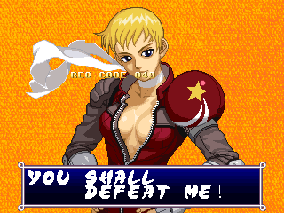

Tōki Denshō - Angel Eyes is an enigmatic fighting game  from Tecmo and the second (and last) game on their proprietary Tecmo Motherboard System hardware. It was quickly overshadowed by Dead or Alive and sunk into relative obscurity. It would be a stretch to call the game good, but some of its aspects, like the jarring mix of 2D and pre-rendered 3D sprites, make it oddly fascinating. While I don't normally stray too far from the code, I branched out quite a bit to research this article and it's been an interesting journey...

<!--more-->

# Disabled Dev Menus


Let's start with the "easy" stuff. In the game's standard test menu, there are four disabled options: FIX ROM CHK, CHARACTOR CHK, ANIMATION CHK and CONTE CHK. If you choose one, the game curtly tell you to GTFO:


How rude. Well, it turns out all the code for these menus is still present, so let's show this game who's boss. Here are MAME cheats to re-enable the options for both versions:

Older (VER 960427):

```
  <cheat desc="Restore disabled menu options">
    <script state="on">
      <action>temp0=maincpu.mq@17500</action>
      <action>maincpu.mq@17500=0a0804a002de0b64</action>
      <action>temp1=maincpu.mw@1750a</action>
      <action>maincpu.mw@1750a=0caa</action>
    </script>
    <script state="off">
      <action>maincpu.mq@17500=temp0</action>
      <action>maincpu.mw@1750a=temp1</action>
    </script>
  </cheat>
```

Newer (VER 960614):

```
  <cheat desc="Restore disabled menu options">
    <script state="on">
      <action>temp0=maincpu.mq@17500</action>
      <action>maincpu.mq@17500=0a0e04a602e40b6a</action>
      <action>temp1=maincpu.mw@1750a</action>
      <action>maincpu.mw@1750a=0caa</action>
    </script>
    <script state="off">
      <action>maincpu.mq@17500=temp0</action>
      <action>maincpu.mw@1750a=temp1</action>
    </script>
  </cheat>
```

## FIX ROM CHK


A tile and palette viewer. Not too sure what they mean by 'fix' here; perhaps 'fixed' as in stationary? In any case, P1 or P2 Up/Down to move the cursor in the upper right; P1 or P2 Button 1/2 to increase/decrease the values; P1 Start to return to the main menu. Note that it starts with palette 0, all black, so you'll need to change the COLS value first to see anything.

## CHARACTOR CHK


A sprite viewer. The same controls as above, but holding P1 Button 3 will flip the sprite vertically, and holding P2 Button 3 will flip it horizontally. Things are a little more interesting here, as the 2D characters, especially Raiya and Marie, appear to have a large  number of incomplete frames.


I haven't played the game deeply enough to say if the animations with unfinished frames are entirely unused, or just have the incomplete frames dropped.

Something else you may notice is that there is a 10th character slot, which is a copy of Raiya. We'll talk extensively about *that* later on...

## ANIMATION CHK


Basically the same as the sprite viewer, but it plays animations in a loop. Controls are the same as the tile viewer, but P1 Button 3 flips horizontal, and P1 or P2 Left/Right restart the animation. P2 Buttons 3 and 4 seem to 'reset' some animations that stop, especially ones related to jumping in the air, but some animations lock up the code, so heads up.

## CONTE CHK


Finally have have the 'conte' (storyboard) check. This is a viewer for all the scenes in the game: winning text, opening animation, endings, etc. Basically everything that isn't fighting gameplay can be seen here. Note that there are lots of copies of Raiya throughout, especially in the beginning. Other characters start at 0x40.

P1 or P2 Up/Down to change the Req Code, and P1 or P2 Button 1 to play the scene. P1 or P2 Button 2 clears some of the layers if things get too messy.

# English Localization?




It looks like there is an early attempt to localize the game into English. There are three unused lines at the very end of the string table in questionable English. Two of them appear to be beginning/end of round phrases: "YOU SHALL DEFEAT ME" and "I GOT IT!" I assume that's supposed to be "You shall *not* defeat me" but who knows.

The remaining text is a rough translation of the ending screen. The normal Japanese text is actually duplicated for each othe characters, with the only difference being the inclusion of their name in each copy. This English version seems to be "generic," without a name.

Given how minimal nature of the English lines and how they are not referenced anywhere, my guess is that these were very early placeholders for an international English version. It's worth noting that there may be an undumped, non-Japanese version of the game floating around out there; we'll discuss that briefly below.

# Location Test Leftovers


If you choose Req Code E2 in the Conte Check tool, you'll get the ending from the game's earlier Location Test. It reads:

>ロケテスト版
>
>クリアおめでとう
>
>でも　次はこうはいかないわよ

>Congrats on clearing the Location Test version
>
>But it won't go like this next time!

In the background is Mysterious Power with a most likely incorrect palette. This can be written off as pointing to old data, but as we'll see in the next section, there's something a little more interesting about this screen...

# The Ninth Character

As has been alluded, there was a ninth character (tenth, technically, if you count the normally unplayable boss character, Angel) that was cut from the game. The details about her are scarce, but here's what I've been able to find.

## Leftover Data

Almost all traces of this character have been wiped from the game. She is last in the internal character order, in slot 0x09. This slot exists in data structures throughout the code, but all of it's references point to Raiya's data.

The appears to be only one definite remnant left in the game. It's a text string at 0x1608A (both versions), the last entry in the string table of the character names that appear below the life meters in game, which reads: MAJYO. This is one way to romanize the Japanese word 魔女, meaning Witch. This feels so generic that it may just be a placeholder.

If we force the game to use character 9, we get this:


There is her name string, below the life meter. Interestingly, the palette IDs for this character slot are not just copied from Raiya like everything else is. Rather, it references palettes 0x32 and 0x35, which normally belong to Marie and Chibiko, respectively. Characters normally have five unique palettes, based on which button was used to choose the character. In this case, only 0x32 and 0x35 are referenced in an alternating list of five.

The only other possible remnant is the moveset. While all the animations match with Raiya's sprites, it's clear that the moveset is not just a copy of that character. For example, Raiya's QCF + B3 / B4 energy balls cannot be done as this character. Another notable difference is Button 3, a low kick, which has some odd effects, namely pushing the opponent back a bit no matter where they are on the screen. Whether the moveset is incomplete or buggy (or both) is hard to say.

Here is a MAME cheat to force Raiya to use character 9:

```
  <cheat desc="Set Raiya to unused character slot 9">
    <script state="on">
      <action>temp0=maincpu.mw@6780</action>
      <action>maincpu.mw@6780=9</action>
    </script>
    <script state="off">
      <action>maincpu.mw@6780=temp0</action>
    </script>
  </cheat>
``` 

There's not much to go on with just the data in the game, but thankfully, the story doesn't end there.

## "Complete Collection" and "Tōki Gentei"

Tōki Denshō is full of fan service, and clearly meant to appeal to the otaku crowd of the time. And if you're going to appeal to otaku, you need goods to sell! Aside of lots of now long-forgotten merchandise, a couple books about the game were published.

One is an officially produced guide and art book, "Tōki Denshō Complete Collection." It was released after the Playstation port and contains comics, strategies, developer commentary and lots of artwork, including preproduction artwork.

The other, "Tōki Gentei," is a doujinshi (fan book) with many contributions from the game's staff. Though it's 85% comics, there is a sizable section devoted to the games development, including a monthly "diary" of its production!

Both of these books mention the cut character. In fact, "Tōki Gentei" has an entire page about her:


Unfortunately, they only provide a silhouette, but they include a couple interesting details in the text:

>THE 9th Tōki
>
>- Being incomplete by the time of the final location test, work on this "Illusory Tōki" was stopped at the animation key frame >stage. Her name was Re...*cough cough*
>
>- Those who see her see her many tricky skills would most certainly be mesmerized. (Probably...)
>
>- We'd definitely love to bring her back for a home port or a sequel. (Her voice work was aleady complete, after all)
>
>※Those who cleared the game at the February '96 AOU Show were able to see this image on the temporary ending screen. So lucky (lol)

The shape of the shadow makes it seem that she has a long ponytail and carries a snake. I imagine the snake was used as part of her moveset, similar to Marie and King.

They intentionally refrain from revealing her name, except for the first syllable, which is either 'Re' or 'Le'. This obviously doesn't match with 'Majyo', the only leftover data in the game related to the 9th character. However, several of the Tōki girls have two names: a 'character' name and a real name. For example, Mysterious Power is the character name, and Tani Fujiko is her real name. It's possible that Mahyo is the character name while the name starting with Re/Le is the real name.

The bit about her moves being 'mesmerizing' (the word they used is 魅了 *miryou*, to charm, fascinate, mesmerize) makes me think there may have been some hypnosis type effects, perhaps involving her snake. But that's purely conjecture.

They also note that her voice work was complete, though it doesn't seem that any was left in the game (or was added in the first place).

The final line is particularly interesting, telling us that those who went to the [AOU Show](https://segaretro.org/AOU_Show) in February 1996, where Tōki Denshō was put on demo, and cleared the game were able to see the image in the temporary ending screen set up. That screen may have been the same location test ending screen we talked about above:


That could explain why MysP in the background has the wrong colors: it may have previously been our 9th Tōki, the graphics for which were removed for the final version but the palette was not updated for the now useless location test ending screen.

The most complete image of this character that we have is actually on the Playstation version, in the unlockable CG Gallery:


It appears to be the same image as the silhouette above, with the snake (which we can now see is white) clearly wrapped around her. We can also see she has blonde hair with a large 'ahoge' (for lack of a better term) sticking up in the front. Her outfit is black with a sort of halter top with long collar points in purple and red.

This same image actually appears in the "Complete Collection" book as well, though in monochrome and specifically calling her out: "Illusory Wallpaper - Who is this?"


"Complete Collection" came with a CD-ROM with media on it, so I assume 'wallpaper' here refers to a computer desktop image. Unfortunately my copy lacks the disc, but I have my eyes peeled for a copy with the disc.

(This image is also the second time we see the kanji 幻 *maboroshi* (phantom, illusion, dream, apparition) associated with this character. It could be referring to her personality or play style, or perhaps to the fact that she disappeared like a ghost (i.e. was removed) and there are only a few traces of her left... or I may be reading into it too much.)

Earlier in the book, there are a couple paragraphs of commentary from one of the voice actresses, Nanase Rio. Included in that section is this small illustration:


From left to right, it looks like Kiriko, Reika and Mysterious Power... but Reika is holding a doll of the unused character! Note the long ponytail, ahoge and collar style.

So to summarize everything we know about this character:

 - Internal character id 0x09 (last character)
 - No character graphics remain in the ROM, as far as I've been able to tell
 - Names could be Majyo (Witch) and/or something beginning with Re/Le
 - Carried a snake
 - Some partial artwork of her available in the Playstation version

If I get a hold of that Complete Collection CD and it has anything of interest, I'll be sure to update.

# Older Character Select

I was able to peruse the GAMEST collection at the [Game Preservation Society](https://www.gamepres.org/) and while I didn't find anything incredibly interesting, I did find a screenshot of an older version of the character select screen:


It's not wildly different from the final, but it does mean that the version GAMEST was playing on was an older a release, quite possibly the AOU/location test version.

# Overseas Release?

"Perfect Collection" makes a brief mention of an overseas release (海外版) in the encyclopedia section:

>【海外版】
>
>韓国などアジア数ヶ国に出荷されたアーケード版のこと。旅行に行ったら探してみよう！

>[Overseas Version]
>
>Refers to the arcade version that was shipped to Korea and a few other Asian countries. If you go on vacation, try to find one!

If this is correct, it implies there is at least one undumped, non-Japanese market version of the game out there. The changes to such a version would probably be minimal, if there are any at all, but it's something to keep in mind for those of us trying to preserve data for historical reasons.

# Early Development History

"Tōki Gentei" contains a fascinating glimpse into the game's evolution, as it contains a development timeline that was maintained by the game's planner, Hasunuma Jun. I've been copying and translating this text and plan to release it in a later post along with scans of the whole dev section from the book. For now, here's a paraphrased summary of the game's early development.

Planning began on July 22, 1994 (or at least, that is when Hasunuma Jun started keeping a record). According to this first entry, after Ninja Gaiden 2 for Neo-Geo failed to be released, three teams were formed in Tecmo to re-use the failed game's assets. After some planning, three basic concepts were decided on. Team A was to make a ninja themed fighting game; Team B, a fairytale themed fighting game; Team C, a horseback based fighting game. It was Team A with the ninja theme that eventually produced Tōki Denshō.

It was around this time (September 1994) that the company's president ([Kakihara Yoshihito](https://ja.wikipedia.org/wiki/%E6%9F%BF%E5%8E%9F%E5%BD%AC%E4%BA%BA)) called them into his office and announced that they would make a game for the [Sega Model 2 arcade board](https://segaretro.org/Sega_Model_2). This was handed off to a differnet team, however, and would, of course, eventually become Dead or Alive.

Very soon thereafter, they changed course and decided to drop the ninja concept, since they felt ninjas wouldn't have much impact. Instead, they turned to an 'all female fighters' gimmick.

(Though the writer never says it explicitly, he implies that the Team B fairytale fighting game eventually became [Dero~n Dero Dero](https://segaretro.org/Dero~n_Dero_Dero). He also cryptically mentions the Team C horseback fighting game as well, telling us to "use your imagination" about what it became. [Gallop Racer](https://en.wikipedia.org/wiki/Gallop_Racer), a horse racing game, came out in 1996, so possibly that? Then again, given the sort of wink-nudge way he wrote about it, it could be Dead or Alive...)

The rest of the year was filled with character planning and idea experimentation. At the start of 1995, work began in earnest. While the code was in a good place, there were no characters ready to be inserted into the game. There were a number of sketched animation frames ready to go, but the team did not have their own scanner. Progress on in-game artwork was falling behind schedule. As a result, the Ran sprites from the unreleased Ninja Gaiden II game were used as a test character. She would remain in the game for most of the development period.


Ran, from the cancelled Ninja Gaiden II for Neo-Geo

By April 1995, though progress on the artwork was coming along, none of the characters were yet finished, and Ran was still the only character in the game for testing. One of the programmers, Miyazaki Eigo, was moved to another team. (He is listed as one of the programmers in the first DOA arcade version, so it's pretty safe to assume that other team was DOA.) This was the beginning of the already small team growing smaller.

By June, incomplete versions of Highway Star and Raiya were in the game. The team is told by upper management that "If this game doesn't sell, who knows what's going to happen to you all!"

By October, Chibiko, Lina and Mysterious Power had been added, and Ran was finally removed due to limited space in the ROM. Up to this point, the game was called "ANGEL EYES," but upper management decided that the title should have Japanse kanji. "Our company loves to use kanji," explains the writer. 女難拳 Jonanken ("Lady Troubles Fist" is the most literal translation, which sounds awful in English) is floated as a possible title.

From here on, the game was finally starting to take shape, so there are less interesting details. The rest will be available in the followup post.

# Connections to Dead or Alive

When we think of the DOA series as it stands today, with its spinoffs that verge dangerously close to eroge territory, the ladies of the series quickly come to mind as a defining feature of the games. And because of that, it's easy to come to the conclusion that Tōki Denshō was a prototype or at least an inspiration for DOA.

Before I get your hopes up, the TL;DR here is that there is no connection between the two games, aside from being fighting games developed by the same company. But with that said, I want to bring up a couple points that initially made me raise my eyebrows.

As we mentioned above, each of the girls in Tōki Denshō has two names: their character name, which appears in game, and their 'real' name, which appears in the manual, comics, story mode in the Playstation version, and so on. It seems that Reika's real name is actually Lei Fang, and both are of Chinese descent.


Lei Fang (DOA) and Lei Fang (TD)

Furthermore, Kiriko's full name is Kasumi Kiriko. She is a ninja on the run and (with the release of the Playstation version) is being chased by her sister Akane.

It's definitely one of those things that make you go "Hmm..." at first blush, but kunoichi being named [Kasumi](https://en.wikipedia.org/wiki/Kasumi_(given_name)) and the runaway shinobi trope are both pretty cliched. It seems it's more a case of reusing generic plots for characters that don't need anything more than generic plots. As for Reika/Lei Fang, there is nothing else similar to the two characters to give a wink-nudge connection to the two games. (And while the image comparison above is fun, it's not really fair: Lei Fang (DOA) didn't have her first cheongsam until DOA++, and the detailed red/gold phoenix patterned one didn't appear until DOA2.)

If that's not enough, the developers directly address this situation in both the "Tōki Gentei" and "Complete Collection" book. "Tōki Gentei" is particularly detailed:

> (That's right, no connection at all)
>
> Kiriko's real name is "Kasumi Kiriko," and though she is looking for her long lost brother, there is absolutely no connection to the kunoichi who loves mille feulle (which I happen to love as well) from a certain other game from our company. Furthermore, while Reika's real name is read as "Lei Fang," I'm sorry to say there is no relation to the Chinese woman tracking down a man, who appears in that certain other game from our company.

For those not aware, the DOA character profiles describe strawberry millefeulle as Kasumi's favorite food, and the original storyline for Lei Fang is basically her tracking down Jann Lee from China to defeat him.

Aside from the fact that fighting game characters just didn't need creative, deep and involving stories, another reason for the similarities is probably due to the small size of the company at the time. In several places in throughout [the Tōki Denshō dev diary](/entry/touki-denshou-dev-diary), the writer laments losing staff to other teams and expresses exasperation that a certain other game (which was almost certainly Dead Or Alive) was getting more resources and attention than his humble project. It seems likely that staff carried ideas around between projects.

Comparing the staff roll between Tōki Denshō and the very first arcade release of DOA, only a couple names are shared. One in particular is interesting, however: ASAMIN. He is listed as one of the nebulously defined planners for Tōki Denshō, and as the "Character's Story" staff in the arcade version of DOA (and as Scenario Writer in the Saturn port of DOA). It's probably this one person who had a hand in the storylines for both games, and possibly character names as well, further contributing to similarities.

(On a somewhat related side note, if you check the staff credits for DOA++ and the home console versions of the first game, you'll see many more of the Tōki Denshō staff appear. After Tecmo found its niche with exaggerated breast animations, DOA became the 'all hands on deck' project, and in a somewhat ironic twist, it seems the next assignment for the TD staff was home console ports of the game that overshadowed their own previous project.)

So there's no official connection between Tōki Denshō and Dead Or Alive, though some storyline concepts may have been copied due to the shared staff.

---

That's all for Tōki Denshō for now. ~I'll have another post along eventually with a full scan and translation of the dev materials from Tōki Gentei!~ 

**The devi diary has finally be translated. [Check it out here!](/entry/touki-denshou-dev-diary)
