One of the most loved games by fans of the legendary Neo-Geo has a boatload of debug tools and a hidden mini game...

<!--more-->

# Debug Menus

There are three debug menus in the game: the Program Menu, Edit Menu and Gameplay Menu. In all versions, these menus are enabled by a debug flag, stored as a byte within the program ROM. Changing this value to 0xDB (DB - debug!) will enable the menus.

For the Neo-Geo systems, this is located in the lower bank of PROM, at address 0xFF. On the Saturn version, it is located in the upper program bank, at 0x6003FFF. We can patch this easily at runtime with a MAME cheat:

Neo-Geo/Neo-Geo CD

```
  <cheat desc="Enable debug">
    <comment>Hold P2 A+B+C+D after BIOS screen for Program Menu; press P1 or P2 C+D during gameplay for Gameplay Menu; press P1 Select (AES mode) any time for Edit Menu</comment>
    <script state="on">
      <action>temp0=maincpu.rb@ff</action>
      <action>maincpu.rb@ff=db</action>
    </script>
    <script state="run">
      <action>maincpu.rb@ff=db</action>
    </script>
    <script state="off">
      <action>maincpu.rb@ff=temp0</action>
    </script>
  </cheat>
```

Sega Saturn:

```
  <cheat desc="Enable debug">
    <comment>Hold P1 X+Y+Z after BIOS screen for Program Menu; press P1 or P2 R+Z during gameplay for Gameplay Menu</comment>
    <script state="run">
      <action>maincpu.pb@6003fff=db</action>
    </script>
  </cheat>
```

If you (understandably) prefer Mednafen for Saturn emulation, here is a cheat:

```
R A 1 L 0 06003fff db EnableDebug
```

## Program Menu

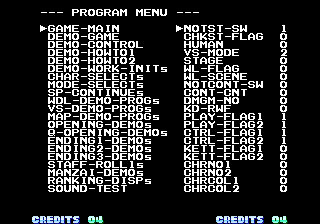

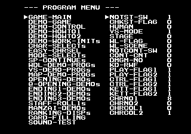

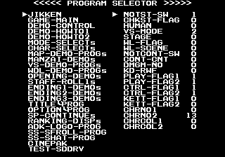

From left to right: Neo-Geo, Neo-Geo CD, Saturn





The Program Menu provides a list of quick links to the various program modes along with modifying variables. The left column are the programs to run while the right column are some of the runtime variables that can be modified. The left column is controlled with Player 1 inputs, and the right with Player 2. P1 Up/Down moves the cursor and Button 1 selects; P2 Up/Down moves the cursor and Left/Right changes the variable value.

Many of the options are self explanatory. For example, ENDING1-DEMO will show one of the ending scenes; CHAR_SELECT will display the character select screen, and so on. In all cases, when a mode ends, it will return to the program menu.

Some of the settings on the right are a bit of a mystery however. KD-RWF, for example, allows the player to control the characters during the "How To Play" screens. CHKST will "skip" some screens immediately when set, such as SP-CONTINUE and Q-OPENING.

The menu is accessed by holding P2 A+B+C+D during boot, after the initial BIOS animation. (On the AES/MVS, you can hold the buttons right from reset; on the CD, you'll be brought to the controller input test if you hold from reset, so wait till the CD animation has started, then hold the buttons.)

On the Saturn, it's accessed by holding X+Y+Z on boot after the initial BIOS animation. (When the "Produced by Sega.." screen appears, it's a good time to start holding the buttons.)

## Edit Menu



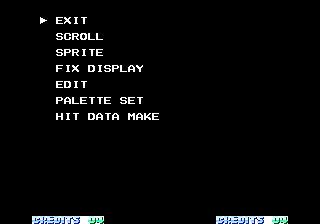

This menu doesn't have a proper title, but I call it the Edit Menu as it options seem are related to lower level tools like graphics viewers and editors. 

It is accessed by pressing the Select button at any time. (As such, it is only available in AES mode for the original Neo-Geo.) It was removed in the Saturn version, likely due to the fact that these tools seem to be intended to work with external developer hardware.

For all options, pressing P1 Button 4 button returns to the menu.

### Scroll

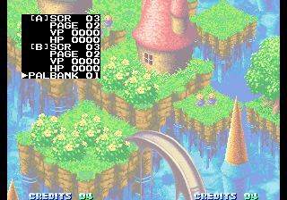

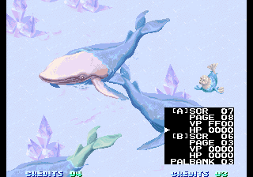

This is a graphics viewer for the scroll planes in the background. 

P1 Up/Down controls the cursor and P1 Left/Right changes values. After changing a value, you must press P1 Button 1 to activate the new values. Holding P1 Button 2 will allow you to scroll the values quickly. P1 Button C will reposition the menu to either the upper left or lower right corner. P2 joystick moves the position of the lower layer.

### Sprite

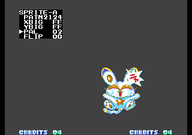

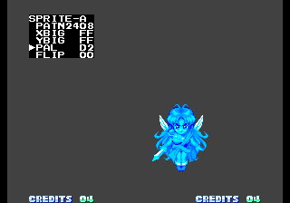

A graphics viewer for the sprite objects in the game.

P1 Left/Right changes the value by one; P1 Up/Down changes the value by 0x100 in the PATN option. Hold P1 Button 1 to scroll quickly. P1 Button 3 moves to next option in the menu.

While on the PATNO option, hold P1 Button 2 to move the object around the screen. On the FLIP option, P1 Button 1 flips horizontally, and P1 Button 2 flips vertically.

Note that the top line says SPRITE-A. The tool actually allows you to place three seperate sprites on an A, B and C layer.

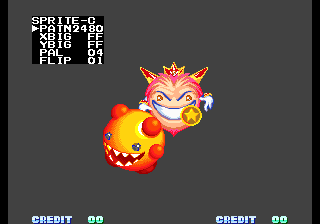

However, the button to change the layer is mapped to P1 Select, which is already used in a larger scope to display the Edit Menu. To work around this, we can remap to P2 Button 1 with a cheat:

```
  <cheat desc="Fix Sprite Viewer">
    <comment>Change the Sprite layer with P2 Button 1</comment>
    <script state="on">
      <action>temp0=maincpu.rd@a3f0</action>
      <action>maincpu.rd@a3f0=0019fd9d</action>
      <action>temp1=maincpu.rb@a3ef</action>
      <action>maincpu.rb@a3ef=04</action>
    </script>
    <script state="off">
      <action>maincpu.rd@a3f0=temp0</action>
      <action>maincpu.rb@a3ef=temp1</action>
    </script>
  </cheat>
```

### Fix Display

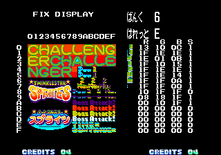

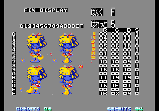

Displays the tiles for the graphics that appear on the fix layer. The Japanese text in the upper right reads "bank" and "palette."

P1 Up/Down changes the bank, and P1 Left/Right changes the palette. Holding P1 Button 1 will change the background to gray to provide contrast. 

### Edit

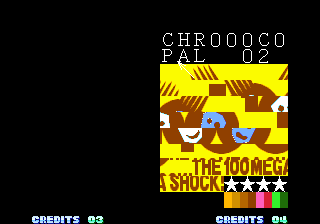

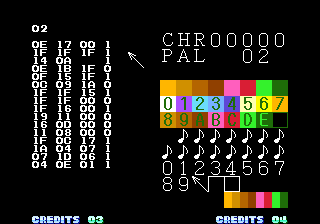

This is simply a graphics viewer with a color palette editor, but the interface is quite unique: there is a pointer which is used like a mouse cursor to change values. The cursor is moved with P1 Joystick, and pressing P1 Button 1 or 2 on the PAL or CHR digits will change their values. Pressing P1 B3 brings up the RGB levels of each color in the palette. The levels can be changed for each color, with the current color flashing in the list. P2 Joystick moves this selection around and P2 Buttons 1 and 2 change the values.

Ultimately, there's not a lot going on here, though to be fair I haven't given its code a very thorough look. The fact that there's a mouse-like cursor system is intriguing, and I wonder if it's somehow related to SNK's Art Box hardware...

### Palette Set

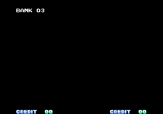

The title makes it clear that this is related to color palettes, yet there is no visible functionality. P1 Up/Down changes the value, but nothing seems to happen. This may be making some changes memory for use on a development system though.

### Hit Data Make

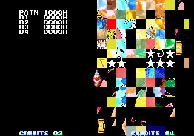

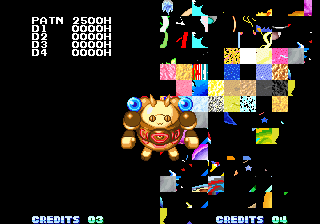

Judging from the name of this option, this was probably a tool for editing the hit boxes of sprites. However, it is clearly broken or not meant to work with the final code/hardware, as there is a random assortment of tiles on the right side of the screen. Hold P1 Button 3 and use the joy stick to change the sprite and its frames. Holding P1 Button 1 and using the joystick will change the D1 to D4 values in pairs (D1/D2 and D3/D4), while holding P1 Button 2 will change D2 and D4 only.

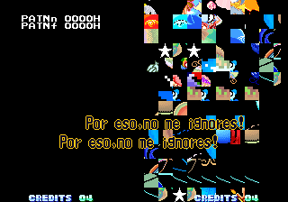

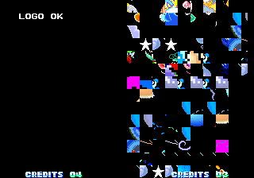

There are a couple of other strange quirks with this tool. If you hold P1 Button 2 when selecting the tool from the main menu, you'll be put into an alternate mode, which seems to be a broken or half implemented pattern viewer. You can move one of the sprites slowly around the screen by holding P1 Button 3 and using the joystick, but that's it.

Holding P1 Button 3 when selecting the tool shows the text "LOGO OK," and doesn't respond to any inputs.

There's a decent amount of code around both of these that may be worth exploring someday to get a better sense of what they were meant to do... but that's a project for a slow day (or someone else with more time on their hands).

## Gameplay Menu



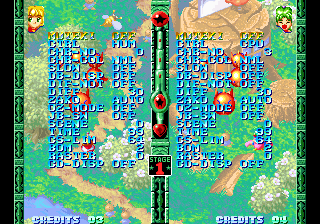

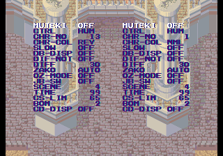

Left: Neo-Geo Version, Right: Saturn Version

This menu is accessible while in a stage and allows you to set a number of gameplay variables and has a couple of map viewers. Several of the options are self-explanatory, but we'll take a closer look at a couple.

For the Neo-Geo versions, press P1 or P2 C + D simultaneously during gameplay. For the Saturn version, press P1 or P2 R+Z simultaneously. In the menu, P1 controls the right column, and P2 the left (though some options are shared). Up/Down moves cursor and Left/Right changes value. Hold Button 1 to change the value quickly.

### DB-DISP

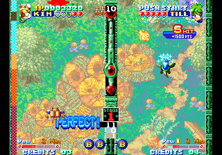

This displays a CPU usage meter on the left and three number displays in the lower middle column. It will also display a number on the continue and game over screens.

### ZAKO and BLOCK test



Zako is the term for the explosive enemy/puzzle pieces that you shoot in the game, and the ZAKO and BLOCK test modes are for testing them individually or as preset groups, respectively. When you change the ZAKO option from Auto and return to the game, there will be a small menu list displayed on the right side of the screen. In this mode, holding Button 4 and using the P1 Joystick will move the cursor and change the values. In either mode, pressing Button 3 + 4 will return to the gameplay menu.

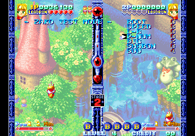

In ZAKO mode, you can define mostly freeform waves of enemies with the options available. Root is the animation/attack pattern. Speed is the speed at which they move. L-R determines if they enter from the left or right side. Big determines the size level of the enemies. Shabon (bubble) encases the enemies in a bubble. Suu (count) is the number of enemies in the wave. I haven't quite figured out what P-Num affects yet, though (possibly damage?)...

Pressing Button 3 will spawn the wave of enemies with your settings.

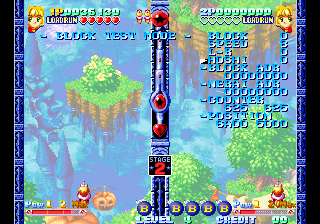

BLOCK mode is similar, but it instead works with predefined waves of enemies. Block changes that wave ID, Speed and L-R are the same as ZAKO mode, and Hoshi will include an orb with the enemies. The value of Hoshi seems to its position in the enemy chain.

Button 3 will spawn the block with your settings.

### Unused Gameplay Menu Entries

Among the list of strings for the gameplay menu are a couple which are not used: H-TYPE and SORT-SW. They are completely unreferenced by the gameplay code, but there do appear to be two routines among the gameplay menu options code that are unused which may be the functions these were originally attached to. One of them deals with RAM location 0x10BA45 (byte), with a maximum value of 3. This is set to 3 by default in the game. The other deals with location 0x10BA46 (byte), with a value of either 0 or 1 (which is 1 by default). 

Based on the name SORT-SW, the SW of which is probably 'switch' and likely implies an on or off state, the value at 0x10BA46 is probably SORT-SW, and 0x10BA45 is H-TYPE. Unfortunately, I didn't notice any immediate differences in gameplay when messing with these, so these too need more research eventually.

## Pause/Slow Motion

Another option only available to the AES version is a pause / slow motion mode. Press P2 Select to enable it, which will pause the game. Holding any other input will continue the game in slow motion.

(There's a slow motion option with the same functionality in the Gameplay Menu, but that is only available inside a stage. With P2 Select, it can be enabled anywhere.)

# Unused Tools

## Old Stage Viewer?

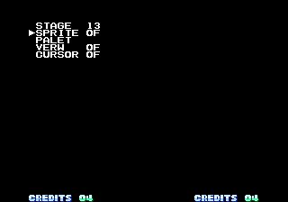

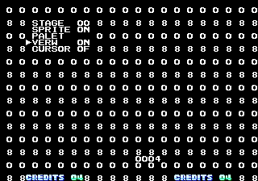

This one's a bit of a mystery. I'm not even entirely certain I've found the proper entry for the code.

The code seems to start at 0x8AA4, which is unreferenced anywhere else. When first entering, there is a single STAGE text, whose value can be set with P1 Joystick. P1 Button 1 makes the text disappear, and pressing it again makes it reappear as a longer menu with Sprite, Palet, etc options. None of these seem to have any actual affect on the background. Setting VERW to on will display a grid of 8 and 0 characters, and enabling CURSOR will display an address at the bottom of the screen. Pressing P1 B3 will cause the menu to disappear; P1 B1 will make it reappearr.

The presence of 'Sprite' and 'Palet' suggest it may have been a stage background viewer, similar to the Scroll option in the Edit Menu, but I can't be certain. It seems to be another tool from an earlier stage of development. Here's a cheat to replace the Scroll option in the Edit Menu with whatever this is:

```
  <cheat desc="Unused and broken dev tool">
    <comment>Replaces the Scroll option in the Edit Menu</comment>
    <script state="on">
      <action>temp0=maincpu.rd@8284</action>
      <action>maincpu.rd@8284=00008aa4</action>
    </script>
    <script state="off">
      <action>maincpu.rd@8284=temp0</action>
    </script>
  </cheat>
```

## Old Pattern Viewer

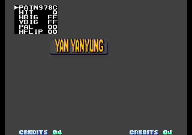

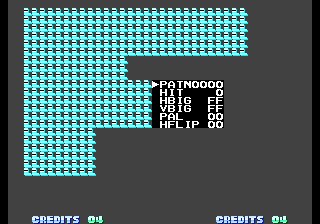

This is simply an old version of the sprite viewer that currently appears in the edit menu. All the controls are the same as the final version, but there are a couple other differences:

 - The multiple sprite layers are not present
 - There is a HIT entry in the list, though it's value doesn't seem to change
 - P2 Joystick moves the menu box around the screen, though it leaves behind some ugly artifacts, as seen in the second screenshot

The code for this tool is at 0x8560, where it sits lonely and unreferenced. We can replace the current Sprite tool with this one with a cheat:

```
  <cheat desc="Use old Sprite Viewer">
    <comment>Replaces the Sprite option in the Edit Menu</comment>
    <script state="on">
      <action>temp0=maincpu.rd@8288</action>
      <action>maincpu.rd@8288=00008560</action>
    </script>
    <script state="off">
      <action>maincpu.rd@8288=temp0</action>
    </script>
  </cheat>
```

## Countdown Monitor

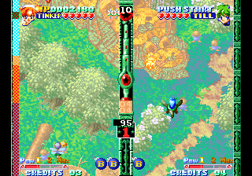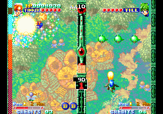

Located at 0x1841a, this code displays the countdown until the Death enemy starts to spawn. There are also two other values above it that seem to go up after the counter reaches zero, though their exact purpose isn't clear. It is shown as a text box in the middle column, similar the one visible when DB-DISP is enabled from the Gameplay Menu. In fact, this code (and the next two unused subroutines we'll talk about) are in the same area as the Gameplay Menu code and was likely one of the options at one time.

Here's a cheat to replace the normal DB-DISP text with this timer:

```
  <cheat desc="Show unused countdown monitor">
    <comment>Replaces the text in the middle column when DB-DISP is enabled</comment>
    <script state="on">
      <action>temp0=maincpu.rd@1799c</action>
      <action>maincpu.rd@1799c=4eb90001</action>
      <action>temp1=maincpu.rd@179a0</action>
      <action>maincpu.rd@179a0=841a4e75</action>
    </script>
    <script state="off">
      <action>maincpu.rd@1799c=temp0</action>
      <action>maincpu.rd@179a0=temp1</action>
    </script>
  </cheat>
```

## Unknown Gameplay Monitor

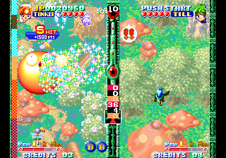

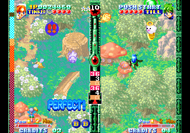

This is another monitor that displays a few gameplay values. It's not clear what they correspond to though. (At least, not without a fair bit more research.) The code for it is at 0x18488, and we can put it in the DB-DISP code like we did with the monitor above:

```
  <cheat desc="Show unused unknown monitor">
    <comment>Replaces the text in the middle column when DB-DISP is enabled</comment>
    <script state="on">
      <action>temp0=maincpu.rd@1799c</action>
      <action>maincpu.rd@1799c=4eb90001</action>
      <action>temp1=maincpu.rd@179a0</action>
      <action>maincpu.rd@179a0=84884e75</action>
    </script>
    <script state="off">
      <action>maincpu.rd@1799c=temp0</action>
      <action>maincpu.rd@179a0=temp1</action>
    </script>
  </cheat>
```

## Tangent List

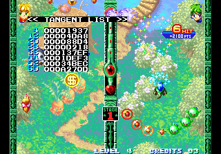

This displays some data from the 0xC04000 region of the Neo-Geo system ROM, which contains a <a href="https://wiki.neogeodev.org/index.php?title=System_ROM_tables#SIN_DATA_.28.24C04000.29" target="_blank">sine lookup table</a>, with some math done on the values to presumably calculate the tangent. How or what this is used for is unclear. Pressing any input will exit the viewer.

The unreferenced code is at 0x18542. We don't know how it was called, but since it's near the other gameplay menu options, we'll stick it in there. The chear below will replace the DB-DISP option in the gameplay menu:

```
  <cheat desc="Tangent List">
    <comment>Replaces the DB-DISP option in the gameplay menu</comment>
    <script state="on">
      <action>temp0=maincpu.rd@17e80</action>
      <action>maincpu.rd@17e80=18542</action>
    </script>
    <script state="off">
      <action>maincpu.rd@17e80=temp0</action>
    </script>
  </cheat>
```

# Load Ran's Swimsuit

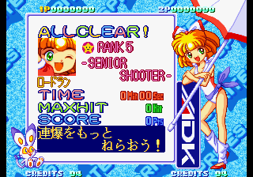

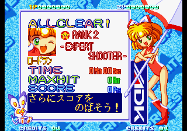

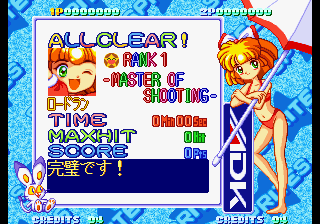

This may be common knowledge to those who are more skilled than I am at actually playing games (which is pretty much everyone), but it was a discovery for me. Depending on your rank at the end of gameplay, Load Ran's "race queen" swimsuit will be different. For ranks 8 to 5, it is a white swimsuit with loose socks. For ranks 4 to 2, it is a red swimsuit with boots. For rank 1, it is a bikini.

# Unused Strings

There are a few unused bits of text in the data. At 0x1C3B6 is:

```
Come a New Chalenger
```

And at 0x2342C:

```
NORMAL  ATTACK K.O.
REVERSE ATTACK K.O.
EXTRA   ATTACK K.O.
BOSS    ATTACK K.O.
DETH    ATTACK K.O.
!!! DOUBLE K.O. !!!
*** ERROR K.O.  ***
```

All of these were replaced with graphics, though I don't think an 'Error KO' is possible in the final game. Interestingly, these strings also made it into the CD and Saturn ports as well, where they remain unused.

# Jikken Program

<div class="embeddedContent oembed-provider- oembed-provider-youtube" style="text-align: center;"><iframe allowfullscreen="true" frameborder="0" height="349" scrolling="no" src="//www.youtube.com/embed/1UDw9b5gR7E?wmode=transparent&amp;jqoemcache=CCcTK" width="425"></iframe>

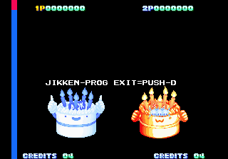

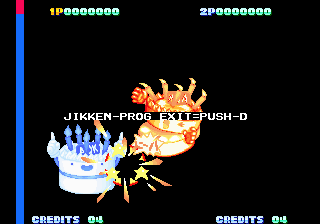

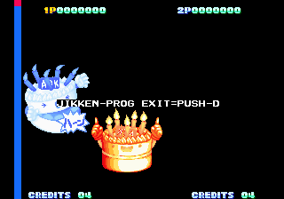

We've saved the best for last.

Finding debug tools is all well and good, but they tend to be the same thing over and over in many games: graphics viewers, invincibility, level selects. Meh. But every now and then we strike pure gold, and that was the case here, with Twinkle Star Sprites.

At 0x270226 in the original Neo-Geo version is a "Jikken (experimental) Program." It is a very simple two player versus fighting game featuring Memory's boss character: a sentient birthday cake. Each character is controlled with P1 and P2 controls, respectively. The movement is surprisingly complete: you can jump and crouch with Up and Down, and dash forward or back with a double tap in either direction. There are two attacks: Button 1 seems to be the stronger attack with some enemy knockback, while Button 2's attack moves your character in further but has less knockback. B1 + B2 is an even stronger attack. QCF+B1 launches a hadouken-like attack; double QCF+B1 will perform a high jump attack. QCB+B1 while in the air will do a homing attack.

Unfortunately, there's no actual damage counter or score or timer or anything to give it a gameplay framework. Otherwise it could be the next hot thing at Evo.

The code is (seemingly) complete but is not referenced anywhere, so we can't be sure where it was originally called from. It seems like it would have been part of the Program Menu at one time, though. Here is a MAME cheat to replace the Program Menu with the Jikken Program. (So you'll also need to enable the Debug cheat, and hold P2 Button 1+2+3+4 on startup.)

```
  <cheat desc="Jikken Program">
    <comment>Also requires Debug cheat to be active; hold P2 Button A+B+C+D on startup</comment>
    <script state="on">
      <action>temp0=maincpu.rd@14d30</action>
      <action>maincpu.rd@14d30=00270226</action>
    </script>
    <script state="off">
      <action>maincpu.rd@14d30=temp0</action>
    </script>
  </cheat>
```

***

UPDATE: One of the staff who worked on the game heard about the fighting cakes find [and replied on twitter](https://twitter.com/jDwVV3CEGUy7nlR/status/1390536138197065736?s=20). Considering there is no name on their profile, they likely don't want their real name published, so unfortunately we can't tell which staff member it is. He says that while the hidden fighting game was likely created by main programmer AOMATSU Shōji, he was the one who have it its name: Cake Fighter. But more interesting than this is the fact that this wasn't something hidden away by the programmer, that at least some of the other staff knew of its existence. It seems this person  isn't on very good terms with the game designer MATSUSHITA Yoshiyasu and declined to give any more details around the history of Cake Fighter, but even this small commentary is appreciated!

***

The code was removed from the CD version, unfortunately, but there is a Jikken option in the Saturn menu.

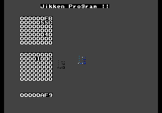

This one is decidedly more boring, though, being a (possibly broken) graphics test. You can move the the small dot.. sprite... thing around with the D-pad, and hold L to rotate it. Not nearly as exciting as pastries doing martial arts.

That's all we have for Twinkle Star Sprites for now, ladies and gentlemen. See you again in 2020!
