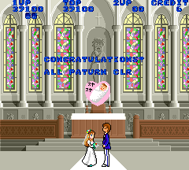

The MAME hacking continues! [Momoko 120%](http://www.mamedb.com/game/momoko) is a platform shooter with an [interesting history](http://en.wikipedia.org/wiki/Momoko_120%25). I've always enjoyed it and have begun a full disassembly of the code, partially to learn Z80 assembly and also, as always, to look for any bits of leftover or unused data. And find something I did!

<!--more-->

The game normally concludes with [Momoko's marriage ceremony](https://www.youtube.com/watch?v=clIFZ0HRohQ#t=485), with wedding music and a slow walk. However, there is an unused bit of the ending in which the text "CONGRATULATIONS! ALL PATURN CLR" appears:



Before I give a technical explanation, here's a MAME cheat to enable the "proper" ending:

Japanese version:

```
<cheat desc="Fixed ending">
	<comment>Set this to view the extra line of text during the game ending</comment>
	<script state="on">
		<action>temp0=maincpu.mb@0F3F</action>
		<action>maincpu.mb@0F3F=85</action>
	</script>
	<script state="off">
		<action>maincpu.mb@0F3F=temp0</action>
	</script>
</cheat>
```

English (prototype) version:

```
<cheat desc="Fixed ending">
	<comment>Set this to view the extra line of text during the game ending</comment>
	<script state="on">
		<action>temp0=maincpu.mb@0F5D</action>
		<action>maincpu.mb@0F5D=85</action>
	</script>
	<script state="off">
		<action>maincpu.mb@0F5D=temp0</action>
	</script>
</cheat>
```

The routine to display this text begins at 0x0F49. It is called when the program "mode" value (tracked at 0xC080) is 44. Mode 40 initiates the special timed final level, and 41 is Momoko's turn towards the church door. The end of that routine sets game state 42, which is Momoko and the groom's slow walk towards each other; it then calls game state 43, which is the fluttering hearts and the appearance of the baby. And at the end of 43, it sets game state to 44, which is the display of our text. Yet nothing appears!

In short, the timer (tracked at 0xC085) is not set to 0 as it should be when entering mode 44. All of the ending scene modes reset this timer to zero at the end before moving on to the next mode; 43 is the only one that doesn't. It looks like resetting the timer was forgotten, so this we can infer that this is *probably* a bug, rather than the text being intentionally removed. *Probably,* because we can't know for sure. If it was inentional, it's sort of an odd way to do it. It seems to me that simply ending at mode 43 and never advancing to 44 to begin with would be the more obvious choice. The English is pretty bad here, so I could understand why they would remove it. On the other hand, the game is already riddled with bugs and unoptimized code, so an issue like this slipping through wouldn't surprise me.

As for the cheat to fix this, we hijack the code that is resetting the player animation frame (at 0xC01D) to 0, and have it reset the timer (at 0xC085) instead. This doesn't effect anything, as the player frame is the same, and thus the ending is restored.
