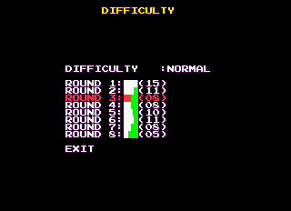

I was pretty unhappy that Land Maker, one of my favorite arcade puzzle games, was one of the few Taito F3 games that did not have the Taito code implemented. Despite that, I still had a hunch there may be some leftovers worth investigating. And I was right! I wouldn't be making a post otherwise...

<!--more-->

# Check Menu

There is a hidden menu left over in the game:


And by 'left over' I mean I can't find any references to the routine anywhere in the disassembly (unless there's some indirect addressing going on, but I doubt that: all of the other routines I played around with, such as the Test Mode menu, were directly addressed). I'm assuming it was used in development then disabled. It's fully functional in the prototype as well, but I don't see any references to it there either.

Currently, I have it implemented as a MAME cheat to patch the code so it calls this routine after inserting a coin.

## Object Check

As its name implies, this allows you to cycle through all sprites in the game:


P1 Button 1 and Button 2 cycle through each 'section', while P1 Left and Right cycle through each frame. P1 Up/Down cycle quickly. If you've ever wanted to rip sprites from this game, now's your chance!

## SCP Check


I'm not sure what SCP stands for, but this is clearly a viewer for all the non-sprite artwork in the game. Perhaps SCP is the art format? As in the object viewer, P1 Left/Right cycles one by one, while P1 Up/Down cycle quickly.

## Mask Check


Yup. Just a palette checker. Controls work as they do in the other modes.

In all of these modes, you can press P2 Start to return to the main menu. P1 Start will lock up the game; I assume it was originally meant to reset or return to the game, but since we don't have a way to call it properly, it doesn't work.

Here are the MAME cheats to access the menu:

**Prototype:**

```
  <cheat desc="Object test">
    <comment>Insert a coin to bring up this menu. You will need to reset the game first if you have previously inserted a coin.</comment>
    <script state="on">
      <action>temp0=maincpu.md@8E2F6</action>
      <action>maincpu.md@8E2F6=0000665a</action>
    </script>
    <script state="off">
      <action>maincpu.md@8E2F6=temp0</action>
    </script>
  </cheat>
```

**Final:**

```
  <cheat desc="Object test">
    <comment>Insert a coin to bring up this menu. You will need to reset the game first if you have previously inserted a coin.</comment>
    <script state="on">
      <action>temp0=maincpu.md@8DF02</action>
      <action>maincpu.md@8DF02=0000665A</action>
    </script>
    <script state="off">
      <action>maincpu.md@8DF02=temp0</action>
    </script>
  </cheat>
```

# Alternate Difficulty Menu

Okay, this is pretty interesting. In the normal test menu, you can set the general difficult for the game: Easy, Normal, Hard and Very Hard.


However, it seems that at one time there was a more intricate menu for configuring difficulty:




Navigating the menu and setting values all seem to be functional. You can set the standard difficulty at the top. It loads from/saves to the NVRAM properly: if you switch back to the standard configuration menu, you'll see that your setting was saved. It's not clear what the numbering represents, although it's logical to assume that a higher number means more difficult. I gave it a couple quick gameplay tests with different values for Round 1, but I didn't notice any thing drastically different. It's worth further testing, though.

This menu too appears to be wholly unused. The list of menu options for the Test Menu is stored in ASCII starting at 0x10324D, with the address for each entry's subroutine stored as a long in front of the text. 'Difficulty' is not listed there as a menu option in either the final or prototype; there's no sign of normal access for our difficulty menu anywhere.

I created a MAME cheat to patch the code so it calls this alternate difficulty menu instead when choosing Configuration. It all seems to work flawlessly, and you can turn the MAME cheat on and off while in the Test Menu to switch around access to the normal Configuration and this alternate Difficulty menu.

**Prototype:**

```
  <cheat desc="Alternate difficulty menu">
    <comment>This replaces the 'Configuration' menu option in the Test Menu. It can be turned on and off while in the Test Menu as needed.</comment>
    <script state="on">
      <action>temp0=maincpu.mw@10371A</action>
      <action>maincpu.mw@10371A=24D4</action>
    </script>
    <script state="off">
      <action>maincpu.mw@10371A=temp0</action>
    </script>
  </cheat>
```

**Final:**

```
  <cheat desc="Alternate difficulty menu">
    <comment>This replaces the 'Configuration' menu option in the Test Menu. It can be turned on and off while in the Test Menu as needed.</comment>
    <script state="on">
      <action>temp0=maincpu.mw@1032BA</action>
      <action>maincpu.mw@1032BA=2074</action>
    </script>
    <script state="off">
      <action>maincpu.mw@1032BA=temp0</action>
    </script>
  </cheat>
```

Enjoy!
