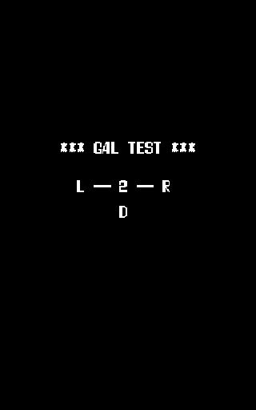
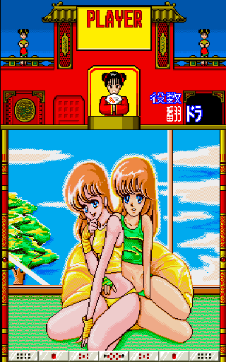
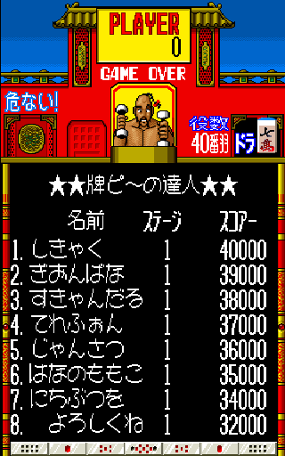
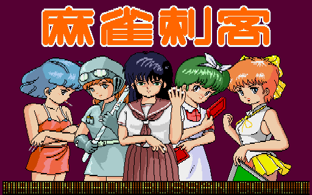
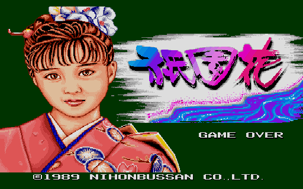
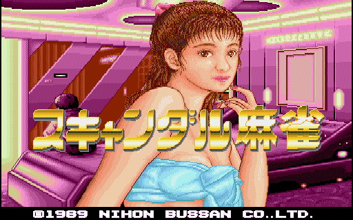
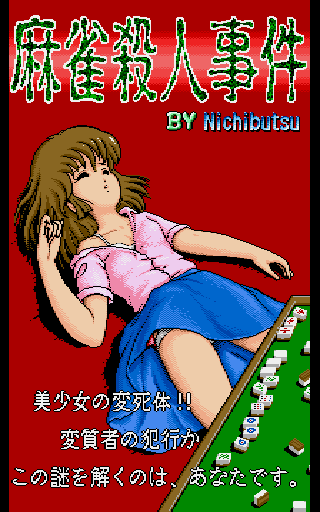
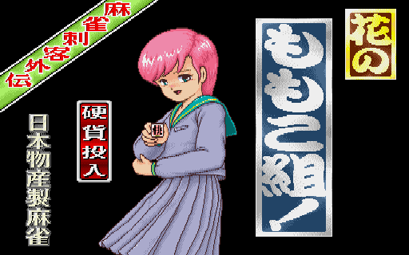

It's a mahjong game! It's a falling-block puzzle game! No, it's Oh! Paipii, a mix of both that isn't nearly as fun as either of those genres are on their own!

<!--more-->

# Gal Test





There is an unused test menu within the game code which is used to view the ladies in the game in their various states of immodesty.

Left and Right changes the girl number and Down activates the test. It will progress through each image automatically before returning you to the menu. Pressing P1 Button 1 will run the graphics test normally shown by enabling DIP 1-8.

The menu is located at 0x1084 and does not seem to be referenced anywhere in the code. So while we don't know the context from which it was originally called, we can at least restore it easily enough by replacing the brief alignment test at startup with a jump to the gal test instead:

```
  <cheat desc="Enable Gal Test">
    <comment>Shows the menu on startup, replacing the main game</comment>
    <script state="on">
      <action>temp0=maincpu.mw@583</action>
      <action>maincpu.mw@583=1084</action>
    </script>
    <script state="off">
      <action>maincpu.mw@583=temp0</action>
    </script>
  </cheat>
```

# Nichibutsu References

For those of us out there who enjoy old arcade mahjong games (all five of us), the name Nichibutsu (short for Nihon Bussan) is synonymous with the genre. The Osaka based company made multitudes of cheap mahjong and hanafuda games, including Oh Paipii. The game's default high score list is a reference to some of their games.



The list reads:

1. Shikyaku
2. Gionbana
3. Sukyandaru
4. Terefon
5. Jansatsu
6. Hananomomoko
7. Nichibutsuwo
8. Yoroshikune

The last two lines read "Thanks to Nichibutsu," but the preceding lines refer to the following games:












Ah, Nichibutsu, you were a special company.
